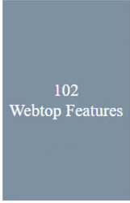
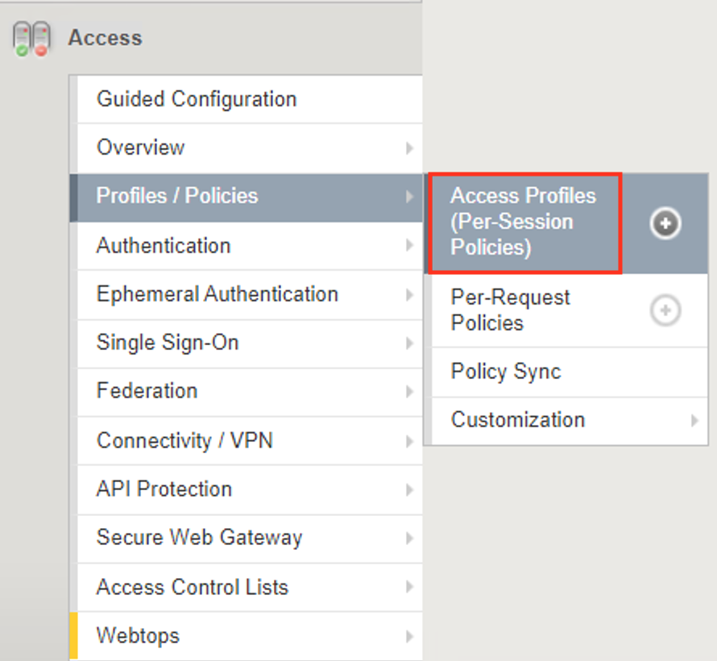
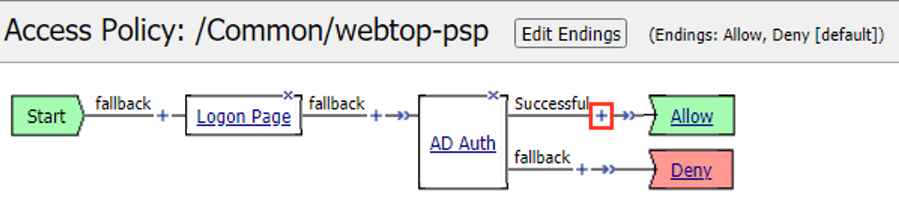
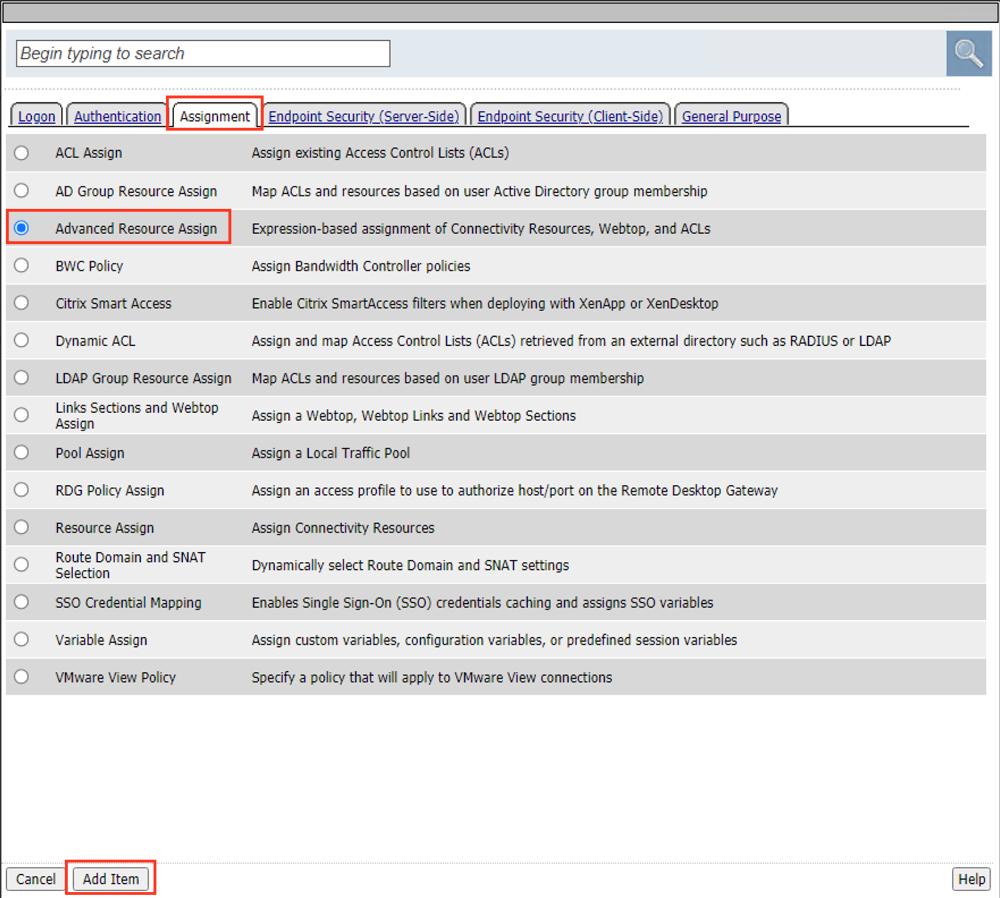
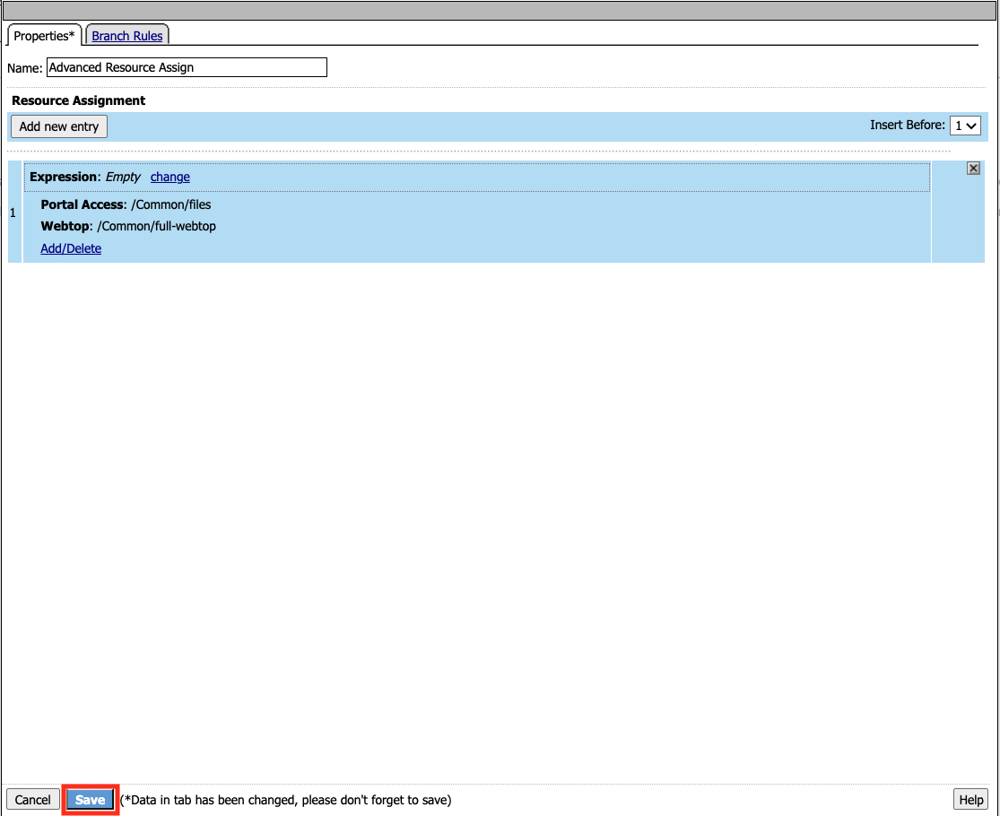
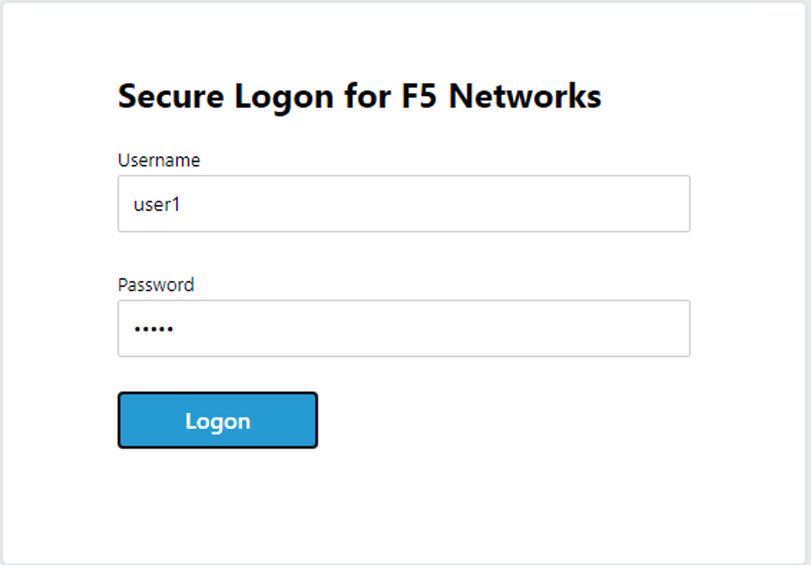

Lab 2: Portal Resources
=========================

A full webtop provides an access policy ending for an access policy branch to which you can optionally assign portal access resources, app tunnels, remote desktops, and webtop links, in addition to network access tunnels.

In this lab we will explore how to configure a Portal Access Resource to perform reverse proxy functionality.

Section 1 - Setup Lab Environment
~~~~~~~~~~~~~~~~~~~~~~~~~~~~~~~~~~

Task 1 - Deploy prebuilt objects
-----------------------------------

To access your dedicated student lab environment, you will require a web browser and Remote Desktop Protocol (RDP) client software. The web browser will be used to access the Lab Training Portal. The RDP client will be used to connect to the Jump Host, where you will be able to access the BIG-IP management interfaces (HTTPS, SSH).

#. Click **DEPLOYMENT** located on the top left corner to display the environment

#. Click **ACCESS** next to jumpohost.f5lab.local

   |image001|

#. Select your RDP resolution.

#. The RDP client on your local host establishes a RDP connection to the Jump Host.

#. Login with the following credentials:

         - User: **f5lab\\user1**
         - Password: **user1**

#. After successful logon the Chrome browser will auto launch opening the site https://portal.f5lab.local.  This process usually takes 30 seconds after logon.

#. Click the **Classes** tab at the top of the page.

	|image002|

#. Scroll down the page until you see **102 Webtop Features** on the left

   |image003|

#. Hover over tile **Portal Resources**. A start and stop icon should appear within the tile.  Click the **Play** Button to start the automation to build the environment

   +---------------+-------------+
   | |image004|    | |image005|  |
   +---------------+-------------+

#. The screen should refresh displaying the progress of the automation within 30 seconds.  Scroll to the bottom of the automation workflow to ensure all requests succeeded.  If you experience errors try running the automation a second time or open an issue on the `Access Labs Repo <https://github.com/f5devcentral/access-labs>`__.

   |image006|

Section 2 - Basic Portal Resource
~~~~~~~~~~~~~~~~~~~~~~~~~~~~~~~~~~~~~

Task 1 - Create a Webtop 
--------------------------

#. From a browser navigate to https://bigip1.f5lab.local

#. Login with username **admin** and password **admin**

   |image009|

#. Navigate to **Access** >> **Webtops** >> **Webtop Lists** >> click the **Plus Sign(+)**.

   |image010|

#. Enter the Name **full-webtop**
#. From the Type dropdown menu select **Full**
#. Click **Finished**.

   |image011|

Task 2 - Create a portal resource
---------------------------------------

#. Navigate to **Access** >> **Connectivity/VPN** >> **Portal Access Lists** >> click the **Plus Sign(+)**.

   |image012|

#. Enter the Name **files**
#. From the Link Type dropdown menu select **Application URI**
#. Enter the Application URI **http://files-master.f5lab.local**
#. Enter the Caption *files**
#. Click **Create**

   |image013|

Task 3 - Create a Connectivity Profile
---------------------------------------

#. Navigate to **Access** >> **Connectivity/VPN** >> **Connectivity** >>  **Profiles** >>click the **Plus Sign(+)**.

   |image014|

#. Enter the Name **webtop-cp**
#. From the Parent Profile dropdown menu select **/Common/connectivity**
#. Click **OK**

   |image015|

Task 4 - Add new profiles to an existing Virtual Server
---------------------------------------------------------

#. Navigate to **Local Traffic** >> **Virtual Servers** >> **Virtual Server List**

   |image016|

#. Click **webtop-https**

   |image017|

#. In Content Rewrite Section, select **rewrite** from the Rewrite Profile dropdown menu.
#. In Access Policy Section, select **webtop-cp** from the Connectivity Profile dropdown menu.
#. Click **Update**

   |image018|

Task 5 - Add a Webtop Resource to an existing Policy
------------------------------------------------------

#. Navigate to **Access** > **Profiles / Policies** > **Access Profiles (Per-Session Policies)**, 

    |image019|

#. Click on **Edit** for **webtop-psp**. 

   |image020|

#. Click the Plus Sign(+) in between the AD Auth policy item and the Allow Terminal .

   |image021|

#. Click on the **Assignment Tab**
#. Select the **Advanced Resource Assign** radio button
#. Click **Add Item**

   |image022|

#. Click the **Add New Entry** button.
#. Click the **Add/Delete** button

   |image023|

#. Click on the **Portal Access** tab
#. Select the radio button for **/Common/files**

   |image024|

#. Click on the **Webtop** tab
#. Select the radio button for **/Common/full-webtop**
#. Click the **Update** button at the bottom of the screen.

   |image025|

#. Click **Save**.

   |image026|

#. At the top left of the browser window, click on **Apply Access Policy**

   |image027|

Task 3 - Test the Configuration
---------------------------------

#. Open a **New Incognito** web browser and navigate to **https://webtop.acme.com**. 
#. Enter the following credentials:

    +-------------+--------------+
    |Username:    |**user1**     |
    +-------------+--------------+
    |Password:    |**user1**     |
    +-------------+--------------+

#. Click **Logon**.

   |image028|

   .. note:: This will open the APM landing page that shows the resources you are allowed to access. In this lab, we've only configured a single resource but you can add as many as you want and they will appear on this Webtop page.

#. Click the **F5** Resource on the webtop

   |image029|

#.  The Files site opens in a new tab,  but notice you are not redirected to http://files.f5lab.local.  Instead you are being reverse proxied to the site through https://webtop.acme.com   

   |image030| 

Section 3 - Lab Cleanup
~~~~~~~~~~~~~~~~~~~~~~~~~~~~

Task 1 - Run Cleanup automation
---------------------------------

#. From a browser on the jumphost navigate to https://portal.f5lab.local

#. Click the **Classes** tab at the top of the page.

    |image002|

#. Scroll down the page until you see **102 Webtop Features** on the left

   |image003|

#. Hover over tile **Portal Resources**. A start and stop icon should appear within the tile.  Click the **Stop** Button to trigger the automation to remove any prebuilt objects from the environment

    +---------------+-------------+
    | |image004|    | |image007|  |
    +---------------+-------------+

#. The screen should refresh displaying the progress of the automation within 30 seconds.  Scroll to the bottom of the automation workflow to ensure all requests succeeded.  If you experience errors try running the automation a second time or open an issue on the `Access Labs Repo <https://github.com/f5devcentral/access-labs>`__.

   |image008|

#. This concludes the lab.

   |image000|

.. |image000| image:: ./media/lab02/000.png
.. |image001| image:: ./media/lab02/001.png
.. |image002| image:: ./media/lab02/002.png

.. |image005| image:: ./media/lab02/005.png

.. |image014| image:: ./media/lab02/014.png
.. |image015| image:: ./media/lab02/015.png

.. |image017| image:: ./media/lab02/017.png

