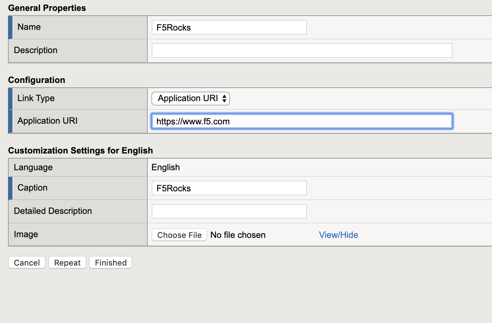
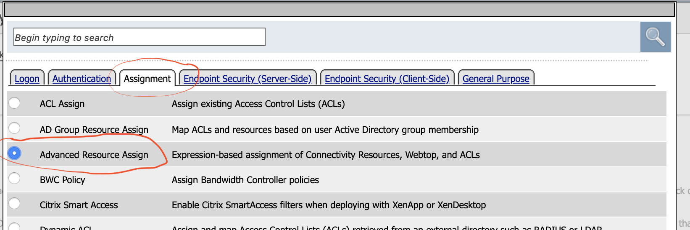
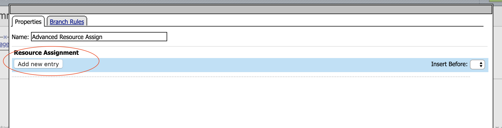

Lab 4: Webtop Access Policy Build
============================================

In this lab, we will add a Webtop resource to the Access Policy
created in the previous lab. A full webtop provides an access policy ending for an access policy branch to which you can optionally assign portal access resources, app tunnels, remote desktops, and webtop links, in addition to network access tunnels.
Then, the full webtop provides your clients with a web page on which they can choose resources, including a network access connection to start.

Lab Requirements
----------------

  - Working HTTPS Virtual Server with Access Policy Created in Lab 1 (Lab 1 successfully completed).

Task 1: Create a Webtop resource
---------------------------------

#. Expand the **Access** tab from the main menu on the left and navigate
   to **Webtops** > **Webtop Lists**.

#. Click **Create** to create a new Webtop called **MyFullWebtop**,
   select Type **Full** , uncheck  **Minimize To Tray** and
   click **Finished**.

   |Lab4-Image1|

Task 2: Create Webtop Item
----------------------------
#. Browse to **Access** > **Webtops >** **Webtop Link** and click create.

#. Complete the following entries.

      - Name: F5Rocks
      - Link Type Dropdown: Application URI
      - Applicatoin URI : https://www.f5.com
      - Application Caption : F5 Rocks.

   |Lab4-Image2|

   |Lab4-Image3|

Task 3: Add Webtop resource to existing Access Policy
------------------------------------------------------

#. Browse to **Access** > **Profiles / Policies > Access Profiles (Per-Session Policies)**, click on **Edit** for **MyAccessPolicy**. A new tab should open to the Visual Policy Editor for **MyAccessPolicy**.

   |Lab4-Image4|

#. In between the AD Auth APM Item and the Allow APM item click the + option to add an item.

   |Lab4-Image5|

#. Select the **Advanced Resource Assign** object. Click on the "Assignment Tab" and select the "Advanced Resource Assign" radio button. Click **Add Item**.

   |Lab4-Image6|

#. Then Click the "Add New Entry" button.

   |Lab4-Image7|

#. Then under the "Expression Section" click the "Add/Delete" button

#. Click on the **Webtop** tab, select the radio button for **MyFullWebtop**. Click on the **Webop Links** tab, and select the radio button for **F5Rocks** then click the **Update** button at the bottom of the screen.

   |Lab4-Image8|

#. Click **Save**.

#. At the top left of the browser window, click on **Apply Access Policy** , then close the tab. Replace the Access Profile on your app-https VIP with your myaccesspolicy Access profile and set the Per-Request Policy to None

   |Lab4-Image9|

#. Navigate to **Local Traffic** --> **Virtual Servers** --> **Virtual Server List**

    .. Note:: Make sure you are in the **Common Partition**

        |Lab4-Image17|

#. Open the **app-https** Virtual server, scroll down to the **Access Policy** section and ensure that **myaccesspolicy** has been assigned to this virtual server.

    |Lab4-Image18|

Task 4: Testing
-----------------

#. Open a **New Incognito** web browser to the virtual server created in the previous lab by navigating to **https://app.acme.com**. You will be presented with a Logon page similar to the one from the last lab.

#. Enter the following credentials:

    +-------------+--------------+
    |Username:    |**user1**     |
    +-------------+--------------+
    |Password:    |**user1**     |
    +-------------+--------------+

#. Click **Logon**.

   This will open the APM Webtop landing page that shows the resources you are allowed to access. In this lab, we've only configured one resource:

   **F5 Rocks**, but you can add as many as you want and they will appear on this Webtop page.

   |Lab4-Image10|

.. |Lab4-Image1| image:: ./media/Lab4-Image1.png
.. |Lab4-Image2| image:: ./media/Lab4-Image2.png

.. |Lab4-Image5| image:: ./media/Lab4-Image5.png

.. |Lab4-Image8| image:: ./media/Lab4-Image8.png
.. |Lab4-Image9| image:: ./media/Lab4-Image9.png

.. |Lab4-Image17| image:: ./media/Lab4-Image17.png
.. |Lab4-Image18| image:: ./media/Lab4-Image18.png
