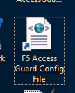
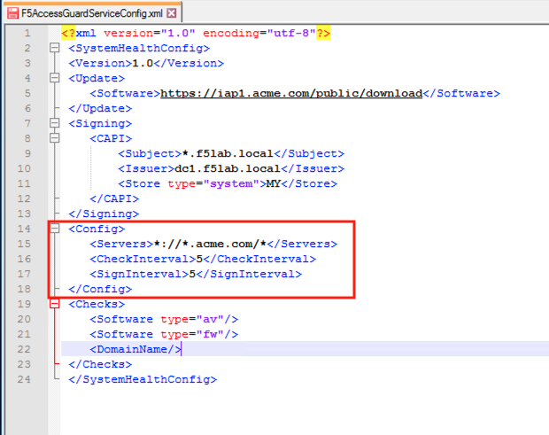
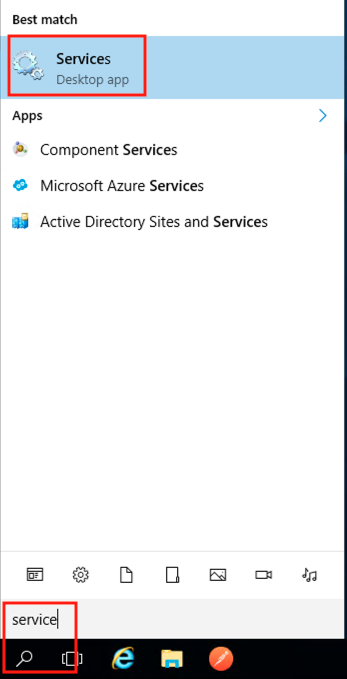
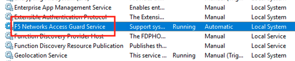
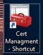
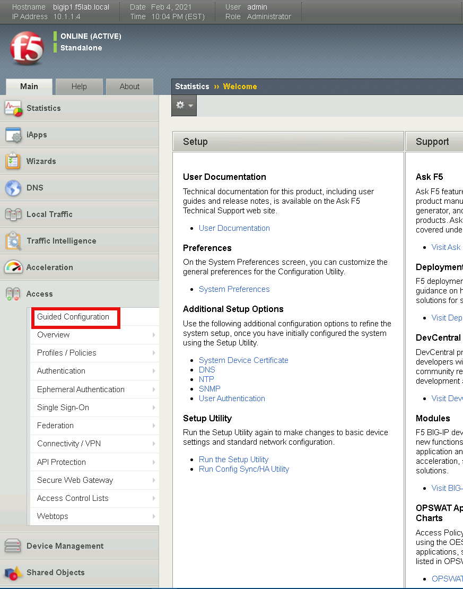
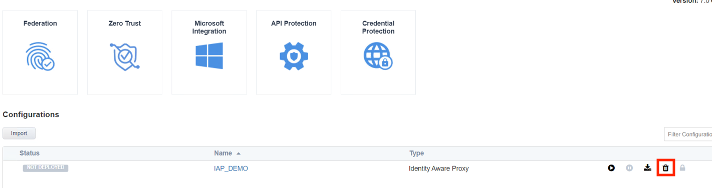
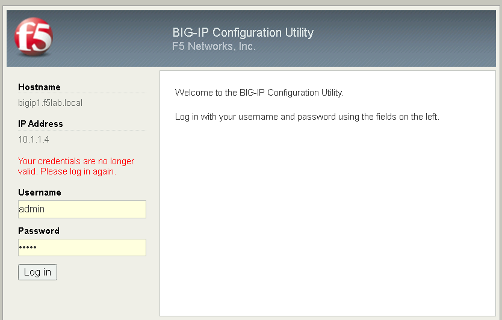
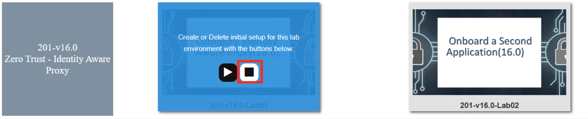
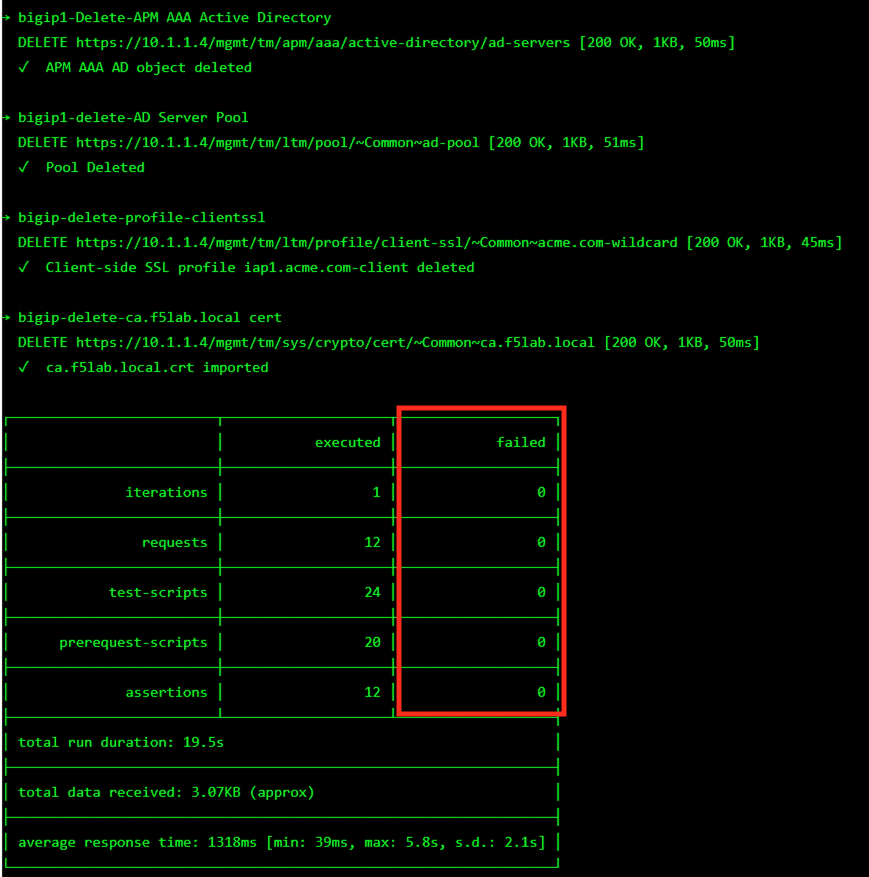

Lab 4: Explore AccessGuard(16.0)
======================================================

F5 Access Guard is a new set of client software tools designed to help administrators validate the security posture of incoming web connections from remote clients. F5 Access Guard allows real-time posture information to be inspected with per-request policy subroutines on BIG-IP Access Policy Manager. F5 Access Guard generates posture information asynchronously and transparently transmits it to chosen APM server endpoints using special HTTP headers

APM has included posture checking capability since its inception, and this new service improves upon this capability by allowing for instantaneous and continuous checks. Deployment of F5 Access Guard is significantly different than previous posture check implementations.

   
Section 4.1 - XML Configuration File
--------------------------------------

The F5 AccessGuardServiceConfig.xml file defines the settings used by the AccessGuard Service.  This file contains settings for the signing certificate, timers, checks performed and websites posture data can be sent to.

Task 1 - Explore the configuration file setting
~~~~~~~~~~~~~~~~~~~~~~~~~~~~~~~~~~~~~~~~~~~~~~~~~~~~~~

	.. note:: Additional settings can be configured in the XML file beyond this 		example.  For further information see the article **Configuring F5 AccessGuard** 	on askf5.com - https://techdocs.f5.com/en-us/bigip-15-0-0/big-ip-access-policy-manager-access-guard-config/configuring-f5-access-guard.html

#. Open the **F5 Access Guard** Config file shortcut located on the desktop by right clicking it and opening with notepad++

   .. note:: The file is located in the C:\\ProgramData\\F5 Networks\\F5AccessGuardService directory

   |image0|

#. The **Update** section contains the Software check library auto-update URI. The value specifies the location for software check (OesisInspector.cab) updates. 

   |image1|

#. The **Signing** section contains the location, cert name, and Issuer Name, of the certificate/key pair used to sign the posture assessment data. 

   |image2|

#. The **Config** section contains how often posture data is collected and signed. Also the Match patterns for URLs to which the health information would be sent via the HTTP header. This prevents AccessGuard from leaking client configuration data to an untrusted server.

   |image3|

#. The **Checks** section contains the check F5 AccessGuard Service will report on.  As of 15.1 there are currently 10 different checks that can be performed.

   |image4|

#. Close the configuration file without saving it

Section 4.2 - System Service
-----------------------------------

The AccessGuard System Service performs the continuous monitoring of the system based on the parameters in the previously explored F5AccessGuardServiceConfig.xml file

Task 1 - Locate the F5 Access Guard Service
~~~~~~~~~~~~~~~~~~~~~~~~~~~~~~~~~~~~~~~~~~~~~~~~~~~~~~

#. Enter Services into the jump box's desktop search bar.

   |image5|

#. The F5 Networks Access Guard Service was installed via a .msi available on https://downloads.f5.com

   |image6|

#. Close the services screen.

Section 4.3 - Device Certificate
------------------------------------------------

When the configuration file is set to sign posture data, it uses the specified certificate/key pair in the machine's local certifcate store.

Task 1 - Explore the Device Certificate
~~~~~~~~~~~~~~~~~~~~~~~~~~~~~~~~~~~~~~~~~~

#. Open the jump box's certificate store by clicking the **Certificate Management** shortcut located on the desktop

   |image7|

#. Double click the **jumpbox.f5lab.local** certificate

   |image8|

#. Click the **Details** tab and scroll to the Enhanced Key Usage section.  The default usage types associated with a Microsoft CA template is Client Authentication and Server Authentication.  The default template must be modified to include Secure Email. 

   |image9|

#. Click **OK** and close the Certificate management window 

Section 4.4 - Browser Extension
------------------------------------------------

The browser extension takes the posture data generated by the Access Guard service and converts it to a header.  

Task 1 - View the installed Extension
~~~~~~~~~~~~~~~~~~~~~~~~~~~~~~~~~~~~~~~~~~

#. Open Firefox and enter **about:addons**. Click **Extensions** on the left to see that the F5 Access Guard add-on is installed. The extension is download and installed via a browser's addon store.

   |image10|

Section 4.5 Lab CleanUp
---------------------------

TASK 1: Remove AGC Configuration
~~~~~~~~~~~~~~~~~~~~~~~~~~~~~~~~~~~

#. Open a browser, and navigate to https://bigip1.f5lab.local

#. Login with username **admin** and password **admin**

   |image17|

#. Navigate to **Access -> Guided Configuration** in the left-hand menu.                                                                                      

   |image11|                                                                                   

#. Click the **Undeploy** button on the existing IAP_DEMO configuration                                                                                                                            

   |image12|                                                                                   

#. Click **OK** when asked, "Are you sure you want to undeploy this configuration?"                                                                          

   |image13|                                                                                   

#. Click the **Delete** button once the deployment is undeployed                                                                                               

   |image14|                                                                                   

#. Click **OK** when asked, "Are you sure you want to delete this configuration?"                                                                             

   |image15|                                                                                   

#. The Configuration section should now be empty                                             

   |image16|   

Task 2: Delete Prebuilt objects
~~~~~~~~~~~~~~~~~~~~~~~~~~~~~~~~~                                                                                

#. From a browser on the jumphost navigate to https://portal.f5lab.local 

#. Click the **Classes** tab at the top of the page.

	|image91|

#. Scroll down the page until you see **201-v16.0 Zero Trust - Identity Aware Proxy** on the left

   |image87|

#. Hover over tile **Configure Identity Aware Proxy(16.0)**. A start and stop icon should appear within the tile.  Click the **Stop** Button to trigger the automation to remove any prebuilt objects from the environment

   |image88|

#. The screen should refresh displaying the progress of the automation within 30 seconds.  Scroll to the bottom of the automation workflow to ensure all requests succeeded.  If you you experience errors try running the automation a second time or open an issue on the `Access Labs Repo <https://github.com/f5devcentral/access-labs>`__.

   |image89|

#. This concludes lab 4.

   |image100|

.. |image2| image:: media/lab04/image002.png

.. |image4| image:: media/lab04/image004.png

.. |image8| image:: media/lab04/image008.png
.. |image9| image:: media/lab04/image009.png
.. |image10| image:: media/lab04/010.png

.. |image12| image:: media/lab04/012.png

.. |image91| image:: media/lab04/091.png
.. |image100| image:: media/lab04/image100.png

