Lab 4: ADFS Proxy using Pre-Authentication
============================================

Task 1 - Setup Lab Environment
-----------------------------------

To access your dedicated student lab environment, you will require a web browser and Remote Desktop Protocol (RDP) client software. The web browser will be used to access the Lab Training Portal. The RDP client will be used to connect to the Jump Host, where you will be able to access the BIG-IP management interfaces (HTTPS, SSH).

#. Click **DEPLOYMENT** located on the top left corner to display the environment

#. Click **ACCESS** next to jumpohost.f5lab.local

   |image001|

#. Select your RDP resolution.

#. The RDP client on your local host establishes a RDP connection to the Jumphost.

#. Login with the following credentials:

         - User: **f5lab\\user1**
         - Password: **user1**

#. After successful logon the Chrome browser will auto launch opening the site https://portal.f5lab.local.  This process usually takes 30 seconds after logon.

#. Click the **Classes** tab at the top of the page.

	|image002|

#. Scroll down the page until you see **203 Microsoft Integrations** on the left

   |image003|

#. Hover over tile **ADFS Proxy using Pre-Authentication**. A start and stop icon should appear within the tile.  Click the **Play** Button to start the automation to build the environment

   +---------------+-------------+
   | |image004|    | |image005|  |
   +---------------+-------------+

#. The screen should refresh displaying the progress of the automation within 30 seconds.  Scroll to the bottom of the automation workflow to ensure all requests succeeded.  If you experience errors try running the automation a second time or open an issue on the `Access Labs Repo <https://github.com/f5devcentral/access-labs>`__.

   |image006|

Task 2 - Access the Microsoft ADFS guided configuration
------------------------------------------------------------

#. From the jumphost browser navigate to https://bigip1.f5lab.local

#. Login with the following credentials:

   - username **admin**
   - password **admin**

#. Click on the **Access** tab located on the left side.

    |image009|

#. Click **Guided Configuration**

    |image010|

#. Click **Microsoft Integration**

    |image011|

#. Click **ADFS Proxy**

    |image012|

#. Click **Next**

    |image013|

Task 3 - ADFS Proxy Settings
-----------------------------

#. Enter the Configuration Name **ADFS_PROXY**
#. Enter the ADFS FQDN **adfs.acme.com**
#. Select the Authenticatin Method **Access Policy Authentication**
#. Select Access Policy Authentication Type **Only Endpoint Checks**
#. Click **Save & Next**

    |image014|

Task 4 - Virtual Server Properties
------------------------------------

#. Enter the Destination Address **10.1.10.101**
#. Select the Client SSL Certificate **acme.com-wildcard**
#. Select the Associated Private Key **acme.com-wilcard**
#. Click **Save & Next**

    |image015|

Task 5 - ADFS Server Pool Properties
-------------------------------------

#. Enter the IP address **10.1.20.13**
#. Click **Save & Next**

    |image016|

Task 6 - Authentication Properties
-------------------------------------

#. From the Choose Authentication Server dropdown select **Create New**

    |image017|

#. Enter the Domain Name **f5lab.local**
#. Select **Use Pool**
#. Select Domain Controller Pool Name **AD_POOL**
#. For Domain Controllers enter the IP address **10.1.20.7** and Hostname **dc1.f5lab.local**
#. Enter Admin Name **admin**
#. Enter Admin Password **admin** 
#. Enter Verify Admin Password **admin**  
#. Click **Save & Next**

    |image018|

Task 7 - MFA Properties
-------------------------

#. Click **Save & Next**

    |image019|

Task 8 - Endpoint Check Properties
-----------------------------------

#. Click **Save & Next**

    |image020|

Task 9 - Customization Properties
-----------------------------------

#. Click **Save & Next**

    |image021|

    |image022|

Task 10 - Logon Protection Properties
--------------------------------------

#. Click **Save & Next**

    |image023|

Task 11 - Session Management Properties
---------------------------------------

#. Click **Save & Next**

    |image024|

Task 12 - Summary
-----------------

#. Click **Deploy**

    |image025|

#. Click **Establish Trust**

    |image026|

#. Enter the Username **admin**
#. Enter the Password **admin**
#. Click **Establish Trust**

    |image027|

#. A certificate appears under the **Establish Trust** section signifying the trust was successfully established. 
#. Click **Finish** 

    |image028|

#.  The configuration has been successfully deployed

    |image029|

Task 13 - Test APM Authentication 
------------------------------------

#. On the jumphost open a webbrowser and navigate to https://sp.acme.com.  You will redirected to https://adfs.acme.com
#. Enter the username **user1**
#. Enter the password **user1**
#. Click **Logon**

    |image030|

#.  After successful login at ADFS you redirected to http://sp.acme.com

    |image031|

    
Task 14 - Lab Cleanup
-----------------------

#. From the jumphost browser navigate to https://bigip1.f5lab.local

#. Login with the following credentials:

   - username **admin**
   - password **admin**

#. Navigate to **Access -> Guided Configuration** in the left-hand menu. 

    |image010|

                                                                        
#. Click the **Undeploy** button  

    |image032|

                                                                            
#. Click **OK** when asked, "Are you sure you want to undeploy this configuration?"   

    |image033|       

#. Click the **Delete** button once the deployment is undeployed    

    |image034|

#. Click **OK** when asked, "Are you sure you want to delete this configuration?"     

    |image035|       

#. The Configuration section should now be empty  

    |image036|

#. From a browser on the jumphost navigate to https://portal.f5lab.local                     
                                                                                            
#. Click the **Classes** tab at the top of the page.  

    |image002|

#. Scroll down the page until you see **203 - Microsoft Integration** on the left     

    |image003|

#. Hover over the tile **ADFS Proxy using Pre-Authentication**. A start and stop icon should appear within the tile.  Click the **Stop** Button to start the automation to delete any prebuilt objects                                                                  

    +---------------+-------------+
    | |image004|    | |image007|  |
    +---------------+-------------+

#. The screen should refresh displaying the progress of the automation within 30 seconds. Scroll to the bottom of the automation workflow to ensure all requests succeeded. If you you experience errors try running the automation a second time or open an issue on the `Access Labs Repo <https://github.com/f5devcentral/access-labs>`__.                      

    |image008|

#. This concludes Lab 4.   

    |image000|

.. |image001| image:: ./media/lab04/001.png
.. |image002| image:: ./media/lab04/002.png
.. |image003| image:: ./media/lab04/003.png
.. |image004| image:: ./media/lab04/004.png

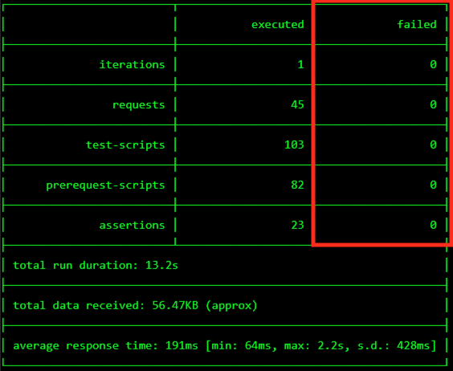

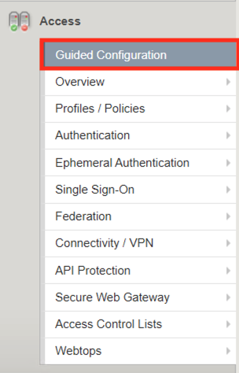

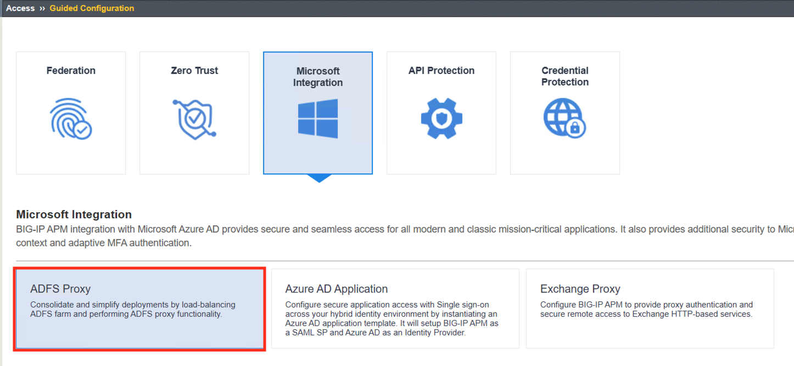
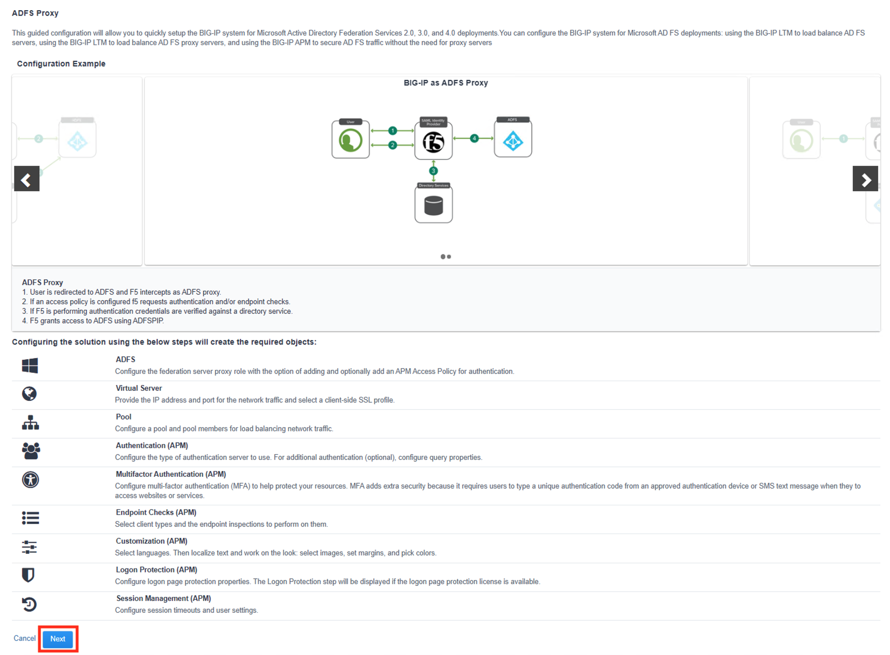
.. |image014| image:: ./media/lab04/014.png
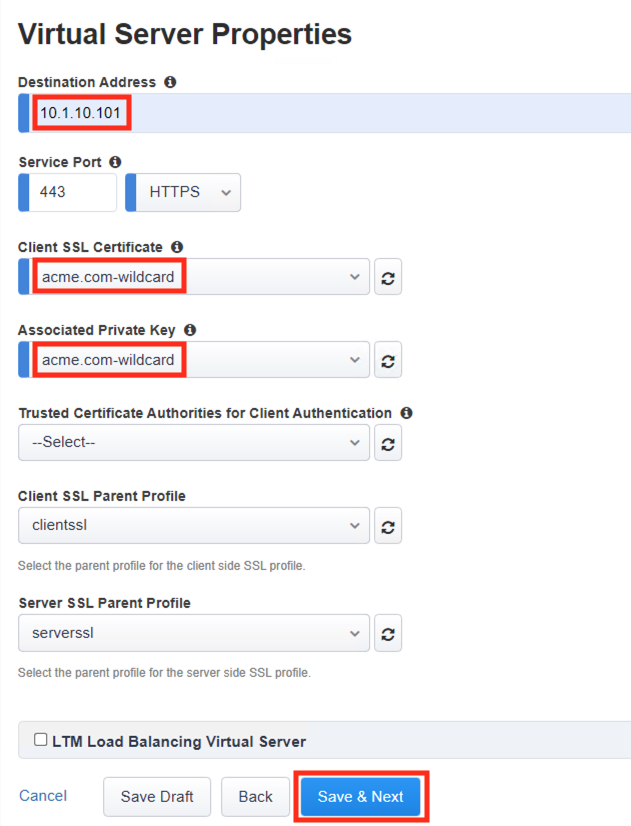

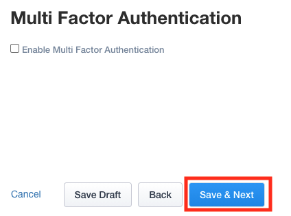
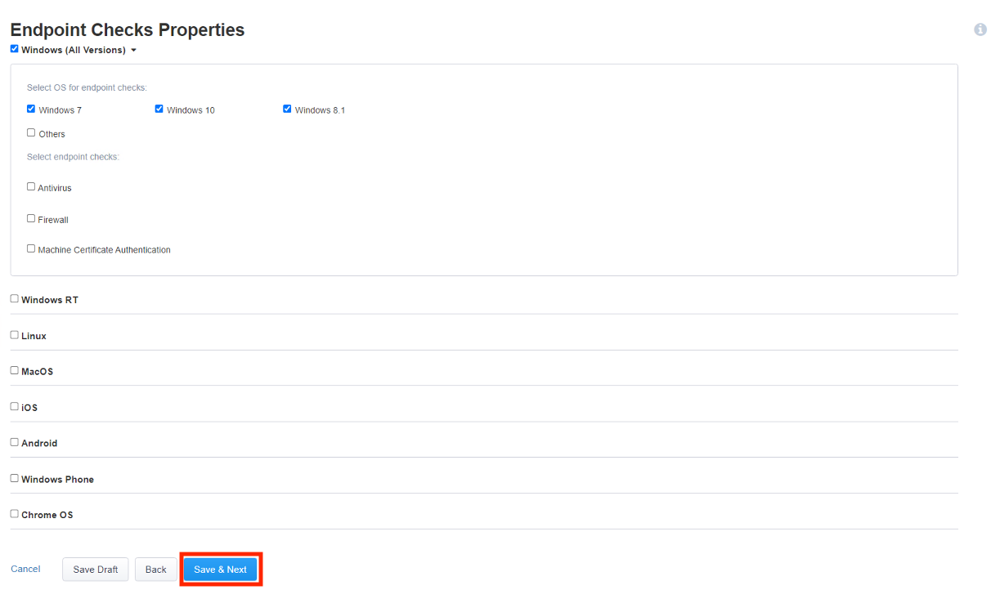
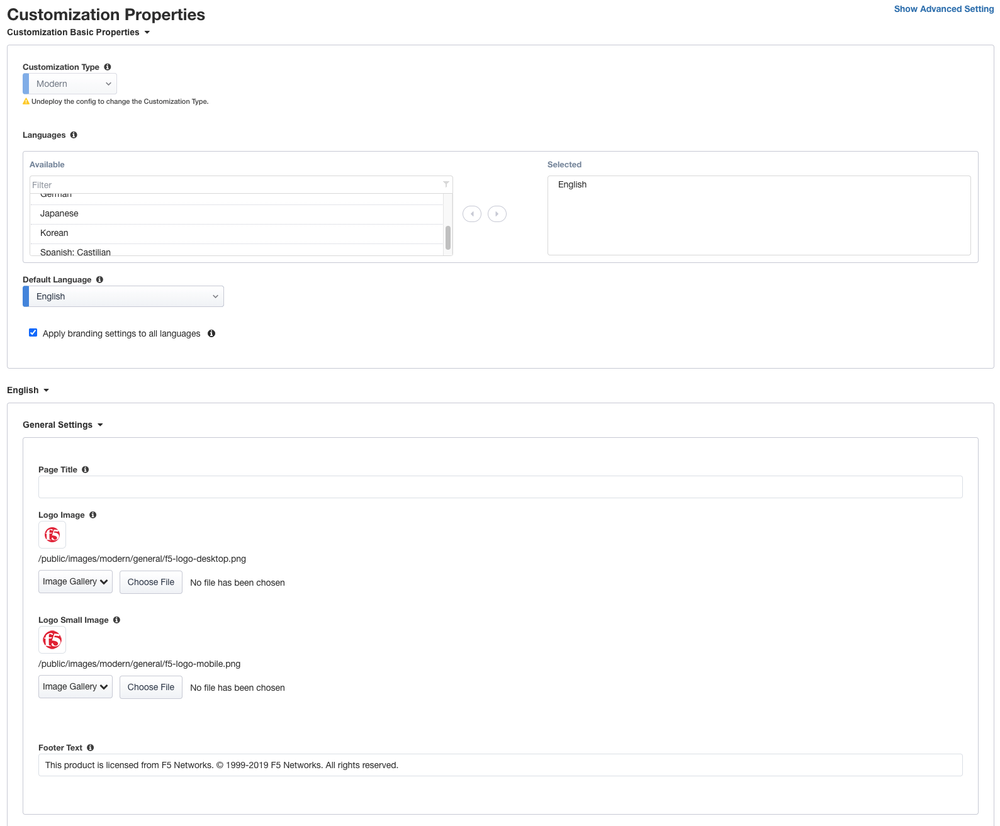

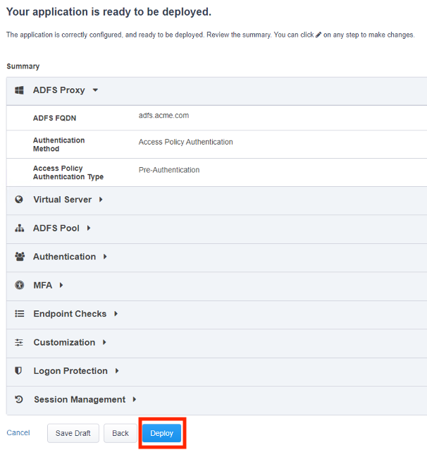

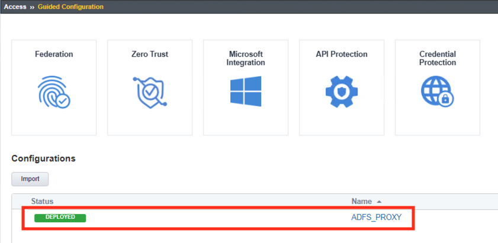
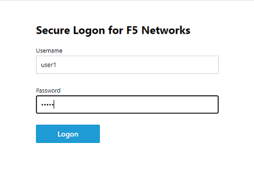

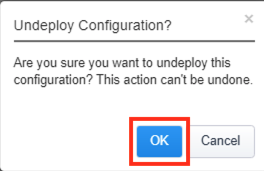

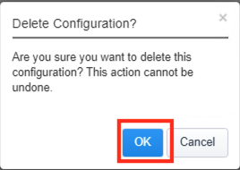

