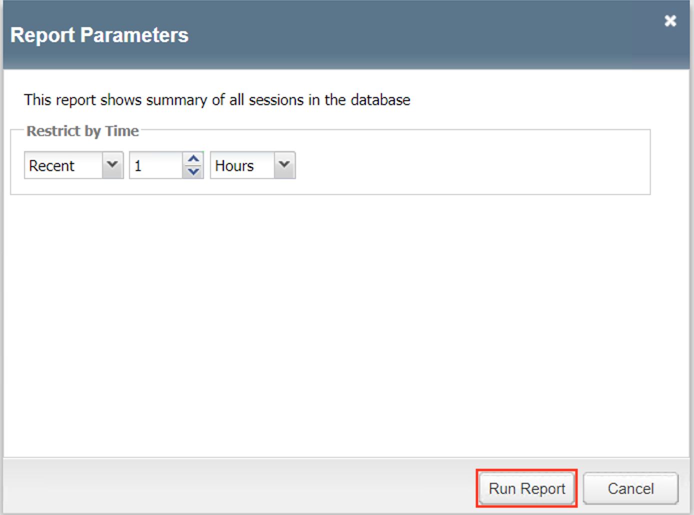
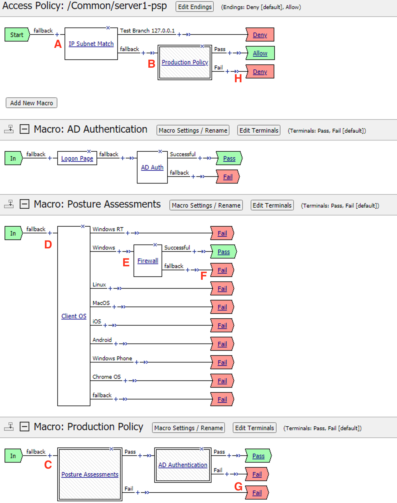
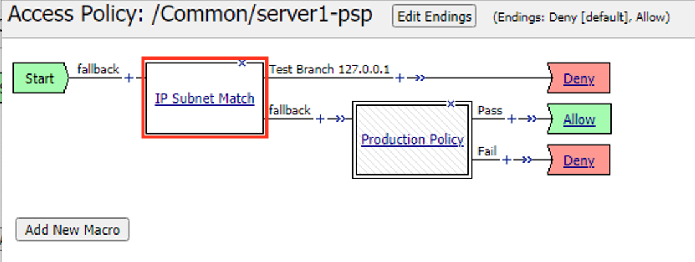
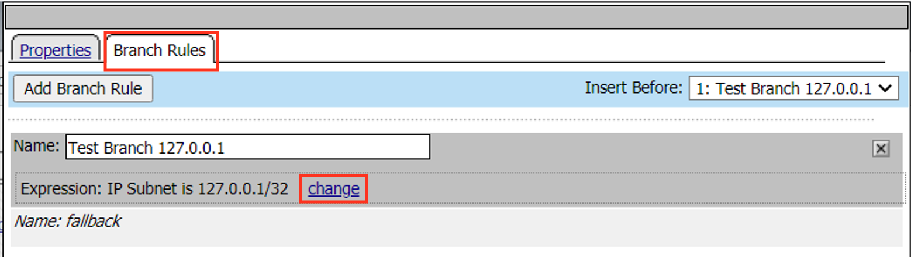
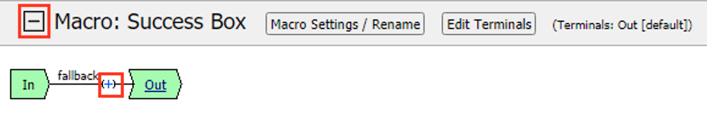

Lab 1: SWG iApp – Explicit Proxy for HTTP and HTTPS
===================================================

In this lab exercise, you will learn how to automate and simplify a
deployment of SWG using an iApp template.

Estimated completion time: 30 minutes

**Objectives:**

-  Create an Explicit Proxy configuration by deploying the SWG iApp
   template

-  Test web browsing behavior

**Lab Requirements:**

-  BIG-IP with SWG licensed

-  BIG-IP must have access to the public Internet

-  BIG-IP must have access to a DNS server that can resolve queries for
   public Internet web site names

-  The latest iApp for SWG can be downloaded from
   **https://downloads.f5.com/** (browse to BIG-IP **iApp
   Templates**) Note: The iApp has already been downloaded and
   imported for you.

Before you can deploy the SWG iApp template, you must have the following
objects configured:

-  AD AAA server

-  SWG-Explicit Access Policy

-  Custom URL Filter

-  Per-Request Access Policy

Task 1 – Create an "SWG-Explicit" Access Policy for Authentication
------------------------------------------------------------------

Create an AD AAA Server
~~~~~~~~~~~~~~~~~~~~~~~

-  Create an AD AAA server by selecting **Access >> Authentication >>
   Active Directory** and clicking on **Create...**

-  Change the Name to **AD\_F5DEMO**

-  Change the Domain Name to **f5demo.com**

-  Change Server Connection to **Direct**

-  Change the Domain Controller to **10.1.20.20**

-  Click **Finished**

   |image001|

Create a Per-Session Access Policy
~~~~~~~~~~~~~~~~~~~~~~~~~~~~~~~~~~

-  Browse to **Access >> Profiles / Policies >> Access Profiles
   (Per-Session Policies)** and click **Create...***

-  Name the profile **AP_Explicit_Auth**

-  Change the **Profile** **Type** to **SWG-Explicit**

-  Add **English** to the **Accepted Languages** list

-  Accept all other default settings and click **Finished**

-  Click on the **Edit…** link for the appropriate Access Policy created above

   |image002|

-  Select the **+** between Start and Deny and **Add**
   an **HTTP 407 Response** object

   |image003|

-  Change the **HTTP Auth Level** to **basic**

   |image004|

-  Click **Save**

-  On the **Basic** branch of the **HTTP 407** Object, **Add**
   an **AD Auth** Object

   |image005|

-  Change the **Server** to **/Common/AD_F5DEMO** and change
   **Show Extended Error** to **Enabled**

   |image006|

-  Click **Save**

-  On the **Successful** branch of the **AD Auth** Object, click on the
   **Deny** Ending and change it to **Allow**

-  Click **Save**

-  Click on the **Apply Access Policy** link

   |image007|

Task 2 – Create a custom URL Filter
-----------------------------------

-  Browse to **Access >> Secure Web Gateway >> URL Filters** and
   click **Create...**

-  Name your filter **LAB_URL_FILTER** and click **Finished**

-  Click on the first check box to select all categories

   |image008|

-  Click **Allow** at the bottom of the page

   |image009|

-  Click the check box to select **Social Web – Facebook** and then click
   **Block** (for this lab, our URL filter will only block Facebook)

   |image010|

Task 3 – Create a "Per-Request" Access Policy
---------------------------------------------

-  Browse to **Access >> Profiles / Policies >> Per-Request
   Policies** and click **Create...**

-  Name your policy **Lab_Per_Request**

-  Click **Finished**

-  Click on the **Edit…** link for the appropriate Per-Request Policy created
   above, then go back to the VPE tab in your browser

   |image011|

-  Click on the **+** symbol between **Start** and **Allow**

-  Go to the **General Purpose** tab and add a **Protocol
   Lookup** object

   |image012|

-  Click **Add Item**

-  Click **Save**

-  On the HTTPS branch, click the **+** and **Add** a
   **Category Lookup** object (**General Purpose** tab)

   |image013|

-  Select **Use SNI in Client Hello** for **Categorization Input**

-  Click **Save**

-  After the Category Lookup, **Add** a **URL Filter Assign** Object
   (from the **General Purpose** tab) and choose URL Filter
   **/Common/LAB_URL_FILTER**

   |image014|

   .. IMPORTANT:: Change the Ending of the **Allow**
      outcome on the "fallback" branch from “Reject” to **Allow**

   |image015|

Task 4 – Create Explicit Proxy Configuration using the SWG iApp
----------------------------------------------------------------

Import the SWG iApp template into the BIG-IP – Note: This has been done for you.
~~~~~~~~~~~~~~~~~~~~~~~~~~~~~~~~~~~~~~~~~~~~~~~~~~~~~~~~~~~~~~~~~~~~~~~~~~~~~~~~

-  In the BIG-IP Management UI, browse to **iApps >> Templates** and
   click **Import...**

-  Click **Choose File** or **Browse...** and select the iApp
   file (at the time of writing the current version is 1.1.0rc4
   (f5.secure_web_gateway.v1.1.0rc4.tmpl).

-  Click **Open** and **Upload**

Create a SWG proxy configuration
~~~~~~~~~~~~~~~~~~~~~~~~~~~~~~~~

-  Browse to **iApps >> Application Services**

-  Click **Create...**

-  Change the name to **SWG**

-  Change the Template to **f5.secure_web_gateway.v1.1.0rc4**
   (your version may be newer)

   a. Answer the questions as follows:

      +--------------------------------------+---------------------------------------+
      | Question                             | Answer                                |
      +==============================================================================+
      | Do you want to see inline help?      | Yes, show inline help                 |
      +--------------------------------------+---------------------------------------+
      | Do you want to enable advanced       | No, do not enable advanced options    |
      | options?                             |                                       |
      +--------------------------------------+---------------------------------------+
      | Which type of SWG configuration do   | Explicit Proxy                        |
      | you want to deploy                   |                                       |
      +--------------------------------------+---------------------------------------+
      | Do you want to use ICAP to forward   | No, do not use ICAP for DLP           |
      | requests for inspection by DLP       |                                       |
      | servers?                             |                                       |
      +--------------------------------------+---------------------------------------+
      | What IP address and port do you want | - IP Address: 10.1.20.200             |
      | to use for the virtual server?       | - Port: 3128                          |
      +--------------------------------------+---------------------------------------+
      | What is the FQDN of this proxy?      | proxy.f5demo.com. The local hosts     |
      |                                      | file on your Jump Host has already    |
      |                                      | been modified to resolve this FQDN to |
      |                                      | the correct IP address indicated      |
      |                                      | above.                                |
      +--------------------------------------+---------------------------------------+
      | On which ports should the system     | 80                                    |
      | accept HTTP traffic?                 |                                       |
      +--------------------------------------+---------------------------------------+
      | On which ports should the system     | 443                                   |
      | accept HTTPS traffic?                |                                       |
      +--------------------------------------+---------------------------------------+
      | Which SWG-Explicit Access Policy do  | AP_Explicit_Auth                      |
      | you want to use?                     |                                       |
      +--------------------------------------+---------------------------------------+
      | Which Per-Request Access Policy do   | Lab_Per_Request                       |
      | you want to use?                     |                                       |
      +--------------------------------------+---------------------------------------+
      | Do you want the system to forward    | Yes, forward all name requests        |
      | all name requests?                   |                                       |
      +--------------------------------------+---------------------------------------+
      | Which DNS servers do you want to use | - IP: 10.1.20.20                      |
      | for forwarding?                      | - Port: 53                            |
      +--------------------------------------+---------------------------------------+
      | Which SSL profile do you want to use | Create a new Client SSL profile       |
      | for client-side connections?         |                                       |
      +--------------------------------------+---------------------------------------+
      | Which Subordinate CA certificate do  | f5agility.crt                         |
      | you want to use?                     |                                       |
      +--------------------------------------+---------------------------------------+
      | Which CA key do you want to use?     | f5agility.key                         |
      +--------------------------------------+---------------------------------------+
      | Does the key require a password? If  | F5labs                                |
      | so, type it here                     |                                       |
      +--------------------------------------+---------------------------------------+
      | Which SSL profile do you want to use | Create a new Server SSL profile       |
      | for server-side connections?         |                                       |
      +--------------------------------------+---------------------------------------+

   b. Click **Finished** – you will see a large number of objects created
      for you on the **Components** tab.

Task 5 – Verify that the “F5 Agility CA” certificate is trusted
---------------------------------------------------------------

A Windows Domain Group Policy was configured to deploy the CA
certificate that SWG uses to forge new certificates (on behalf of the
origin server) to domain-joined machines.

-  Open Internet Explorer on your Jump Host client machine

-  Click the gear icon or hit ``Alt-X`` and select
   **Internet options**

   |image016|

-  Go to the **Content** tab and click **Certificates**

-  Click on the **Trusted Root Certification Authorities** tab and
   scroll down. You should see the **F5 Agility CA** certificate in the
   list.

   |image017|

-  Double-click on the certificate to view its properties, then close
   this window and the Certificates window.

Task 6 – Testing
----------------

Configure your browser with a “Proxy Server”
~~~~~~~~~~~~~~~~~~~~~~~~~~~~~~~~~~~~~~~~~~~~~

-  Go to the **Connections** tab and click **LAN settings**

-  Enable the checkbox for **Use a proxy server for your LAN** and enter:

   -  Address: **10.1.20.200**

   -  Port: **3128**

-  Click **OK** twice.

   |image018|

Test 1:
~~~~~~~

-  Open a new Internet Explorer "InPrivate" browser window on your Jump
   Host client machine

-  Browse to **https://www.google.com**

   |image019|

-  The browser should prompt you for authentication. Submit your
   credentials:

   -  User: ``user1``

   -  Password: ``AgilityRocks!``

-  Verify defined user has an Access Session ID

-  Browse to **Access > Overview > Active Sessions**

   |image020|

Test 2:
~~~~~~~

-  Using an InPrivate browser window from the client test
   machine, go to https://www.google.com and verify the SSL certificate
   is signed by the **F5 Agility CA** you configured in Lab 1

   |image021|

-  Using an InPrivate browser window from the client test
   machine, go to https://www.wellsfargo.com and examine the certificate
   to verify that it is signed by the same **F5 Agility CA** you
   configured in Lab 1

   |image022|

Test 3:
~~~~~~~

-  Using an InPrivate browser window from the client test
   machine, go to https://www.facebook.com and verify that you are
   instead delivered a SWG Block Page, in accordance to the URL Filter
   you configured above.

   |image023|

.. |image001| image:: ./media/lab01/001.png
.. |image002| image:: ./media/lab01/002.png
.. |image003| image:: ./media/lab01/003.png
.. |image004| image:: ./media/lab01/004.png
.. |image005| image:: ./media/lab01/005.png
.. |image006| image:: ./media/lab01/006.png
.. |image007| image:: ./media/lab01/007.png
.. |image008| image:: ./media/lab01/008.png

.. |image010| image:: ./media/lab01/010.png
.. |image011| image:: ./media/lab01/011.png
.. |image012| image:: ./media/lab01/012.png
.. |image013| image:: ./media/lab01/013.png

.. |image017| image:: ./media/lab01/017.png
.. |image018| image:: ./media/lab01/018.png
.. |image019| image:: ./media/lab01/019.png
.. |image020| image:: ./media/lab01/020.png
.. |image021| image:: ./media/lab01/021.png

.. |image023| image:: ./media/lab01/023.png
