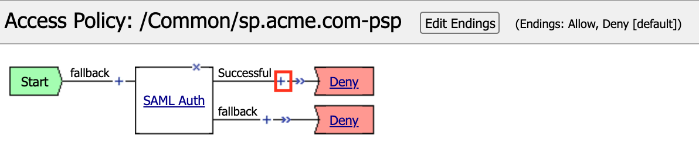
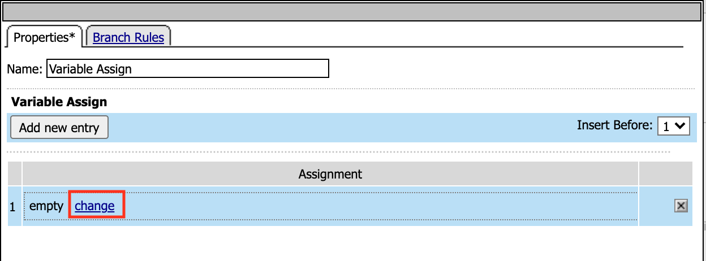
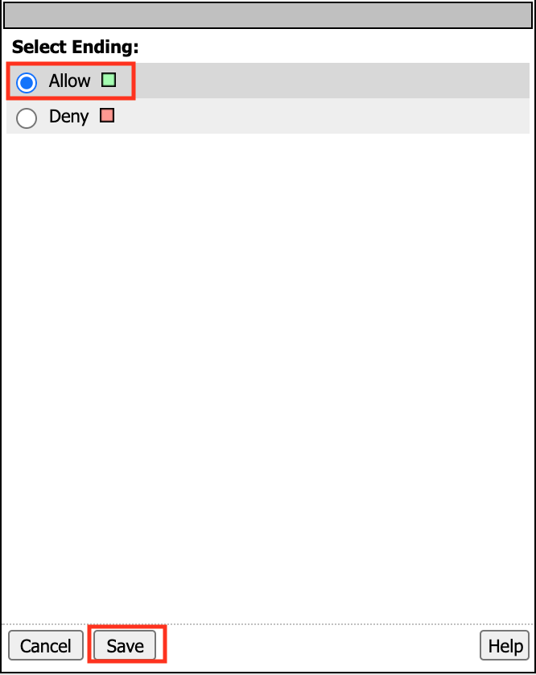
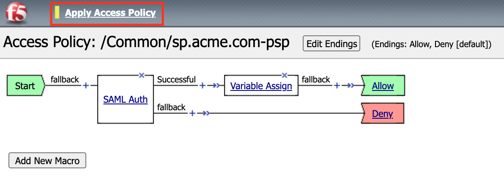
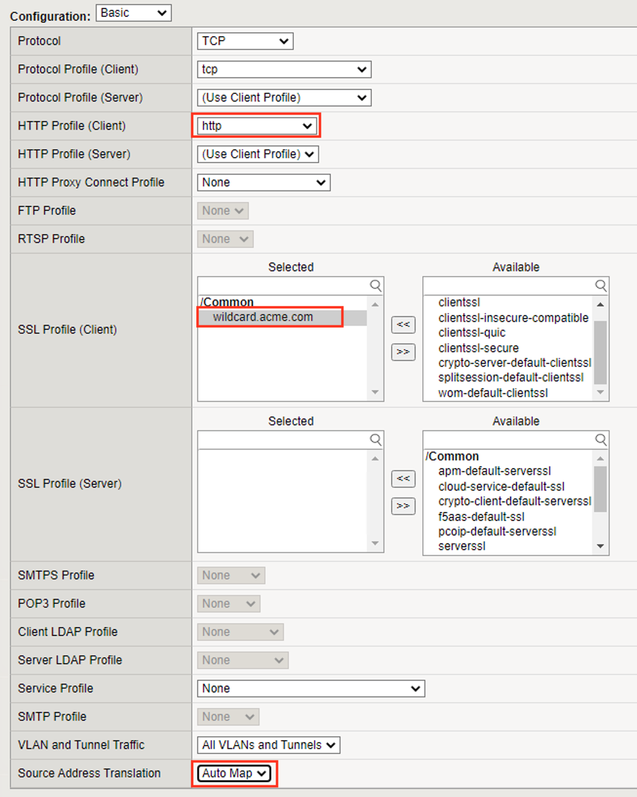
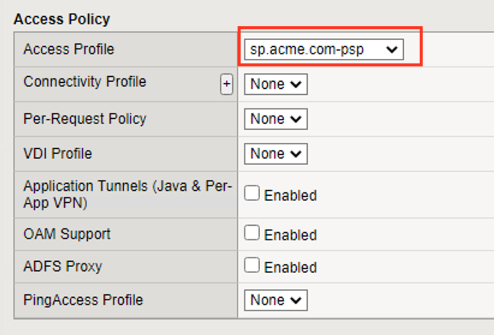
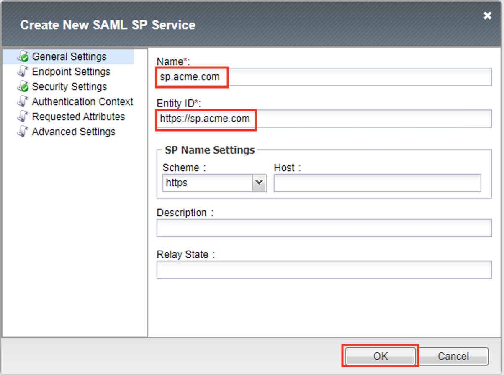
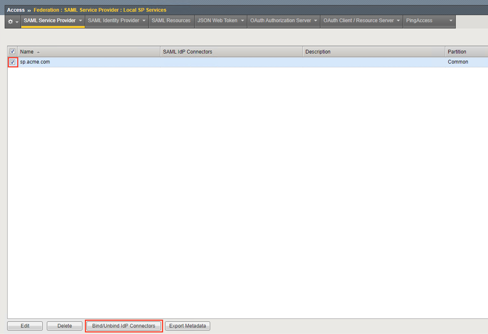
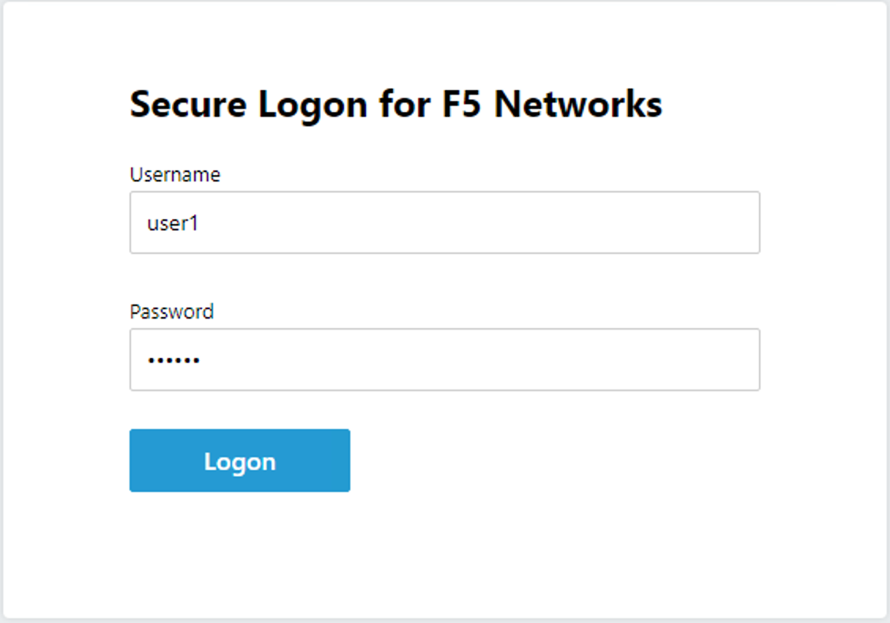
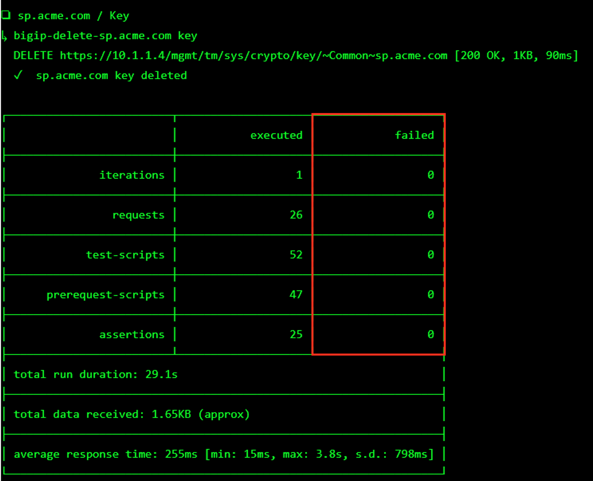

Lab 1: SAML Service Provider (SP) Lab
=======================================

The purpose of this lab is to configure and test a SAML Service
Provider. Students will configure the various aspects of a SAML Service
Provider, import and bind to a SAML Identity Provider and test
SP‑Initiated SAML Federation.

Objective:

-  Gain an understanding of SAML Service Provider(SP) configurations and
   its component parts

-  Gain an understanding of the access flow for SP-Initiated SAML

Estimated completion time: 25 minutes

Task 1 - Setup Lab Environment
-----------------------------------

To access your dedicated student lab environment, you will need a web browser and Remote Desktop Protocol (RDP) client software. The web browser will be used to access the Unified Demo Framework (UDF) Training Portal. The RDP client will be used to connect to the jumphost, where you will be able to access the BIG-IP management interfaces (HTTPS, SSH).
#. Click **DEPLOYMENT** located on the top left corner to display the environment

#. Click **ACCESS** next to jumphost.f5lab.local

   |image001|

#. Select your RDP resolution.

#. The RDP client on your local host establishes a RDP connection to the jumphost.

#. Login with the following credentials:

         - User: **f5lab\\user1**
         - Password: **user1**

#. After successful logon the Chrome browser will auto launch opening the site https://portal.f5lab.local.  This process usually takes 30 seconds after logon.

#. Click the **Classes** tab at the top of the page.

	|image002|

#. Scroll down the page until you see **301 SAML Federation** on the left

   |image003|

#. Hover over tile **SAML Service Provider (SP) Lab**. A start and stop icon should appear within the tile.  Click the **Play** Button to start the automation to build the environment

   +---------------+-------------+
   | |image039|    | |image004|  |
   +---------------+-------------+   

#. The screen should refresh displaying the progress of the automation within 30 seconds.  Scroll to the bottom of the automation workflow to ensure all requests succeeded.  If you experience errors try running the automation a second time or open an issue on the `Access Labs Repo <https://github.com/f5devcentral/access-labs>`__.

   |image005|

TASK 2 ‑ Configure the SAML Service Provider (SP)
-----------------------------------------------------

SP Service
~~~~~~~~~~~~

#. Begin by selecting: **Access -> Federation -> SAML Service Provider -> Local SP Services**
#. Click the **Create** button (far right)

   |image028|

#. In the **Create New SAML SP Service** dialog box click **General Settings**
   in the left navigation pane and key in the following as shown:

   +------------+----------------------------+
   | Name:      | ``sp.acme.com``            |
   +------------+----------------------------+
   | Entity ID: | ``https://sp.acme.com``    |
   +------------+----------------------------+

#. Click **Security Settings**
#. Click **Sign Authentication Request**
#. From the **Message Signing Private Key** dropdown  select **/Common/sp.acme.com** 
#. From the **Message Signing Certificate** dropdown select **/Common/sp.acme.com**

    |image035|

#. Click **OK** on the dialogue box

   |image029|

   .. NOTE:: The yellow box on Host will disappear when the Entity ID is entered.

IdP Connector
~~~~~~~~~~~~~~~~~

#. Click on **Access ‑> Federation ‑> SAML Service Provider ‑> External IdP
   Connectors** *or* click on the **SAML Service Provider** tab in the
   horizontal navigation menu and select **External IdP Connectors**

#. Click specifically on the **Down Arrow** next to the **Create** button
   (far right)

#. Select **From Metadata** from the drop down menu

   |image030|

#. In the **Create New SAML IdP Connector** dialogue box, click **Browse**
   and select the **idp_acme_com.xml** file from the Desktop
   of your jump host.

#. In the **Identity Provider Name** field enter *idp.acme.com*:

#. Click **OK** on the dialog box

   |image031|

   .. NOTE:: The idp_acme_com.xml was created previously.
      Oftentimes, IdP providers will have a metadata file representing their IdP
      service.  This can be imported to save object creation time as it has been
      done in this lab

#. Click on the **Local SP Services** from the **SAML Service Providers** tab
   in the horizontal navigation menu

#. Click the **checkbox** next to the previously created *sp.acme.com* and
   click **Bind/Unbind IdP Connectors** at the bottom of the GUI

   |image032|

#. In the **Edit SAML IdP's that use this SP** dialogue box, click the
    **Add New Row** button

    |image033|

#. In the added row, click the **Down Arrow** under **SAML IdP Connectors** and
   select the **/Common/idp.acme.com** SAML IdP Connector previously created

   |image034|

#. Click the **Update** button and the **OK** button at the bottom of the
   dialog box

   |image006|

#. Under the **Access ‑> Federation ‑> SAML Service Provider ‑>
   Local SP Services** menu you should now see the following (as shown):

   +----------------------+---------------------+
   | Name:                | ``sp.acme.com``     |
   +----------------------+---------------------+
   | SAML IdP Connectors: | ``idp.acme.com``    |
   +----------------------+---------------------+

   |image007|

TASK 3 ‑ Configure the SAML SP Access Policy
----------------------------------------------------

#. Begin by selecting **Access ‑> Profiles/Policies ‑>
   Access Profiles (Per‑Session Policies)**

#. Click the **Create** button (far right)

   |image008|

#. In the **New Profile** window, key in the following:

   +----------------+---------------------------+
   | Name:          | ``sp.acme.com‑psp``       |
   +----------------+---------------------------+
   | Profile Type:  | ``All`` (from drop down)  |
   +----------------+---------------------------+
   | Profile Scope: | ``Profile`` (default)     |
   +----------------+---------------------------+

   |image009|

#. Scroll to the bottom of the **New Profile** window to the
   **Language Settings**
#. Select *English* from the **Factory Built‑in Languages** on the right,
   and click the **Double Arrow (<<)**, then click the **Finished** button.

   |image010|

#. From the **Access ‑> Profiles/Policies ‑> Access Profiles
   (Per‑Session Policies)** screen, click the **Edit** link on the previously
   created ``sp.acme.com-psp`` line

   |image011|

#. In the Visual Policy Editor window for ``/Common/sp.acme.com-psp``,
   click the **Plus (+) Sign** between **Start** and **Deny**

   |image012|

#. In the pop‑up dialog box, select the **Authentication** tab and then click
   the **Radio Button** next to **SAML Auth**

#. Once selected, click the **Add Item** button

   |image013|

#. In the **SAML Auth** configuration window, select ``/Common/sp.acme.com``
   from the **AAA Server** drop down menu

#. Click the **Save** button at the bottom of the window

   |image014|

#. In the **Visual Policy Editor** window for ``/Common/sp.acme.com‑psp``,
   click the **Plus (+) Sign** on the **Successful** branch following
   **SAML Auth**

   |image015|

#. In the pop-up dialog box, select the **Assignment** tab, and then click
   the **Radio Button** next to **Variable Assign**

#. Once selected, click the **Add Item** buton

   |image016|

#. In the **Variable Assign** configuration window, click the
   **Add New Entry** button

    |image017|

#. Under the new **Assignment** row, click the **Change** link

    |image018|

#. In the pop‑up window, configure the following:

   +-------------------+--------------------------------------------+
   | Left Pane                                                      |
   +===================+============================================+
   | Variable Type:    | ``Custom Variable``                        |
   +-------------------+--------------------------------------------+
   | Security:         | ``Unsecure``                               |
   +-------------------+--------------------------------------------+
   | Value:            | ``session.logon.last.username``            |
   +-------------------+--------------------------------------------+

   +-------------------+----------------------------------------------+
   | Right Pane                                                       |
   +===================+==============================================+
   | Variable Type:    | ``Session Variable``                         |
   +-------------------+----------------------------------------------+
   | Session Variable: | ``session.saml.last.attr.name.emailaddress`` |
   +-------------------+----------------------------------------------+

#. Click the **Finished** button at the bottom of the configuration window

    |image019|

#. Click the **Save** button at the bottom of the **Variable Assign**
   dialog window

   |image020|

#. In the **Visual Policy Editor** select the **Deny** ending along the
   **fallback** branch following the **Variable Assign**

   |image021|

#. From the **Select Ending** dialog box, select the **Allow** button and
   then click **Save**

   |image022|

#. In the **Visual Policy Editor** click **Apply Access Policy** (top left)
   and close the **Visual Policy Editor**

   |image023|

TASK 4 ‑ Create the SP Virtual Server & Apply the SP Access Policy
----------------------------------------------------------------------

#. Begin by selecting Local Traffic >> Virtual Servers >> **+** (Plus Symbol)

   |image024|

#. In the **New Virtual Server** window, key in the following as shown:

   +---------------------------+----------------------------+
   | General Properties                                     |
   +===========================+============================+
   | Name:                     | ``sp.acme.com``            |
   +---------------------------+----------------------------+
   | Destination Address/Mask: | ``10.1.10.103``            |
   +---------------------------+----------------------------+
   | Service Port:             | ``443``                    |
   +---------------------------+----------------------------+

    |image025|

   +---------------------------+------------------------------+
   | Configuration                                            |
   +===========================+==============================+
   | HTTP Profile:             | ``http`` (drop down)         |
   +---------------------------+------------------------------+
   | SSL Profile (Client)      | ``wilcard.acme.com``         |
   +---------------------------+------------------------------+
   | Source Address Translation| ``auto Map``                 |
   +---------------------------+------------------------------+

    |image026|

   +-----------------+---------------------------+
   | Access Policy                               |
   +=================+===========================+
   | Access Profile: | ``sp.acme.com-psp``       |
   +-----------------+---------------------------+

    |image027|

   +-----------------+---------------------------+
   | Access Policy                               |
   +=================+===========================+
   | Default Pool    | ``sp-pool``               |
   +-----------------+---------------------------+

#. Click **Finished**

    |image036|

TASK 5 ‑ Test the SAML SP
------------------------------

#. Using your browser from the jump host, navigate to ``https://sp.acme.com``

#. You are redirected to ``https://idp.acme.com``

#. Log in to the IdP with the credentials: 

   - username: **user1** 
   - password: **user1**

   |image037|

#. You are redirected back to https://sp.acme.com and successfully logged on.

    |image038|

#. Review your Active Sessions **(Access ‑> Overview ‑> Active Sessions­­­)**

Task 6 - Lab Cleanup
------------------------

#. From a browser on the jumphost navigate to https://portal.f5lab.local

#. Click the **Classes** tab at the top of the page.

    |image002|

#. Scroll down the page until you see **301 SAML Federation** on the left

   |image003|

#. Hover over tile **SAML Service Provider (SP) Lab**. A start and stop icon should appear within the tile.  Click the **Stop** Button to trigger the automation to remove any prebuilt objects from the environment

   +---------------+-------------+
   | |image039|    | |image998|  |
   +---------------+-------------+  

#. The screen should refresh displaying the progress of the automation within 30 seconds.  Scroll to the bottom of the automation workflow to ensure all requests succeeded.  If you you experience errors try running the automation a second time or open an issue on the `Access Labs Repo <https://github.com/f5devcentral/access-labs>`__.

   |image999|

#. This concludes the lab.

   |image000|

.. |image000| image:: ./media/lab01/000.png
.. |image001| image:: ./media/lab01/001.png
.. |image002| image:: ./media/lab01/002.png
.. |image003| image:: ./media/lab01/003.png

.. |image005| image:: ./media/lab01/005.png

.. |image008| image:: ./media/lab01/008.png

.. |image010| image:: ./media/lab01/010.png

.. |image028| image:: ./media/lab01/028.png

.. |image035| image:: ./media/lab01/035.png

.. |image038| image:: ./media/lab01/038.png

