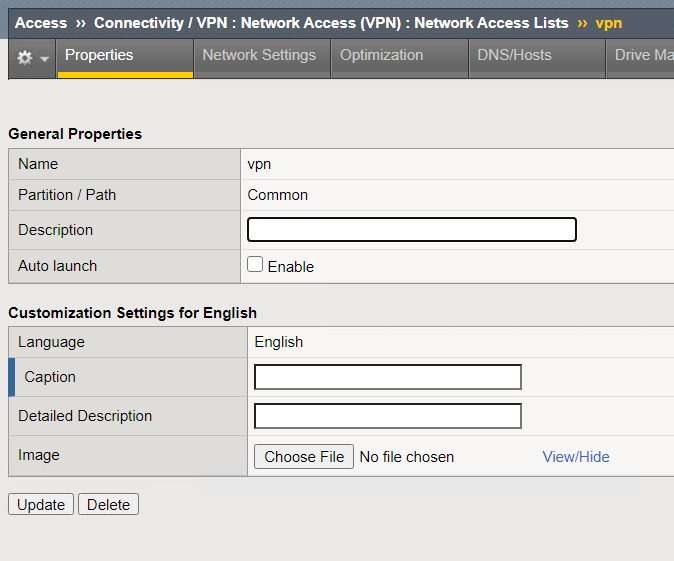
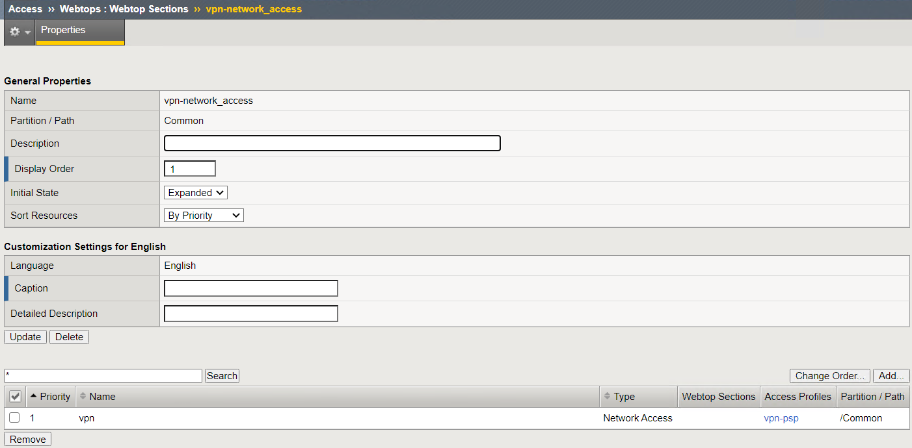
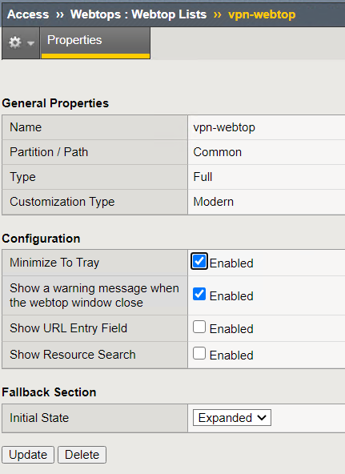
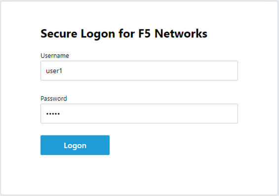
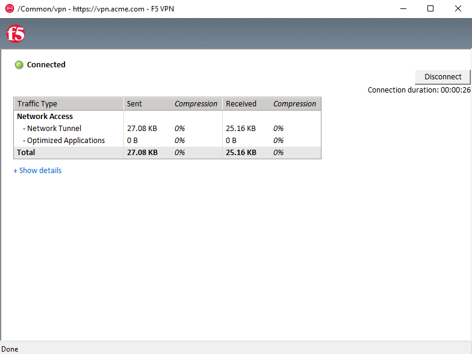
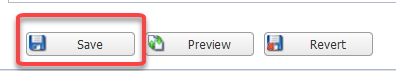
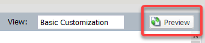

Lab 1: SSL VPN - AD Authentication and  MFA
============================================

Section 1.1 - Setup Lab Environment
-------------------------------------
To access your dedicated student lab environment, you will need a web browser and Remote Desktop Protocol (RDP) client software. The web browser will be used to access the Unified Demo Framework (UDF) Training Portal. The RDP client will be used to connect to the jumphost, where you will be able to access the BIG-IP management interfaces (HTTPS, SSH).
#. Click **DEPLOYMENT** located on the top left corner to display the environment

#. Click **ACCESS** next to jumphost.f5lab.local

   |image0010|

#. Select your RDP resolution.

#. The RDP client on your local host establishes a RDP connection to the jumphost.

#. Login with the following credentials:

         - User: **f5lab\\user1**
         - Password: **user1**

#. After successful logon the Chrome browser will auto launch opening the site https://portal.f5lab.local.  This process usually takes 30 seconds after logon.

#. Click the **Classes** tab at the top of the page.

	 |image0020|

#. Scroll down the page until you see **309 SSL VPN** on the left

   |image0030|

#. Hover over tile **SSL VPN - AD Authentication + MFA**. A start and stop icon should appear within the tile.  Click the **Play** Button to start the automation to build the environment

   +---------------+-------------+
   | |image037|    | |image0040| |
   +---------------+-------------+

#. The screen should refresh displaying the progress of the automation within 30 seconds.  Scroll to the bottom of the automation workflow to ensure all requests succeeded.  If you experience errors try running the automation a second time or open an issue on the `Access Labs Repo <https://github.com/f5devcentral/access-labs>`__.

   |image0050|

Task 1 - Build Network Access Components
~~~~~~~~~~~~~~~~~~~~~~~~~~~~~~~~~~~~~~~~~

#.  While in the jumphost, launch Chrome and click on the bigip1 bookmark.
#.  Log in to bigip1.f5lab.local

      - User: **admin**
      - Password: **admin**

#.  Navigate to **Access** --> **Connectivity/VPN** --> **Network Access (VPN)** --> **Network Access Lists**
#.  Click the **create** button

      |image016|

#.  Give the Network Access list a name and caption

      +-------------+----------------+
      | Name        |  vpn-lab01-vpn |
      +-------------+----------------+
      | Caption     | Corp VPN       |
      +-------------+----------------+

#.  Click **Finished**

      |image017|

#.  Click on the **Network Settings** tab
#.  Click the **+** next to **IPV4 Lease Pool** to create a lease Pool
#.  Give the pool a name **vpn-lab01-vpn_pool**
#.  Click the radio button next to IP address
#.  Enter **10.1.20.254**
#.  Click **Add**
#.  Click **Update**

      |image018|

      .. Note:: For the purposes of this lab we are only going to use a single IP address for the lease pool.  In a production environment you should set this range to as many as you need.

#.  Back at the Network Access object we will configure VPN for split tunneling only accepting traffic destined to the internal network through the VPN tunnel.  Click the radio button **Use split tunneling for traffic**.
#.  Enter IP Address **10.1.20.0**
#.  Enter Mask **255.255.255.0**
#.  Click **Update**

      |image019|

#.  Navigate to **Access** --> **Connectivity/VPN** --> **Connectivity** --> **Profiles**
#.  Click **Add**
#.  Profile Name **vpn-lab01-cp** and Parent Profile **/Common/connectivity**
#.  Click **OK**

      |image023|

#.  Navigate to **Access** --> **Webtops** --> **Webtop Sections**
#.  Click **Create**
#.  Enter name **vpn-lab01-network_access**
#.  Change caption to be **Network Access**
#.  Click **Finished**

      |image020|

#.  Navigate to **Access** --> **Webtops** --> **Webtop Lists**
#.  Click **Create**
#.  Click on **vpn-lab01-webtop**
#.  Select **Full** from the drop down menu
#.  Customization type **Modern**
#.  Click **Finished**

      |image021|

Task 2 - Per Session Access Policy
~~~~~~~~~~~~~~~~~~~~~~~~~~~~~~~~~~~

#.  Navigate to **Access** --> **Profiles/Policies** --> **Access Profiles (Per-Session Policies)**
#.  Click **Create** to create a new per session policy for VPN

      +----------------------+----------------+
      | Name                 |  vpn-lab01-psp |
      +----------------------+----------------+
      | Profile Type         |  All           |
      +----------------------+----------------+
      | Customization Type   |  Modern        |
      +----------------------+----------------+

#. Scroll to the bottom choose English from the right menu and slide move it to the left and click **Finished**

      |image024|

#.  Locate profile **vpn-lab01-psp** and click on **Edit**.  This opens the Visual Policy Editor (VPE) and we can take a look at the policy

      |image001|

#.  Click the **+** between **Start** and **Deny**

      |image038|

#.  Click the **Logon Page** Radio button and click **Add Item**

      |image025|

#.  Accept the defaults for **Logon Page** and click **Save**

      |image026|

#.  Click the **+** between **Logon Page** and **Deny**
#.  Click the **Authentication Tab** and click the **AD Auth** radio button.  Cick **Add Item**
#.  Click the drop down for **Server** and select **/common/vpn-lab01-ad-servers**.  Click **Save**

      |image039|

    .. Note::  AAA Active Directory object was created through automation.  If you want more details on how to create this object see APM 100 Series labs.

#.  Click on the **+** between **AD Auth** and **Deny**
#.  Click on the **Assignment** tab and choose **Advanced Resource Assign**.  Click **Add Item**
#.  Click **Add new entry** Button
#.  Click the **Add/Delete** link

      |image028|

#.  Click the **Network Access** tab and check the box for **/Common/vpn-lab01-vpn**
#.  Click the **Webtop** tab and click the radio button for **/Common/vpn-lab01-webtop**
#.  Click the **Webtop Sections** tab and check the box for **/Common/vpn-lab01-network_access**
#.  Click **Update**

      |image029|

#.  Click **Save**
#.  Click the **Deny** end point on the branch with **Advanced Resource Assign** and select **Allow** then **Save**

      |image030|

#.  Click **Apply Access Policy** and **Close**

      +--------------+---------------+
      | |image031|   |  |image032|   |
      +--------------+---------------+

Task 3 - Apply Policy and profiles to Virtual Server
~~~~~~~~~~~~~~~~~~~~~~~~~~~~~~~~~~~~~~~~~~~~~~~~~~~~~

#.  Navigate to **Local Traffic** --> **Virtual Servers** --> **Virtual Server List**

    .. Note::  Due to how the automation is deployed in the lab the Virtual Server has been deployed in it's own partition.  In your own environment you can choose to deploy the Virtual Server in a specific parition or in Common.

#.  From the Partition drop down in the upper right choose **vpn-lab01**

      |image041|

#.  Click on **vpn-lab01** Virtual Server (not the redirect server)
#.  Scroll down to the **Access Policy** section
#.  Select the **vpn-lab01-psp** from the **Access Profile** drop down menu
#.  Click the drop down for ""Connectivity Profle** and choose the **vpn-lab01-cp** from the menu

      |image033|

#.  Scroll down and click *Update**

Task 4 - Test VPN Access
~~~~~~~~~~~~~~~~~~~~~~~~~~~~~~~~~~~

#. The connects to https://vpn.acme.com with the following credentials

      +------------+-----------+
      | Username:  | user1     |
      +------------+-----------+
      | Password:  | user1     |
      +------------+-----------+

      |image010|

#. Once authenticated the user is presented a Webtop with a single VPN icon.

      |image011|

#. Assuming the VPN has already been installed the user is notified that the client is attempting to start

      |image012|

      .. Note::  You may be prompted to download the VPN update.  This is what a user will experience if you have auto-update enabled in the VPN Connectivity Profile. Click Download and wait for the components to update.

#. A popup opens displaying the status of the VPN connection.  The status will eventually become **Connected**

      |image013|

      .. Note::  If you lose the pop-up check the system tray for the little red ball.  Right click and choose **restore**

#. Click **Disconnect**

Task 5 - Adding Radius MFA
~~~~~~~~~~~~~~~~~~~~~~~~~~~~

#.  Navigate to **Access** --> **Authentication** --> **RADIUS**
#.  From the **Partition** drop down menu at the top right change your partition back to **Common**

    .. Note:: The Radius server has already been built.

#.  Click on **vpn-lab01-radius-server** and examine the properties

      +-------------------------------+------------------------+
      | Name:                         | vpn-lab01-radius       |
      +-------------------------------+------------------------+
      | Mode:                         | Authentication         |
      +-------------------------------+------------------------+
      | Server Connection:            | Use Pool               |
      +-------------------------------+------------------------+
      | Server Pool Name:             | vpn-lab01-radius-pool  |
      +-------------------------------+------------------------+
      | Server Address:               | 10.1.20.8              |
      +-------------------------------+------------------------+
      | Authentication Service Port:  | 1812                   |
      +-------------------------------+------------------------+
      | Secret:                       | secret                 |
      +-------------------------------+------------------------+

#.  Navigate to **Access** --> **Profiles/Policies** --> **Access Profiles (Per-Session Policies)**
#.  Click on **Edit** next to the **vpn-lab01-psp** Profile
#.  Click on the **+** between **AD Auth** and **Advanced Resource Assign**
#.  From the **Logon** tab select **Logon Page** and click **Add Item**
#.  In the name field enter **MFA Prompt**
#.  On row 1 the Username field change the **Read Only** value to **Yes**

      |image043|

#.  Under **Customization** change **Logon Page Input Field #2 to **PIN** and **Logon Button** to **Validate**
#.  Click **Save**

    .. Note:: In this lab we are using FreeRadius with a pre-configured users and PINs. For this particular setup we need to present two login pages.  One for AD Auth and one for MFA.  Setting the Username entry to Read Only will ensure we will reuse the sanem username.  If you were to add MFA via Radius for other MFA vendors please follow the vendors integration documentation.

      |image044|

#.  Click on the **+** between **MFA Prompt** and **Advanced Resource Assign**.
#.  Click on the **Authentication** tab and choose **Radius Auth**
#.  Under **AAA Server** click the drop down menu and select the **vpn-lab01-radius** server we created earlier
#.  Click **Save**
#.  You policy should now be complete. Click **Apply Access Policy**

      |image035|

Task 5 - Test VPN Access (again)
~~~~~~~~~~~~~~~~~~~~~~~~~~~~~~~~~~~

#. The connects to https://vpn.acme.com with the following credentials

      +------------+-----------+
      | Username:  | user1     |
      +------------+-----------+
      | Password:  | user1     |
      +------------+-----------+

      |image010|

#.  You will be prompted to enter the PIN

      +-------+-----------+
      | PNI:  | 123456    |
      +-------+-----------+

      |image036|

      .. Note::  Other MFA providers will operate differently.  They may prompt with an auto enrollment for the first login and then present options to send a PUSH or enter a PIN.  This is just an example of how to integrate Radius as a second form of auth.

#. Once we have passed Auth and MFA the user is presented a Webtop with a single VPN icon.

      |image011|

#. Assuming the VPN has already been installed the user is notified that the client is attempting to start

      |image012|

      .. Note::  You may be prompted to download the VPN update.  This is what a user will experience if you have auto-update enabled in the VPN Connectivity Profile. Click Download and wait for the components to update.

#. A popup opens displaying the status of the VPN connection.  The status will eventually become **Connected**

      |image013|

      .. Note::  If you lose the pop-up check the system tray for the little red ball.  Right click and choose **restore**

#. Click **Disconnect**

.. |image006| image:: media/lab01/006.png

.. |image0010| image:: media/lab01/0010.png
.. |image0020| image:: media/lab01/0020.png

.. |image0040| image:: media/lab01/0040.png

