Lab 1: Creating a SAML Service Provider(SP)
============================================

.. _class4-module1-lab1:

In this lab you will learn how to work with the SP Service and IdP Connector.

Task 1 - Access the Lab Environment
--------------------------------------

To access your dedicated student lab environment, you will need a web browser and Remote Desktop Protocol (RDP) client software. The web browser will be used to access the Unified Demo Framework (UDF) Training Portal. The RDP client will be used to connect to the jumphost, where you will be able to access the BIG-IP management interfaces (HTTPS, SSH).

#. Click **DEPLOYMENT** located on the top left corner to display the environment

#. Click **ACCESS** next to jumphost.f5lab.local

    |image101|

#. Select your RDP resolution.

#. The RDP client on your local host establishes a RDP connection to the Jump Host.

#. Login with the following credentials:

         - User: **f5lab\\user1**
         - Password: **user1**

Task 2 - Import Postman Collections
-----------------------------------------------------------------------

#. From the Jumphost, open **Postman** via the desktop shortcut or toolbar at the bottom

    .. note::  Dismiss any prompts to update Postman.

    |image001|

#. Click **Yes** if prompted for "Do you want to allow this app to make changes to your device?"

    |image002|

#. Click **Import** located on the **Scratch Pad** menu bar

    |image003|

#.  Click **Upload Files**

    |image004|

#. Navigate to C:\\access-labs\\class4\\module1\\student_files, select **student-class4-module1-lab1.postman_collection.json**, and click **Open**

    |image005|

#.  Click **Import**

    |image006|

#. Click on **Collections** from the left menu and a collection called **student-class4-module1-lab1** will be listed

    |image032|

Task 3 - Import IDP Signing Certificate
-----------------------------------------------------------------------

#. Expand the **student-class4-module1-lab1** collection to see the subfolders and requests.

     |image007|

#. Select the **bigip-import-cert-idp** request.

#. Notice the request endpoint is **/mgmt/shared/file-transfer/uploads**.  This endpoint allows us to upload files to the /var/config/rest/downloads directory on the BIG-IP.

     .. note:: If you are unfamiliar with Postman, the information in curly braces are variables that have been defined inside the collection.  If you wish to see the variable values simply click the three dots on the collection that allows you display more options. Click Edit and then Variables.

#. Click **Body** to display what will be passed in the POST request

     .. note:: The request contains only the PEM formated certificate of our AzureAD Identity Provider.

     |image008|

#. Click the blue **Send** button in the upper right corner

#. In the response body we see where the file is stored and its file name.

     |image009|

#. Select the **bigip-install-cert-idp** request.

#. Examine the body of this request.  This request installs the certificate we previously uploaded to the BIG-IPs crypto store.

     |image010|

#. Click the blue **Send** button in the upper right corner

#. In the response body we a see certificate named **class4-module1-lab1-idp** has been installed to the crypto store.

     |image011|

Task 4 - Create an SAML IDP Connector
-----------------------------------------------------------------------

In order to create an SP service the IDP Connector must exist.  This is because the SP Service endpoint contains the binding information to the IDP Connector.

#. Select the **bigip-create-idp connector-azuread** request

#. Notice the request endpoint is **/mgmt/tm/apm/aaa/saml-idp-connector/**.

#. Click **Body** to display what will be passed in the POST request.  The body contains all the necessary setting in order to integrate with AzureAD.

     |image012|

#. Click the blue **Send** button in the upper right corner

#. The response body contains all of the information related the connector and links to other endpoints that are related to this connectors configuration.

     |image013|

Task 5 - Create an SAML SP Service
-----------------------------------------------------------------------

#. Select the **bigip-create-sp service-bigip**

#. Notice the request endpoint is **/mgmt/tm/apm/aaa/saml/**.

#. Click **Body** to display what will be passed in the POST request.  The body contains all the necessary setting for the SP service, plus a binding to the IDP Connector we just created.

     |image014|

#. Click the blue **Send** button in the upper right corner

#. The response body contains all of the information related the SP Service and links to other endpoints that are related to this SP Services configuration.

     |image015|

Task 6 - Explore configuration via the BIG-IP GUI
-----------------------------------------------------------------------

#. From the jumphost, open a browser and navigate to https://bigip1.f5lab.local

#. Login to the BIG-IP GUI with the following credentials:

     - Username: **admin**
     - Password: **admin**

#. Navigate to System -> Certificate Management -> Traffic Certificate Management -> SSL Certificate List.  Click on **SSL Certificate List** and not the + plus symbol.

     |image016|

#. You can see the certificate **class4-module1-lab1-idp** from Task 1 was successfully imported.

     |image017|

#. Navigate to Access >> Federation >> SAML Service Provider >> Local SP Services.  Click on **Local SP Services** and not the + (plus symbol).

     |image018|

#. You can see a SP service object was created with the name **class4-module1-lab1-sp** and successfully bound to an IDP Connector named **class4-module1-lab1-idp**.

     |image019|

Task 7 - Deleting a SAML Service Provider(SP) Service Configuration
------------------------------------------------------------------------
.. _class4-module1-lab1-delete:

With imperative call objects must be deleted in the reverse order they are typically created in.  This is because objects that are currently in use cannot be deleted.

#. From Postman, inside the collection Student-class4-module1-lab1 open the subfolder **Delete Objects**

#. Click **bigip-delete-sp service**

#. Notice the body is empty.  Also, the endpoint we are using is the same endpoint we used to create the SP service plus the partition and object name.

     |image020|

#. Click the blue **Send** button in the upper right corner.

#. Notice nothing is returned in the response body but the Response code is a 200 OK.

     |image021|

#. If you click **Send** a second time you will you get a message back stating the object is not found and a Status Code of 404.  That's because the object was deleted with the prior request.

     |image022|

#. Click **bigip-delete-idp connector**

#. Click the blue **send** button in the upper right corner.

     |image023|

#. You will receive a response code of 200 OK.

     |image024|

#. Click **bigip-delete-idp cert**

#. Click the blue **send** button in the upper right corner.

     |image025|

#. You will receive a response code of 200 OK.

     |image026|

Task 8 - Ensure objects were removed via GUI
-----------------------------------------------

#. Return to the jumpbox's browser and navigate to https://bigip1.f5lab.local

#. Login to the BIG-IP GUI with the following credentials:

     - Username: **admin**
     - Password: **admin**

#. Navigate to System >> Certificate Management >> Traffic Certificate Management >> SSL Certificate List.  Click on **SSL Certificate List** and not the + (plus symbol).

     |image016|

#. Notice the certificate **class4-module1-lab1-idp** was deleted

     |image027|

#. Navigate to Access >> Federation >> SAML Service Provider >> Local SP Services.  Click on **Local SP Services** and not the + (plus symbol).

     |image018|

#. Notice the SP Service was deleted

     |image028|

#. Mouse over SAML Service Provider on the top of the screen and click External IdP Connectors.

     |image029|

#. Notice the IDP Connector was deleted.

     |image030|

Task 9 - Lab Clean up
---------------------------------
#. From Postman, Mouse over the title of the collection and click the **3 dots** next to student-class4-module1-lab1 Collection.

#. Click **Delete**

     |image031|

This concludes the APM lab on creating and deleting APM objects via iControlREST.

     |image000|

.. |image000| image:: media/lab01/000.png
.. |image001| image:: media/lab01/001.png
.. |image002| image:: media/lab01/002.png
.. |image003| image:: media/lab01/003.png
.. |image004| image:: media/lab01/004.png
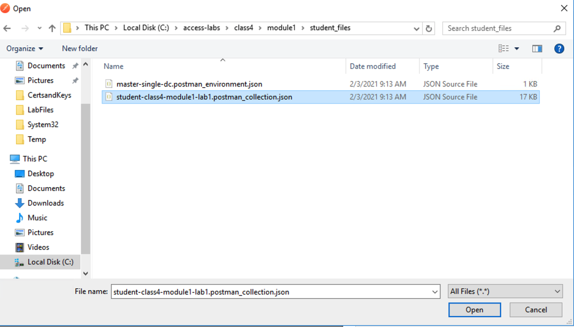
.. |image006| image:: media/lab01/006.png
.. |image007| image:: media/lab01/007.png
.. |image008| image:: media/lab01/008.png
.. |image009| image:: media/lab01/009.png
.. |image010| image:: media/lab01/010.png
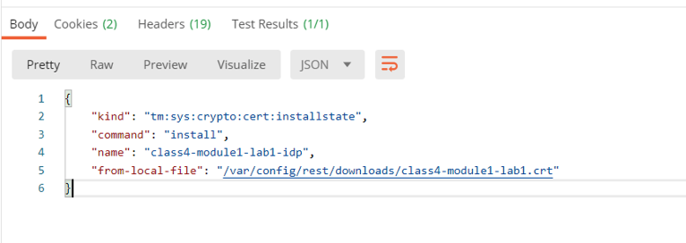
.. |image012| image:: media/lab01/012.png
.. |image013| image:: media/lab01/013.png
.. |image014| image:: media/lab01/014.png
.. |image015| image:: media/lab01/015.png
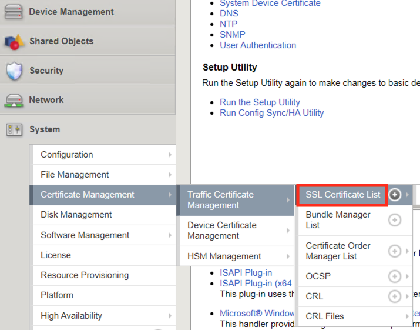
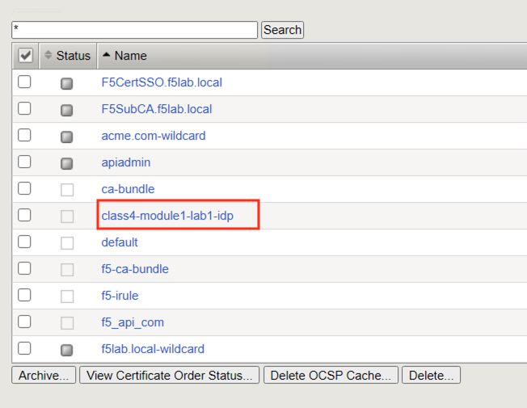
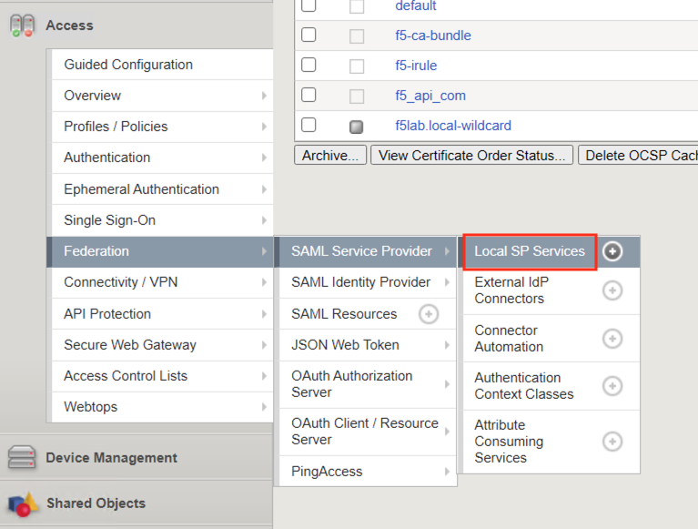
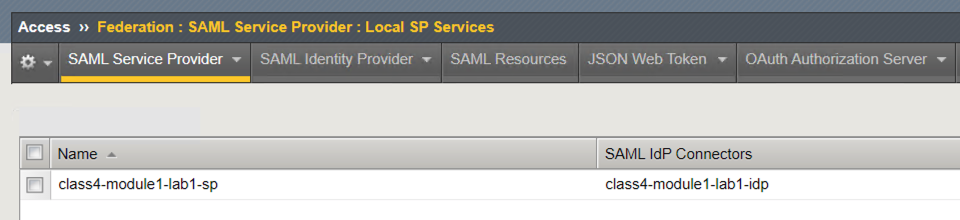
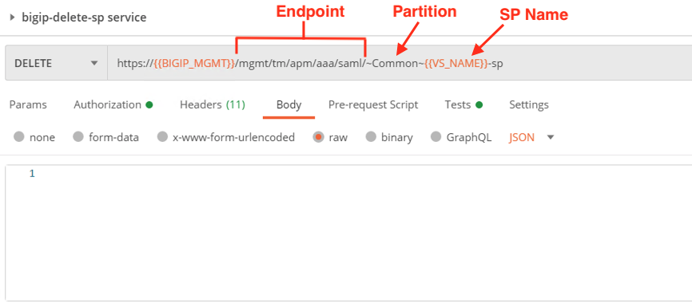
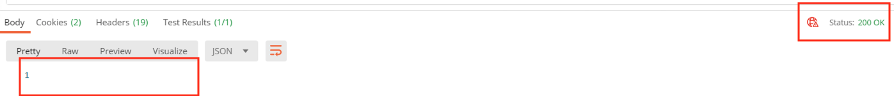
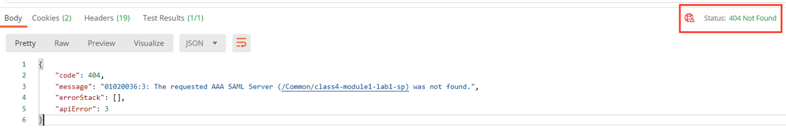
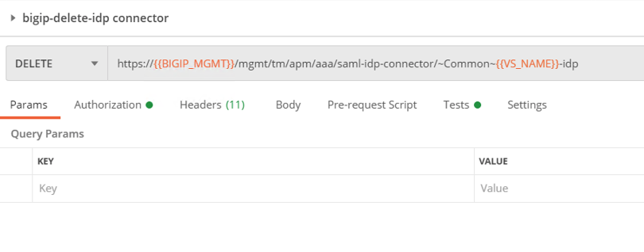
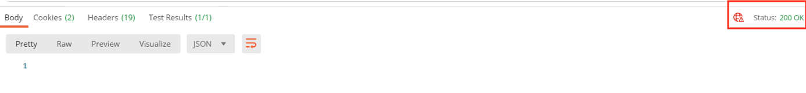
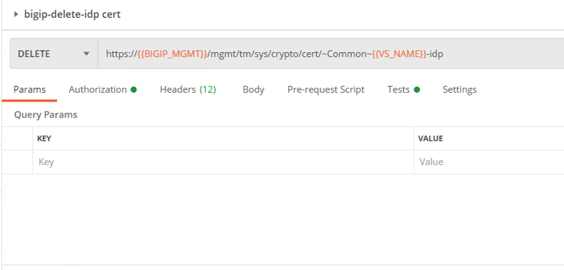
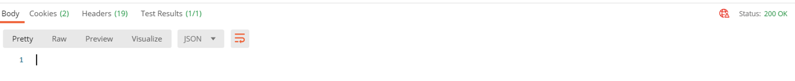
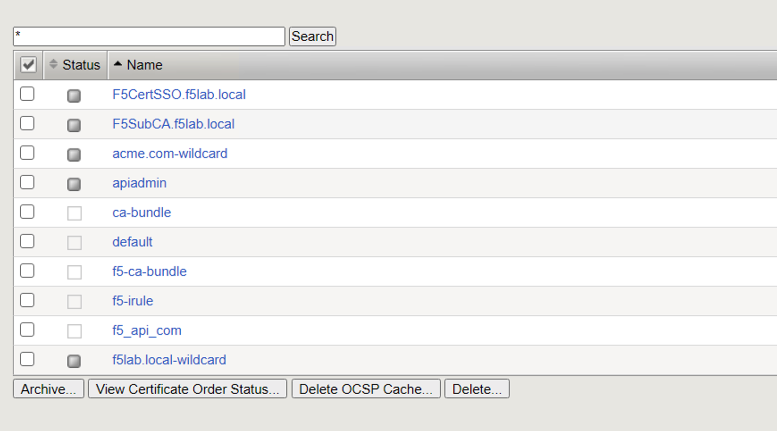
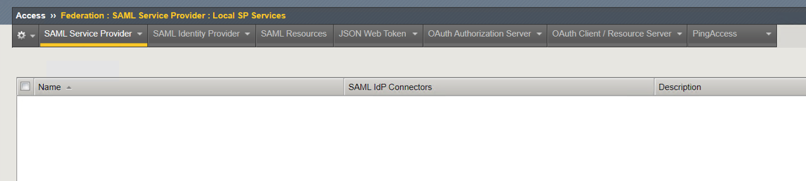
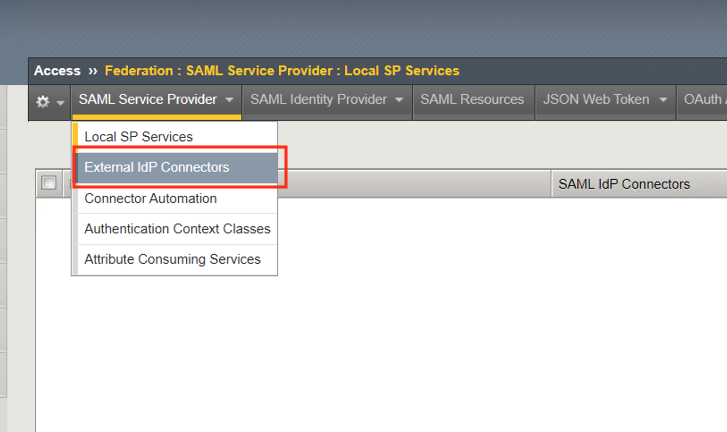
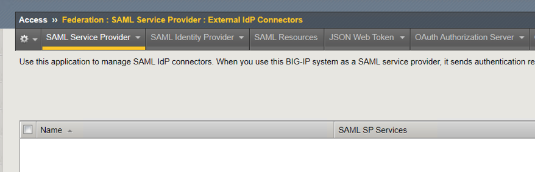
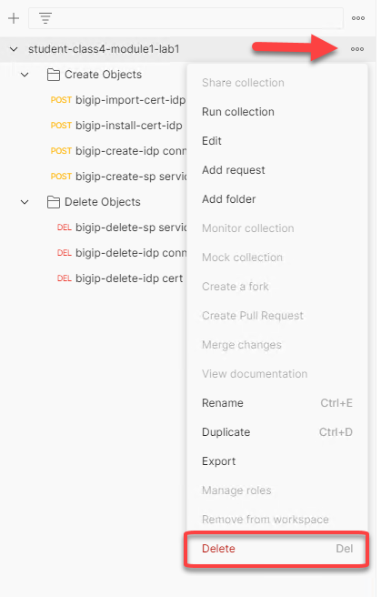
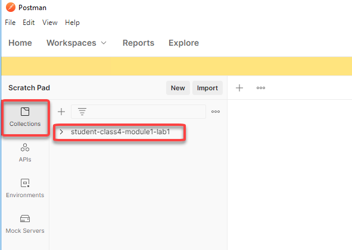
.. |image101| image:: media/lab01/101.png
