Lab 2: Create a SAML SP Per-Session Policy
==============================================

In this lab your will learn about the API calls necessary to build a SAML SP Access Policy.  The graphic below depicts the basic flow required for creating the policy via API.

      |image100|

Access Lab Environment
-------------------------

To access your dedicated student lab environment, you will need a web browser and Remote Desktop Protocol (RDP) client software. The web browser will be used to access the Unified Demo Framework (UDF) Training Portal. The RDP client will be used to connect to the jumphost, where you will be able to access the BIG-IP management interfaces (HTTPS, SSH).

#. Click **DEPLOYMENT** located on the top left corner to display the environment

#. Click **ACCESS** next to jumphost.f5lab.local

      |image101|

#. Select your RDP resolution.

#. The RDP client on your local host establishes a RDP connection to the Jumphost.

#. Login with the following credentials:

         - User: **f5lab\\user1**
         - Password: **user1**

Task 1 - Import Postman Collections
-----------------------------------------------------------------------

#. From the Jumpbox, open **Postman** via the desktop shortcut or toolbar at the bottom

    .. note::  Dismiss any prompts to update Postman.

      |image001|

#. Click **Yes** if prompted for "Do you want to allow this app to make changes to your device?"

      |image002|

#. Click **Import** located on the **Scratch Pad** menu bar

      |image003|

#. Click **Upload Files**

      |image004|

#. Navigate to C:\\access-labs\\class4\\module2\\student_files, select **student-class4-module2-lab2.postman_collection.json**, and click **Open**

      |image005|

#.  Click **Import**

      |image006|

#. A collection called **student-class4-module2-lab2** will appear on the left side in Postman

Task 2 - Create Required SAML Objects
-----------------------------------------------------------------------

#. Expand the **student-class4-module2-lab2** collection and **Create Access Objects** folder.  These requests will import the IdP signing certificate, create a IdP Connector, and also the SP Service.  If you are unfamiliar with these requests please review :ref:`Creating a SAML Service Provider(SP) Service <class4-module1-lab1>` for more detail.

      |image007|

#. Located at the bottom right of the **Postman** application is an option for **Runner**.  Click this icon to open the **Runner** tab

      |image008|

#. From the **Scratchpad** pane locate the **student-class4-module2-lab2** collection.  Expand the collection, drag and drop the **Create Access Objects** folder to the **Runner** tab.

      |image009|
      |image041|

#. Check only **Save Response** and click **Run student-class4-module2-lab2**

      |image010|

#. The **Passed** results will display a value 4.
#. Close Runner by clicking the **X** on the tab open for runner.

      |image012|

Task 3 - Review the SAML SP Policy-item
-------------------------------------------

#. Expand the **Create Policy** folder.  There are two subfolders containing the baseline policy and also the SAML SP Policy-item.  If you are unfamiliar with the requests inside of the baseline policy please review :ref:`Creating a Baseline Per-Session Policy <class4-module2-lab1>`.

      |image013|

#. Expand the Policy-item SAML SP subfolder

      |image014|

#. Click **bigip-create-agent-saml-sp** and then **Body**.  The JSON Body specifies the SP service using the **server** JSON key.   This is the name of the service we just created using runner.

      |image015|

#. Click **bigip-create-policy item-saml-sp** and then **Body**.  The JSON Body of the policy-item contains a reference to the previously reviewed SAML agent along with two branch rules.  One branch rule contains an expression that if the SAML auth is 1(True) then proceed to the allow terminal.  Everything else goes down the fallback branch to the Deny Terminal.  Lastly take notice of the SAML SP policy-item name because we will be using it later in the lab.

      |image016|

Task 4 - Create a SAML SP policy
-------------------------------------------

#.  Expand the **Baseline Policy** subfolder.

      |image017|

#. We will now add the policy-item SAML SP folder to the baseline Policy folder in its proper place.  Click and drag the **policy-item SAML SP** folder between the **Allow Ending** and **Start Item** folders.

      |image018|

#. Now the requests are in the folder we need to modify a couple baseline requests to ensure the policy is created correctly.

#. First, we need to adjust the start item's rule to go to the **SAML SP Policy-item**.   Open the **Start Item** folder, click on **bigip-create-policy item-start**, and then **Body**.

#. Change the **NextItem** key value from **"/Common/{{VS_NAME}}-psp_end_deny"** to **"/Common/{{VS_NAME}}-psp_act_saml_auth"**.

      |image019|

#. After you are done editing the request, click **Save** in the upper right corner.  Runner will not pickup any changes that are not saved causing the automation to fail.

#. Now the workflow of the policy is complete. The flow of the policy is as follows:  A user enters the **start** policy-item, proceed to the **SAML Auth** Policy-item.Then based on success or failure of SAML authentication a user will proceed to the **Allow** or **Deny** Terminal.

#. Every Policy-item must be defined inside of the **items** list of the policy.  Expand the **Create Policy** subfolder located inside the **Baseline Policy** folder, click on **bigip-create-policy** and then **Body**.

      |image038| |image039|

#. Copy and paste the below JSON inside the items array in front of the allow Terminal.  The placement of policy-items inside of the items array is not important to the order they used within branch rules or Visual Policy Editors.

    .. code-block:: JSON

        {
            "name": "{{VS_NAME}}-psp_act_saml_auth",
            "partition": "Common"
        },

    |image020|

#. After you are done editing the request, click **Save** in the upper right corner.  Runner will not pickup any changes that are not saved causing the automation to fail.

#. Now that we have the automation updated let's deploy the policy.  Locate the runner icon in the bottom right corner of the **Postman** application.

      |image008|

#. Drag and drop the **Create Policy** folder to the **Runner** tab

      |image040|
      |image035|

#. Check on **Save Responses** and click **Run student-class4-module2-lab2**

      |image022|

#. The **Passed** results will display a value 2.
#. Close Runner by clicking the **X** on the tab open for Runner.

      |image025|

#. From the jumphost, open browser and navigate to https://bigip1.f5lab.local

#. Login to the BIG-IP GUI with the following credentials:

        - Username: **admin**
        - Password: **admin**

#. Navigate to Access>>Profiles/Policies>>Access Profiles (Per-Session Policies).  Do not click the plus symbol.

      |image026|

#. The policy **class4-module2-lab2-psp** you created via automation is displayed.  Click **Edit** to view Visual Policy Editor(VPE).

      |image027|

#. The policy was successfully deployed with the SAML Auth Policy-Item.

      |image034|

Task 5 - Lab Cleanup
-------------------------------------------

#. Expand the **Lab Cleanup** subfolder and its subfolders. There are a total of five requests.  The first two requests delete the Policy, while the last three requests delete the SP Service, IdP Connector, and IdP signing certificate.  To understand these requests further review :ref:`Deleting an Access Profile <class4-module2-lab1-delete>` or :ref:`Deleting a SAML Service Provider(SP) Service Configuration <class4-module1-lab1-delete>`

      |image028|

#. Locate the runner icon in the bottom right corner of the **Postman** application.

      |image008|

#. Drag and drop **Lab Cleanup** to the **Runner** tab

      |image036|

#. Check on **Save Responses** and click **Run student-class4-module2-lab2**

      |image030|

#. The **Passed** results will display a value of 5. Click the **x** to close the **Runner** tab

      |image033|

#. Hover over the postman collection. Click the **3 dots** the student-class4-module2-lab2 collection.

#. Click **Delete**

      |image037|

This concludes the lab on creating and deleting a SAML SP Access Policy.

      |image000|

.. |image000| image:: media/lab02/000.png
.. |image001| image:: media/lab02/001.png
.. |image002| image:: media/lab02/002.png
.. |image003| image:: media/lab02/003.png
.. |image004| image:: media/lab02/004.png
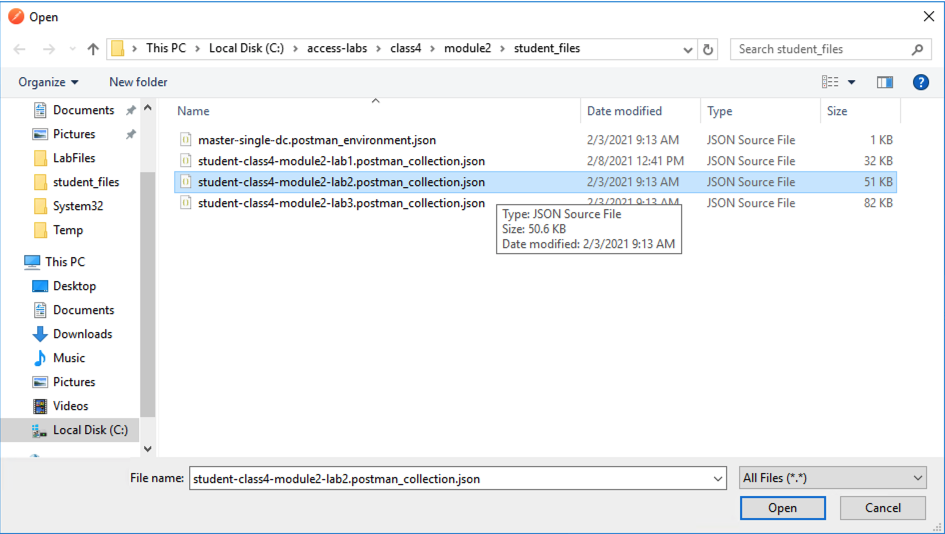
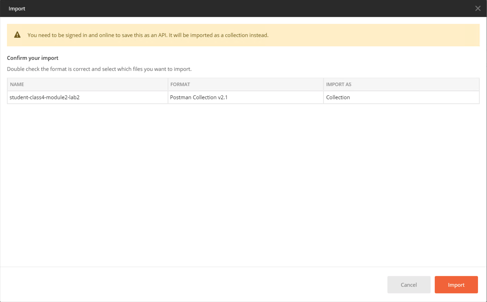
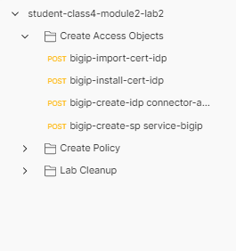
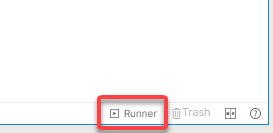
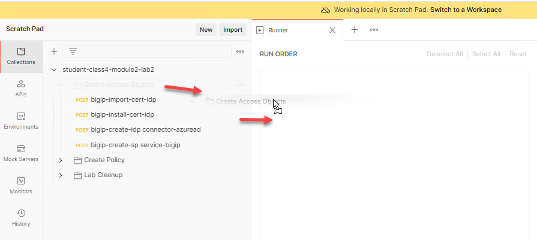
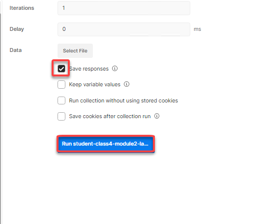
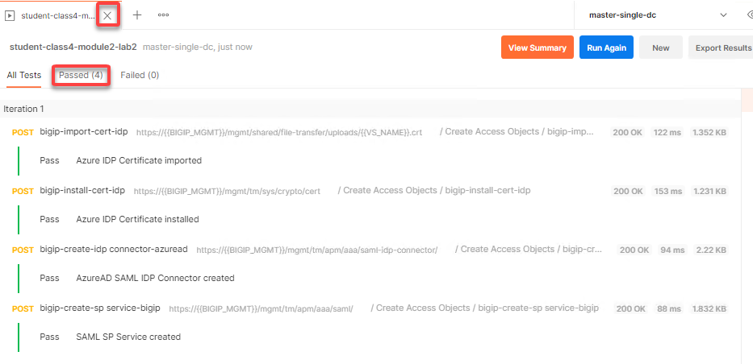
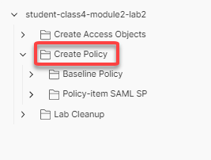
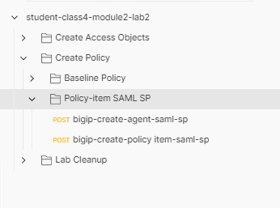
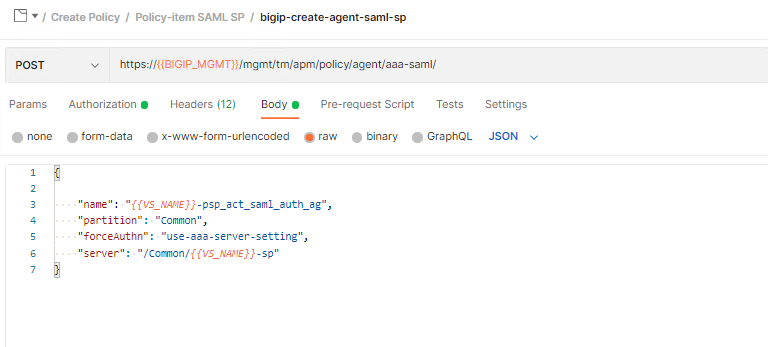
.. |image016| image:: media/lab02/016.png
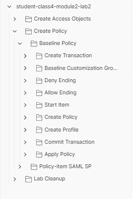
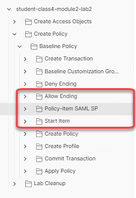
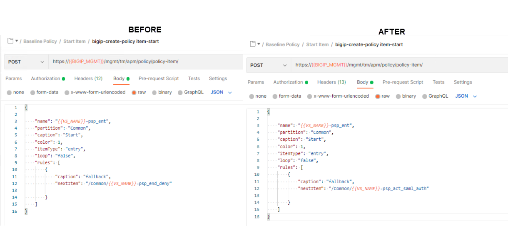
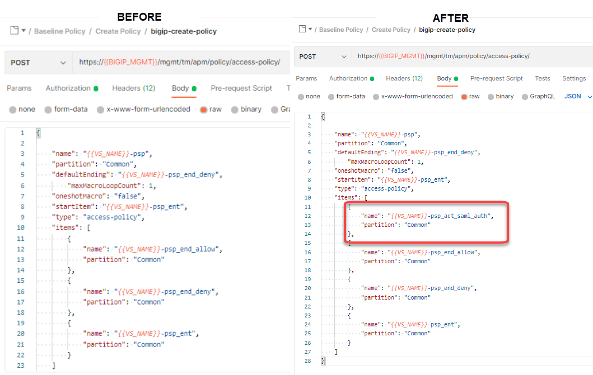
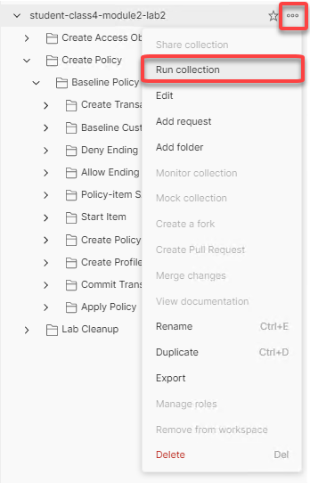
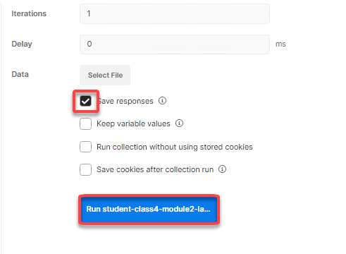
.. |image025| image:: media/lab02/025.png
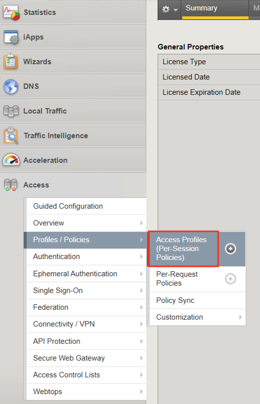
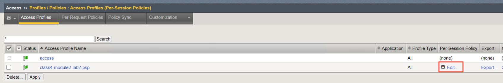
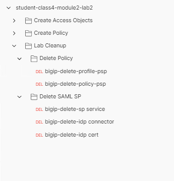
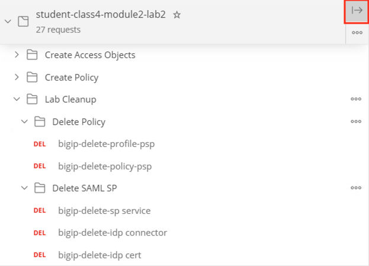
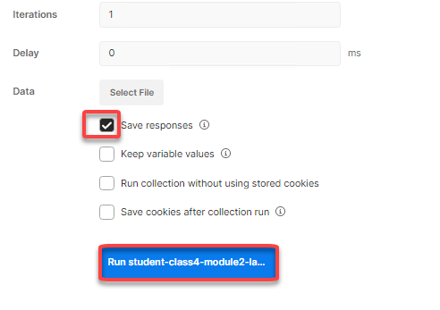
.. |image033| image:: media/lab02/033.png
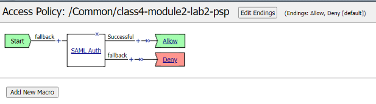
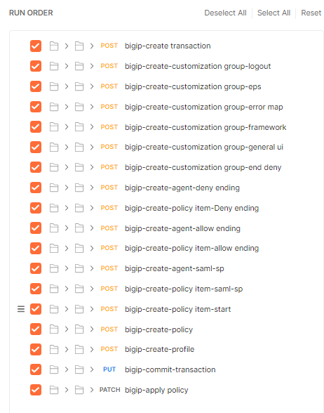
.. |image036| image:: media/lab02/036.png
.. |image037| image:: media/lab02/037.png
.. |image038| image:: media/lab02/038.png
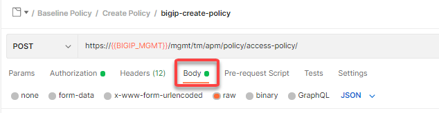
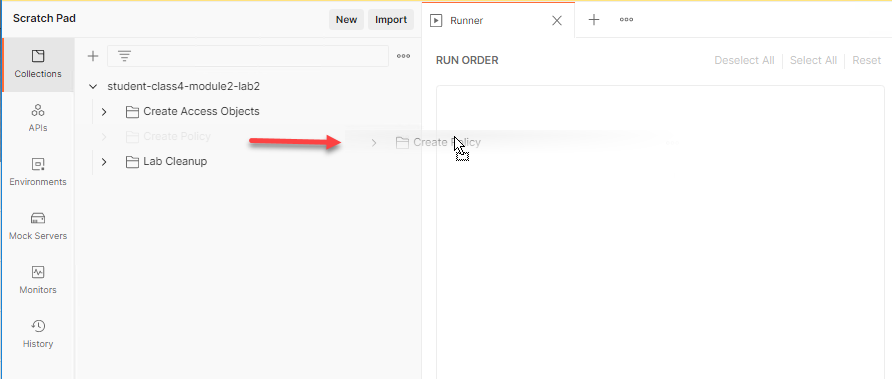
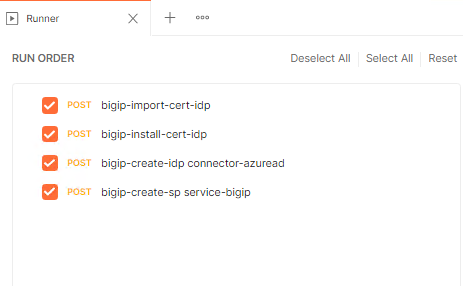
.. |image100| image:: media/lab02/100.png
.. |image101| image:: media/lab02/101.png
