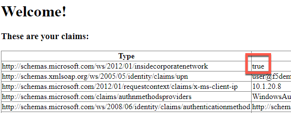

Module: Connect and Validate Environment
========================================

In this module you will validate that ADFS and the application that
requests ADFS authentication are functioning without the BIG-IP in the
traffic flow.

Open an RDP session to the client machine
-----------------------------------------

1. Open an RDP session to the client jumphost

2. Login with username: user and password: user

Change Client to Point at ADFS-1 Direct (BIG-IP not in traffic flow)
--------------------------------------------------------------------

1. Double click the “ADFS-1 Direct” desktop shortcut

|image2|

2. You should receive a notification that the HOSTS file now points
   adfs.vlab.f5demo.com directly at the ADFS-1 server.

|image3|

Open the BIG-IP Management Interface
------------------------------------

1. Open Chrome

2. Click the BIG-IP shortcut

|image0|

3. Login with username: admin and password: admin

4. Nothing needs to be done here now, you are only validating you can access the BIG-IP.

Verify ADFS and App are Functional
----------------------------------

1. Close any open Chrome incognito windows

2. Open Chrome if not already open

3. Right click the “ADFS Demo App” shortcut and click "open in incognito window"

**VERY IMPORTANT: For all testing in this lab, close all incognito windows first, then open a new one for your test. This will ensure you do not have issues related to cache or cookies.**

|image1|

4. You should see a set of claims displayed in the claims app at
   app.vlab.f5demo.com

**If the request failed and you do not see claims then the ADFS-1 Windows server may not have started correctly or may not be finished starting. It must be fixed before proceeding. If the lab has just started, wait a few moments. If it is still not working, you have two options:**
   Option 1: You can restart services on the ADFS servers from your client with the shortcut on the desktop. This is the fastest option.
   
   |image6|
   
   Option 2: You can restart the ADFS-1 and then ADFS-2 servers. This is much slower.

**You should now see the following:**

|image5|

5. Note that ADFS identified the user as inside the corporate network
   because they did not go through an MS-ADFSPIP compliant proxy.

6. What happened:

   i.   You made a request to App

   ii.  App redirected you to ADFS for authentication

   iii. ADFS authenticated you automatically with Windows Integrated
        Authentication with your domain joined computer

   iv.  ADFS redirected you back to App with a WS-Fed assertion

   v.   App validated the assertion and displayed the claims it received
        from ADFS

**You should close all browser windows in the client and repeat these steps to validate ADFS-2 using the desktop shortcut labeled “ADFS-2 Direct”. If it fails, use the desktop shortcut to restart ADFS services as noted above.**

.. |image0| image:: media/image1.png
   :width: 2.82407in
   :height: 1.43919in
.. |image1| image:: media/image2.png
   :width: 3.46296in
   :height: 4.3888in
.. |image2| image:: media/image3.png
   :width: 0.98611in
   :height: 1.25000in
.. |image3| image:: media/image4.png
   :width: 2.84259in
   :height: 0.94358in
.. |image4| image:: media/image5.png
   :width: 2.48148in
   :height: 0.92839in

.. |image6| image:: media/image7.png
   :width: 1.73148in
   :height: 2.19440in
