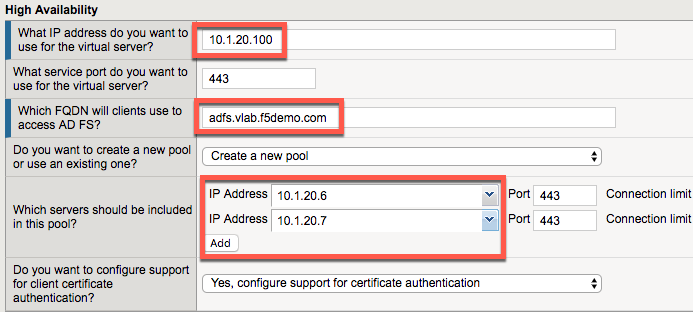

Module: Deploy ADFS Load Balancing Services
===========================================

In this module you will deploy simple load balancing of ADFS for
internal users. No proxy services are needed for internal users.

Change Client to Point at BIG-IP Load Balancing Virtual Server
--------------------------------------------------------------

1. Double click the BIG-IP ADFS Load Balancer desktop shortcut

|image0|

2. You should see that the HOSTS file now points ADFS at the load
   balancing virtual server (which is not yet created)

|image1|

3. Close any open Chrome incognito windows

4. Open a new Chrome window if not already open.

5. Right click the "ADFS Demo App shortcut" and open a new incognito window

   a. It should fail because you cannot access ADFS through the BIG-IP
      until you deploy the configuration.

   b. If it is still working, you may need to close Chrome and/or retry
      the HOSTS file shortcut.

Deploy ADFS iApp for ADFS Load Balancing
----------------------------------------

1. Open the BIG-IP configuration interface

2. Open Local Traffic -> Virtual Servers and notice nothing is deployed

3. Open iApps -> Application Services -> Applications

4. Click Create

Accept all default values except for those listed below.

5. **Name**: **adfs-lb**

6. **Template**: **f5.microsoft\_adfs.v1.2.0rc7**

7. **SSL Encryption**

   a. **How should the BIG-IP system handle SSL traffic?**

      i. **Encrypted traffic is forwarded without decryption (SSL
         pass-through)**

SSL Pass-Through is chosen because Microsoft requires it for supported
load balancing of ADFS. SSL Bridging breaks the connectivity between WAP
servers and ADFS servers because client certificate authentication is
required. You can use SSL Bridging if you will not point WAP servers at
your deployment but following Microsoft’s guidelines and using SSL
Pass-Through is recommended.

8. **High Availability**

   a. **What IP address do you want to use for the virtual server?**

      i. **10.1.20.100**

10.1.20.x is the internal network in this environment.

a. **Which FQDN will clients use to access AD FS?**

   i. **adfs.vlab.f5demo.com**

b. **Which servers should be included in this pool?**

   i.   **10.1.20.6**

   ii.  Click Add

   iii. **10.1.20.7**

|image2|

9. Click Finished

Test the ADFS Load Balancing Functionality
------------------------------------------

1. Close any open Chrome incognito windows

2. Open a new Chrome window if not already open

3. Right click the “ADFS Demo App” shortcut and open in an incognito window

|image3|

4. You should see a set of claims displayed in the claims app at
   app.vlab.f5demo.com

|image4|

a. Note that ADFS is still identifying the user as inside the corporate
   network because the user did not go through an MS-ADFSPIP compliant
   proxy solution.

b. What happened:

   i.   You made a request to App

   ii.  App redirected you to ADFS for authentication

   iii. **The BIG-IP received the request and load balanced it to one of
        the ADFS servers (this is the only change from last time)**

   iv.  ADFS authenticated you automatically with Windows Integrated
        Authentication with your domain joined computer

   v.   ADFS redirected you back to App with a WS-Fed assertion

   vi.  App validated the assertion and displayed the claims it received
        from ADFS

Review the ADFS Load Balancing Configuration
--------------------------------------------

1. Go to Local Traffic -> Virtual Servers

2. Notice there are two deployed, one on port 443 and one on port 49443

   a. 443 is for ADFS traffic

      i. Pool members use port 443

   b. 49443 is for client certificate auth support

      i. Pool members use port 49443

.. |image0| image:: media/image1.png
   :width: 1.23611in
   :height: 1.73611in
.. |image1| image:: media/image2.png
   :width: 4.02778in
   :height: 1.29698in

.. |image3| image:: media/image4.png
   :width: 2.48148in
   :height: 0.92839in
.. |image4| image:: media/image5.png
   :width: 4.81482in
   :height: 2.08488in
