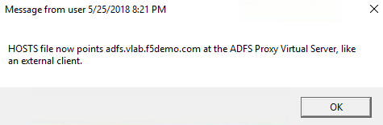
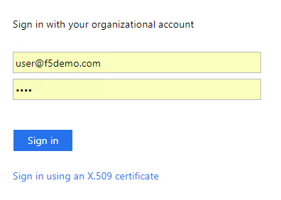
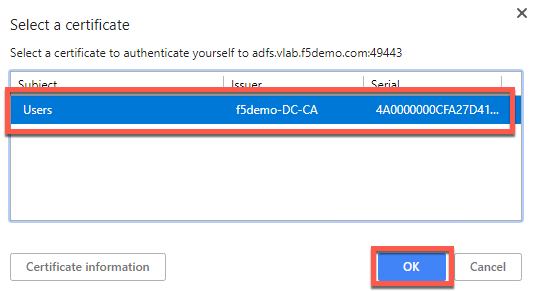
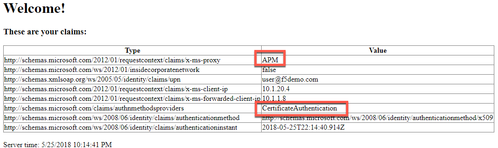

Module: Deploy ADFS Proxy Services
==================================

In this module you will deploy ADFS Proxy functionality. The BIG-IP will
perform the same role in front of ADFS as a Web Application Proxy (WAP)
server does, supporting the protocol MS-ADFSPIP.

Change Client to Point at BIG-IP ADFS Proxy Virtual Server
----------------------------------------------------------

1. Double click the BIG-IP ADFS Load Balancer desktop shortcut

|image0|

2. You should see that the HOSTS file now points ADFS at the load
   balancing virtual server (which is not yet created)

|image1|

3. Close any open Chrome incognito windows

4. Open a new Chrome window if not already open

5. Right click the "ADFS Demo App" shortcut and open a new incognito window

   a. It should fail because you cannot access ADFS through the BIG-IP
      until you deploy the configuration.

   b. If it is still working, you may need to close Chrome and/or retry
      the HOSTS file shortcut.

Deploy ADFS iApp for ADFS Proxy (with MS-ADFSPIP support)
---------------------------------------------------------

1. Open the BIG-IP configuration interface

2. Open iApps -> Application Services -> Applications

3. Click Create

Accept all default values except for those listed below.

4. **Name**: **adfs-proxy**

5. **Template**: **f5.microsoft\_adfs.v1.2.0rc7**

6. **Access Policy Manager (BIG-IP APM)**

   a. **Would you like to configure BIG-IP as an ADFS Proxy?**

      i. **Yes, configure BIG-IP as an ADFS Proxy**

   b. **What is the account to be used for establishing proxy trust with
      ADFS?**

      i. **admin@f5demo.com**

   c. **What is the password associated with that account?**

      i. **admin**

Establishing trust with ADFS requires username in UPN or
domain\\username format. This is true whether in the iApp or
establishing trust manually.

7. **SSL Encryption**

   a. **Which SSL certificate do you want to use?**

      i. **internal-vlab.f5demo.com.crt**

   b. **Which SSL private key do you want to use?**

      i. **internal-vlab.f5demo.com.key**

Note that this time we are doing SSL Bridging. This is required for the
ADFS Proxy. Client certificate authentication can still be performed
because BIG-IP supports MS-ADFSPIP.

8. **High Availability**

   a. **What IP address do you want to use for the virtual server?**

      i. **10.1.10.100**

      10.1.10.x is the external/DMZ network in this environment. Notice this
      is .10 not .20 this time.

a. **Which FQDN will clients use to access AD FS?**

   i. **adfs.vlab.f5demo.com**

b. **Which servers should be included in this pool?**

   i.   **10.1.20.6**

   ii.  Click Add

   iii. **10.1.20.7**

c. **What Trusted CA would you like to use to validate the client
   certificate chain presented during certificate authentication?**

   i. **F5demo-DC-CA.crt**

This is the AD Certificates Services CA certificate for this environment
that was used to issue the client certificates so that the client
certificate auth can be verified. It was pre-imported for you.

9. Click Finished

Test the ADFS Proxy Forms Authentication Functionality
------------------------------------------------------

1. Close any open Chrome incognito windows

2. Open a new Chrome window if not already open

3. Right click the "ADFS Demo App" shortcut and open a new incognito window

|image2|

**If you do not get the ADFS logon page noted below wait 60-120 seconds for the ADFS servers to sync and try again. If you are still getting the error you may have cache problems. Double check that you have closed all other incognito windows before trying this, and you can clear cache and cookies by performing ctrl+shift+del and selecting "all time".**

1. This time instead of automatically authenticating with Windows
   Integrated Authentication you are presented with a forms login page.
   This is because ADFS is configured to require Forms auth for external
   users.

   a. Username: **user@f5demo.com**

   b. Password: **user**

   c. Click Sign In

|image3|

1. You should see a set of claims displayed in the claims app at
   app.vlab.f5demo.com

|image4|

a. Note that ADFS now identifies the user as outside the corporate
   network, knows that APM acted as an ADFS Proxy, knows the user’s true
   IP address, and that the user is now logging in with
   FormsAuthentication instead of WindowsAuthentication.

b. What happened:

   i.   You made a request to App

   ii.  App redirected you to ADFS for authentication

   iii. **The BIG-IP received the request and load balanced it to one of
        the ADFS servers, as well as communicated data about the traffic
        using MS-ADFSPIP.**

   iv.  **The ADFS server determined that you should be authenticated
        using the extranet policy and sent back a logon page which the
        BIG-IP forwarded on to you.**

   v.   **You submitted the forms and ADFS authenticated with your
        credentials**

   vi.  ADFS redirected you back to App with a WS-Fed assertion

   vii. App validated the assertion and displayed the claims it received
        from ADFS

Test the ADFS Proxy Certificate Authentication Functionality
------------------------------------------------------------

1. Close any open Chrome incognito windows

2. Open a new Chrome window if not already open

3. Right click the "ADFS Demo App" shortcut and open a new incognito window

|image5|

1. Click **Sign in using an X.509 certificate**

|image6|

a. Note that you can configure ADFS extranet authentication settings to
   perform certificate authentication automatically. The ADFS server in
   this lab is setup to allow both forms and certificate authentication.

1. The certificate is already selected, click OK.

|image7|

1. You should see a set of claims displayed in the claims app at
   app.vlab.f5demo.com

|image8|

a. Note that ADFS now ADFS has identified the authentication type as
   CertificateAuthentication

b. What happened:

   i.    You made a request to App

   ii.   App redirected you to ADFS for authentication

   iii.  **The BIG-IP received the request and load balanced it to one
         of the ADFS servers, as well as communicated data about the
         traffic using MS-ADFSPIP.**

   iv.   **The ADFS server determined that you should be authenticated
         using the extranet policy and sent back a logon page which the
         BIG-IP forwarded on to you.**

   v.    **You selected the Certificate Authentication, which caused you
         to be redirected to port 49443 where the BIG-IP performed
         certificate authentication**

   vi.   **BIG-IP forwarded on details about your authentication using
         MS-ADFSPIP to the ADFS server**

   vii.  ADFS redirected you back to App with a WS-Fed assertion

   viii. App validated the assertion and displayed the claims it
         received from ADFS

Review the ADFS Proxy Configuration
-----------------------------------

1. Go to Local Traffic -> Virtual Servers

2. Notice there are two adfs-proxy virtual servers deployed, one on port
   443 and one on port 49443

   a. 443 is for ADFS traffic

      i. Pool members use port 443

   b. 49443 is for client certificate auth support

      i. Pool members use **port 443**

         1. **This is different from the load balancing only, which
            pointed to port 49443. This is because the certificate auth
            is not passing through, BIG-IP is performing the certificate
            auth, then sending the data along to ADFS using
            MS-ADFSPIP.**

   a. Click on the virtual server **adfs-proxy\_adfs\_vs\_443**

      i. Scroll down and examine the Access Policy -> ADFS Proxy
         configuration item

         1. Note that ADFS Proxy functionality is enabled and a trust is
            established. The BIG-IP will auto-renew this prior to
            expiration.

         2. Note that no Access Profile is deployed. You can add one if
            desired for additional security. The iApp is capable of
            deploying it, along with the required bypass iRule for some
            URLs like the metadata sharing URL.

   b. Go to Local Traffic -> Profiles -> SSL -> Server and click
      **adfs-proxy\_server-ssl**

      i.  Note that a certificate and key are used on the server side.
          These are created as part of establishing the trust with the
          ADFS server as noted in the previous step and then
          automatically input here.

      ii. This is shared by both the 443 and the 49443 virtual servers
          because they need the same settings to communicate with ADFS.

   c. Change configuration mode to advanced

      i. Note that the server name field contains adfs.vlab.f5demo.com.
         ADFS requires SNI and this is how you configure it on the
         serverssl profile.

   d. Go to Local Traffic -> Profiles -> SSL -> Client and click
      **adfs-proxy\_client-ssl-cert-auth**

      i.   This is the SSL profile that provides certificate auth on the
           port 49443 virtual server.

      ii.  Note that Client Certificate is set to required and the
           Trusted Certificate Authorities is set to f5demo-DC-CA.

      iii. You could use Advertised Certified Authority here if you
           wanted the client to only display certificates generated by a
           specific CA. This could be your primary CA, or even a
           specific subordinate CA if you wanted to issue client
           certificate auth user certificates from a specific CA to
           reduce the number shown to the user.

.. |image0| image:: media/image1.png
   :width: 0.84481in
   :height: 1.06481in

.. |image2| image:: media/image3.png
   :width: 2.48148in
   :height: 0.92839in

.. |image4| image:: media/image5.png
   :width: 6.50000in
   :height: 2.27986in
.. |image5| image:: media/image3.png
   :width: 2.48148in
   :height: 0.92839in
.. |image6| image:: media/image6.png
   :width: 3.60185in
   :height: 2.45138in

