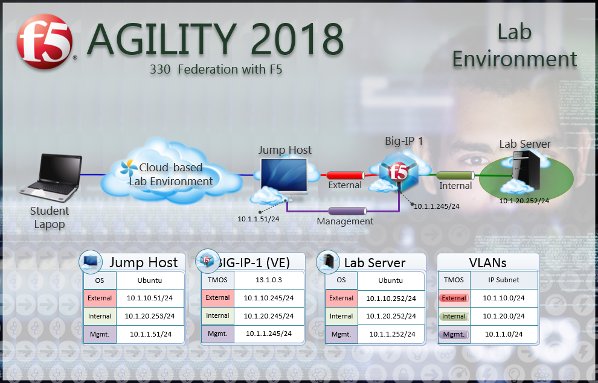

Welcome
=======

Welcome to the 330 Access Policy Manager (APM) Federation Hands-on Lab Guide. The
following labs and exercises will instruct you on how to configure and
troubleshoot federation use cases based on the experience of field
engineers, support engineers and clients. This guide is intended to
complement lecture material provided during the 330 course as well as a
reference guide that can be referred to after the class as a basis for
configuring federation relationships in your own environment.

Lab Network Setup
-----------------

In the interest of focusing as much time as possible configuring and
performing lab tasks, we have provided some resources and basic setup
ahead of time. These are:

-  Cloud-based lab environment complete with Jump Host, Virtual BIG-IP
   and Lab Server

-  Duplicate Lab environments for each student for improved
   collaboration

-  The Virtual BIG-IP has been pre-licensed and provisioned with Access
   Policy Manager (APM)

-  Pre-staged configurations to speed up lab time, reducing repetitive
   tasks to focus on key learning elements.

If you wish to replicate these labs in your environment you will need to
perform these steps accordingly. Additional lab resources are provided
as illustrated in the diagram below:

|image000|

Timing for labs
---------------

The time it takes to perform each lab varies and is mostly dependent on
accurately completing steps. This can never be accurately predicted but
we strived to provide an estimate based on several people, each having a
different level of experience. Below is an estimate of how long it will
take for each lab:

+-----------------------------------------------------+----------------------+
| **Lab Description**                                 | **Time Allocated**   |
+=====================================================+======================+
| LAB 1 - SAML Service Provider (SP)                  | 25 minutes           |
+-----------------------------------------------------+----------------------+
| LAB 2 - SaaS SAML Identity Provider (IDP) (OKTA)    | 25 minutes           |
+-----------------------------------------------------+----------------------+
| LAB 3 - oAuth & OpenID Connect (Google)             | 25 minutes           |
+-----------------------------------------------------+----------------------+
| LAB 4 - oAuth and Azure AD Lab                      | 25 minutes           |
+-----------------------------------------------------+----------------------+

Authentication – Credentials
----------------------------

The following credentials will be utilized throughout this Lab guide.
All other credentials will be indicated at the time of use.

+--------------------------------------+---------------+----------------+
| **Credential Use**                   | **User ID**   | **Password**   |
+======================================+===============+================+
| BIG-IP Configuration Utility (GUI)   | admin         | admin          |
+--------------------------------------+---------------+----------------+
| BIG-IP CLI Access (SSH)              | root          | default        |
+--------------------------------------+---------------+----------------+
| Jump Host Access                     | f5student     | f5DEMOs4u      |
+--------------------------------------+---------------+----------------+

Utilized Browsers
-----------------

The preferred browser for this lab is Firefox. Shortcut links have been
provided to speed access to targeted resources and assist you in your
tasks. Except where noted, either browser can be used for all lab tasks.

General Notes
-------------

As noted previously, environment staging has been done to speed up lab
time, reducing repetitive tasks to focus on key learning elements. Where
possible steps that have been optimized have been called out with links
and references provided in the *Additional Information* section for
additional clarification. The intention being that the lab guide truly
serves as a resource guide for all your future federation deployments.

Acknowledgements 
----------------

This lab is built upon the work of prior F5 Agility’s and the work of
many individuals behind the scenes in addition the 2018 Agility Lab
Team. Many thanks to the 2017 Agility Lab Team for the SAML & OAuth
Federation Labs, Lucas Thompson for his OAuth/OIDC Lab and our lab
testers Matt Harmon, Dave Lipowsky & Stu McMath.

Presented by
------------

APM 330 Presented by: Steve Lyons, Chris Miller & Chas Lesley

