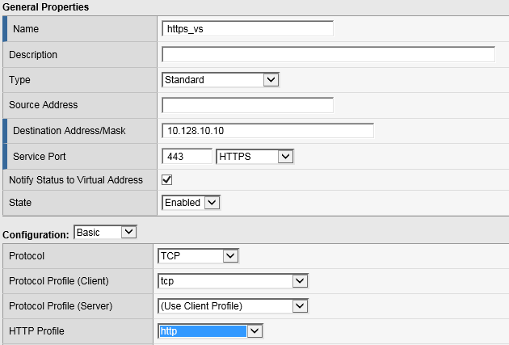
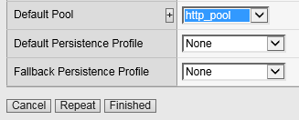
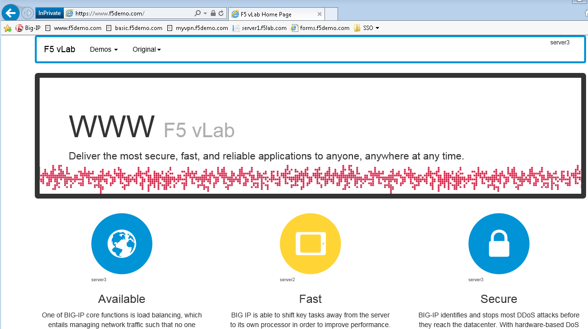

Lab 1 – Deploy a simple reverse proxy service
---------------------------------------------

This lab will teach you how to configure resources including Virtual Servers, Pools, and monitors that we will use as the foundation for subsequent labs.

.. NOTE::
  Lab Requirements:

  - BIG-IP with APM licensed and activated
  - Web site up and running at 10.128.20.200:80, 10.128.20.201:80 and 10.128.20.202:80

Task – Create a pool
~~~~~~~~~~~~~~~~~~~~

Follow these steps to complete this task:

#. Browse to **Local Traffic >** **Pools** and click the ‘\ **+**\ ’
   next to **Pools List** to create a new pool.
#. Name the pool in “\ **http\_pool**\ ”
#. Assign the monitor “\ **http**\ ” by selecting it and sliding it to
   the left.
#. **Add** the following “new node” members to the pool, then click **Finished**:

   -  Node Name: **server1**, Address: **10.128.20.200**, Service Port **80**

   -  Node Name: **server2**, Address: **10.128.20.201**, Service Port **80**

   -  Node Name: **server3**, Address: **10.128.20.202**, Service Port **80**

   |image1|

Task - Create HTTP Virtual Server to redirect to HTTPS
~~~~~~~~~~~~~~~~~~~~~~~~~~~~~~~~~~~~~~~~~~~~~~~~~~~~~~

#. Create a new Virtual Server by browsing to **Local Traffic** >
   **Virtual Servers** > **Virtual Server List** and click the
   ‘\ **+**\ ’ to create a new one.

#. Name the Virtual Server in the following format **http\_vs\_redir**.
   For “Destination Address/Mask”, use **10.128.10.10"**. For “Service
   Port”, use **80**.

#. For “HTTP Profile” choose the default http profile called **http**

#. Under iRules at the bottom of the screen, select the **sys\_https\_redirect** irule from the “Available” list and slide it over to the “Enabled” list and click **Finished**.

|image2|

|image3|

Task - Create HTTPS Virtual Server
~~~~~~~~~~~~~~~~~~~~~~~~~~~~~~~~~~

#. Create a new Virtual Server by browsing to **Local Traffic** >
   **Virtual Servers** > **Virtual Server List** and click the
   ‘\ **+**\ ’ to create a new one.

#. Name the Virtual Server in the following format **https\_vs** .

#. For “Destination Address/Mask”, use **10.128.10.10**. For “Service
   Port”, use **443**.

#. For “HTTP Profile”, choose the default **http** profile

#. For “SSL Profile (Client)”, choose the **f5demo**, slide it over to
   the “Selected” column

#. For “Source Address Translation”, choose **Auto Map**

#. For “Default Pool”, select the pool created earlier (**http\_pool**) and click **Finished**.

|image4|

|image5|

|image6|

Task - Testing
~~~~~~~~~~~~~~

You should now be able to browse to either Virtual Server (HTTP or
HTTPs) and you should get the same page. Try:
**http://www.f5demo.com** and **https://www.f5demo.com**

|image7|

.. |image1| image:: media/image3.png
   :width: 3.18038in
   :height: 3.19792in
.. |image2| image:: media/image4.png
   :width: 2.83333in
   :height: 2.51525in
.. |image3| image:: media/image5.png
   :width: 3.60417in
   :height: 1.98705in

.. |image5| image:: media/image7.png
   :width: 4.00000in
   :height: 2.70790in

