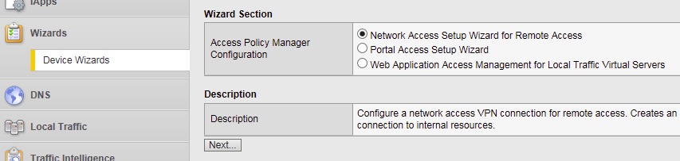
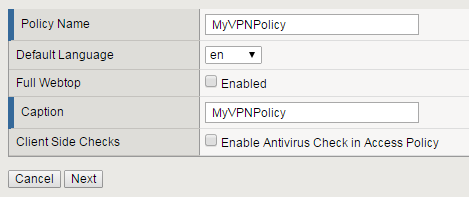
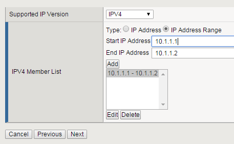
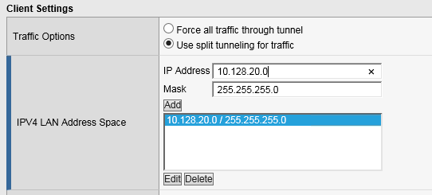
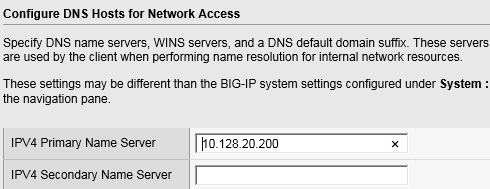
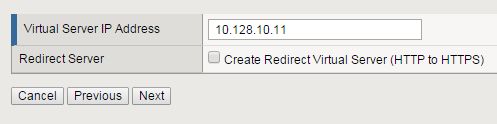
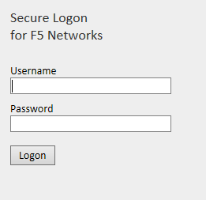
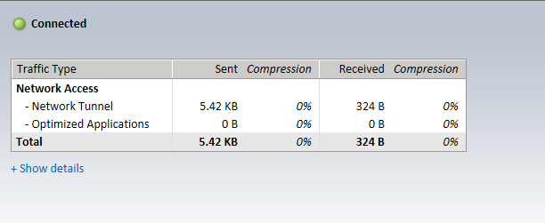
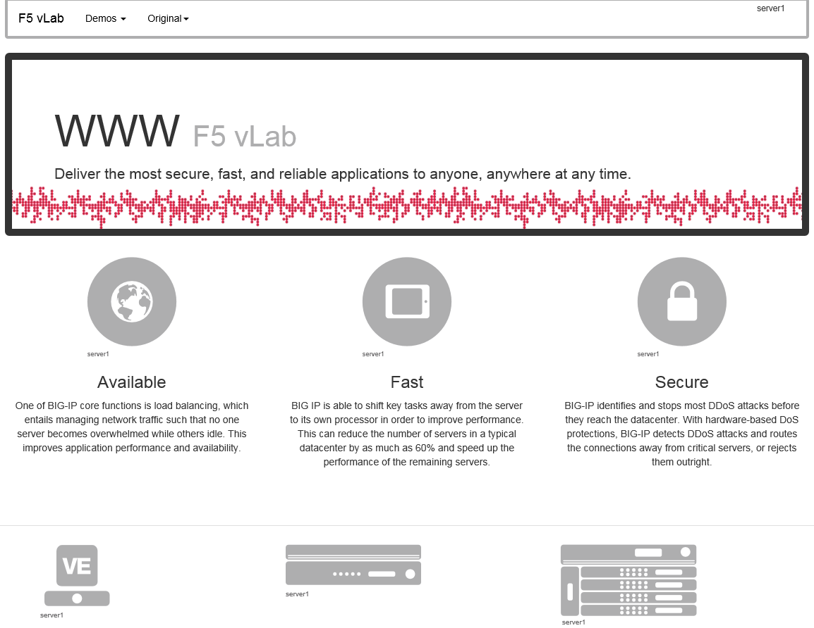

Lab 3 – Configuring a VPN Policy
--------------------------------

In this lab, we will use the Device Wizard to configure a new SSL VPN
service with the necessary Network Access Resources on APM.

.. NOTE::
  Lab Requirements:

  - BIG-IP with APM licensed and activated
  - Server running AD and Web services
  - Local Host file entries on the Jump Host

Task – Use the Wizard to create a new Remote Access service
~~~~~~~~~~~~~~~~~~~~~~~~~~~~~~~~~~~~~~~~~~~~~~~~~~~~~~~~~~~

The Wizard simplifies configuration tasks for specific use cases.

#. From the main menu on the left side of the screen, browse to the
   **Wizards > Device Wizards** and select the radio button for
   “\ **Network Access Setup Wizard for Remote Access**\ ".

   |image28|

#. Click **Next**.

#. For the Policy Name field, enter **MyVPNPolicy**. This should auto
   populate the caption field. **Uncheck** the “\ **Enable Antivirus
   Check in Access Policy**\ ” checkbox and click **Next**.

   |image29|

#. From the Select Authentication screen, choose the “\ **Use
   Existing**\ ” radio button, select the AAA server
   "**Lab\_SSO\_AD\_Server::Active Directory**\ ” configured previously
   in Lab 2 and click **Next**.

   |image30|

#. Assign an IP Address Range to be used for the VPN connection on the
   “Configure Lease Pool” page. Click the radio button for “\ **IP
   Address range**\ ” and enter the range “\ **10.1.1.1-10.1.1.2**\ ”,
   click **Add** and click **Next**.

   |image31|

#. On the “Configure Network Access” page, select "**Use split
   tunneling for traffic**\ ” and for “IPV4 Lan Space”, enter the
   network “\ **10.128.20.0”**, mask “\ **255.255.255.0”,** click
   **Add**, leave everything else default and click **Next**.

   |image32|

#. Accept the default on the “Configure DNS Hosts for Network Access”
   page and click **Next**.

   |image33|

#. On the “Virtual Server (HTTPS connection)” page, enter
   “\ **10.128.10.11**\ ” for the IP address of the Virtual Server that
   users will connect to for access to the VPN. **Uncheck** the
   “\ **Create Redirect Virtual Server**\ ” option and click **Next**.

   |image34|

#. Verify your settings on the Review page and click **Next** when satisfied.

#. The Setup Summary page will display a list of the configuration
   objects that the Wizard created for you. Click **Finished**.

Task – Testing
~~~~~~~~~~~~~~

#. | Open a web browser to the virtual server created in the above step
        by navigating to **https://myvpn.f5demo.com**. You will be
        presented with a Logon page similar to the one from the last
        lab. |

   |image35|

#. Enter the following credentials:

   Username: **user**

   Password: **Agility1**

   This will initialize, authenticate and establish a new VPN connection to the Network Resource that was configured. You will be presented with a new page that shows the connection details.

   |image36|

#. Open a new browser tab and confirm that you are now connected to
   the internal network by browsing directly to the HTTP server used
   in the pool for the previous labs:
   **http://server1.f5demo.com**. You should see a page similar to the following:

   |image37|

#. Close the page then click **Logout** on the F5 VPN page to terminate your VPN connection and close the browser window.

.. |image30| image:: media/image31.png
   :width: 5.20833in
   :height: 0.79421in

