Lab 6 – BASIC Authentication
----------------------------

In this lab, we will show you how to configure basic authentication
leveraging the SSO functionality of APM.

.. NOTE::
  Lab Requirements:

  - BIG-IP with APM licensed and activated
  - Server running AD and Web services
  - Local Host file entries on the Jump Host

Task – Create a Pool
~~~~~~~~~~~~~~~~~~~~

#. Browse to **Local Traffic > Pools** and click the ‘\ **+**\ ’ next to
   **Pools List** to create a new pool.

#. Name the pool “\ **basic\_pool**\ ”

#. Assign the monitor “\ **http**\ ” by selecting the monitor and moving
   it to the left.

#. **Add** the following “New Member/Node” to the pool and click
   **Finished**:

   - Node Name: **basic**, Address: **10.128.20.203**, Service Port: **80**

      |image62|

Task 2: Create a Virtual Server
~~~~~~~~~~~~~~~~~~~~~~~~~~~~~~~

#. Browse to **Local Traffic > Virtual Servers** and click the
   ‘\ **+**\ ’ next to **Virtual Server List** to create a new one.

#. Use the following information to create the virtual server and leave
   other settings as default, then click **Finished**:

   -  Name the pool “\ **basic\_vs**\ ”

   -  Destination Address: **10.128.10.13**

   -  Service Port: **443**

   -  HTTP Profile: **http**

   -  SSL Profile (Client): **f5demo**

   -  Source Address Translation: **Auto Map**

   -  | Default Pool: **basic\_pool**

   | |image63|

   | |image64|

   | |image65|

Task 3: Testing without APM
~~~~~~~~~~~~~~~~~~~~~~~~~~~

Observe the current behavior of the login page without APM
authentication.

#. | Open a private browsing window and go to **https://basic.f5demo.com**. You should receive a prompt that looks similar to the following
     screen shot:
   |

   |image66|

#. Enter the following credentials:

   -  Username: **user**

   -  Password: **Agility1**

#. Once successfully logged in you will see a webpage similar to this one:

   |image67|

#. Close the private browsing window.

Task 4: Create Access Policy to use with Basic Authentication
~~~~~~~~~~~~~~~~~~~~~~~~~~~~~~~~~~~~~~~~~~~~~~~~~~~~~~~~~~~~~

#. Open the **Wizards > Device Wizards** page.

   #. Select **Web Application Access Management for Local Traffic Virtual Servers**

      |image68|

   #. Click **Next**

#. Click **Next** for Option 1 on the Configuration Options page

   |image69|

#. Configure Basic Properties for the policy

   #. For Policy Name enter **Basic\_Access\_Policy**

   #. **Uncheck** “Enable Antivirus Check in Access Policy”

      |image70|

   #. Click **Next**

#. Configure Authentication type used for policy

   #. Select **Use Existing** for the “Authentication Options”

   #. Select **Lab\_SSO\_AD\_Server::Active Directory**

      |image71|

   #. Click **Next**

#. Configure SSO

   #. Select **Create New** for the “SSO Options”

   #. Choose **HTTP Basic**

   #. Click **Next**

      |image72|

#. Configure Virtual Server

   #. Select Use **Existing HTTPS Server**

   #. Choose **/Common/basic\_vs** for the Virtual Server**

      |image73|

   #. Click **Next**

#. Review configuration and click **Next**

#. Review the “Setup Summary”, which shows all (existing and new)
   objects associated with this new policy.

#. Click **Finished**

#. Add a logout URI Include to the new access policy

   #. Open the **Access > Profiles / Policies > Access Profiles
      (Per-Session Policies)** page

   #. Click on the name of the new policy **Basic\_Access\_Policy**

   #. **Add** “\ **/Home/Logout**\ ” to “Logout URI Include”

   #. Change **Logout URI Timeout** to **1** second

      |image74|

   #. Click **Update**

#. Enable the SSO Configuration

   #. Click on the **SSO / Auth Domains** tab

   #. For **SSO Configuration**, select **Basic\_Access\_Policy\_sso**

      |image75|

   #. Click **Update**

Task 5: Applying Access Policy
~~~~~~~~~~~~~~~~~~~~~~~~~~~~~~

After you create or change an access policy, the link Apply Access
Policy appears in yellow at the top left of the BIG-IP Configuration
utility screen. You must click this link to activate the access policy
for use in your configuration.

|image76|

#. Click the **Apply Access Policy** link, which will bring you to the
   Apply Access Policy screen, with a list of access policies that have
   been changed.

#. Select the Access Policy and click the **Apply** button (by
   default, all access policies that are new or changed are selected).

   |image77|

   After you apply the access policy, the Access Profiles list screen
   is displayed.

Task 6: Testing with APM Authentication
~~~~~~~~~~~~~~~~~~~~~~~~~~~~~~~~~~~~~~~

Observe the behavior of the login page with authentication enforced by
APM.

#. Open a private browsing window and go to **https://basic.f5demo.com**. You should see a page that looks like the following:

   |image78|

#. Logon with the following credentials:

   Username: **user**

   Password: **Agility1**

   Once successfully logged in you will see the same web page
   observed in task 3:

   |image79|

Task 7: Testing Logout
~~~~~~~~~~~~~~~~~~~~~~

Earlier in Task 3, Step 9, we defined a **Logout URI Include** for this
Access Policy. This is a list of logoff URIs that the access profile
searches for in order to terminate the Access Policy Manager session.
The URI we used was /Home/Logout, and the default logout delay is 5
seconds which was modified to 1 second.

#. Click the **Logout** link located at the top right of the web pagee

#. Wait 1 second

#. Click the “\ **App #1**\ ” link in the banner at the top of the page

#. You should be redirected back to the F5 logon page

.. |image62| image:: media/image63.png
   :width: 4.11458in
   :height: 3.76458in
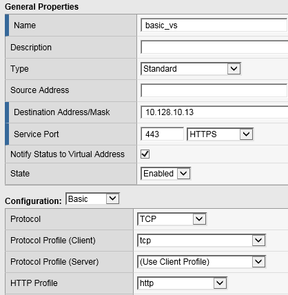
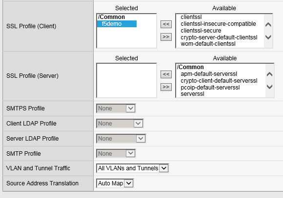
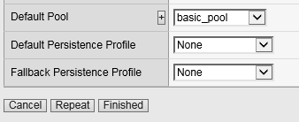
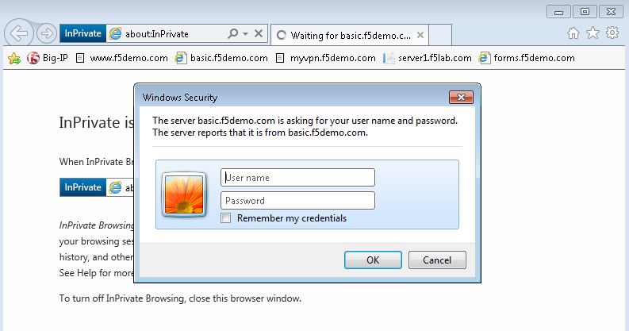
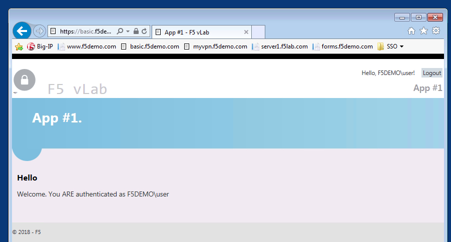
.. |image68| image:: media/image51.png
   :width: 5.30972in
   :height: 1.40972in
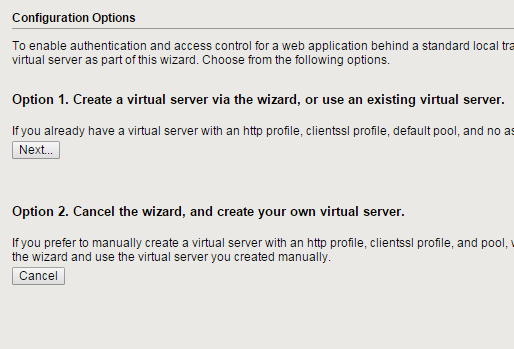
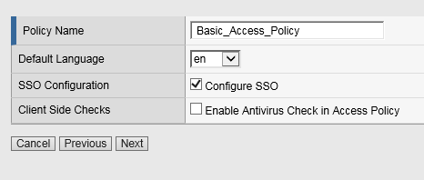
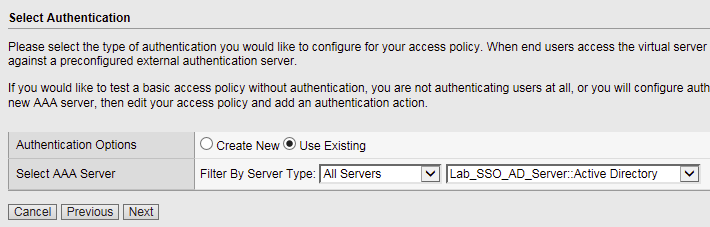
.. |image72| image:: media/image69.png
   :width: 5.30972in
   :height: 1.48672in
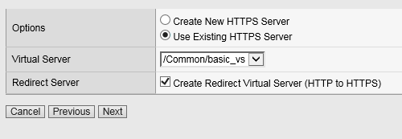
.. |image74| image:: media/image71.png
   :width: 3.69792in
   :height: 1.55900in
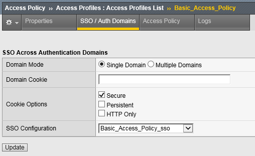
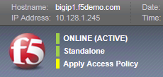
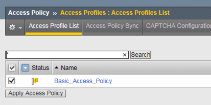
.. |image78| image:: media/image61.png
   :width: 4.67208in
   :height: 1.72235in

