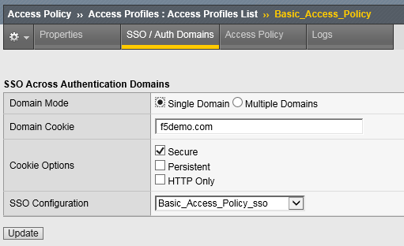

Lab 7 – Single-Sign-On Across Authentication Domains
----------------------------------------------------

In this lab, we will show you how to provide SSO across multiple
applications. Normally APM will require authentication each time an
application is accessed. By using a Domain Cookie it is possible to
re-use an existing APM session to access multiple applications.

.. NOTE::
  Lab Requirements:

  - Previous Labs 5 and 6 successfully completed

Task – Verify Authentication Required for different applications
~~~~~~~~~~~~~~~~~~~~~~~~~~~~~~~~~~~~~~~~~~~~~~~~~~~~~~~~~~~~~~~~

#. Open a Private web browser or clear your browser cache and go to the
   Virtual Server used earlier **https://basic.f5demo.com**

#. You should be able to logon with the following credentials:

   -  Username: **user**

   -  Password: **Agility1**

#. Once successfully logged in, you will be presented with the same
   information page you observed earlier from basic.f5demo.com “App #1”.

#. Now go to **https://app2.f5demo.com** you should be prompted to logon
   again.

#. You should be able to logon with the following credentials:

   -  Username: **user**

   -  Password: **Agility1**

#. Once successfully logged in, you will be presented with information
   about “App #2”.

#. Logout and close the browser window.

Task - Specify Domain Cookie
~~~~~~~~~~~~~~~~~~~~~~~~~~~~

#. Open the **Access > Profiles / Policies > Access Profiles
   (Per-Session Policies)** page

#. Click on the name of the policy **Basic\_Access\_Policy**

#. Click on the **SSO / Auth Domains** tab

#. Enter **f5demo.com** to **Domain Cookie**

   |image80|

#. Click **Update**

#. Don’t forget to click on **Apply Access Policy** to put your changes
   in effect!

Task - Testing Authentication across domains
~~~~~~~~~~~~~~~~~~~~~~~~~~~~~~~~~~~~~~~~~~~~

#. Open a Private web browser or clear your browser cache and go to the
   Virtual Server used earlier **https://basic.f5demo.com**

#. You should be able to logon with
   - Username: **user**
   - Password: **Agility1**

#. Once successfully logged in, you will be presented with the same
   information page you observed earlier.

4. Now go to **https://app2.f5demo.com**.
   You should not be prompted to logon again!

Task 4 (Bonus) - Authentication across domains & virtual servers
~~~~~~~~~~~~~~~~~~~~~~~~~~~~~~~~~~~~~~~~~~~~~~~~~~~~~~~~~~~~~~~~

Repeat the previous steps, but for Forms\_Access\_Policy instead of
Basic\_Access\_Policy.

Are you prompted for authentication when going from
**https://forms.f5demo.com** to **https://basic.f5demo.com**?

Try changing the value for “Profile Scope” for **Basic\_Access\_Policy**
and **Forms\_Access\_Policy** from Profile to **Global**

    ***Troubleshooting tips:**

    Did you forget to **Apply Access Policy** ?

    Verify the Domain Cookie configured on the SSO page… for both
    policies?

