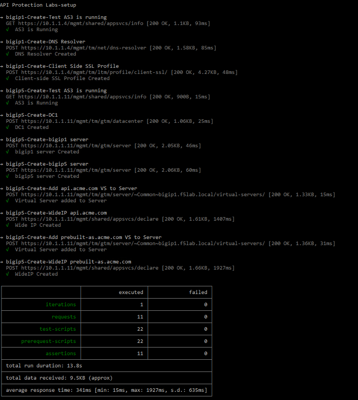

Class - API Protection
======================

As the dependency of API usage increases across organizations so do the tools used to protect them. APIs historically were protected through dedicated API gateways performing complex tasks such as transformations between API types such as REST to XML but still required a Web Application Firewall to perform content validation against various attack types beyond schema validation. The complex requirements for API gateways have decreased as the adoption of REST has increased in organizations. API gateways have been narrowed to three specific requirements: authentication, authorization, and content validation.

Using F5’s Advanced WAF module in conjunction with Access Policy Managers(APM) an organization can not only achieve the requirements needed for a traditional API gateway but increased Security and authorization controls.

During this hands-on lab you will learn how to configure the following:

- Build an API protection profile using OpenAPI spec files
- Configure the BIG-IP as OAuth Resource Server for course-grained access control
- Configure APM’s Per-Request Policy engine to provide fine-grained access control
- Configure Advanced WAF to protect against common API attacks

Expected time to complete: **1 hour**

UDF blueprint version: **44**

Setup Lab Environment
----------------------------------------

#. Click the **Command Prompt** shortcut to open the command prompt on the jumphost 

   |image1|

#. Type the command **cd c:\\labs\\class1\\postman** to navigate the Postman collection folder.

#. Type the command **setup.bat**

#. All Steps in the collection should succeed before moving on to the lab.  If an API call fails run the collection again by repeating the previous step.  

   |image2|

.. |image1| image:: media/image001.png

.. toctree::
   :maxdepth: 1
   :glob:

   labinfo
   module*/module*

