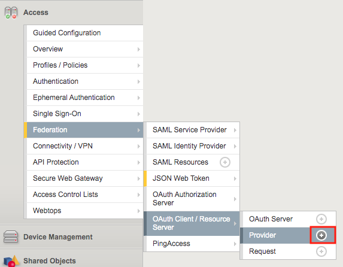
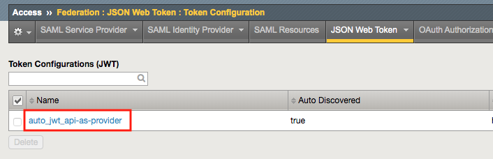
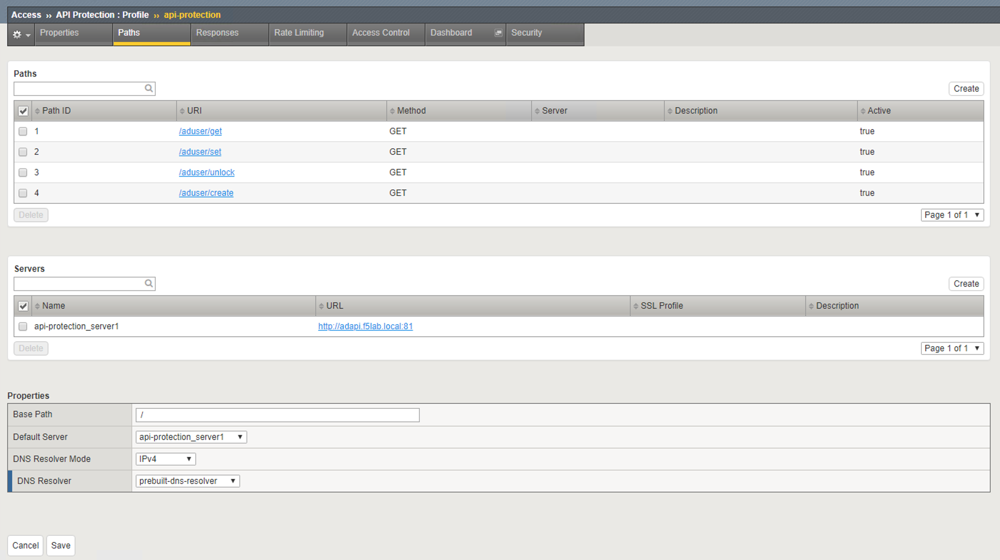
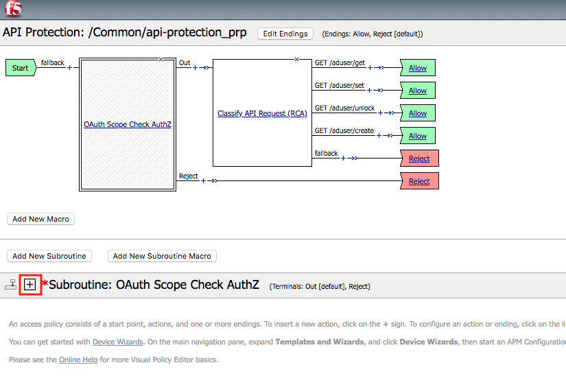
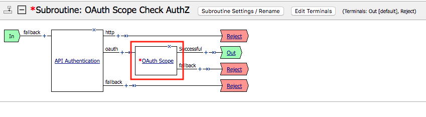

Lab 1.2 - Create an API Protection Profile
=============================================

The API Protection profile is a combination of APM and AWAF features to protect any API.

Task 1 - Create an API Protection Profile
-------------------------------------------

#. Navigate to API Protection >> Profile. Click the **+ (plus symbol)**

   |image11|

.. note :: json file is located on the jumpbox in c:\\labs\\class1\\student_files

#. Enter the following parameters:

   - Name: **api-protection**
   - OpenAPI File: **Active Directory OpenAPI.json**
   - DNS Resolver: **internal-dns-resolver**
   - Authorization: **OAuth 2.0**

#. Click **Add**

#. Click **Save**

   |image12|

Task 2 - Explore the Path Configuration
-----------------------------------------

#. Note the Spec file contained four paths to various URIs

#. Each URI only supports the Method GET

#. The APIs server URL is http://adapi.f5lab.local:81

   |image13|

Task 3 - Associate a JWT Provider
----------------------------------

#. Click **Access Control** from the top ribbon

#. Click **Edit (Per Request Policy)**

   |image14|

#. Notice the same paths displayed in the API Protection profile appear here. Currently there is no fine-grained access    control.  We will implement it later in the lab

#. Click the **+ (plus symbol)** next the Subroutine **OAuth Scope Check AuthZ** to expand its properties:

   |image15|

   .. note :: The OAuth scope agent currently has a red asterisk since no provider is associated with it.

#. Click **OAuth Scope**

   |image16|

#. Enter the following parameters:

   - Token Validation Mode: **Internal**
   - JWT Provider List: **as-jwt-provider**
   - Response: **api-protection_auto_response1**

#. Click **Save**

   |image17|

.. |image0| image:: media/image000.png
	:width: 800px
.. |image1| image:: media/image001.png
	
.. |image2| image:: media/image002.png

.. |image4| image:: media/image004.png
.. |image5| image:: media/image005.png
	:width: 800px
.. |image6| image:: media/image006.png
	:width: 800px	

.. |image8| image:: media/image008.png
.. |image9| image:: media/image009.png
.. |image10| image:: media/image010.png
.. |image11| image:: media/image011.png
.. |image12| image:: media/image012.png
	:width: 800px	

.. |image14| image:: media/image014.png
	:width: 800px	

.. |image17| image:: media/image017.png
	:width: 800px
	

