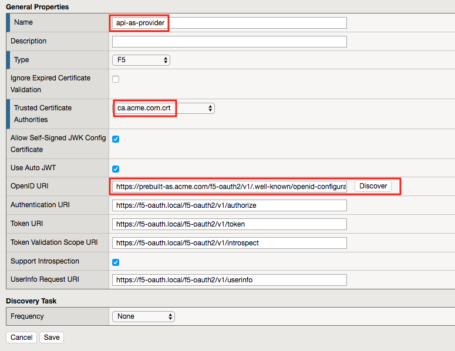
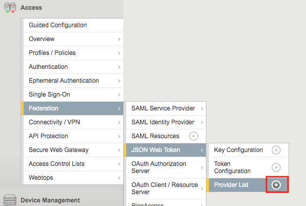
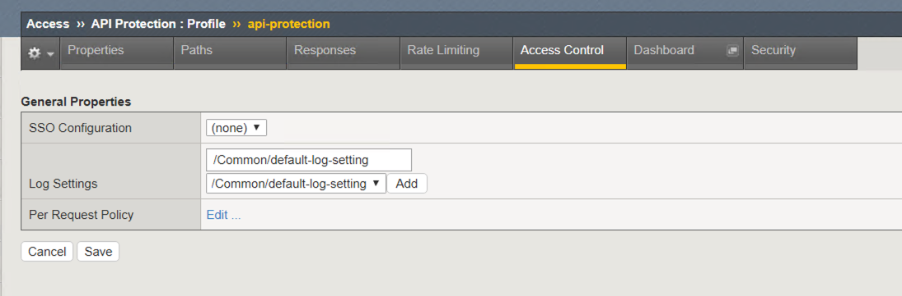
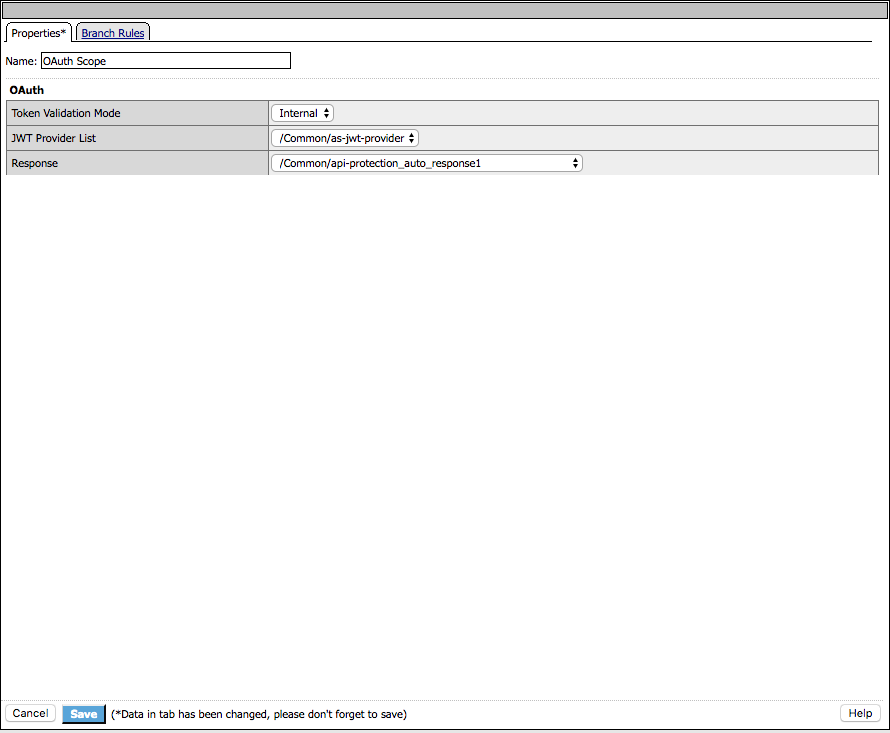
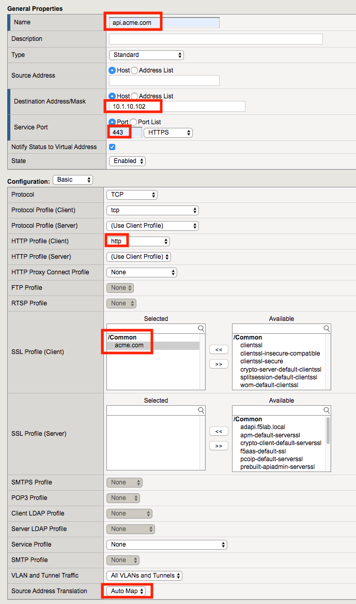

Lab 1.3 - Create the api.acme.com virtual server
===================================================

In this section, you will define which components you want to create as part of the API Protection configuration.

Task 1 - Create a virtual server
----------------------------------

1. From the web browser, click on the **Local Traffic** tab located on the left side

|image18|

2. Navigate to Virtual Servers >> Virtual Server List.  Click the **+ (plus symbol)**

|image19|

3. Enter the following parameters:

- Name: **api.acme.com**
- Destination Address/Mask: **10.1.10.102**
- Service Port: **443**
- HTTP Profile (Client): **http**
- SSL Profile(Client): **acme.com**
- Source Address Translation: **Auto Map**
- API Protection: **api-protection**

4. Click **Finished**

|image20|
|image22|

.. |image0| image:: media/image000.png
	:width: 800px
.. |image1| image:: media/image001.png
	
.. |image2| image:: media/image002.png
.. |image3| image:: media/image003.png

.. |image5| image:: media/image005.png
	:width: 800px
.. |image6| image:: media/image006.png
	:width: 800px	
.. |image7| image:: media/image007.png

.. |image8| image:: media/image008.png

.. |image10| image:: media/image010.png
.. |image11| image:: media/image011.png
.. |image12| image:: media/image012.png
	:width: 800px	
.. |image13| image:: media/image013.png
	:width: 800px	

.. |image15| image:: media/image015.png
	:width: 800px	
.. |image16| image:: media/image016.png
	:width: 800px	

	

.. |image18| image:: media/image018.png
.. |image19| image:: media/image019.png

.. |image21| image:: media/image021.png
	:width: 700px
.. |image22| image:: media/image022.png

