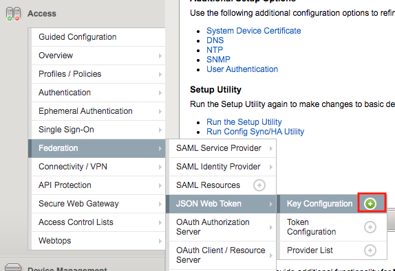
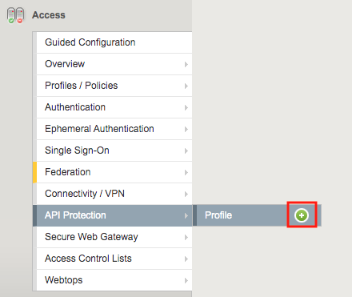
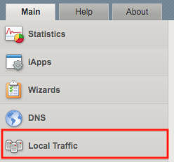
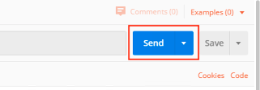
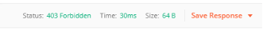
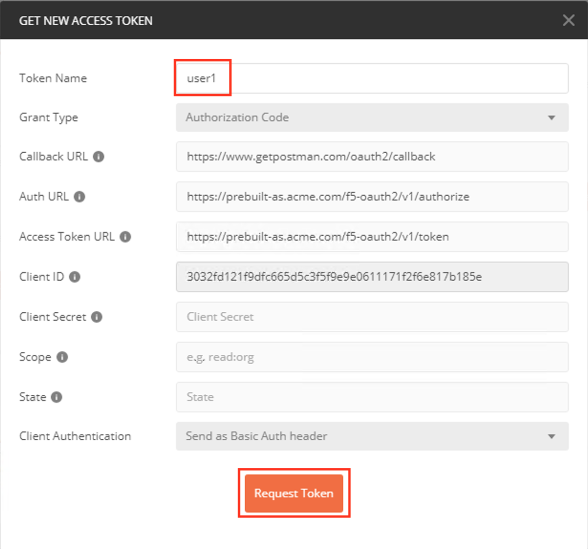
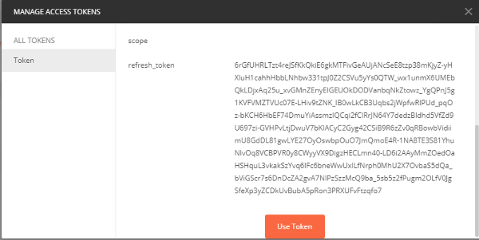
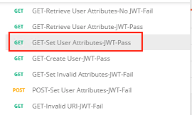
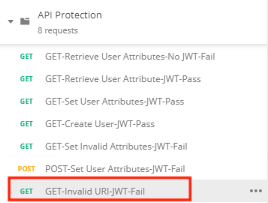
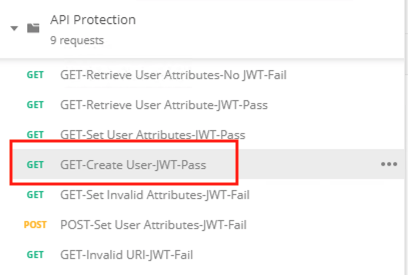

Lab 1.4 - Test Course-Grained Access
========================================

In this section, you will sample API requests to the new created api.acme.com virtual server to test functionality

Task 1 - Send a valid GET without a JWT to retrieve user1's attributes
-----------------------------------------------------------------------

1. From the Jumpbox, open **Postman**

|image23|

2. Expand the **API Protection** Collection, the **Agility 2020** Folder, and finally the **Lab API Requests subfolder**

3. Select the request **No JWT-Retrieve User Attributes**

|image24|

4. Click **Send**

|image25|

5. You receive a **403 Forbidden** response status code since you do not have a valid JWT

|image26|

Task 2 - Send a valid GET with JWT to retrieve user1\'s attributes
-------------------------------------------------------------------

1. Select the request **JWT-Retrieve User Attributes**

2. Select the **Authorization** tab

|image43|

3. Click **Get New Access Token**

|image44|

4. Enter **User1** for the Token Name and review the Postman Configuration. Nothing else should need to be modified

5. Click **Request Token**

|image27|

6. Login using Username: **user1**, Password: **user1**

|image28|

7. Click **Use Token** at the top.

|image29|

8. Notice the **Access Token** field is now populated

|image34|

9. Click **Send**

10. You receive a **200 OK** response status code with attributes for user1 in the body of the response

|image31|

Task 3 - Send a valid GET with JWT to set user1's employeeNumber
------------------------------------------------------------------

1. Select the request **JWT-Set User Attributes**

2. Select the **Authorization** tab

3. Select the previously created **User1** token from the **Available Tokens** dropdown

|image33|

4. The **Token** field is now populated

|image34|

5. Click **Send**

.. note :: If you receive a 403 response status code, repeat steps 10-13 to request a new token.  You can change the name of the token request prior to sending by setting the Token Name.

.. note :: You can delete expired tokens by clicking the Available Tokens dropdown, clicking Manage Tokens, and then clicking the trashcan next to the Token.

6. You receive a **200 OK** response status code with a response body that contains user1's employeeNumber **123456**

|image35|

Task 4 - Send a valid GET with JWT to create a user
-----------------------------------------------------

1. Select the request **JWT-Create User**

2. Select the **Authorization** tab

3. Select the previously created **User1** token from the **Available Tokens** dropdown

|image33|

4. Click **Send**

.. note :: If you receive a 403 response status code, repeat steps 10-13 to request a new token.  You can change the name of the token request prior to sending by setting the Token Name.

.. note :: You can delete expired tokens by clicking the Available Tokens dropdown, clicking Manage Tokens, and then clicking the trashcan next to the Token.

5. You receive a **200 OK** response status code with a response body that contains Bob Smith's user attributes
|image46|

Task 5 - Send invalid GET request with JWT to set a nonexistent user's attributes
------------------------------------------------------------------------------------

1. Select the request **JWT-Set Invalid Attributes**

2. Select the **Authorization** tab

3. Select the previously created **User1** token from the **Available Tokens** dropdown

4. The **Token** field is now populated

5. Click **Send**

.. note :: If you receive a 403 response status code, repeat steps 10-13 to request a new token.  You can change the name of the token request prior to sending by setting the Token Name.

.. note :: you can delete expired tokens by clicking the Available Tokens dropdown, clicking Manage Tokens, and then clicking the trashcan next to the Token.

6. You receive a **400 Bad Request** response status code. The request successfully passed through the API Gateway, but the server failed to process the request.

|image37|

Task 6 - Send a POST request to a valid URI to set User1's attributes
-----------------------------------------------------------------------

1. Select the request **JWT-Set User Attributes**

2. Select the **Authorization** tab

3. Select the previously created **User1** token from the **Available Tokens** dropdown

4. The **Token** field is now populated

5. Click **Send**

6. You receive a **403 Forbidden** response status code. This is expected because the POST Method was not specified in the API Protection Profile for the path /aduser/Set

|image39|

Task 7 - Send a GET request to an invalid URI
-----------------------------------------------

1. Select the request **JWT-Invalid URI**

2. Select the **Authorization** tab

3. Select the previously created **User1** token from the **Available Tokens** dropdown

4. The **Token** field is now populated

5. Click **Send**

6. You receive a **403 Forbidden** response status code. This is expected because the path /hacker/attack was not specified in the API Protection Profile

|image39|

.. |image0| image:: media/image000.png
	:width: 800px

.. |image2| image:: media/image002.png
.. |image3| image:: media/image003.png
.. |image4| image:: media/image004.png
.. |image5| image:: media/image005.png
	:width: 800px
.. |image6| image:: media/image006.png
	:width: 800px	
.. |image7| image:: media/image007.png
.. |image8| image:: media/image008.png
.. |image9| image:: media/image009.png
.. |image10| image:: media/image010.png

.. |image12| image:: media/image012.png
	:width: 800px	
.. |image13| image:: media/image013.png
	:width: 800px	
.. |image14| image:: media/image014.png
	:width: 800px	
.. |image15| image:: media/image015.png
	:width: 800px	
.. |image16| image:: media/image016.png
	:width: 800px	
.. |image17| image:: media/image017.png
	:width: 800px

.. |image19| image:: media/image019.png
.. |image20| image:: media/image020.png
.. |image21| image:: media/image021.png
	:width: 700px
.. |image22| image:: media/image022.png
.. |image23| image:: media/image023.png
.. |image24| image:: media/image024.png

.. |image28| image:: media/image028.png

.. |image31| image:: media/image031.png

.. |image33| image:: media/image033.png
	:width: 800px
.. |image34| image:: media/image034.png
.. |image35| image:: media/image035.png
.. |image36| image:: media/image036.png
.. |image37| image:: media/image037.png
.. |image38| image:: media/image038.png
.. |image39| image:: media/image039.png

.. |image42| image:: media/image042.png
.. |image43| image:: media/image043.png
.. |image44| image:: media/image044.png

.. |image46| image:: media/image046.png
