Lab 1.5 - Implement Fine-Grained Access Controls
==================================================

Up to this point any authenticated user to the API is authorized to use them. In this section we will restrict user1's ability to create users, but will still be able to modify a user's employee number.

Task 1 - Retrieve Group Membership Subsession Variable
--------------------------------------------------------

.. note :: In order to implement fine-grained control the session variables that contain the data must be known. This first session shows you how to display the session variables and their values.

1. From the Jumpbox desktop click on the **BIG-IP1** Putty icon

|image47|

2. Enter the command **sessiondump --delete all** to remove any existing APM sessions

|image41|

3. Enter the command **tailf /var/log/apm**.  Hit enter a few times to create some space on the screen

|image84|

4. From Postman, Select the request **JWT-Retrieve User Attributes**.  The Authorization field should already be populated with User1's token.

5. Click **Send**

6. You receive a **200 OK** response status code with attributes for user1 in the body of the response

|image31|

.. Note :: Your SessionID will be different

7. Return to the CLI and examine the logs. You will see a message about a new subsession being created. Copy the subsession ID

|image85|

8. Exit the logs using Ctrl+Z

9. Enter the command **sessiondump -subkeys <subsessionID>**

|image86|

10.  Scroll through input until you find the session variable for **subsession.oauth.scope.last.jwt.groups**

|image87|

Task 2 - Edit the per-request policy
--------------------------------------

1. Return to BIG-IP1's management interface in the browser and click on the **Access** tab located on the left side

|image0|

2. Navigate to API Protection >> Profile.  Click **Profile** to modify the previously created API protection Profile (not the + Plus symbol)

|image48|

3. Click **Edit** Under Per-Request Policy

|image49|

4. Click the **Allow** terminal located at the end of the **GET /aduser/create** branch

|image72|

5. Select **Reject**
6. Click **Save**

|image60|
 
7. Click the **+ (Plus Symbol)** on the GET /aduser/create branch

|image50|

8. Click the **General Purpose** tab

9. Select **Empty**

10. Click **Add Item**

|image51|

11. Enter the name **Claim Check**

|image53|

12. Click the **Branch Rules** tab

13. Click the **Add Branch Rule**

|image52|

14. Enter Name **CreateUser**

15. Click **Change**

|image54|

16. Click the **Advanced** tab

17. Enter the string in the notes section to restrict access to only members of the **CreateUser** Group. Make sure the " characters are properly formatted after pasting. If they aren't, simply delete and re-enter them manually.  

18. Click **Finished**

.. Note :: 

	expr {[mcget {subsession.oauth.scope.last.jwt.groups}] contains "CreateUser"}
	
	

|image55|

19. Click **Save**

|image56|

20. Click **Reject** on the CreateUser Branch to permit access

|image57|

21. Select **Allow**

22. Click **Save**

|image58|

23. Review the Policy Flow

|image61|

Task 3 - Test the Fine-Grained Access Control with user1
-----------------------------------------------------------

1. From Postman select the request **JWT-Create User**

2. Select the **Authorization** Tab

|image43|

3. Select the previously created **User1** token from the **Available Tokens** dropdown

4. The **Token** field is now populated

5. Click **Send**

6. You receive a **403 Forbidden** response status code when using user1. User1 does not contain the proper claim data.

|image26|

Task 4 - Test the Fine-Grained Access Control with user2
-----------------------------------------------------------

1. Select the request **JWT-Create User**

2. Select the **Authorization** tab

3. Click **Get New Access Token**

|image44|

4. Enter **User2** for the Token Name and review the Postman Configuration. Nothing else should need to be modified
5. Click **Request Token**

|image101|

6. Login using Username: **user2**, Password: **user2**

|image62|

7. Scroll down to the token and click **Use Token**
8. The **Token** field is now populated
9. Click **Send**

10. You receive a **200 OK** response status code when using user2. User2 does contain the proper claim data

|image46|

.. |image0| image:: media/image000.png
	:width: 800px
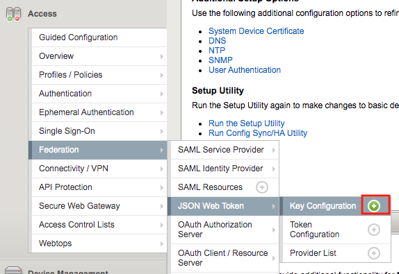
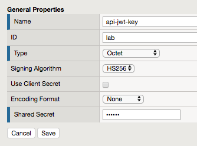
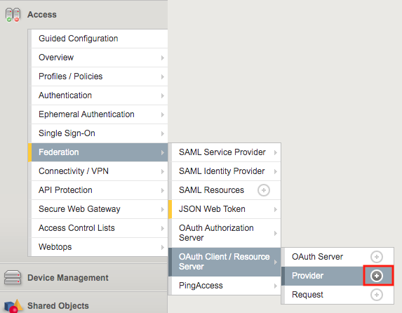
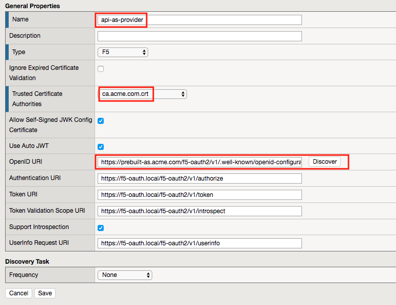
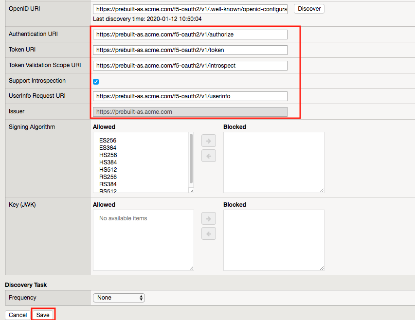
.. |image6| image:: media/image006.png
	:width: 800px	
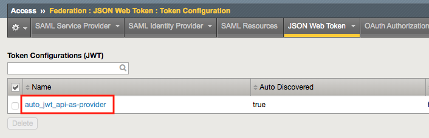
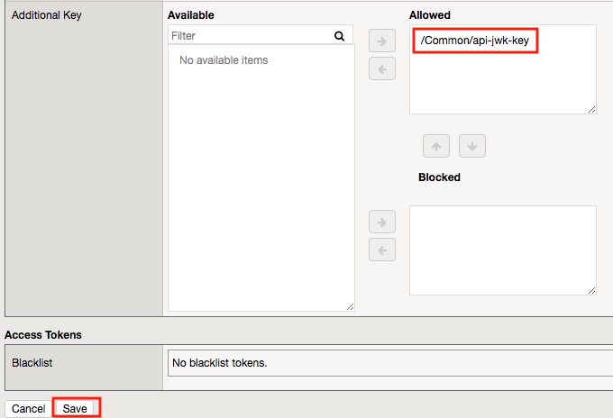
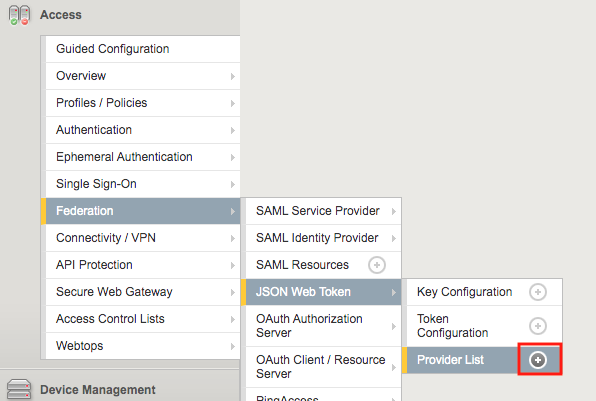
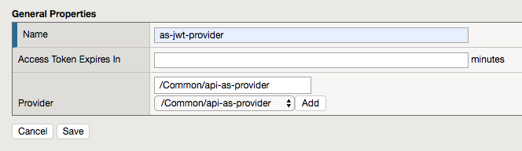
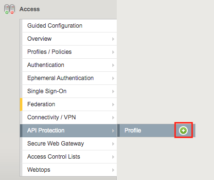
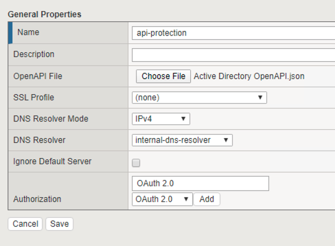
.. |image13| image:: media/image013.png
	:width: 800px	
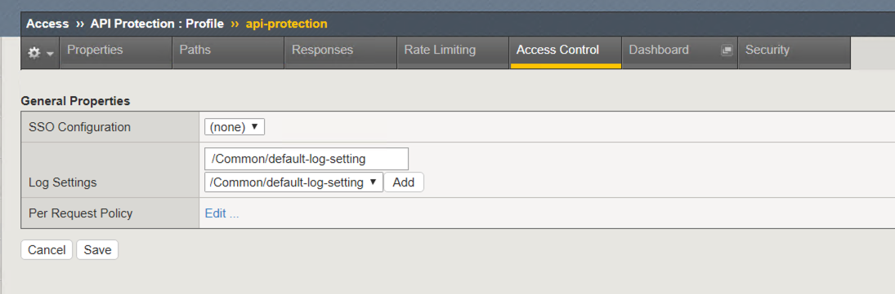
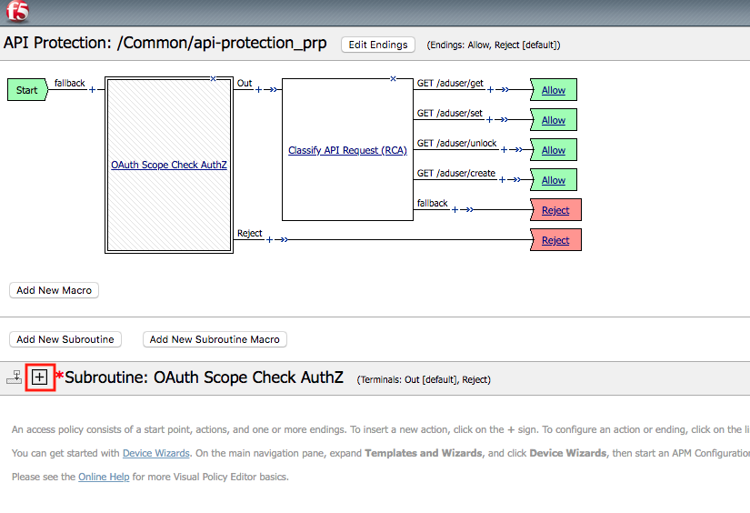
.. |image16| image:: media/image016.png
	:width: 800px	
.. |image17| image:: media/image017.png
	:width: 800px
.. |image18| image:: media/image018.png
.. |image19| image:: media/image019.png
.. |image20| image:: media/image020.png
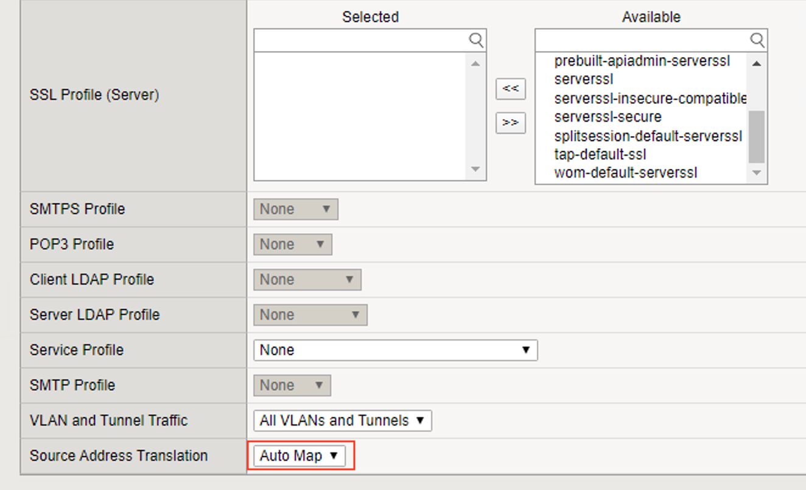
.. |image22| image:: media/image022.png

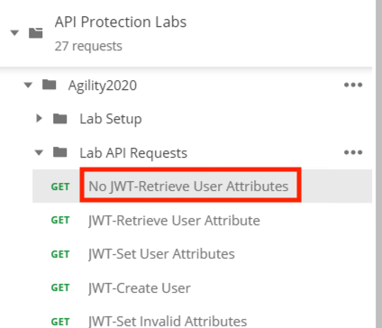
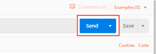
.. |image26| image:: media/image026.png
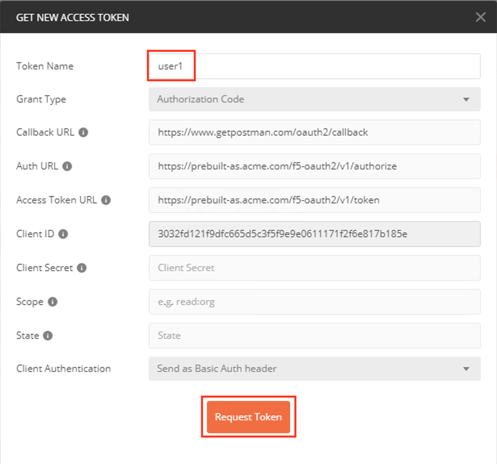
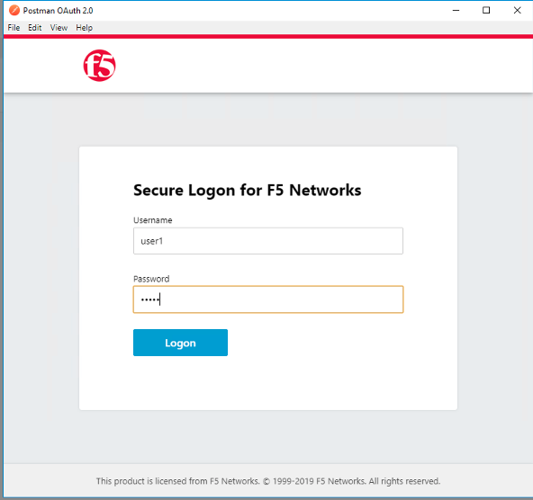
.. |image29| image:: media/image029.png
.. |image31| image:: media/image031.png
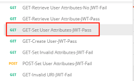
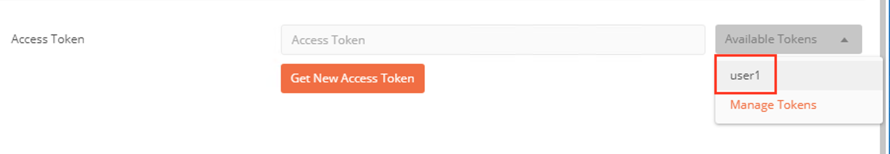
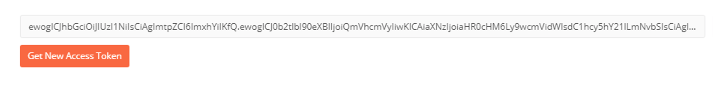
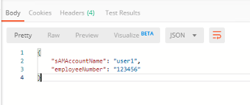
.. |image36| image:: media/image036.png
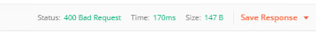
.. |image38| image:: media/image038.png
.. |image39| image:: media/image039.png
.. |image40| image:: media/image040.png
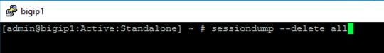
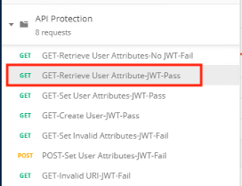
.. |image43| image:: media/image043.png
.. |image44| image:: media/image044.png
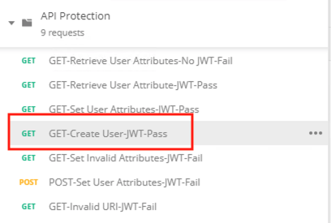
.. |image46| image:: media/image046.png
.. |image47| image:: media/image047.png
.. |image48| image:: media/image048.png
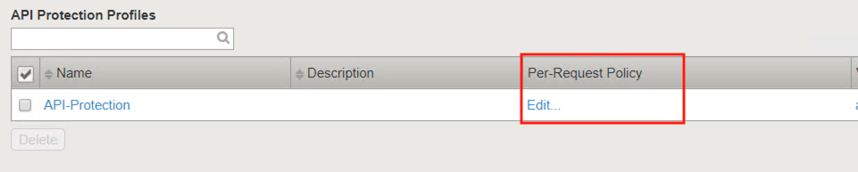
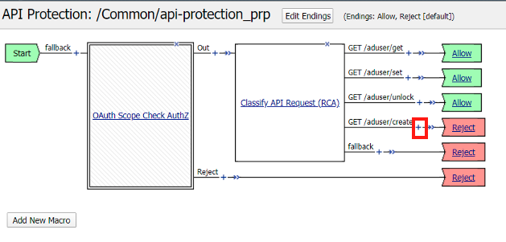
.. |image51| image:: media/image051.png
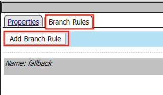
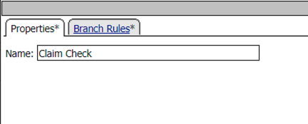
.. |image54| image:: media/image054.png
.. |image55| image:: media/image055.png
.. |image56| image:: media/image056.png
	:width: 800px
.. |image57| image:: media/image057.png
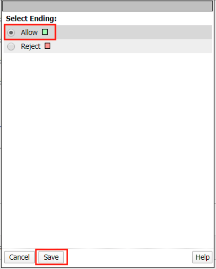
.. |image59| image:: media/image059.png
.. |image60| image:: media/image060.png
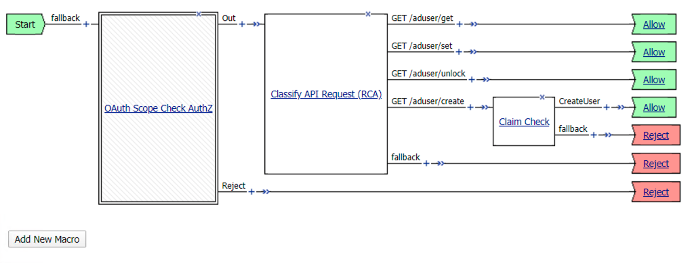
.. |image62| image:: media/image062.png
.. |image63| image:: media/image063.png
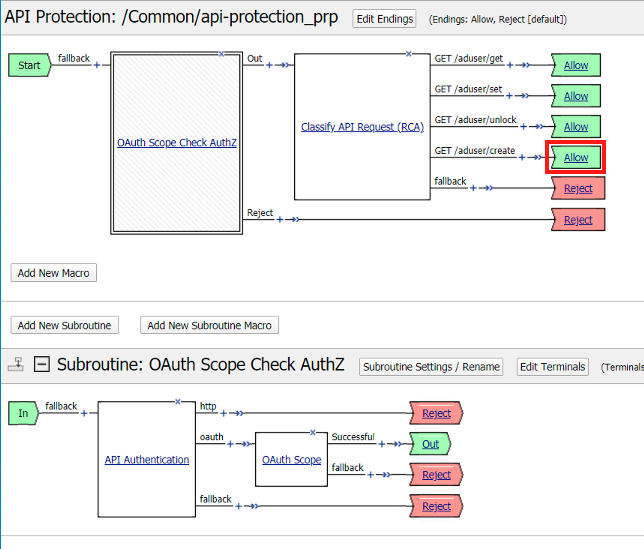
.. |image84| image:: media/image084.png
	:width: 800px
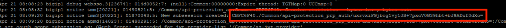
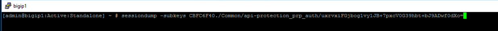
.. |image87| image:: media/image087.png
.. |image101| image:: media/image101.png
