Lab 1.6 - Implement Rate Limiting
===================================

The API Protection Profile allows a BIG-IP administrator to throttle the amount of connections to an API through the use of Key Names.

Task 1 - Test pre-rate limiting Access
---------------------------------------

#. From Postman, Select the request **JWT-Retrieve User Attributes**

#. Click **Save**, so the current token is saved as part of the API request.

   |image88|

#. Click the **arrow** located to the right of the API Protection labs collection.

   |image89|

#. Click **Run**

   |image104|

#. Deselect all requests except **JWT-Retrieve User Attributes**

#. Set the iterations to **100**

#. Click **Run API Protection**

   |image105|

#. You receive a **200 OK** for every request. Leave Runner open

   |image92|

Task 2 - Define the rate limiting keys
-----------------------------------------

#. Navigate to API Protection >> Profile.  Click **Profile** to modify the previously created API protection Profile.  Not the + Plus symbol.

   |image48|

#. Click **api-protection**

   |image64|

#. Click **Rate Limiting** from the top ribbon

   |image69|

   .. Note ::  The API protection profile default settings contains five Key Names created, but their values are empty.  Additional Keys can be created if necessary

#. Click **api-protection_auto_rate_limiting_key1**

   |image70|

#. Enter the Key Value **%{subsession.oauth.scope.last.jwt.user}**

#. Click **Edit**

   |image71|

#. Click **api-protection_auto_rate_limiting_key2**

#. Enter the Key Value **%{subsession.oauth.scope.last.jwt.groupid}**

#. Click **Edit**

   |image73|

#. Click **api-protection_auto_rate_limiting_key3**

#. Enter the Key Value **%{subsession.oauth.scope.last.jwt.client}**

#. Click **Edit**

   |image75|

#. Click **api-protection_auto_rate_limiting_key4**

#. Enter the Key Value **%{subsession.oauth.scope.last.jwt.tier}**

#. Click **Edit**

   |image77|

#. Click **api-protection_auto_rate_limiting_key5**

#. Enter the Key Value **%{subsession.oauth.scope.last.jwt.org}**

#. Click **Edit**

   |image79|

#. Click **Save**

   |image80|

Task 3 - Create a Rate Limiting Policy
----------------------------------------

#. Click **Create** in the rate limiting section

   |image81|

#. Enter the Name **acme-rate-limits**

#. Move all five keys under **Selected Keys**

#. Enter **10** for the number of requests per minute

#. Enter **5** for the number requests per second

#. Click **Add**.

   |image82|

#. Click **Save**

   |image83|

Task 4 - Apply the Rate Limiting Policy
-------------------------------------------

#. Click **Access Control** from the ribbon

   |image93|

#. Click **Edit** Per Request Policy

   |image94|

#. Click the **+ (Plus Symbol)** on the **Out** branch of the **OAuth Scope Check AuthZ** Macro

   |image95|

#. Click the **Traffic Management** tab

#. Select **API Rate Limiting**

#. Click **Add Item**

   |image96|

#. Click **Add new entry**

#. Select **acme-rate-limits**

#. Click **Save**

   |image97|

#. Verify the Rate Limiting agent now appears in the appropriate location

   |image98|

Task 5 - Test Rate Limiting
------------------------------

#. From Postman, return to Runner

   |image89|

#. Click **Retry** to rerun the request an additional 100 times.

   |image103|

#. On the 6th request you begin to receive a **429 Too Many Requests** response status code

   |image99|

.. |image0| image:: media/image000.png
	:width: 800px
.. |image1| image:: media/image001.png	
.. |image2| image:: media/image002.png
.. |image3| image:: media/image003.png
.. |image4| image:: media/image004.png
.. |image5| image:: media/image005.png
	:width: 800px
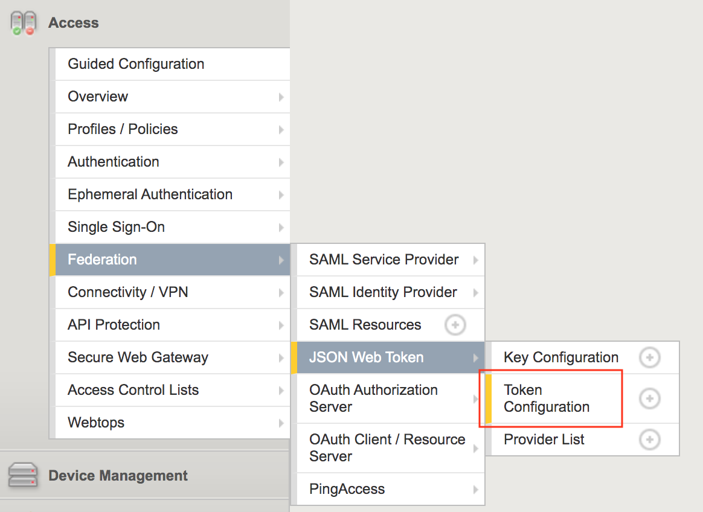
.. |image7| image:: media/image007.png
.. |image8| image:: media/image008.png
.. |image9| image:: media/image009.png
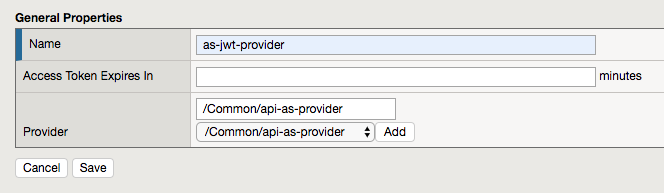
.. |image11| image:: media/image011.png
.. |image12| image:: media/image012.png
	:width: 800px	
.. |image13| image:: media/image013.png
	:width: 800px	
.. |image14| image:: media/image014.png
	:width: 800px	
.. |image15| image:: media/image015.png
	:width: 800px	
.. |image16| image:: media/image016.png
	:width: 800px	
.. |image17| image:: media/image017.png
	:width: 800px
.. |image18| image:: media/image018.png
.. |image19| image:: media/image019.png
.. |image20| image:: media/image020.png
.. |image21| image:: media/image021.png
	:width: 700px
.. |image22| image:: media/image022.png
.. |image23| image:: media/image023.png
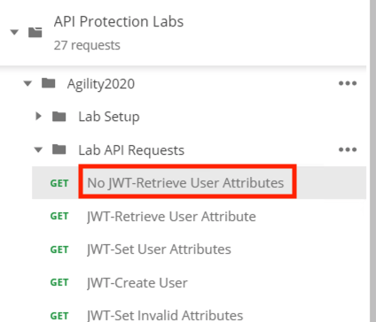
.. |image25| image:: media/image025.png
.. |image26| image:: media/image026.png
.. |image27| image:: media/image027.png
	:width: 600px
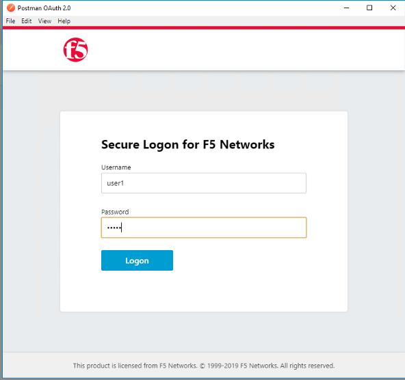
.. |image29| image:: media/image029.png
.. |image31| image:: media/image031.png
.. |image32| image:: media/image032.png
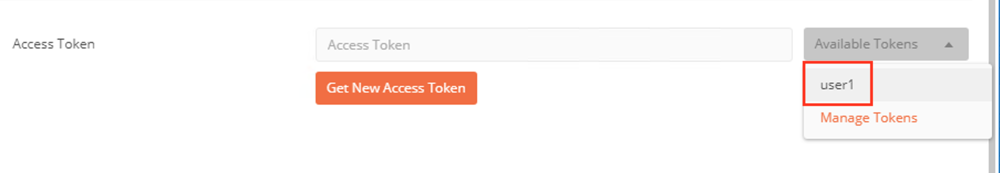
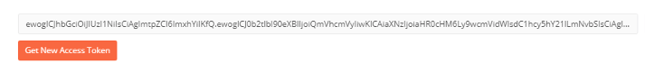
.. |image35| image:: media/image035.png
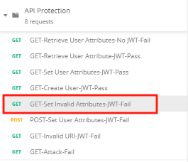
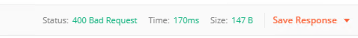
.. |image38| image:: media/image038.png
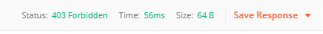
.. |image40| image:: media/image040.png
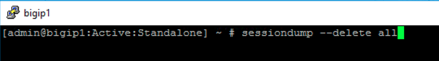
.. |image42| image:: media/image042.png
.. |image43| image:: media/image043.png
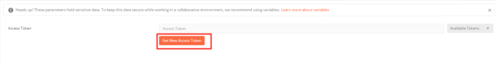
.. |image45| image:: media/image045.png
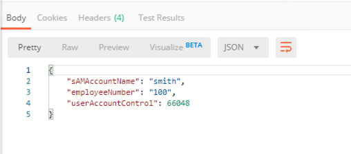
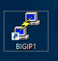
.. |image48| image:: media/image048.png
.. |image49| image:: media/image049.png
	:width: 800px
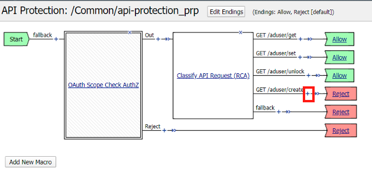
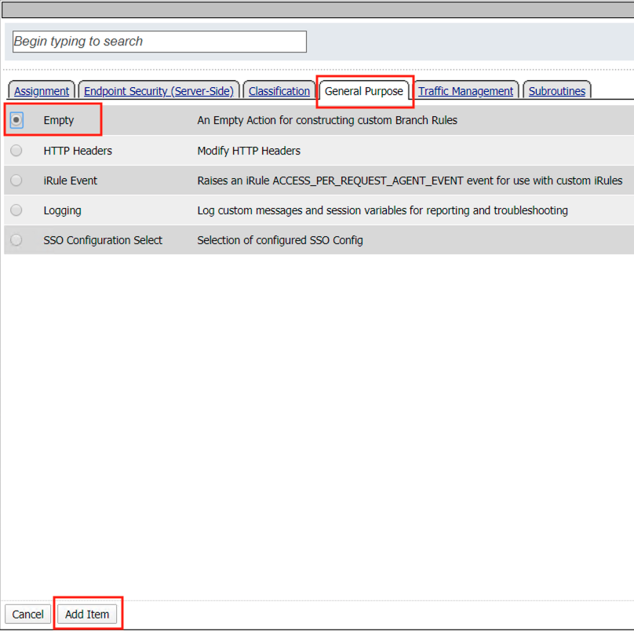
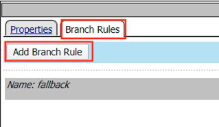
.. |image53| image:: media/image053.png
.. |image54| image:: media/image054.png
.. |image55| image:: media/image055.png
.. |image56| image:: media/image056.png
	:width: 800px
.. |image57| image:: media/image057.png
.. |image58| image:: media/image058.png
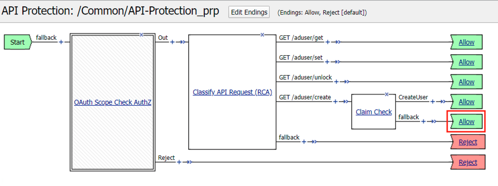
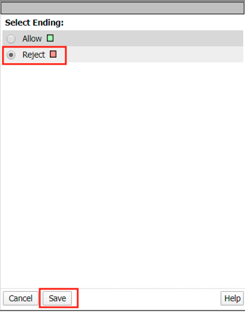
.. |image61| image:: media/image061.png
	:width: 800px
.. |image62| image:: media/image062.png
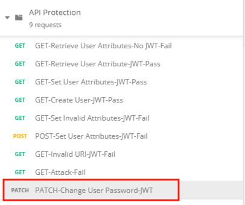
.. |image64| image:: media/image064.png
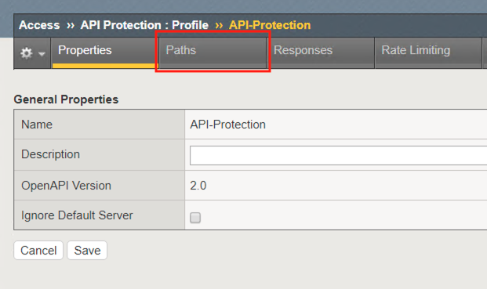
.. |image66| image:: media/image066.png
.. |image67| image:: media/image067.png
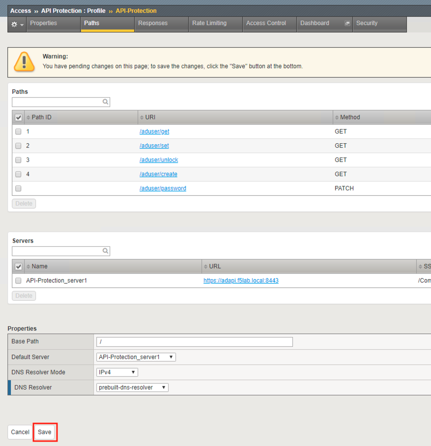
.. |image69| image:: media/image069.png
	:width: 800px

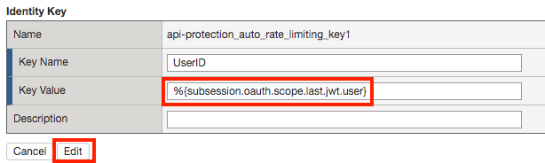
.. |image72| image:: media/image072.png
.. |image73| image:: media/image073.png

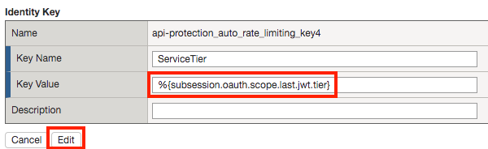

.. |image82| image:: media/image082.png
	:width: 800px
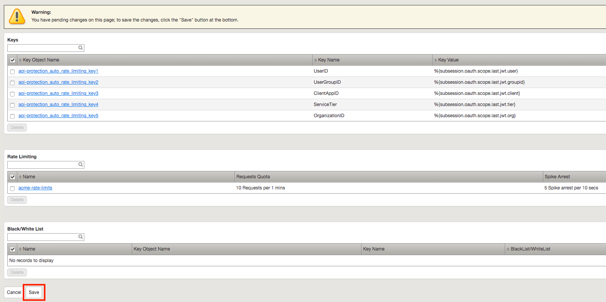
.. |image84| image:: media/image084.png
	:width: 800px
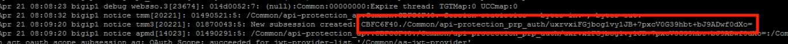
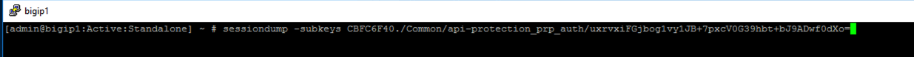
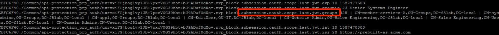

.. |image90| image:: media/image090.png
	:width: 800px
.. |image91| image:: media/image091.png
	:width: 800px

.. |image93| image:: media/image093.png
	:width: 800px
.. |image94| image:: media/image094.png
	:width: 800px

.. |image97| image:: media/image097.png
	:width: 800px
.. |image98| image:: media/image098.png
	:width: 800px
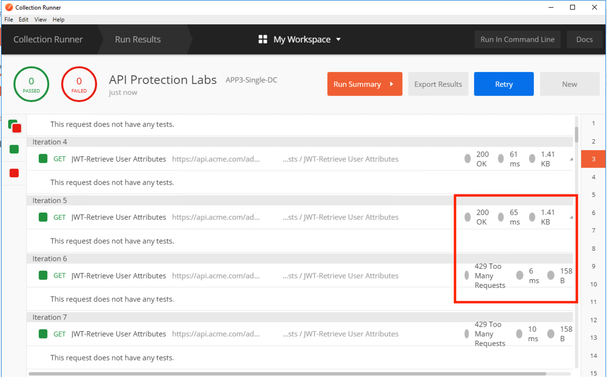
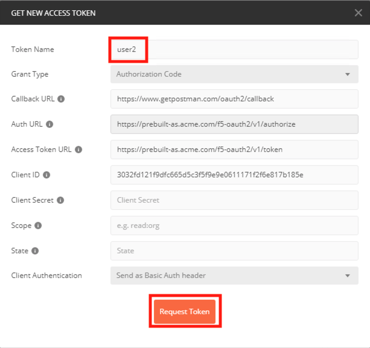

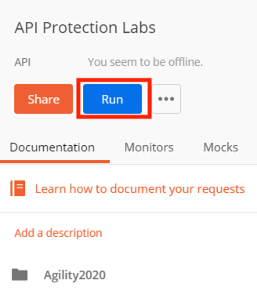

