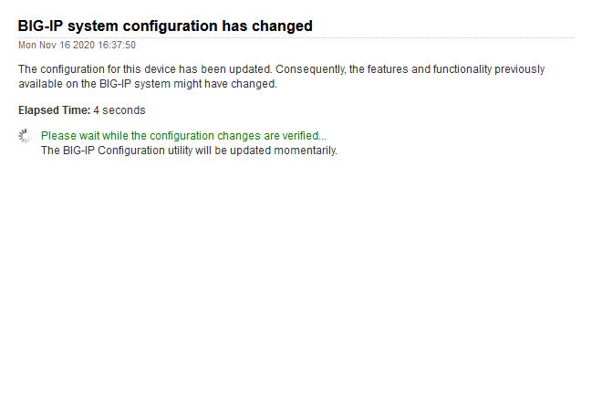
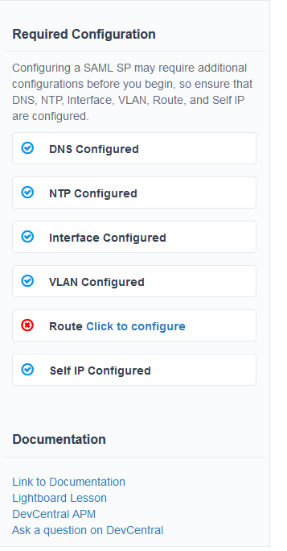
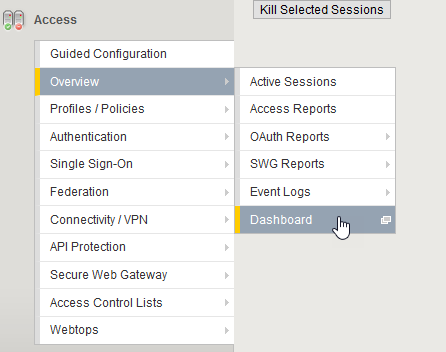
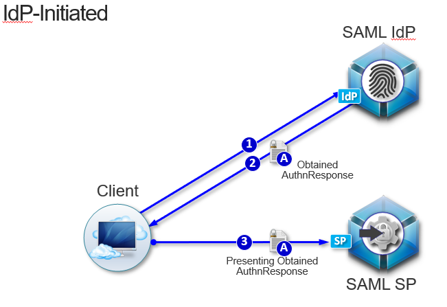
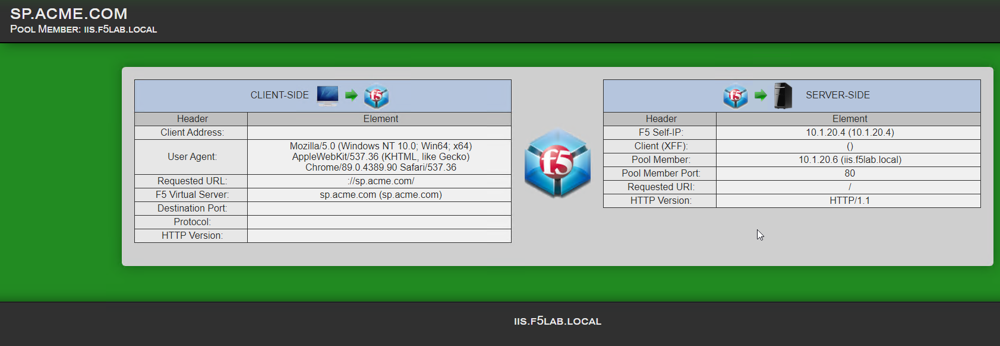
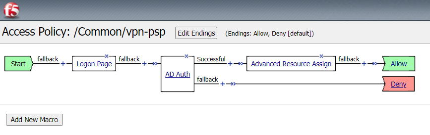
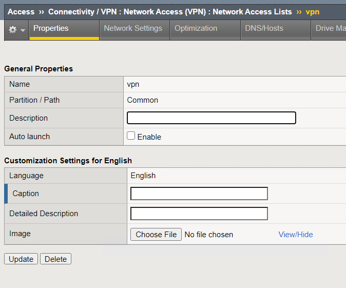
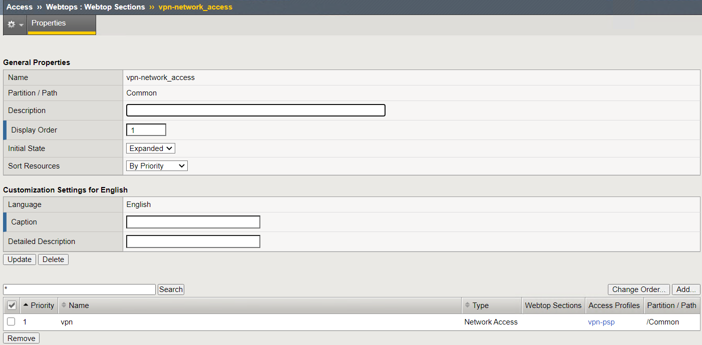
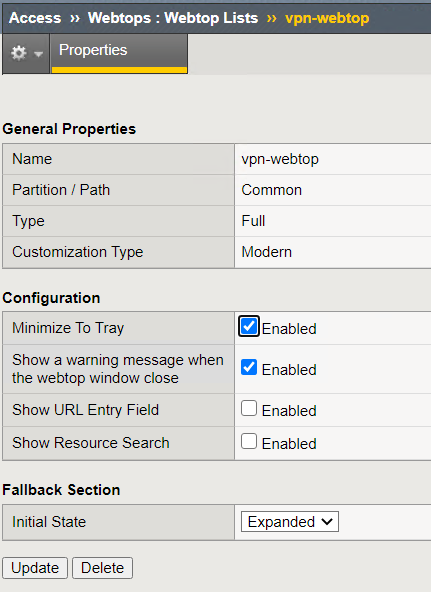

Lab 1: APM GUI Overview
===========================================

Objectives
----------

The intention of this lab will be to show how to enable Access Policy Manager (APM) through resource provisioning.  Next we will explore all the components within the **Access** left menu.
This is not a deep dive on the components but an overview of the components, features and concepts of APM.

Setup Lab Environment
-----------------------------------

To access your dedicated student lab environment, you will need a web browser and Remote Desktop Protocol (RDP) client software. The web browser will be used to access the Unified Demo Framework (UDF) Training Portal. The RDP client will be used to connect to the jumphost, where you will be able to access the BIG-IP management interfaces (HTTPS, SSH).

#. Click **DEPLOYMENT** located on the top left corner to display the environment

#. Click **ACCESS** next to jumphost.f5lab.local

   |accessjh|

#. Select your RDP resolution.

#. The RDP client on your local host establishes a RDP connection to the Jump Host.

#. Login with the following credentials:

         - User: **f5lab\\user1**
         - Password: **user1**

#. After successful logon the Chrome browser will auto launch opening the site https://portal.f5lab.local.  This process usually takes 30 seconds after logon.

#. Click the **Classes** tab at the top of the page.

	|accessportal|

#. Scroll down the page until you see **101 Intro to Access Foundational Concepts** on the left

   |101intro|

#. Hover over tile **APM GUI Overview**. A start and stop icon should appear within the tile.  Click the **Play** Button to start the automation to build the environment

   +---------------+-------------+
   | |guioverview| | |guiflyout| |
   +---------------+-------------+

#. After the click it may take up to 30 seconds before you see processing

   |process|

#. Scroll to the bottom of the automation workflow to ensure all requests succeeded.  If you experience errors try running the automation a second time or open an issue on the `Access Labs Repo <https://github.com/f5devcentral/access-labs>`__.

   |issues|

Task 1: Resource Provisioning
---------------------------------------
Access Policy Manager (APM) is a module available for use on the BIG-IP platform (Hardware and Virtual).  Unlike other modules, APM can be provisioned with limited functionality on any BIG-IP platform without a specific license (`see F5 KB15854 <https://support.f5.com/csp/article/K15854>`__).  APM is licensed based on the number of Access Sessions and Concurrent Users Sessions (`see APM Operations Guide <https://support.f5.com/csp/article/K72971039>`__). You can provision APM limited and immediately start using all the functions of APM with a limitation of 10 Access and Concurrent user session.

      .. Important::  APM has already been provisioned for this lab.  The next step would be completed if you are provisioning on your own BIG-IP.

#. Log in to bigip1.f5lab.local with administrative credentials provided
#. On the left menu navigate to **System** --> **Resource Provisioning**
#. Click box and on the drop down next to the module and choose **Nominal**

      .. Note:: In most use cases you will want to use **Nominal** for provisioning modules.  What does each setting mean?

      +---------------+---------------------------------------------------------------------------------------+
      |Dedicated      |Specifies that all resources are dedicated to the module you are provisioning. For all |
      |               |other modules, the level option must be set to none.                                   |
      +---------------+---------------------------------------------------------------------------------------+
      |Minimum        |Specifies that you want to provision the minimum amount of  resources for the module   |
      |               |you are provisioning.                                                                  |
      +---------------+---------------------------------------------------------------------------------------+
      |Nominal        |Specifies that you want to share all of the available resources equally among all of   |
      |               |the modules that are licensed on the unit.                                             |
      +---------------+---------------------------------------------------------------------------------------+

      |image01|

#. Before you click on Submit note that this operation will halt operations while the module provisions.  Do not do this on an active unit processing traffic unless you are in an outage window. This will not require a reboot but will take approximately 1 to 5 minutes to complete.

      |image02|
      |image03|

      .. Note::  Resource Provisioning is not a synced item between HA pairs.  You will need to provision the module on all devices in the cluster.

Task 2: Guided Configuration
-----------------------------
Access Guided Configuration (AGC) provides an easy way to create BIG-IP configurations for categories of Access use cases. This feature is an independent release from TMOS and requires updates for new configurations from time to time. To find updates and expanded use cases it will be necessary to download and install updates from https://downloads.f5.com. In this task we are going to explore the menu and take a look at a few options. We will not be deploying any of these solutions in this lab.

#.  Go to **Access** --> **Guided Configuration**
#.  A set of tiles appears at top listing the areas of use cases where Guided Configuration can be used

      |image06|

#.  Click on the Federation Tile.
#.  Under this tile are several Identity Federation use cases available.  Each use case has an accompanying guide to walk you through the configuration.  This is not designed for already deployed applications but used for new deployments.  All the components needed to create the configuration will be deployed on the BIG-IP through this guide.  Editing and configuring of the solution will be maintained within this menu.
#.  Click on **SAML Service Provider**
#.  Here you will find there are couple topologies.  SAML SP Initiated and SAML IdP Initiated.

      +------------+-----------+
      | |image08|  | |image09| |
      +------------+-----------+

#. If there are any required configuration pieces missing to complete guided configuration they will appear in the right pane

      |image07|

#. Below the topologies you will find all the components that will be configured using the guided configured

      |image10|

#.  From here you would click next to begin configuration. (We will explore this further in the 300 Series labs)
#.  Click on the Guide Configuration bread crumb at the top of the screen to return to the main menu.
#.  Click on the Zero Trust tile.
#.  Zero trust follows the principle never trust, always verify and thus enforces authentication and verification for every user or device attempting to access resources whether from within or outside of the network.

      **About Identity Aware proxy**

      The easiest way to create policies to support zero trust security is to use the Zero Trust-Identity Aware Proxy template in Access Guided Configuration. The template takes you through the
      steps needed to create an Identity Aware Proxy. Access Policy Manager (APM) acts as the Identity Aware Proxy helping to simplify client access to both multi-cloud and on-premise web applications,
      and securely manage access from client devices.

      On APM, you can develop per-request policies with subroutines that perform different levels of authentication, federated identity management, SSO (single sign on), and MFA (multi-factor
      authentication) depending on the requirements. Subroutines perform continuous checking based on a specified duration or gating criteria. Policies can be as complex or as simple as you need
      them to be to provide seamless yet secure access to resources. Refer to Implementing Zero Trust with Per-Request Policies for many examples of per-request policies that implement different
      aspects of zero trust.

      For additional security, device posture checking provides instantaneous device posture information. The system can continuously check clients to be sure, for example, that their antivirus,
      firewall, and patches meet company requirements, ensuring that the device maintains trust at all times.

      On the client side, F5 Access Guard allows real-time posture information to be inspected with per-request policy subroutines. F5 Access Guard generates posture information asynchronously,
      and transparently transmits it to chosen APM server endpoints using special HTTP headers. Refer to BIG-IP Access Policy Manager: Configuring F5 Access Guard
      for details on client requirements.

#.  Click on the **Identity Aware Proxy** configuration option
#.  There are two topologies available:

      +---------------+-------------+-------------+
      |Single Proxy   | |image13|   |  |image17|  |
      +---------------+-------------+-------------+
      |Multi-Proxy    | |image14|   |  |image16|  |
      +---------------+-------------+-------------+

#.  Proceeding with this configuration will create a number of object as seen here.

      .. Note::  If you are interested in learning more on this specific solution please consider taking the Zero Trust Identity Aware Proxy class.

      |image18|

      .. Note:: Webtop is available as of version 16.0

Task 3: Overview
-----------------
The Overview menu is where an administrator can view active sessions, previous sessions, and view various reports.

#.  Click on **Access** --> **Overview** from the left menu
#.  Here is where we would see Active Sessions.  When users login to applications using APM policies the sessions will appear in this pane.

      |activesessions|

#.  This is also where you will be able to kill sessions.  For more on logging see Lab 3

      |killsession|

#.  Click on **Access** --> **Overview** --> **Access Report**
#.  This section will give you details on the all sessions active and inactive.  Each log item is a message on the policy flow as a user walks through an Access policy.  (We will cover Per Session and Per Request policies in in more detail later).
#.  You will be prompted to enter a time period to run the report

      |image22|

      .. Note:: This is how you can view past sessions.  Pick a time frame and run a report.

#.  There are two other reporting functions in this screen, **OAuth Report** and **SWG Reports**.  We will not cover these reports in this lab.
#.  The last section is Event Logs.

    .. Note:: URL Request Logs is part of SWG functionality and will not be covered in this lab

#.  From the top menu bar Click on the drop down next to **Event Logs** and choose **Settings**. This is where you can create logging profiles for access policies.  From here you can specify what information to collect and to what detail.
#.  Click the **Create** button
#.  We will create a new APM Log profile

      +----------------------+---------------------------+----------------------------------+
      |General Information   | Name                      |  basic_log_profile               |
      +----------------------+---------------------------+----------------------------------+
      |                      | Enable Access System Logs |  Check box                       |
      +----------------------+---------------------------+----------------------------------+
      |Access System Logs    | Publisher                 |  /Common/sys-db-access-publisher |
      +----------------------+---------------------------+----------------------------------+
      |                      | Access Policy             |  Notice                          |
      +----------------------+---------------------------+----------------------------------+
      |                      | ACL                       |  Notice                          |
      +----------------------+---------------------------+----------------------------------+
      |                      | Secure Web Gateway        |  Notice                          |
      +----------------------+---------------------------+----------------------------------+
      |                      | OAuth                     |  Notice                          |
      +----------------------+---------------------------+----------------------------------+
      |                      | VDI                       |  Notice                          |
      +----------------------+---------------------------+----------------------------------+
      |                      | ADFS Proxy                |  Notice                          |
      +----------------------+---------------------------+----------------------------------+
      |                      | Per-Request Policy        |  Notice                          |
      +----------------------+---------------------------+----------------------------------+
      |                      | SSO                       |  Notice                          |
      +----------------------+---------------------------+----------------------------------+
      |                      | ECA                       |  Notice                          |
      +----------------------+---------------------------+----------------------------------+
      |                      | PingAccess Profile        |  Notice                          |
      +----------------------+---------------------------+----------------------------------+
      |                      | Endpoint Management System|  Notice                          |
      +----------------------+---------------------------+----------------------------------+
      |Access Profile        | Selected                  |  (leave this blank for now)      |
      +----------------------+---------------------------+----------------------------------+

      .. Note:: Within the Access System Logs section of the log profile is where you can change the logging for various portions of the APM Policies.  The one you will use most will be to move Access Policy from Notice to Debug and/or Pre-Request Policy from Notice to Debug.  As you can see you can pick and choose what level of notifications you want in your logs.  This will impact what you see in Access Reports for a session and what appears in /var/log/apm.

#.  Click OK

#.  From the left menu go to **Access** --> **Overview** --> **Dashboard**

      |image23|

#.  The Dashboard can give you a quick synopsis on Access Session, Network Access Session, Portal Access and Access control Lists.

      |Dashboard|

      .. Note:: For more reporting on APM stats look to BIG-IQ or exporting logs to 3rd party SIEMs and create your own dashboard.

Task 4: Profile/Policies
------------------------
Profiles and Policies are where we begin to learn about what makes APM function.  In order for APM functions to be added to a Virtual server we need to create Access Profiles and Policies.  These entities take all the components we will look at below and put them in a logical flow through the Visual Policy Editor (VPE). These entities are things like login pages, authentication, single sign on methods and endpoint checks.  To being we have to create an Access Profile.  Within that profile we create a per session policy.  When that is completed we attach that profile to a Virtual Server.

.. Note::  You can associate one Access Profile (which includes a per-session policy) and one per-request policy per virtual server.

.. Important:: We will creating objects for use within this task.

#.  From the left menu go to **Access** --> **Profiles/Policies** --> **Access Profiles (Per-Session Policies)**

      The per-session policy runs when a client initiates a session. (A per-session policy is also known as an access policy.) Depending on the actions you include in the access policy, it can authenticate the user and perform other actions that populate session variables with data for use throughout the session.

#.  Click on the Create button on the far right

      +----------------------+---------------------------+----------------------------------+
      |General Properties    | Name                      | server1-psp                      |
      +----------------------+---------------------------+----------------------------------+
      |                      | Profile Type              |  All                             |
      +----------------------+---------------------------+----------------------------------+
      |                      | Profile Scope             |  Profile                         |
      +----------------------+---------------------------+----------------------------------+
      |                      | Customization Type        |  Modern                          |
      +----------------------+---------------------------+----------------------------------+
      |Language Settings     | Accepted Languages        |  English                         |
      +----------------------+---------------------------+----------------------------------+

      .. Note:: Customization Type is a newer setting that changes the look and feel of login pages.  For the traditional look you can **Standard**

#.  Click **Finished**
#.  Now we have a basic profile.  There were a number of other settings to modify and use in the profile.  For now we will focus just on the basics.
#.  From the **Access Profiles (Per-Session Policies)** section locate the **server1-psp**
#.  There are two ways to edit the Policy piece of the profile.

    First way

    +----------------------------------------------------------------------------+
    | Click on the profile                                                       |
    +----------------------------------------------------------------------------+
    | Click on **Access Policy** from the top menu bar                           |
    +----------------------------------------------------------------------------+
    | Click on the link to **Edit Access Policy for Profile "server1-psp"**      |
    +----------------------------------------------------------------------------+
    | This will take you to the Visual Policy Editor (VPE)                       |
    +----------------------------------------------------------------------------+

    Second way

    +-----------------------------------------------------------------------------------+
    | Locate the **server1-psp** in the Profile list and follow the line to the right.  |
    +-----------------------------------------------------------------------------------+
    | Middle of the line there will be an **Edit** link                                 |
    +-----------------------------------------------------------------------------------+
    | Click the **Edit** link                                                           |
    +-----------------------------------------------------------------------------------+

#.  Close the VPE (we will visit the VPE and policy in more detail later)
#.  Return to **Access** --> **Profiles/Policies** --> **Access Profiles (Per-Session Policies)**
#.  Click on the **server1-psp** and explore the settings for the Profile.

    +----------------------+------------------------------------------------------------------------------------+
    | Settings             | Here you can manage settings for the profile. You may want to change timeouts, max |
    |                      | sessions and login attempts. These are settings specifically for this profile.     |
    +----------------------+------------------------------------------------------------------------------------+
    | Configurations       | These are more advanced options and covered in other labs                          |
    +----------------------+------------------------------------------------------------------------------------+
    | Language Settings    | You have to set this at creation.                                                  |
    +----------------------+------------------------------------------------------------------------------------+

    .. Note:: If you are unsure of the settings you need at profile creation you can see that you can return to the profile and make adjustments.

#.  Still in the profile click on **SSO/Auth Domain** at the top

      BIG-IP APM offers a number of Single Sign On (SSO) options.  The SSO/Auth Domain tab in a Per Session Profile is where you will select what SSO method to use for your application. In Task 6 we will cover the objects that need to be created in order to associate that SSO method to a policy.  At this time the drop down for the SSO Configuration will have a pre-built SSO object we will use later.

      .. Note::  We will not discuss Multi-Domain in this lab but you can find more information in the Appendix

#.  From the top menu bar click on **Logs**
#.  The log profile we created earlier is now listed here.  The Default log profile is attached but we can remove that and add the **basic_log_profile**
#.  Click Update.

    That concludes the review of the Per Session policy.

    .. Note:: A per session profile is required (even if it is blank) to be deployed with a per request policy

**Per Request policies**

#.  From the left menu navigate to **Access** --> **Profiles/Policies** --> **Per Request Policies**

      APM executes per-session policies when a client attempts to connect to the enterprise. After a session starts, a per-request policy runs each time the client makes an HTTP or HTTPS request. Because of this behavior, a per-request policy is particularly useful in the context of a Secure Web Gateway or Zero Trust scenario, where the client requires re-verification on every request, or changes based on gating criteria.

      A per-request policy can include a subroutine, which starts a subsession. Multiple subsessions can exist at one time. You can use nearly all of the same agents in per-request policies that you can use in per-session policies. However, most of the agents (including authentication agents) have to be used in a subroutine in per-request policies.

#. Click **Create**

      +----------------------+---------------------------+----------------------------------+
      |General Properties    | Name                      |  server1_prp_policy              |
      +----------------------+---------------------------+----------------------------------+
      |                      | Profile Type              |  All                             |
      +----------------------+---------------------------+----------------------------------+
      |                      | Incomplete Action         |  Deny                            |
      +----------------------+---------------------------+----------------------------------+
      |                      | Customization Type        |  Modern                          |
      +----------------------+---------------------------+----------------------------------+
      |Language Settings     | Accepted Languages        |  English                         |
      +----------------------+---------------------------+----------------------------------+

#. Click **Finished**

#. Click **Edit**

      A per request policy creation will work the same way as a per session policy allowing you to add various items to the main policy and create macros. In addition a per request policy can also contain subroutines.

      .. Note:: A per-request policy subroutine is a collection of actions. What distinguishes a subroutine from other collections of actions (such as macros), is that a subroutine starts a subsession that, for its duration, controls user access to specified resources. If a subroutine has an established subsession, subroutine execution is skipped. A subroutine is therefore useful for cases that require user interaction (such as a confirmation dialog or a step-up authentication), since it allows skipping that interaction in a subsequent access.

      You cannot use subroutines in macros within per-request policies.
      Subroutine properties specify subsession timeout values, maximum macro loop count, and gating criteria. You can reauthenticate, check for changes on the client, or take other actions based on timeouts or gating criteria.

      .. Note:: A subsession starts when a subroutine runs and continues until reaching the maximum lifetime specified in the subroutine properties, or until the session terminates. A subsession populates subsession variables that are available for the duration of the subsession. Subsession variables and events that occur during a subsession are logged. Multiple subsessions can exist at the same time. The maximum number of subsessions allowed varies across platforms. The total number of subsessions is limited by the session limits in APM (128 * max sessions). Creating a subsession does not count against the license limit.

#. If you click on the plus between Start and Allow a new box will appear and you can explore the various components that can be added.  At this time we will leave the policy blank and return to populate it in later tasks.
#. Close the VPE tab when you are done exploring.

**Policy Sync**

#. Click on **Access** --> **Profiles/Policies** --> **Policy sync**

      BIG-IP APM Policy Sync maintains access policies on multiple BIG-IP APM devices while adjusting appropriate settings for objects that are specific to device locations, such as network addresses. You can synchronize policies from one BIG-IP APM device to another BIG-IP APM device, or to multiple devices in a device group.

      A sync-only device group configured for automatic and full sync is required to synchronize access policies between multiple devices.

      .. Important:: USE WITH CAUTION.  This is an advanced feature and you should consult with your F5 Account team or Professional Services before implementing this configuration.

      .. Note:: In BIG-IP 13.1.0, a maximum of eight BIG-IP APM systems are supported in a sync-only group type.

**Customization**

#. Click on **Access** --> **Profiles/Policies** --> **Customization**

      **What are customization and localization?**

      Customization and localization are ways to change the text and the language that users see, and to change the appearance of the user interface that Access Policy Manager presents to client users. Customization provides numerous settings that let you adapt the interface to your particular operation. Localization allows you to use different languages in different countries.

      **About the Customization tool**

      The Customization tool is part of Access Policy Manager (APM). With the Customization tool, you can personalize screen messages and prompts, change screen layouts, colors, and images, and customize error messages and other messages using specific languages and text for policies and profiles developed in APM. You can customize settings in the Basic Customization view (fewer settings) or change the view to General Customization (many settings). In the General Customization view, you can use the Customization tool in the BIG-IP admin console, or click Popout to open it in a separate browser window. In either view, you can click Preview to see what an object (such as Logon page or Deny Ending Page) will look like.

      After you personalize settings, remember to click the **Save** icon to apply your changes.

#. About basic, general, and advanced customization

      The Customization tool provides three views that you can use to customize the interface. The General Customization view provides the greatest number of options
      and is where most of the customization takes place.

      +----------------------+--------------------------------------------------------------------------------------------------------------------+
      | View                 | Description                                                                                                        |
      +======================+====================================================================================================================+
      | Quick Start/Basic    |Basic customization provides a limited set of options intended for quick modification of the objects that are       |
      | Customization        |commonly displayed to users. This is the default customization view. Use this to configure basic look and feel      |
      |                      |for pages, and common text labels and captions for resources on the webtop. Different options exist depending on    |
      |                      |the Customization Type selected when the policy was created.                                                        |
      +----------------------+--------------------------------------------------------------------------------------------------------------------+
      | General              |This view provides a tree structure containing all the configuration elements, and more detailed options to         |
      | Customization        |customize objects, such as:                                                                                         |
      |                      |                                                                                                                    |
      |                      |- The size, color, and placement of forms and screens.                                                              |
      |                      |- The look and feel of objects with more opportunities to replace images.                                           |
      |                      |- Text on the screen, including headers and footers.                                                                |
      |                      |- Messages, including installation and error messages.                                                              |
      |                      |                                                                                                                    |
      |                      |Any text or image that you can customize using the visual policy editor, can also be adjusted using the general     |
      |                      |customization UI. Different options exist depending on the Customization Type selected when the policy was created, |
      |                      |and which elements were added to the access or per-request policy.                                                  |
      +----------------------+--------------------------------------------------------------------------------------------------------------------+
      | Advanced             |Advanced customization provides direct access to PHP, Cascading Style Sheets (CSS), JavaScript, and HTML files that |
      | Customization        |you can edit to control the display and function of web and client pages in Access Policy Manager.                  |
      +----------------------+--------------------------------------------------------------------------------------------------------------------+

      .. Note:: See the `APM Customization guide <https://techdocs.f5.com/en-us/bigip-16-0-0/big-ip-access-policy-manager-customization.html>`__ for further details on customization

#. Under **Available Profiles** choose the /Common/server1-psp
#. Select Language:  **English**
#. Let's upload a new image.  Click **Upload New Image**
#. Browse to **Desktop** and locate the **Lab01_images** folder
#. Choose an image from the selection and click **Open**
#. Pick a Background color
#. Pick a Header Background color
#. Change the footer Text
#. Click on the **Preview** button
#. Choose **Access Profiles** --> **/Common/server1-psp** --> **Access Policy** --> **Ending pages** -- **Deny**

      Bonus Answer:  Why don't we see logon pages?

      .. Hint::  What is in the policy so far?

Task 5: Authentication
----------------------------

BIG-IP APM serves as an authentication gateway or proxy. As an authentication proxy, BIG-IP APM provides separate client-side and server-side authentication. Client-side authentication occurs between the client and BIG-IP APM. Server-side authentication occurs between BIG-IP APM and servers.

Loose coupling between the client-side and server-side layers allows for a rich set of identity transformation services. Combined with a Visual Policy Editor and an expansive set of access iRules functionality, BIG-IP APM provides flexible and dynamic identity and access, based on a variety of contexts and conditions.

For example, a client accessing Microsoft SharePoint through BIG-IP APM in a corporate environment may silently authenticate to BIG-IP APM with NT LAN Manager (NTLM) or Kerberos credentials. On leaving that environment, or on using a different non-sanctioned device, the client may be required to go through another potentially stronger authentication, such as a smart card or other client certificate, RSA SecurID, or one-time passcode. You can require additional device vetting such as file, folder, and registry checks and antivirus and firewall software validation.

A BIG-IP APM authentication and SSO features access and identity security posture can automatically change depending on environmental factors, such as who or where the user is, what resource the user is accessing, or when or with what method the user is attempting to gain access.

Data centers and Cloud deployments often face the challenge of offering multiple applications with different authentication requirements. You can deploy BIG-IP APM to consolidate and enforce all client-side authentication into a single process. BIG-IP APM can also perform identity transformation on the server side to authenticate to server services using the best-supported methods. This can reduce operational costs since applications remain in the most-supported and documented configurations. Common examples of identity transformation are client-side public key infrastructure (PKI) certificate to server-side Kerberos and client-side HTTP form to server-side HTTP Basic.

The following figure shows BIG-IP APM acting as an authentication gateway. Information received during pre-authentication is transformed to authenticate to multiple enterprise applications with different requirements.

|image25|

#. Client-side authentication

      Client-side authentication involves the client (typically a user employing a browser) accessing a BIG-APM virtual server and presenting identity. This is called authentication, authorization, and accounting (AAA).

      BIG-IP APM supports industry standard authentication methods, including:

      - NTLM
      - Kerberos
      - Security Assertion Markup Language (SAML)
      - Client certificate
      - RSA SecurID
      - One-time passcode
      - HTTP Basic
      - HTTP Form
      - OAuth 2.0
      - OpenId Connect

      After access credentials are submitted, BIG-IP APM validates the listed methods with industry-standard mechanisms, including:

      - Active Directory authentication and query
      - LDAP and LDAPS authentication and query
      - Remote Authentication Dial-in User Service (RADIUS)
      - Terminal Access Controller Access Control System (TACACS)
      - Online Certificate Status Protocol (OCSP) and Certificate Revocation List Distribution Point (CRLDP) (for client certificates)
      - Local User Database authentication

#. Go to **Access** --> **Authentication** --> **Active Directory**
#. Click on basic-ad-servers and review the settings.  You can choose to use go direct or use a pool of AD servers.

      +----------------------+-----------------------------+----------------------------------+
      |General Properties    | Name                        |  basic-ad-servers                |
      +----------------------+-----------------------------+----------------------------------+
      |Configuration         | Domain Name                 |  f5lab.local                     |
      +----------------------+-----------------------------+----------------------------------+
      |                      | Server Connection           |  Use Pool                        |
      +----------------------+-----------------------------+----------------------------------+
      |                      | Domain Controller Pool Name |  /Common/basic-ad-pool           |
      +----------------------+-----------------------------+----------------------------------+
      |                      | IP Address                  |  10.1.20.7                       |
      +----------------------+-----------------------------+----------------------------------+
      |                      | Hostname                    |  dc1.f5lab.local                 |
      +----------------------+-----------------------------+----------------------------------+
      |                      | Admin Name                  |  admin                           |
      +----------------------+-----------------------------+----------------------------------+
      |                      | Admin Password              |  admin                           |
      +----------------------+-----------------------------+----------------------------------+

      .. Note:: If you choose to use a pool you can create the pool as you create the AD object.  You can also choose to use Direct which allows you to only use one server. Go back and click create to see what this looks like.

      |adpool|

      You now have an object that can be used to facilitate Active Directory authentication in front of any application.  The application itself does not need to require authentication. If you were to deploy a policy with AD Auth on a Virtual Server for a web application the policy would preset a login page, prompt for credentials, verify the credentials against this AD object before allowing a user to access the web application.

#. Go to **Access** --> **Profiles/Policies** --> **Access Profiles (Per-Session Policies)**
#. Locate the **server1-psp** and click **Edit**
#. Click the **+** symbol between Start and Deny.
#. From the **Logon** tab select the **Logon Page** radio button
#. Click **Add Item**
#. Notice that you can add fields and change the names of the fields.  Click **Save**
#. Click the **+** between **Logon Page** and Deny
#. Click the **Authentication** tab
#. Choose the **AD Auth** radio button and click **Add Item**
#. Under the **Type** field click on the drop down menu and choose the AAA server **basic-ad-servers**
#. Click **Save**
#. On the Success branch click on the **Deny** end point and choose **Allow** then click **Save**
#. Click **Apply Access Policy**

      |basicpolicy|

      Now you have a basic policy with AD Authentication that you can leverage for Web Pre-Authorization in front of any application.

#. Go to **Local Traffic** --> **Virtual Servers**
#. Locate **server1-https** and click on it
#. Scroll down to the **Access Policy** section.  Next to **Access Profile** click the drop and chose server1-psp
#. Scroll down to the bottom and click **Update**
#. In a new browser tab go to http://server1.acme.com and Login

      +---------------+--------------+
      | username      | user1        |
      +---------------+--------------+
      | password      | user1        |
      +---------------+--------------+

Task 6: Single Sign-On
----------------------------
Client side and server side are loosely coupled in the authentication proxy. Because of this, BIG-IP APM can transform client-side identity values of one type into server-side identity values of another type. You configure SSO within an SSO profile, which is applied to an access profile. The system triggers SSO at the end of successful access policy evaluation and on subsequent client-side requests.

BIG-IP APM supports industry standard authentication methods, including:

    - NTLM
    - Kerberos
    - HTTP Basic
    - HTTP Form
    - Security Assertion Markup Language (SAML)

    .. Note:: Client-side authentication methods outnumber server-side methods. This is because BIG-IP APM does not transmit client certificate, RSA SecurID, or one-time passcodes to the server on the client’s behalf.

#.  Go to **Access** --> **Single Sign-On** --> **HTTP Basic**
#.  Click **basic-sso**

        +----------------------+-----------------------------+----------------------------------+
        |General Properties    | Name                        |  basic-sso                       |
        +----------------------+-----------------------------+----------------------------------+
        |Credential Source     | Username Source             |  session.sso.token.last.username |
        +----------------------+-----------------------------+----------------------------------+
        |                      | Password Source             |  session.sso.token.last.password |
        +----------------------+-----------------------------+----------------------------------+
        |SSO Method Conversion | Username Conversion         |  unchecked                       |
        +----------------------+-----------------------------+----------------------------------+

        .. Note::  Username conversion can be enabled if you want domain\\username or username@domain to convert to just username.

#. Click on **Access** --> **Profiles/Policies** --> **Access Profiles (Per-Session Policies)**
#. Locate the **basic-psp** profile and click on the name
#. Click on **SSO/Auth Domains**
#. Under SSO Configuration notice **basic_sso** is selected
#. From the top menu bar click **Access Policy** and click **Edit Access Policy for Profile "basic-psp"** link

      |basicpsp|

#. Click on **SSO Credential Mapping**

      |ssocredmap|

      .. Note:: You can modify these options based on the variables collected in the user's session.  In this case we accept the defaults.

#. Open an incognito window and try go to https://basic.acme.com
#. You should have been prompted with a windows login.  Close the Window
#. Go to **Local Traffic** --> **Virtual Servers** and open **basic-https**
#. Scroll to **Access Policy** and click the drop down next to **Access Profile**.  Choose **basic-psp**

      |policyattach|

#. Scroll down click **Update**
#. Open a new incognito tab.  Go to https://basic.acme.com
#. Login **user1** and **user1**
#. Now you should have been signed in to the backend server with Single Sign On.

Task 7: Federation
----------------------------

**BIG-IP APM federation with SAML**

    BIG-IP APM supports SAML 2.0 and can act as the IdP for popular SPs, such as Microsoft Office 365 and Salesforce. The system supports both IdP- and SP-initiated identity federation deployments.

**IdP-initiated federation with BIG-IP APM**

      |samlidp|

      - The user logs in to the BIG-IP APM IdP and the system directs them to the BIG-IP APM webtop.
      - The user selects the SP they want, such as Salesforce.
      - The system retrieves any required attributes from the user data store to pass on to the SP.
      - The system uses the browser to direct the request to the SP, along with the SAML assertion and any required attributes.

#. In a new tab go to https://idp.acme.com
#. Login to the SAML IdP

      +------------+-----------+
      | Username:  | user1     |
      +------------+-----------+
      | Password:  | user1     |
      +------------+-----------+

      |samlidplogin|

#. You are logged in to a webtop where a SAML SP object resides.  Click on the SAML Resource sp.acme.com

      |webtopsaml|

#. Since you authenticated through the SAML IdP you will not be prompted for authentication again and are connected to the SAML SP resource.

      |spacme|

#. Return to bigip1.f5lab.local.  From the left menu click **Access** --> **Profiles/Policies** --> **Access Profiles (Per-Session Policies)**
#. Locate the policy **idp-psp** and click on **Edit**

      |idppsp|

#. Click *AD Auth** object within the Policy.  Examine the settings

      |idpadauth|

      .. Note::  If you look at the AAA server under Active directory you will find the idp-ad-server object.  We are leveraging Active Directory as the credential verification but BIG-IP is acting as a SAML Identity Provider.  BIG-IP will verify the credentials against Active Directory and create a SAML Assertion for the user requesting access.  That assertion can then be used by the SAML Service Provider to provide access to the SAML SP resource.

      |samlidpaaa|

#. Click **Advanced Resource Assign**. Examine the settings

      |samladvres|

      .. Note::  You can click on the Add/Delete button and add other SAML Resources (if available).  We will cover more on Webtop in the Access 102 lab.

#. Return to the BIG-IP click on **Access** --> **Federation** --> **SAML Identity Provider**

      |samlidpobj|
      |samlbindexp|

      In order for the BIG-IP to be configured as a SAML IdP you must define the Identity provider and bind it with a SAML Service Provider.  This object contains the settings required to configure BIG-IP as a SAML SP.  For more information on SAML and uses with BIG-IP consider taking the Federation lab.

      .. Note::  You can export the Metadata of the SAML IdP in this menu by clicking the SAML IdP and clicking the Export Metadata button.  It will output an XML file that you can use to upload in to a SAML Service Provider with all the IdP setting particular to this IdP.

**SP-initiated federation with BIG-IP APM**

      |samlsp|

      - The user logs in to the SP, such as Salesforce.
      - The SP uses the browser to redirect the user back to the BIG-IP APM IdP.
      - The BIG-IP APM IdP prompts the user to log in.
      - The system retrieves any required attributes from the user data store to pass on to the SP.
      - The system uses the browser to send the SAML assertion and any required attributes to the SP.

#. Open a new incognito window and go to https://sp.acme.com
#. Notice that you get redirected to https://idp.acme.com for authentication

      |spinitiated|

      +------------+-----------+
      | Username:  | user1     |
      +------------+-----------+
      | Password:  | user1     |
      +------------+-----------+

#. Once logged in you arrive at https://sp.acme.com

      |spacme|

#. Return to the BIG-IP.  From the left menu navigate to **Access** --> **Profiles/Policies** --> **Access Profiles (Per-Session Policies)**
#. Locate the sp-psp profile and cick **Edit**

      |sppsp|

      SAML Auth

      |samlspauth|

#. Return to the BIG-IP and navigate to **Access** --> **Federation** --> **SAML Service Provider**

      |samlspobj|

      The SAML SP object contains information about the SAML SP object and the binding to the SAML Identity Provider.  You can see on the screen that we have a Service Provider object defined and it is bound to a SAML Identity Provider.  The configuration of these objects is covered in more detail in the Access Federation labs.

Task 8: Connectivity/VPN
----------------------------

**Policy Walk-Through**

#.  Navigate to **Access** --> **Profiles/Policies** --> **Access Profiles (Per-Session Policies)**
#.  Locate profile **vpn-psp** and click on **Edit**.  This opens the Visual Policy Editor (VPE) and we can take a look at the policy

      |image001|

#.  A user enters their credentials into the logon page agent.
    - Those credentials are collected, stored as the default system session variables of session.logon.last.username and session.logon.last.password.

#.  The AD Auth Agent validates the username and password session variables against the configured AD Domain Controller.
#.  The user is assigned resources defined in the Advanced Resource Assign Agent
#.  The user is granted access via the Allow Terminal
#.  If unsuccessful, the user proceeds down the fallback branch and denied access via the Deny Terminal

**Policy Agent Configuration**

The Logon Page contains only the default setting

      |image002|

The AD Auth agent defines the AAA AD Servers that a user will be authenticated against.  All Setting are the default.

      |image003|

The Advanced Resource Assign agent grants a user access to the assigned resources.

      |image004|

**Supporting APM Objects**

**Network Access Resource**

#. Navigate to **Access** --> **Connectivity/VPN** --> **Network Access Lists**
#. Click the **vpn** Network Access Profile

      The Properties page contains the Caption name **VPN**.  This is the name displayed to a user.

            |image005|

      - The Network Settings tab assigns the **lease pool** of ip addresses that will be used for the VPN.
      - Split Tunneling is configured to permit only the **10.1.20.0/24** subnet range inside the VPN.

            |image006|

**Lease Pool**

#. Navigate to **Access** --> **Connectivity/VPN** --> **Network Access Lists** --> **IPV4 Lease Pools**
#. Click **vpn-vpn_pool** lease pool object

      A single address of **10.1.20.254** is assigned inside the lease pool.

            |image007|

**Webtop Sections**

#. Navigate to **Access** --> **Webtops** --> **Webtop Sections**
#. Click on **vpn-network_access**

      A single section is configured to display a custom name.

      |image008|

**Webtop Lists**

#. Navigate to **Access** --> **Webtops** --> **Webtop Lists**
#. Click on **vpn-webtop**

      - A Full Webtop was defined with modified default settings.
      - The Minimize to Tray box is **checked** to ensure the Webtop is not displayed when a user connects to the VPN.

      |image009|

**The Policy from a user's perspective**

#. The connects to https://vpn.acme.com with the following credentials

      +------------+-----------+
      | Username:  | user1     |
      +------------+-----------+
      | Password:  | user1     |
      +------------+-----------+

      |image010|

#. Once authenticated the user is presented a Webtop with a single VPN icon.

      |image011|

#. Assuming the VPN has already been installed the user is notified that the client is attempting to start

      |image012|

      .. Note::  You may be prompted to download the VPN update.  This is what a user will experience if you have auto-update enabled in the VPN Connectivity Profile. Click Download and wait for the components to update.

#. A popup opens displaying the status of the VPN connection.  The status will eventually become **Connected**

      |image013|

      .. Note::  If you lose the pop-up check the system tray for the little red ball.  Right click and choose **restore**

#. Click **Disconnect**

.. Note:: For more information on API Protection consider taking the API Protection lab.  For more information on SWG, ACL and Webtops see the appendix or further APM labs.

Task 8: Lab Cleanup
----------------------------

#. Open a new tab and click on the Access: PORTAL bookmark then select **CLASSES**
#. Locate the **APM GUI Overview** Tile and click on the **Stop** button

      +---------------+-------------+
      | |guioverview| | |guistop|   |
      +---------------+-------------+

#. Wait about 30 seconds for the processing to begin

      |process|

#. This process will take up to 30 seconds.  Scroll to the bottom of the script and verify no issues.

Lab 1 is now complete.

.. |accessjh| image:: ./media/lab01/setup/accessjh.png
.. |accessportal| image:: ./media/lab01/setup/accessportal.png
.. |101intro| image:: ./media/lab01/setup/101intro.png
.. |guioverview| image:: ./media/lab01/setup/guioverview.png
.. |guiflyout| image:: ./media/lab01/setup/guiflyout.png
.. |guistop| image:: ./media/lab01/setup/guistop.png
.. |process| image:: ./media/lab01/setup/process.png
.. |issues| image:: ./media/lab01/setup/issues.png
.. |Dashboard| image:: ./media/lab01/Dashboard.png
.. |image01| image:: ./media/lab01/image01.png
.. |image02| image:: ./media/lab01/image02.png

.. |image06| image:: ./media/lab01/image6.png

.. |image08| image:: ./media/lab01/image8.png
.. |image09| image:: ./media/lab01/image9.png
.. |image10| image:: ./media/lab01/image10.png
.. |image13| image:: ./media/lab01/image13.png
.. |image14| image:: ./media/lab01/image14.png
.. |image16| image:: ./media/lab01/image16.png
.. |image17| image:: ./media/lab01/image17.png
.. |image18| image:: ./media/lab01/image18.png
.. |sessionid| image:: ./media/lab01/sessionid.png
.. |activesessions| image:: ./media/lab01/activesessions.png
.. |killsession| image:: ./media/lab01/killsession.png
.. |image22| image:: ./media/lab01/image22.png

.. |image25| image:: ./media/lab01/image25.png
.. |adpool| image:: ./media/lab01/adpool.png
.. |basicpsp| image:: ./media/lab01/basicpsp.png
.. |ssocredmap| image:: ./media/lab01/ssocredmap.png
.. |policyattach| image:: ./media/lab01/policyattach.png
.. |basicpolicy| image:: ./media/lab01/basicpolicy.png

.. |samlidplogin| image:: ./media/lab01/samlidplogin.png
.. |webtopsaml| image:: ./media/lab01/webtopsaml.png

.. |idppsp| image:: ./media/lab01/idppsp.png
.. |idpadauth| image:: ./media/lab01/idpadauth.png
.. |samlidpaaa| image:: ./media/lab01/samlidpaaa.png
.. |samladvres| image:: ./media/lab01/samladvres.png
.. |samlidpobj| image:: ./media/lab01/samlidpobj.png
.. |samlbindexp| image:: ./media/lab01/samlbindexp.png
.. |samlsp| image:: ./media/lab01/samlsp.png
.. |spinitiated| image:: ./media/lab01/spinitiated.png
.. |sppsp| image:: ./media/lab01/sppsp.png
.. |samlspauth| image:: ./media/lab01/samlspauth.png
.. |samlspobj| image:: ./media/lab01/samlspobj.png

.. |image002| image:: ./media/lab01/002.png
.. |image003| image:: ./media/lab01/003.png
.. |image004| image:: ./media/lab01/004.png

.. |image006| image:: ./media/lab01/006.png
.. |image007| image:: ./media/lab01/007.png

.. |image010| image:: ./media/lab01/010.png
.. |image011| image:: ./media/lab01/011.png
.. |image012| image:: ./media/lab01/012.png
.. |image013| image:: ./media/lab01/013.png
