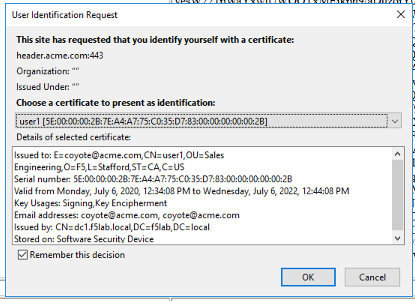

Lab 2: Visual Policy Editor (VPE) Overview
========================================================

Setup Lab Environment
-----------------------------------

To access your dedicated student lab environment, you will require a web browser and Remote Desktop Protocol (RDP) client software. The web browser will be used to access the Lab Training Portal. The RDP client will be used to connect to the Jump Host, where you will be able to access the BIG-IP management interfaces (HTTPS, SSH).

#. Click **DEPLOYMENT** located on the top left corner to display the environment

#. Click **ACCESS** next to jumpohost.f5lab.local

   |image001|

#. Select your RDP resolution.

#. The RDP client on your local host establishes a RDP connection to the Jump Host.

#. Login with the following credentials:

         - User: **f5lab\\user1**
         - Password: **user1**

#. After successful logon the Chrome browser will auto launch opening the site https://portal.f5lab.local.  This process usually takes 30 seconds after logon.

#. Click the **Classes** tab at the top of the page.

	|image002|

#. Scroll down the page until you see **101 Intro to Access Foundational Concepts** on the left

   |image003|

#. Hover over tile **Intro to Per-Session Policies**. A start and stop icon should appear within the tile.  Click the **Play** Button to start the automation to build the environment

   |image004|

#. The screen should refresh displaying the progress of the automation within 30 seconds.  Scroll to the bottom of the automation workflow to ensure all requests succeeded.  If you you experience errors try running the automation a second time or open an issue on the `Access Labs Repo <https://github.com/f5devcentral/access-labs>`__.

   |image005|

Section 1 - The Access Profile
--------------------------------

#. From a browser navigate to https://bigip1.f5lab.local

#. Login with username **admin** and password **admin**

    |image006|

#. Navigate to Access >> Profiles/Policies >> Access Profiles (Per-Session Policies).

    |image007|

#. The **Status** flag indicates if there are changed pending to the policy.  When the flag is yellow there are changes pending to the policy.  We will interact with **Pending Changes** later in the lab.

    |image008|

#. Click **server1-psp**

    |image009|

#. The **Properties** section provides baseline settings related to Scope, timers, and languages accross the all sessions that will use the policy regardless of how Visual Policy Editor is configured.

    |image010|

    +-------------------------+-------------------------+--------------------------------------------------------------------------------------------------------------------+
    | Setting                 | Value                   | Description and defaults                                                                                           |
    +=========================+=========================+====================================================================================================================+
    | Name                    | text                    | Specifies the name of the access profile.                                                                          |
    +-------------------------+-------------------------+--------------------------------------------------------------------------------------------------------------------+
    | Inactivity Timeout      | Number of seconds, or 0 | Specifies the inactivity timeout for the connection. If there is no activity between the client and server within  |
    |                         |                         | the specified threshold time, the system closes the current session. By default, the threshold is 0, which         |
    |                         |                         | specifies that as long as a connection is established, the inactivity timeout is inactive. However, if an          |
    |                         |                         | inactivity timeout value is set, when server traffic exceeds the specified threshold, the inactivity timeout is    |
    |                         |                         | reset.                                                                                                             |
    +-------------------------+-------------------------+--------------------------------------------------------------------------------------------------------------------+
    | Access Policy Timeout   | Number of seconds, or 0 | Designed to keep malicious users from creating a denial-of-service (DoS) attack on your server. The timeout        |
    |                         |                         | requires that a user, who has followed through on a redirect, must reach the webtop before the timeout expires.    |
    |                         |                         | The default value is 300 seconds.                                                                                  |
    +-------------------------+-------------------------+--------------------------------------------------------------------------------------------------------------------+
    | Maximum Session Timeout | Number of seconds, or 0 | The maximum lifetime is from the time a session is created, to when the session terminates. By default, it is set  |
    |                         |                         | to 0, which means no limit. When you configure a maximum session timeout setting other than 0, there is no way to  |
    |                         |                         | extend the session lifetime, and the user must log out and then log back in to the server when the session expires.|
    +-------------------------+-------------------------+--------------------------------------------------------------------------------------------------------------------+
    | Max Concurrent Users    | Number of users, or 0   | The number of sessions allowed at one time for this access profile. The default value is 0 which specifies         |
    |                         |                         | unlimited sessions.                                                                                                |
    +-------------------------+-------------------------+--------------------------------------------------------------------------------------------------------------------+
    | Max Sessions Per User   | Number between 1 and    | Specifies the number of sessions for one user that can be active concurrently. The default value is 0, which       |
    |                         | 1000, or 0              | specifies unlimited sessions. You can set a limit from 1-1000. Values higher than 1000 cause the access profile    |
    |                         |                         | to fail.                                                                                                           |
    +-------------------------+-------------------------+--------------------------------------------------------------------------------------------------------------------+
    | Max In Progress Sessions| Number 0 or greater     | Specifies the maximum number of sessions that can be in progress for a client IP address. When setting this value, |
    | Per Client IP           |                         | take into account whether users will come from a NAT-ed or proxied client address and, if so, consider increasing  |
    |                         |                         | the value accordingly. The default value is 0 which represents unlimited sessions.                                 |                                                                                                          
    +-------------------------+-------------------------+--------------------------------------------------------------------------------------------------------------------+
    | Restrict to Single      | Selected or cleared     | When selected, limits a session to a single IP address.                                                            |
    | Client IP               |                         |                                                                                                                    |
    +-------------------------+-------------------------+--------------------------------------------------------------------------------------------------------------------+
    | Logout URI Include      | One or more URIs        | Specifies a list of URIs to include in the access profile to initiate session logout.                              |
    |                         |                         |                                                                                                                    |
    +-------------------------+-------------------------+--------------------------------------------------------------------------------------------------------------------+
    | Logout URI Timeout      | Logout delay URI in     | Specifies the time delay before the logout occurs, using the logout URIs defined in the logout URI include list.   |
    |                         | seconds                 |                                                                                                                    |
    +-------------------------+-------------------------+--------------------------------------------------------------------------------------------------------------------+

#. Click **SSO/Auth Domains**

    |image011|

    +-------------------------+-------------------------+--------------------------------------------------------------------------------------------------------------------+
    | Setting                 | Value                   | Description and defaults                                                                                           |
    +=========================+=========================+====================================================================================================================+
    | Domain Mode             | Single Domain or        | Select Single Domain to apply your SSO configuration to a single domain. Select Multiple Domain to apply your SSO  |
    |                         | Multiple Domains        | configuration across multiple domains. This is useful in cases where you want to allow your users a single Access  |
    |                         |                         | Policy Manager® (APM®) login session and apply it across multiple Local Traffic Manager™ or APM virtual servers,   |
    |                         |                         | front-ending different domains.                                                                                    |
    +-------------------------+-------------------------+--------------------------------------------------------------------------------------------------------------------+
    | Domain Cookie           | A Domain Cookie         | If you specify a domain cookie, then the line domain=specified_domain is added to the MRHsession                   |
    |                         |                         | cookie.                                                                                                            |
    +-------------------------+-------------------------+--------------------------------------------------------------------------------------------------------------------+
    | Cookie Options:         | Enable or disable check | Enabled, this setting specifies to add the secure keyword to the session cookie. If you are configuring an         |
    | Secure                  | box                     | application access control scenario where you are using an HTTPS virtual server to authenticate the user, and then |
    |                         |                         | sending the user to an existing HTTP virtual server to use applications, clear this check box.                     |
    +-------------------------+-------------------------+--------------------------------------------------------------------------------------------------------------------+
    | Cookie Options:         | Enable or disable check | Enabled, this setting specifies to set cookies if the session does not have a webtop. When the session is first    |
    | Persistent              | box                     | established, session cookies are not marked as persistent, but when the first response is sent to the client after |
    |                         |                         | the access policy completes successfully, the cookies are marked persistent.                                       |
    +-------------------------+-------------------------+--------------------------------------------------------------------------------------------------------------------+
    | Cookie Options:         | Enable or disable check | HttpOnly is an additional flag included in a Set-Cookie HTTP response header. Use the HttpOnly flag when generating|
    | HTTP only               | box                     | a cookie to help mitigate the risk of a client-side script accessing the protected cookie, if the browser supports |
    |                         |                         | HttpOnly.                                                                                                          |
    +-------------------------+-------------------------+--------------------------------------------------------------------------------------------------------------------+
    | SSO Configuration       | Predefined SSO          | SSO configurations contain settings to configure single sign-on with an access profile. Select the SSO             |
    |                         | Configuration           | configuration from the list that you want applied to your domain.                                                  |
    |                         |                         |                                                                                                                    |
    +-------------------------+-------------------------+--------------------------------------------------------------------------------------------------------------------+

#. Click **Multiple Domains**.  Notice additional fields now appear on the screen.

    |image012|

    +-------------------------+-------------------------+--------------------------------------------------------------------------------------------------------------------+
    | Setting                 | Value                   | Description and defaults                                                                                           |
    +=========================+=========================+====================================================================================================================+
    | Primary Authentication  | URI                     | The URI of your primary authentication server, for example https://logon.siterequest.com. This is required if you  |
    | URI                     |                         | use SSO across multiple domains. You provide this URI so your users can access multiple back-end applications from |
    |                         |                         | multiple domains and hosts without requiring them to re-enter their credentials, because the user session is stored|
    |                         |                         | on the primary domain.                                                                                             |
    +-------------------------+-------------------------+--------------------------------------------------------------------------------------------------------------------+
    | Cookie                  | Domain or Host          | If you specify multiple domains, populate this area with hosts or domains. Each host or domain can have a separate |
    |                         |                         | SSO config, and you can set persistent or secure cookies. Click Add to add each host you configure.                |
    +-------------------------+-------------------------+--------------------------------------------------------------------------------------------------------------------+

#. Click **Access Policy**

    .. note::  Object builts outside visual policy editor, but used within the policy are displayed here.

#. Click **Edit Access Policy for Profile "server1-psp"** to open Visual Policy Editor(VPE) in a new tab.

    |image013|

Section 2 - Visual Policy Editor(VPE)
----------------------------------------

Visual Policy Editor is used for configuration of Access Policies in APM.  Using an access policy, you can define a sequence of checks to enforce the required level of security on a users system, before the user is granted access to servers, applications, and other resources on your network.

The policy below presents a user with a logon page to collect credentials.  Once the credentials are collected they are validated against Active Directory. If the credentials are valid the connection to the server is allowed, if they are invalid access is denied.

    |image014|

Let's explore the components that make up Visual Policy Editor workflows.

Task 2.1 - Branches
~~~~~~~~~~~~~~~~~~~~~~~~~~~~

A branch rule evaluates the result of an access policy action, findings about a client system, or other access policy item. The outcome of the evaluation of a branch rule grants or denies access, or continues on to the next action. The order of branch rules in an access policy determines the flow of action.

Some actions such as Logon Pages only have a single default branch, while other actions such as authentication will have a minimum of two branches.

When a creating a policy from scratch there will only be a single branch connecting the **Start** item to the **Deny** Terminal as depicted below.

#. Click on the **AD Auth** action to explore its configuration.

    |image015|

#.  Actions will have atleast two tabs.  One contains the settings for that action, while the second one contains the Branch Rules. Click **Branch Rules**.

    |image016|

#.  The AD Auth action has two branch rules. In order to proceed down the Succesful branch **Active Directory Auth has Passed** must be true.  If not the user will proceed down the fallback branch. Click **change** to take a deeper look at the Expression.

    |image017|

#. Expressions can be modified under the **Simple** or **Advanced** Tabs.  The Simple tab allows you create expression using boolean logic.  If something is added to the AND experssion both conditions must be true.  While if something is add the OR condition either condition must be true.  Click **Advanced**.

    |image018|

#.  The **Advanced** tab allows direct modifation of the expression using TCL.  You can now see that AD Auth action evaluates the session variable session.ad.last.authresult to determine if the value is a 1(true).
#.  Click **Cancel** because we do not want to modify anything in the AD Auth action.

    |image019|

Task 2.2 - Building Blocks
~~~~~~~~~~~~~~~~~~~~~~~~~~~~

APM includes a number of pre-defined actions. You can see the available actions in the visual policy editor when you click the Add Item button , which is activated by positioning the cursor along the actions rule branch. The Add Item popup screen opens as a floating popup screen on top of the visual policy editor.

#. Click the **+ (Plus Symbol)** on the Successful of the AD Auth Action.

    |image020|

    The Actions selection screen has a default set of six tabs.  Each tab contains a collection of prefined actions related to that tab.

#. The **Logon** tab contains various ways of collections user credentials.

    |image021|

#. Click the Authentication Tab.  It contains actions that either validate credentials or interact with directory servers in some way.

    |image022|

    |image023|

#.  Click the **Assigment** tab.  It determines the associatation between resources and users.  Secoondly this is where mechanisms such as ACLs orbandwidth controls are chosen.

    |image024|

#. Click the Endpoint Security (Server-side) tab.  These endpoint checks do not require anything to be installed on the client.

    |image025|

#. Click the Endpoint Security (Client-side) tab.  These endpoints checks require software to be installed on the client.  Either the Edge Client is using VPN or F5 Helper Agent if performing posture via a webbrowser.  It's important to know the initial installation requires administrative privildges on th client machine.  In this enviorment the software is already installed on the jumphost.

    |image026|

#. Click the **General Purpose** tab. We are now going to add a new action to the policy.
#. Click **Message Box**
#. Click **Add Item**

    |image027|

#. Enter the text **Learning APM** in the Title Section.
#. Click **Save**

    |image028|

#.  We have successfully added our first new action to this policy.  Now After the user credentials are successfully validated against Active Directory the user will see a message box with the text "Learning APM".
#.  Also notice a new set of text has appeared in the top left corner of the policy.  When you see **Apply Access Policy** in the left corner it means a policy has changes that have been saved but yet to be commited.  It is important to understand that changes made to a per-session policy do not impact existing sessions. we will leave it that way for now as we have more changes to make.

    |image029|

Task 2.3 - Macros
~~~~~~~~~~~~~~~~~~~

A macro is a collection of actions that you can configure to provide common access policy functions. You can create a macro for any action or series of actions in an access policy. You can also create macros that contain macrocalls to other macros (nested macros).
After you create a macro, you place it in the access policy by adding an item called a macrocall to your policy. A macrocall is an action that performs the functions defined in a macro. In the visual policy editor, a macrocall appears in an access policy, or in a macro definition, as a single rectangular item, surrounded by a double line, with one or more outgoing macro terminal branches, called terminals.

In this task we are going to create a Macro that detects the client operating system.  If the system is Windows it proceed to a Firewall check.  If the system is anything but Windows the client will proceed down the **Fail** branch.

    |image030|

#. Click **Add New Macro**.

    |image031|

#. Enter the name for the macro **Posture Assessments**
#. Click Save

    |image032|

#.  The empty Macro name now Appears under the policy and can be edited just like the main Per-session Policy.
#.  Expand the Macro by clicking the plus symbol

    |image033|

#.  By default a Macro only has a single terminal.  We know upfront that we intent to have a pass/fail condition so it is best create our additional terminal upfront.
#.  Click **Edit Terminals**

    |image034|

#. Click **Add Terminal**

    |image035|

#. Change the default terminal text to **Pass**. This is the terminal using the color green
#. Change the new terminal text to **Fail**.
#. Toggle the Terminal Endpoints order so the **Fail** Terminal is on the **bottom**.

    |image036|

#. Click **Set Default**
#. Change the default to **Fail**
#. Click **Save**

    |image037|

#. Click the **+(Plus Symbol)** inside of the Macro's fallback branch.

    |image038|

#. Click the **Endpoint Security (Server-Side)** tab
#. Select **Client OS**
#. Click **Add Item**

    |image039|

#. Click **Save**

    |image040|

#. We able to only allow Windows hosts to connect.  Click **Pass** on  the Windows RT branch.

    |image041|

#. Select **Fail**
#. Click **Save**

    |image042|

#. Click the **Fail** Terminal on the Windows branch.

    |image043|

#. Select **Pass**
#. Click **Save**

    |image044|

#. Click the **+(Plus Symbol)** inside of the Windows branch.

    |image045|

#. Click the **Endpoint Security (Client-side)** tab.
#. Select **Firewall**
#. Click **Add Item**

    |image046|

#. Leave the defaults.  Click **Save**

    |image047|

#. Now add your completed Macro to the Policy by clicking the **+(Plus Symbol)** between the the Start Item and Logon Page action.

    |image048|

#. A new tab has appeared now that a Macro has been configured.  Click the **Macros** tab
#. Select **Posture Assessments**
#. Click **Add Item**

    |image049|

Task 2.5: Endings
~~~~~~~~~~~~~~~~~~~

Endings allow an administrtor to customize APM's reponsse by introducing redirects rather than generic Allow or Deny action.   We will explore added a redirect to our policy to see it's behavior during testing.

#. Click **Edit Endings**

    |image050|

#. Click **Add Ending**

    |image051|

#. Select the **Redirect** radio button
#. Enter the URL **https://www.f5.com**
#. Update the color #16 Violet
#. Enter the Name **Redirect** for the Redirect Terminal
#. Click **Save**

    |image052|

#. Select the **Deny** Terminal off the AD Auth Action fallback branch

    |image053|

#. Select the **Redirect** Terminal
#. Click **Save**

    |image054|

#.  We now a have completed Policy.  Click **Apply Access Policy** in the top left.

    |image055|

Task 2.6 Testing
~~~~~~~~~~~~~~~~~~

#. Open a new browser tab and then navigate to https://server1.acme.com.  You will be redirected to /my.policy and the first thing that happens in our policy is the Windows and Firewall Check.  You can see these are being performed as the agent software is being triggered when the screen states **Awaiting Connection...** and then transitions to **Checking for security software**.

    |image056|

    |image057|

#. After posture assement has been successful performed the logon screen will appear.

    |image058|

#. we are going to first test if the redirect works by failing Active Directory Authentication.  Enter the username: test and password:test and attempt to logon.  Repeat this step two more times because the AD auth agent by default requires three failed logon attempts before sending the user down the fallback branch.

    |image059|

#.  One authentication has been failed 3 times you are directed to https://www.f5.com as expected.

    |image060|

#.  The session has been closed by the redirect Action.  Navigate back to https://server1.acme.com
#.  At the logon page enter the Username:**user1** and Password:**user1**
#.  Click **Logon**

    |image061|

#.  After successfull authentication you are presented the Message box with the text **learning APM**.  Click **Continue**.

    |image062|

#. User1 has successfully authenticated through the policy and now granted access to their resource.

    |image063|

Lab Cleanup
------------------------

#. From a browser on the jumphost navigate to https://portal.f5lab.local

#. Click the **Classes** tab at the top of the page.

    |image002|

#. Scroll down the page until you see **101 Intro to Access Foundational Concepts** on the left

   |image003|

#. Hover over tile **Into to Per-Session Policies**. A start and stop icon should appear within the tile.  Click the **Stop** Button to trigger the automation to remove any prebuilt objects from the environment

   |image998|

#. The screen should refresh displaying the progress of the automation within 30 seconds.  Scroll to the bottom of the automation workflow to ensure all requests succeeded.  If you you experience errors try running the automation a second time or open an issue on the `Access Labs Repo <https://github.com/f5devcentral/access-labs>`__.

   |image999|

#. This concludes the lab.

   |image000|

.. |image000| image:: ./media/lab02/000.png
.. |image001| image:: ./media/lab02/001.png
.. |image002| image:: ./media/lab02/002.png
.. |image003| image:: ./media/lab02/003.png
.. |image004| image:: ./media/lab02/004.png
.. |image005| image:: ./media/lab02/005.png
.. |image006| image:: ./media/lab02/006.png
.. |image007| image:: ./media/lab02/007.png
.. |image008| image:: ./media/lab02/008.png
.. |image009| image:: ./media/lab02/009.png
.. |image010| image:: ./media/lab02/010.png
.. |image011| image:: ./media/lab02/011.png
.. |image012| image:: ./media/lab02/012.png
.. |image013| image:: ./media/lab02/013.png
.. |image014| image:: ./media/lab02/014.png
.. |image015| image:: ./media/lab02/015.png
.. |image016| image:: ./media/lab02/016.png
.. |image017| image:: ./media/lab02/017.png
.. |image018| image:: ./media/lab02/018.png
.. |image019| image:: ./media/lab02/019.png
.. |image020| image:: ./media/lab02/020.png
.. |image021| image:: ./media/lab02/021.png
.. |image022| image:: ./media/lab02/022.png
.. |image023| image:: ./media/lab02/023.png
.. |image024| image:: ./media/lab02/024.png
.. |image025| image:: ./media/lab02/025.png
.. |image026| image:: ./media/lab02/026.png
.. |image027| image:: ./media/lab02/027.png
.. |image028| image:: ./media/lab02/028.png
.. |image029| image:: ./media/lab02/029.png
.. |image030| image:: ./media/lab02/030.png
.. |image031| image:: ./media/lab02/031.png
.. |image032| image:: ./media/lab02/032.png

.. |image035| image:: ./media/lab02/035.png
.. |image036| image:: ./media/lab02/036.png
.. |image037| image:: ./media/lab02/037.png
.. |image038| image:: ./media/lab02/038.png
.. |image039| image:: ./media/lab02/039.png
.. |image040| image:: ./media/lab02/040.png
.. |image041| image:: ./media/lab02/041.png
.. |image042| image:: ./media/lab02/042.png
.. |image043| image:: ./media/lab02/043.png
.. |image044| image:: ./media/lab02/044.png
.. |image045| image:: ./media/lab02/045.png
.. |image046| image:: ./media/lab02/046.png
.. |image047| image:: ./media/lab02/047.png
.. |image048| image:: ./media/lab02/048.png
.. |image049| image:: ./media/lab02/049.png
.. |image050| image:: ./media/lab02/050.png
.. |image051| image:: ./media/lab02/051.png
.. |image052| image:: ./media/lab02/052.png
.. |image053| image:: ./media/lab02/053.png
.. |image054| image:: ./media/lab02/054.png
.. |image055| image:: ./media/lab02/055.png
.. |image056| image:: ./media/lab02/056.png
.. |image057| image:: ./media/lab02/057.png
.. |image058| image:: ./media/lab02/058.png
.. |image059| image:: ./media/lab02/059.png
.. |image060| image:: ./media/lab02/060.png
.. |image061| image:: ./media/lab02/061.png
.. |image062| image:: ./media/lab02/062.png
.. |image063| image:: ./media/lab02/063.png
.. |image998| image:: ./media/lab02/998.png
.. |image999| image:: ./media/lab02/999.png
