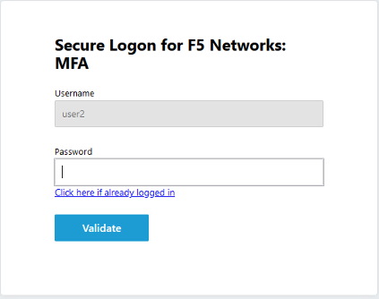
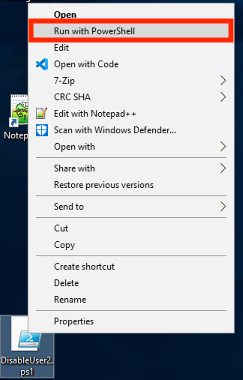

Lab 3: Intro to Per-Request Policies
=====================================

Section 1 - Setup Lab Environment
-----------------------------------

To access your dedicated student lab environment, you will require a web browser and Remote Desktop Protocol (RDP) client software. The web browser will be used to access the Lab Training Portal. The RDP client will be used to connect to the Jump Host, where you will be able to access the BIG-IP management interfaces (HTTPS, SSH).

#. Click **DEPLOYMENT** located on the top left corner to display the environment

#. Click **ACCESS** next to jumpohost.f5lab.local

   |image001|

#. Select your RDP resolution.

#. The RDP client on your local host establishes a RDP connection to the Jump Host.

#. Login with the following credentials:

         - User: **f5lab\\user1**
         - Password: **user1**

#. After successful logon the Chrome browser will auto launch opening the site https://portal.f5lab.local.  This process usually takes 30 seconds after logon.

#. Click the **Classes** tab at the top of the page.

	|image002|

#. Scroll down the page until you see **101 Intro to Access Foundational Concepts** on the left

   |image003|

#. Hover over tile **Intro to Per-Request Policies**. A start and stop icon should appear within the tile.  Click the **Play** Button to start the automation to build the environment

   +---------------+-------------+
   | |image004|    | |image005|  |
   +---------------+-------------+

#. The screen should refresh displaying the progress of the automation within 30 seconds.  Scroll to the bottom of the automation workflow to ensure all requests succeeded.  If you experience errors try running the automation a second time or open an issue on the `Access Labs Repo <https://github.com/f5devcentral/access-labs>`__.

   |image006|

Section 2 - Step-up Authentication
----------------------------------------------------

Task 1 - Test the existing Configuration
~~~~~~~~~~~~~~~~~~~~~~~~~~~~~~~~~~~~~~~~~~~~~

#. From the jumpbox, navigate to  https://app.acme.com.  You will be redirected to the SAML IdP and be presented a logon page.

#. Logon with the credentials username: **coyote@acme.com** password: **user1**

    |image009|

#. After a successful logon at the IdP you are redirected to back to https://app.acme.com and presented a portal page. 
#. Click the **Admin View** button.

    |image010|

#. You are succesfully logged into admin view without asking for any further credentials.  We want to add additional security to the admin view by requiring MFA at the IdP for this portion of the website.

    |image011|

Task 2 - Create a Step-up Authentication Per-Request Policy
~~~~~~~~~~~~~~~~~~~~~~~~~~~~~~~~~~~~~~~~~~~~~~~~~~~~~~~~~~~

#. From a browser navigate to https://bigip1.f5lab.local

#. Login with username **admin** and password **admin**

    |image012|

#. Navigate to Access >> Profiles/Policies >> Per-Request Policies >> click the **Plus Sign(+)**.

    |image013|

#. Enter the Name **app-prp**
#. Toggle **English (en)** to the list of Accepted Languages
#. Click **Finished**

    |image014|

#.  Click **Edit**

    |image015|

#. Click **Add New Subroutine**

    |image016|

#. Enter the Name **SAML Auth**
#. Click **Save** 

    |image017|

#. Click **Edit Terminals**

    |image018|

#. Click **Add Terminal**

    |image019|

#. Enter the Name **Fail** on the line with a red #2
#. Enter the Name **Pass** on the line with a green #1 
#. Click the **up arrow** on the pass line to move it above the Fail Terminal

    |image020|

#. Click the **Set Default** tab

    |image021|

#. Select **Fail** as the default
#. Click **Save**

    |image022|

#. Click the **Plus Symbol (+)** between In and Pass
    
    |image023|

#. Click thee **Authentication** tab

#. Select **SAML Auth**

#. Click **Add Item**

    |image024|

#. From the AAA Server dropdown select **/Common/app.acme.com-1-sp-serv**
#. Click **Save**

    |image025|

#. Click the **Plus Symbol (+)** between Start and Allow

    |image026|

#. Click the **Classification** tab
#. Select **URL Branching**
#. Click **Add Item**

    |image027|

#. Click the **Branch Rules** tab
#. Enter the Name **MFA**
#. Click **change**

    |image028|

#. For URL Contains enter **https://app.acme.com/admin/** 
#. Click **Finished**

    |image029|

#. Click **Save**

    |image030|

#. Click the **Plus Symbol (+)** on the MFA branch between URL branching and Allow

    |image031|

#. Click the **Subrooutines** tab
#. Select **SAML Auth**
#. Click **Add Item**

    |image032|

#. Click the **Reject** Terminal located at the end of the URL Branching fallback branch

    |image033|

#. Select **Allow**
#. Click **Save**

    |image034|

#. The policy should now look like the one below

    |image035|

Task 3 - Attach the Per-Request Policy 
~~~~~~~~~~~~~~~~~~~~~~~~~~~~~~~~~~~~~~~

#. Navigate to Local Traffic >> Virtual Servers >> Virtual Server List. Not the Plus Symbol (+)   

    |image036|

#. Click **app-https**

    |image037|

#. Scroll to the Access Policy section of the virtual server
#. From the Per-Request Policy dropdown select **app-prp**
#. Click **Update**

    |image038|

Task 4 - Test Step-Up Authentication
~~~~~~~~~~~~~~~~~~~~~~~~~~~~~~~~~~~~~

#. From the jumpbox, navigate to  https://app.acme.com.  You will be redirected to the SAML IdP and be presented a logon page.

#. Logon with the credentials username: **coyote@acme.com** password: **user1**

    |image009|

#. After a successful logon at the IdP you are redirected to back to https://app.acme.com and presented a portal page. 
#. Click the **Admin View** button.

    |image010|

#. The page is now requires a new SAML assertion with a higher level authentication context class.  The user is now prompted for certificte authentication.  Selet the **user1** certifcate

    |image039|

#.  After successfully providing a certificate you kow have access to the admin page.

    |image011|

Section 3 -  Header Injection
-------------------------------

Task 1 - Add Header Injection to an existing Per-Request Policy
~~~~~~~~~~~~~~~~~~~~~~~~~~~~~~~~~~~~~~~~~~~~~~~~~~~~~~~~~~~~~~~~

#. BIG-IP APM often has access to information that the application may not have access to natively.  Through the power of the per-request policy we can inject additional headers into each request .  Let's explore adding an additional header after the SAML auth subroutine.
#. From a browser navigate to https://bigip1.f5lab.local

#. Login with username **admin** and password **admin**

    |image012|

#. Navigate to Access >> Profiles/Policies >> Per-Request Policies.

    |image045|

#.  Click **Edit** to the right of add-prp

    |image015|

#. Click the **Plus Symbol (+)** on the Pass branch between SAML Auth and Allow Terminal

    |image041|

#. Click the **General Purpose** tab.
#. Select **HTTP Headers**
#. Click **Add Item**

    |image042|   

#. Click **Add new entry**
#. Enter the Header Name **email**
#. Enter the Header Value **%{session.saml.last.nameIDValue}**
#. Click **Save**

    |image043|

#. The Per-Request Policy should now look like below
    
    |image044|

Task 2 - Test Header Injection
~~~~~~~~~~~~~~~~~~~~~~~~~~~~~~~~

#. From the jumpbox, navigate to  https://app.acme.com.  You will be redirected to the SAML IdP and be presented a logon page.

#. Logon with the credentials username: **coyote@acme.com** password: **user1**

    |image009|

#. After a successful logon at the IdP you are redirected to back to https://app.acme.com and presented a portal page. 
#. Click the **Admin View** button.

    |image010|

#. Selet the **user1** certifcate

    |image039|

#.  The admin page succesfully parsed the new email header and displays it on the screen

    |image040|

Section 4 - Lab Cleanup
------------------------

#. From a browser on the jumphost navigate to https://portal.f5lab.local

#. Click the **Classes** tab at the top of the page.

    |image002|

#. Scroll down the page until you see **101 Intro to Access Foundational Concepts** on the left

   |image003|

#. Hover over tile **Visual Policy Editor (VPE) Overview**. A start and stop icon should appear within the tile.  Click the **Stop** Button to trigger the automation to remove any prebuilt objects from the environment

    +---------------+-------------+
    | |image004|    | |image007|  |
    +---------------+-------------+

#. The screen should refresh displaying the progress of the automation within 30 seconds.  Scroll to the bottom of the automation workflow to ensure all requests succeeded.  If you experience errors try running the automation a second time or open an issue on the `Access Labs Repo <https://github.com/f5devcentral/access-labs>`__.

   |image008|

#. This concludes the lab.

   |image000|

.. |image000| image:: ./media/lab03/000.png
.. |image001| image:: ./media/lab03/001.png
.. |image002| image:: ./media/lab03/002.png
.. |image003| image:: ./media/lab03/003.png
.. |image004| image:: ./media/lab03/004.png
.. |image005| image:: ./media/lab03/005.png
.. |image006| image:: ./media/lab03/006.png
.. |image007| image:: ./media/lab03/007.png
.. |image008| image:: ./media/lab03/008.png
.. |image009| image:: ./media/lab03/009.png
.. |image010| image:: ./media/lab03/010.png
.. |image011| image:: ./media/lab03/011.png
.. |image012| image:: ./media/lab03/012.png
.. |image013| image:: ./media/lab03/013.png
.. |image014| image:: ./media/lab03/014.png
.. |image015| image:: ./media/lab03/015.png
.. |image016| image:: ./media/lab03/016.png
.. |image017| image:: ./media/lab03/017.png
.. |image018| image:: ./media/lab03/018.png
.. |image019| image:: ./media/lab03/019.png
.. |image020| image:: ./media/lab03/020.png
.. |image021| image:: ./media/lab03/021.png
.. |image022| image:: ./media/lab03/022.png
.. |image023| image:: ./media/lab03/023.png
.. |image024| image:: ./media/lab03/024.png
.. |image025| image:: ./media/lab03/025.png

.. |image027| image:: ./media/lab03/027.png
.. |image028| image:: ./media/lab03/028.png
.. |image029| image:: ./media/lab03/029.png
.. |image030| image:: ./media/lab03/030.png
.. |image031| image:: ./media/lab03/031.png
.. |image032| image:: ./media/lab03/032.png
.. |image033| image:: ./media/lab03/033.png
.. |image034| image:: ./media/lab03/034.png

.. |image036| image:: ./media/lab03/036.png
.. |image037| image:: ./media/lab03/037.png
.. |image038| image:: ./media/lab03/038.png
.. |image039| image:: ./media/lab03/039.png
.. |image040| image:: ./media/lab03/040.png
.. |image041| image:: ./media/lab03/041.png
.. |image042| image:: ./media/lab03/042.png
.. |image043| image:: ./media/lab03/043.png
.. |image044| image:: ./media/lab03/044.png
.. |image045| image:: ./media/lab03/045.png

