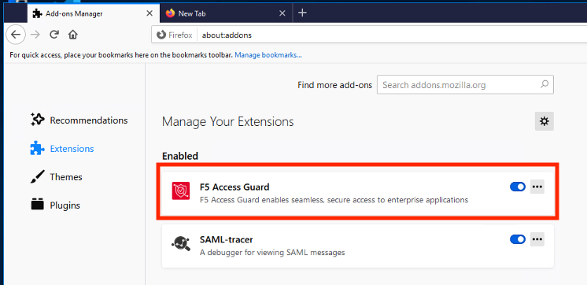
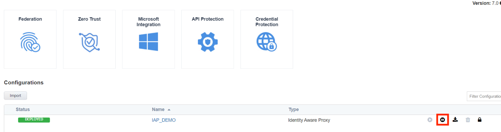

Lab 4: Access Logs Overview
=============================
Access Policy Manager (APM) provides a default-log-setting. When you create an access profile, the default-log-setting is automatically assigned to it. The default-log-setting can be retained, removed, or replaced for the access profile. The default-log-setting is applied to user sessions only when it is assigned to an access profile.

Regardless of whether it is assigned to an access profile, the default-log-setting applies to APM processes that run outside of a user session. Specifically, on a BIG-IP system with an SWG subscription, the default-log-setting applies to URL database updates

Task 1 - Setup Lab Environment
-----------------------------------

To access your dedicated student lab environment, you will need a web browser and Remote Desktop Protocol (RDP) client software. The web browser will be used to access the Unified Demo Framework (UDF) Training Portal. The RDP client will be used to connect to the jumphost, where you will be able to access the BIG-IP management interfaces (HTTPS, SSH).

#. Click **DEPLOYMENT** located on the top left corner to display the environment

#. Click **ACCESS** next to jumphost.f5lab.local

   |image001|

#. Select your RDP resolution.

#. The RDP client on your local host establishes a RDP connection to the Jump Host.

#. Login with the following credentials:

         - User: **f5lab\\user1**
         - Password: **user1**

#. After successful logon the Chrome browser will auto launch opening the site https://portal.f5lab.local.  This process usually takes 30 seconds after logon.

#. Click the **Classes** tab at the top of the page.

	|image002|

#. Scroll down the page until you see **101 Intro to Access Foundational Concepts** on the left

   |image003|

#. Hover over tile **Access Logs Overview**. A start and stop icon should appear within the tile.  Click the **Play** Button to start the automation to build the environment

   |image004|

#. The screen should refresh displaying the progress of the automation within 30 seconds.  Scroll to the bottom of the automation workflow to ensure all requests succeeded.  If you you experience errors try running the automation a second time or open an issue on the `Access Labs Repo <https://github.com/f5devcentral/access-labs>`__.

   |image005|

Task 2 -  Active Sessions
---------------------------------------

#. Open a new tab in browser and then navigate to https://server1.acme.com.  You will be redirected to /my.policy and be presented a logon page.

    |image006|

#. At the logon page enter the Username:**user1** and Password:**user1**
#. Click **Logon**

    |image007|

#.  You will be be presented the following website if the logon was successful.

    |image008|

#. Now that you have fully authenticated session open another tab and navigate to https://bigip1.f5lab.local

    |image009|

#. Login with username **admin** and password **admin**

    |image010|

#. Navigate to Access >> Overview >> Active Sessions.

    |image011|

#. This **Active Sessions** page provides instance feedback on which users have successfully authenticated to APM along with their associated session information.

    |image012|

#.  The Auto Refresh timer is disabled by default.  Various timers settings can be applied to auto update the Active session page.  Select 10 seconds is selected it will immediately begin counting down.  Alternatively, the Refresh button and be clicked to immediately update the table.

    |image013|

#. Active Session Count displays the number of completed and inactive sessions.  Notice the session count is currently **1**.

    |image014|

#. Open a new **incognito** browser tab and navigate to https://server1.acme.com.  Do this will create a new session. Once presented a logon page, **DO NOT** logon and simply close the incognito browser window.

    |image015|

#. Return to the BIG-IP active session screen. If auto refresh is still enabled the next time it refreshes a new session will appear.  **Stop** the auto refresh.

#. Notice the Active Session Count is now **2**

#. Notice the Status of the new session is a blue square rather than a green circle.  A green circle means the entire access policy has been completed from beginning to end.  A blue circle means the session is not complete and is still in process.

    |image016|

#. **Check** the empty square next to the new session with a blue square.

#.  Click **Kill Selected Session**

    |image017|

#. A second screen will appear asking you to confirm you want to delete the session.  Click **Delete**

    |image018|

#. Only **1** Active Session should appear on the screen.

    |image019|

#.  Clicking the **+ (plus symbol)** next to the session ID expands the session to display an subsessions associated with the primary session.  Subsessions are created when using a Per-Request Policy that contains a subroutine.  Subesssions have their own variables, settings, and timers separate from the primary session.

    |image020|

#.  The **Session ID** is a unique hex value for tracking a user throughout the life of their connection.  The sessionID is derived from the last 8 digits of the MRHSession cookie passed to the client.  If you click the session ID it will open a session report.  Session reports will be covered in Task 3

    |image021|

#. Click **Variables** to open a new window that displays all the session variables currently associated with the session. A session variable contains a number or string that represents a specific piece of information. This information is organized in a hierarchical arrangement and is stored as the user's session data.

    |image022|

#. Each variable contains a piece of information that APM gathered during the life of the session.  This information can come from various sources such as traffic flow, device Information or user Information.  Variables can be created, modified, or deleted throughout the life of a session.  Once a variable is defined it can used as condition for access control decisions. Click **Cancel** to return to the Active Session Screen.

    |image023|

    |image024|

#. The Username displayed references the username stored in the session variable session.logon.last.username.

    |image025|

#. The client IP displayed references the IP Address stored in the session variable session.user.clientip

    |image026|

#. The Virtual Server displayed references the initial virtual server the policy was evaluated on for that session.

    |image027|

#. The Start Time for a session is when the initial request was made and the session ID assigned.

    |image028|

#. The expiration time's initial value is be based on the **Inactivity Timeout** defined on the Access Profile.  The default is 15 minutes and can be modified.  The Inactivity Timeout setting controls how long (in seconds) a client can keep a live session without sending traffic.

    |image029|

#. Session Type the type of resources assigned in the session

    - n/a: Session completion still pending
    - network_access: A webtop with a network access resource (VPN)
    - web_application: A virtual server with APM profile and a rewrite profile (APM doing L7 reverse proxy)
    - full: A webtop, that can have multiple type of resources: Web Resources, Reverse Proxy, VDI Resources, SSH Resources, and  network access resource (VPN)
    - ltm_apm: A virtual server with an APM profile.  No rewrite profile or webtop attached.

    |image030|

#. Profile Name shows the Access profile used in the evaluation of the session.

    |image031|

Task 3 - Access Reports
--------------------------------------

Access Reports allow an administrator to quickly locate current and historical session information.

#. Navigate to Access >> Overview >> Access Reports.

    |image032|

#. When running a report you can specify the timeframe and then click **Run Report**

    |image033|

#. All current and historical sessions are displayed.  You can see **user1** currently has an Active Session.

    |image034|

#. Click on user1's session ID to open a session details report.

    |image035|

#.  A session details report displays every step of policy evaluation from the start item to the End Terminal. You can see in line 3 that username **user1** was collected. Then in line 4 the username and password were authenticated against Active Directory and down the **Allow** End branch.  This makes troubleshooting access control decisions easy because every step is logged and it can be easily seen where the failure is and potential reasons why it happened.

    |image036|

Task 4 - Log Settings
--------------------------------------------------

In Task 2, you learned how to view access reports.  In this Task you will learn how to modify the existing logging profile.  This is sometimes necessary when more detailed logging information is needed due to Organizational requirements or when troubleshooting an issue.

#. Navigate to Access >> Overview >> Event Logs >> Settings.

    |image037|

#. On the screen you see single logging profile names **default-log-setting**.  All Access Policies created will always be associated with this Logging profile.  It's important to understand that if you have multiple policies all sharing the same logging profile that when changes are made it impacts all the profiles associated with it.  In many cases it is best practice to create a new logging profile when settings are going to be modified from the defaults and associated with the Access Profile that requires a different in logging capabilities.
#. Click the **checkmark box** next to default-log-settings
#. Click **Edit**

    |image038|

#. The **General Information** has two options for enabling or disabling Access System logging and URL Request Logs.

    |image039|

#. Click **Access System Logs**
#. Select **Debug** from the Access Policy Dropdown

    .. note::  The Publisher defines where log messages are sent.  By default they are logged local to /var/log/apm.   To learn more about Log publishers and how to configure external logging read Tech Article on `High-Speed Logging <https://techdocs.f5.com/en-us/bip-upd-16-0-0-u2/external-monitoring-of-big-ip-systems-implementations/configuring-remote-high-speed-logging.html>`_

    |image040|

#. Click **URL Request Logs**.  This section determines what type of events you want to log in SWG deployments

    |image041|

#. Click **Access Profiles**.  This section allows you to select which Access Profiles will use this logging profile.

    |image042|

#. Click **SSO Objects**.  This section allows you to select which SSLO Objects Profiles will use this logging profile.
#. Click **OK**

    |image043|

#. Navigate to Access >> Overview >> Active Sessions.  Kill any existing sessions.

    |image011|

#. Open a new tab in browser and then navigate to https://server1.acme.com.  You will be redirected to /my.policy and be presented a logon page.

    |image006|

#. At the logon page enter the following credentials:

    - Username:**user1**
    - Password:**user1**

#. Click **Logon**

    |image007|

#.  You will be presented the following website if the logon was successful.

    |image008|

#. Return to the BIG-IP GUI and navigate to Access >> Overview >> Active Sessions.

    |image011|

#. Click the **session ID** to open its Session Report

    |image044|

#. Notice a more detailed session report is provided beyond the six lines displayed with only **Notice** logging enabled.

    |image045|

.. note:: to learn more about logging levels see https://support.f5.com/csp/article/K24826763

Task 5 - Lab Cleanup
------------------------

#. From a browser on the jumphost navigate to https://portal.f5lab.local

#. Click the **Classes** tab at the top of the page.

    |image002|

#. Scroll down the page until you see **101 Intro to Access Foundational Concepts** on the left

   |image003|

#. Hover over tile **Access Logs Overview**. A start and stop icon should appear within the tile.  Click the **Stop** Button to trigger the automation to remove any prebuilt objects from the environment

   |image998|

#. The screen should refresh displaying the progress of the automation within 30 seconds.  Scroll to the bottom of the automation workflow to ensure all requests succeeded.  If you experience errors try running the automation a second time or open an issue on the `Access Labs Repo <https://github.com/f5devcentral/access-labs>`__.

   |image999|

#. This concludes the lab.

   |image000|

.. |image000| image:: ./media/lab04/000.png
.. |image001| image:: ./media/lab04/001.png
.. |image002| image:: ./media/lab04/002.png
.. |image003| image:: ./media/lab04/003.png
.. |image004| image:: ./media/lab04/004.png
.. |image005| image:: ./media/lab04/005.png
.. |image006| image:: ./media/lab04/006.png
.. |image007| image:: ./media/lab04/007.png
.. |image008| image:: ./media/lab04/008.png
.. |image009| image:: ./media/lab04/009.png

.. |image011| image:: ./media/lab04/011.png

.. |image013| image:: ./media/lab04/013.png
.. |image014| image:: ./media/lab04/014.png
.. |image015| image:: ./media/lab04/015.png
.. |image016| image:: ./media/lab04/016.png
.. |image017| image:: ./media/lab04/017.png
.. |image018| image:: ./media/lab04/018.png
.. |image019| image:: ./media/lab04/019.png
.. |image020| image:: ./media/lab04/020.png
.. |image021| image:: ./media/lab04/021.png
.. |image022| image:: ./media/lab04/022.png
.. |image023| image:: ./media/lab04/023.png
.. |image024| image:: ./media/lab04/024.png
.. |image025| image:: ./media/lab04/025.png
.. |image026| image:: ./media/lab04/026.png
.. |image027| image:: ./media/lab04/027.png
.. |image028| image:: ./media/lab04/028.png
.. |image029| image:: ./media/lab04/029.png
.. |image030| image:: ./media/lab04/030.png
.. |image031| image:: ./media/lab04/031.png
.. |image032| image:: ./media/lab04/032.png
.. |image033| image:: ./media/lab04/033.png
.. |image034| image:: ./media/lab04/034.png
.. |image035| image:: ./media/lab04/035.png
.. |image036| image:: ./media/lab04/036.png
.. |image037| image:: ./media/lab04/037.png
.. |image038| image:: ./media/lab04/038.png
.. |image039| image:: ./media/lab04/039.png
.. |image040| image:: ./media/lab04/040.png
.. |image041| image:: ./media/lab04/041.png
.. |image042| image:: ./media/lab04/042.png
.. |image043| image:: ./media/lab04/043.png
.. |image044| image:: ./media/lab04/044.png
.. |image045| image:: ./media/lab04/045.png
.. |image998| image:: ./media/lab04/998.png
.. |image999| image:: ./media/lab04/999.png
