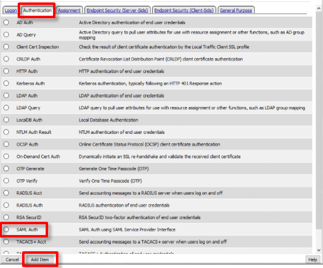

Lab 1 - SAML Service Provider (SP) Lab
======================================

.. toctree::
   :maxdepth: 1
   :glob:

The purpose of this lab is to configure and test a SAML Service
Provider. Students will configure the various aspects of a SAML Service
Provider, import and bind to a SAML Identity Provider and test
SP‑Initiated SAML Federation.

Objective:

-  Gain an understanding of SAML Service Provider(SP) configurations and
   its component parts

-  Gain an understanding of the access flow for SP-Initiated SAML

Lab Requirements:

-  All Lab requirements will be noted in the tasks that follow

Estimated completion time: 25 minutes

TASK 1 ‑ Configure the SAML Service Provider (SP)
~~~~~~~~~~~~~~~~~~~~~~~~~~~~~~~~~~~~~~~~~~~~~~~~~~

SP Service
----------

1.	Begin by selecting: **Access -> Federation -> SAML Service Provider -> Local SP Services**
2.	Click the **Create** button (far right)

|image1|

3. In the **Create New SAML SP Service** dialog box click **General Settings** in the left navigation pane and key in the following as shown:

+------------+--------------------------+
| Name:      | *app.f5demo.com*         |
+------------+--------------------------+
| Entity ID: | *https://app.f5demo.com* |
+------------+--------------------------+

4. Click **OK** on the dialogue box

|image2|

.. NOTE:: The yellow box on Host will disappear when the Entity ID is entered.

IdP Connector
-------------

1. Click on **Access ‑> Federation ‑> SAML Service Provider ‑> External IdP Connectors** *or* click on the **SAML Service Provider** tab in the horizontal navigation menu and select **External IdP Connectors**
2. Click specifically on the **Down Arrow** next to the **Create** button (far right)
3. Select **From Metadata** from the drop down menu

|image3|

4. In the **Create New SAML IdP Connector** dialogue box, click **Browse** and select the **idp.partner.com‑app_metadata.xml** file from the Desktop of your jump host.
5. In the **Identity Provider Name** field enter *idp.partner.com*:
6. Click **OK** on the dialog box

|image4|

.. NOTE:: The idp.partner.com-app_metadata.xml was created previously.
  Oftentimes, IdP providers will have a metadata file representing their IdP
  service.  This can be imported to save object creation time as it has been
  done in this lab

7. Click on the **Local SP Services** from the **SAML Service Providers** tab in the horizontal navigation menu
8. Click the **checkbox** next to the previously created *app.f5demo.com* and click **Bind/Unbind IdP Connectors** at the bottom of the GUI

|image5|

9. In the **Edit SAML IdP's that use this SP** dialogue box, click the **Add New Row** button
10. In the added row, click the **Down Arrow** under **SAML IdP Connectors** and select the */Common/idp.partner/com* SAML IdP Connector previously created
11. Click the **Update** button and the **OK** button at the bottom of the dialog box

|image6|

12. Under the **Access ‑> Federation ‑> SAML Service Provider ‑> Local SP Services** menu you should now see the following (as shown):

+----------------------+-------------------+
| Name:                | *app.f5demo.com*  |
+----------------------+-------------------+
| SAML IdP Connectors: | *idp.partner.com* |
+----------------------+-------------------+

|image7|

TASK 2 ‑ Configure the SAML SP Access Policy
~~~~~~~~~~~~~~~~~~~~~~~~~~~~~~~~~~~~~~~~~~~~

1. Begin by selecting **Access ‑> Profiles/Policies ‑> Access Profiles (Per‑Session Policies)**
2. Click the **Create** button (far right)

|image8|

----

3. In the **New Profile** window, key in the following:

+----------------+-------------------------+
| Name:          | *app.f5demo.com‑policy* |
+----------------+-------------------------+
| Profile Type:  | *All* (from drop down)  |
+----------------+-------------------------+
| Profile Scope: | *Profile* (default)     |
+----------------+-------------------------+

4. Scroll to the bottom of the **New Profile** window to the **Language Settings**
5. Select *English* from the **Factory Built‑in Languages** on the right, and click the **Double Arrow (<<)**, then click the **Finished** button.

|image9|

|br|

|image10|

6. From the **Access ‑> Profiles/Policies ‑> Access Profiles (Per‑Session Policies)** screen, click the **Edit** link on the previously created *app.f5demo.com‑policy* line

|image11|

7. In the Visual Policy Editor window for */Common/app.f5demo.com‑policy*, click the **Plus (+) Sign** between **Start** and **Deny**

|image12|

8. In the pop‑up dialog box, select the **Authentication** tab and then click the **Radio Button** next to **SAML Auth**
9. Once selected, click the **Add Item** button

|image13|

10. In the **SAML Auth** configuration window, select */Common/app.f5demo.com* from the **AAA Server** drop down menu
11. Click the **Save** button at the bottom of the window

|image14|

12. In the **Visual Policy Editor** window for */Common/app.f5demo.com‑policy*, click the **Plus (+) Sign** on the **Successful** branch following **SAML Auth**

|image15|

13. In the pop-up dialog box, select the **Assignment** tab, and then click the **Radio Button** next to **Variable Assign**
14. Once selected, click the **Add Item** buton

|image16|

15. In the **Variable Assign** configuration window, click the **Add New Entry** button
16. Under the new **Assignment** row, click the **Change** link
17. In the pop‑up window, configure the following:

+-------------------+--------------------------------------------+
| Left Pane                                                      |
+===================+============================================+
| Variable Type:    | *Custom Variable*                          |
+-------------------+--------------------------------------------+
| Security:         | *Unsecure*                                 |
+-------------------+--------------------------------------------+
| Value:            | *session.logon.last.username*              |
+-------------------+--------------------------------------------+

+-------------------+--------------------------------------------+
| Right Pane                                                     |
+===================+============================================+
| Variable Type:    | *Session Variable*                         |
+-------------------+--------------------------------------------+
| Session Variable: | *session.saml.last.attr.name.emailaddress* |
+-------------------+--------------------------------------------+

18. Click the **Finished** button at the bottom of the configuration window
19. Click the **Save** button at the bottom of the **Variable Assign** dialog window

|image17|

20. In the **Visual Policy Editor** select the **Deny** ending along the **fallback** branch following the **Variable Assign**

|image18|

21. From the **Select Ending** dialog box, select the **Allow** button and then click **Save**

|image19|

22. In the **Visual Policy Editor** click **Apply Access Policy** (top left) and close the **Visual Policy Editor**

|image20|

TASK 3 ‑ Create the SP Virtual Server & Apply the SP Access Policy
~~~~~~~~~~~~~~~~~~~~~~~~~~~~~~~~~~~~~~~~~~~~~~~~~~~~~~~~~~~~~~~~~~

1. Begin by selecting **Local Traffic -> Virtual Servers**
2. Click the **Create** button (far right)

|image21|

3. In the **New Virtual Server** window, key in the following as shown:

+---------------------------+----------------------------+
| General Properties                                     |
+===========================+============================+
| Name:                     | *app.f5demo.com*           |
+---------------------------+----------------------------+
| Destination Address/Mask: | *10.1.10.100*              |
+---------------------------+----------------------------+
| Service Port:             | *443*                      |
+---------------------------+----------------------------+

+---------------------------+----------------------------+
| Configuration                                          |
+===========================+============================+
| HTTP Profile:             | *http* (drop down)         |
+---------------------------+----------------------------+
| SSL Profile (Client)      | *app.f5demo.com‑clientssl* |
+---------------------------+----------------------------+

+-----------------+-------------------------+
| Access Policy                             |
+=================+=========================+
| Access Profile: | *app.f5demo.com‑policy* |
+-----------------+-------------------------+

+---------+---------------------+
| Resources                     |
+=========+=====================+
| iRules: | *application‑irule* |
+---------+---------------------+

4. Scroll to the bottom of the configuration window and click **Finished**

|image22|

|br|

|image23|

|br|

|image24|

.. NOTE:: The iRule is being added in order to simulate an application server to validate successful access.

TASK 4 ‑ Test the SAML SP
~~~~~~~~~~~~~~~~~~~~~~~~~

1. Using your browser from the jump host, navigate to the SAML SP you just configured at *https://app.f5demo.com* (or click the provided bookmark)

|image25|

2. Did you successfuly redirect to the IdP?
3. Log in to the IdP. Were you successfully authenticated?

.. NOTE:: Use the credentials provided in the Authentication section at the beginning of this guide (user/Agility1)

4. After successful authentication, were you returned to the SAML SP?
5. Were you successfully authenticated to the app in the SAML SP?
6. Review your Active Sessions **(Access ‑> Overview ‑> Active Sessions­­­)**
7. Review your Access Report Logs **(Access ‑> Overview ‑> Access Reports)**

.. |br| raw:: html

    

.. |image1| image:: media/image3.png
.. |image2| image:: media/image4.png
.. |image3| image:: media/image5.png
.. |image4| image:: media/image6.png
.. |image5| image:: media/image7.png
.. |image6| image:: media/image8.png
.. |image7| image:: media/image9.png
.. |image8| image:: media/image10.png
.. |image9| image:: media/image11.png
.. |image10| image:: media/image12.png
.. |image11| image:: media/image13.png
.. |image12| image:: media/image14.png

.. |image14| image:: media/image16.png
.. |image15| image:: media/image17.png
.. |image16| image:: media/image18.png
.. |image17| image:: media/image19.png
.. |image18| image:: media/image20.png
.. |image19| image:: media/image21.png
.. |image20| image:: media/image22.png
.. |image21| image:: media/image23.png
.. |image22| image:: media/image24.png
.. |image23| image:: media/image25.png
.. |image24| image:: media/image26.png
.. |image25| image:: media/image27.png
