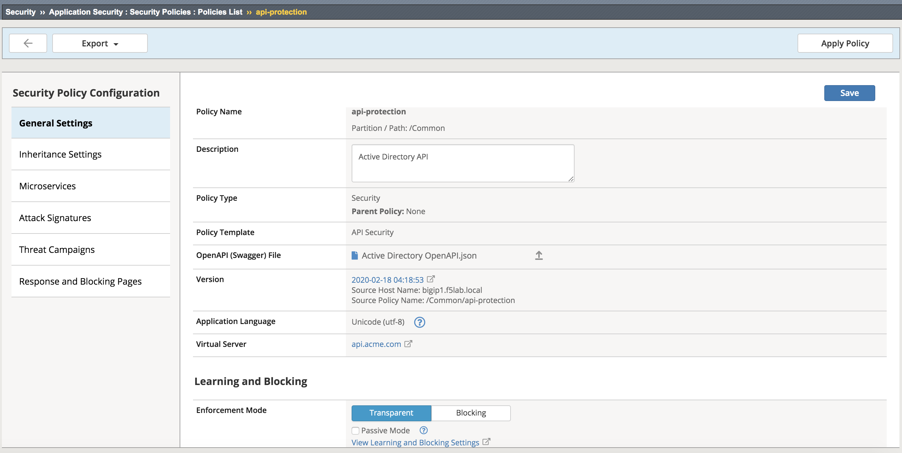
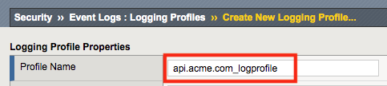
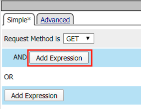

Lab 2.1 - Prepping the Lab
=======================================================================

By default, security events are not logged, in this lab the student will create a security logging profile with Application Security, Bot Defense and DOS Protection enabled.
The student will also place the waf policy in trasnparent to show the difference in behavior when client traffic that is deemed malicious is and is not blocked.

Task 1 - Add Vulnerable API 
------------------------------

#. From the web browser, navigate to API Protection >> Profile.  Click **Profile** to modify the previously created API protection Profile (not the + Plus symbol)

   |image48|

#. Click **Edit** Under Per-Request Policy

   |image49|

#. Click the **+ (Plus Symbol)** located between Start and OAuth Scope Check AuthZ

   |image101|

#. Select the **Classification** tab
#. Select **Request Classification**
#. Click **Add Item**

   |image102|

#. Select **Branch Rules**
#. Click **Add Branch Rule**
#. Enter name **GET /vulnerable**
#. Click **Change**

   |image103|

#. Click **Add Expression**

   |image104|

#. Select **Request** from the Context dropdown

#. Click **Add Expression**

   |image105|

#. Click **Add Expression** on the AND line

   |image106|

#. Select **Path (value)** from the Request dropdown
#. Enter **/vulnerable** in the empty text box
#. Click **Add Expression**

   |image107|

#. Click **Finished**

   |image108|

#. Click **Save**

   |image109|

#. Click the **+ Plus Symbol** on the GET /vulnerable branch

   |image110|

#. Click **API Server Selection**
#. Click **Add Item**

   |image111|

#. Select **api-protection_server1** from the dropdown
#. Click **Save**

   |image112|

#. Click the **Reject** terminal at the end of API Server Selection

   |image113|

#. Select **Allow**
#. Click **Save**

   |image114|

#. The completed policy should look like the below.

   |image115|

Task 2 - Create and assign a Security Logging Profile to the virtual
-------------------------------------------------------------------------

..note :: Ensure you are logged into BIGIP1

#. From the web browser, click on the **Security -> Event Logs -> Logging Profile** and click **Create**.

#. For the Profile Name enter **api.acme.com_logprofile**.

   |module2Lab1Task2-image1|

#. Enable **Application Security**, an Application Security configuration menu will open up at the bottom. Change the Request Type from Illegal requests only to **All requests**.

   |module2Lab1Task2-image2|

#. Enable **DoS Protection**, a DoS Protection configuration menu will open up at the bottom. Enable **Local Publisher**

   |module2Lab1Task2-image3|

#. Enable **Bot Defense**, a Bot Defense configuration menu will open up at the bottom. Enable **Local Publisher** and all other checkboxes, leave Remote Publisher set to none.

   |module2Lab1Task2-image4|

#. Click **Create**

#. Apply the log profile to the api.acme.com virtual by navigating to **Local Traffic -> Virtual Servers -> api.acme.com -> Security -> Policies** and after choosing "Enabled" from the dropdown, set the Selected Log Profile to **api.acme.com_logprofile**.

   |module2Lab1Task2-image5|

#. Click **Update**. The virtual will now log Application Security, DoS and Bot related events under **Security -> Event Logs** when an appropriate security profiles have been applied to the virtual.

Task 3 - Set the WAF policy to Transparent and assign it to the virtual
----------------------------------------------------------------------------

#. From the web browser, click on the Security -> Application Security -> Security Policies -> Policies List. Click  **api-protection**. Scroll down and you'll notice the Enforcement Mode is set to **Blocking**. Set the Enforcement Mode to **Transparent**. Be sure to click **Save**, then **Apply Policy**.

   |module2Lab1Task3-image1|

#. Apply the waf policy to the api.acme.com virtual by navigating to **Local Traffic -> Virtual Servers -> api.acme.com -> Security -> Policies** and set the Application Security Policy to enabled and the Policy to  **api-protection**.

   |module2Lab1Task3-image2|

#. Click **Update**.

..  |module2Lab1Task3-image2| image:: media/module2Lab1Task3-image2.png
        :width: 800

..  |module2Lab1Task2-image5| image:: media/module2Lab1Task1-image5.png
        :width: 400px
..  |module2Lab1Task2-image4| image:: media/module2Lab1Task1-image4.png
        :width: 400px
..  |module2Lab1Task2-image3| image:: media/module2Lab1Task1-image3.png
        :width: 400px
..  |module2Lab1Task2-image2| image:: media/module2Lab1Task1-image2.png
        :width: 800px

.. |image0| image:: media/image000.png
.. |image48| image:: media/image048.png

.. |image64| image:: media/image064.png

.. |image102| image:: media/image102.png
	:width: 800px
.. |image103| image:: media/image103.png
.. |image104| image:: media/image104.png

.. |image111| image:: media/image111.png
.. |image112| image:: media/image112.png

