Lab 2.2 - Create and Configure a Bot Defense Profile in Transparent Mode
==================================================================================

An api's clients, unlike a typical web application, will often be non-human, maybe even exclusively.
This leaves bot defense more difficult to configure in an api protection scenario, for instance javascript such as captcha cannot be used to proactively determine whether the client is human.
In this lab, we demonstrate some scenarios the admin may encounter and how to address them.

Task 1 - Create and assign a Bot Defense Profile
------------------------------------------------

.. note :: Ensure you are logged into BIGIP1

#. From the web browser, click on the **Security -> Bot Defense -> Bot Defense Profiles** and click **Create**.

#. For the name enter **api.acme.com_botprofile**, leave all other settings at their defaults.

   |module2Lab2Task1-image1|

#. Click **Save**

   The bot profile is left in transparent mode to demonstrate the logging behavior and behavior differences to the client.

#. Apply the bot profile to the api.acme.com virtual by navigating to **Local Traffic -> Virtual Servers -> api.acme.com -> Security -> Policies**.

For **Bot Defense Profile** select **Enabled** and select **api.acme.com_botprofile** as the Profile. Click **Update**.

   |module2Lab2Task1-image2|

#. Now we will test the Bot Defense Profile to see how it affects clients. Go to **Postman** once again and select the request **Retrieve Phone and Mail Attributes** and click **Send**.

#. Return to the bigip01 gui and navigate to **Security -> Event Logs -> Bot Defense -> Bot Requests** and find the request to the /vulnerable uri as shown below

   |module2Lab2Task1-image4|

   .. note :: The student should pay special attention to the Request Status, Mitigation Action and Bot Class. Bot Class will be one of the categories found in **Security -> Bot Defense -> Bot Defense Profiles -> api.acme.com_botprofile -> Bot Mitigation Settings** under **Mitigation Settings**.

Task 2 - Place Bot Profile in blocking and allow appropriate clients
----------------------------------------------------------------------

The bot profile was left in transparent to demonstrate the behavior, now we will configure the bot profile to 
block bot traffic. Keep in mind that the bot profile allows for fine-grained control of categories of bots, which bot fits in those categories. We will explore this later.

#. Navigate back to **Security -> Bot Defense -> Bot Defense Profiles -> api.acme.com_botprofile**, change the **Enforcement Mode** to  **Blocking** and click **Save**.

   |module2Lab2Task2-image1| 

#. Go back to **Postman** once again and select the request **Retrieve Phone and Mail Attributes** and click **Send** another time.

   |module2Lab2Task2-image2|

#.  Return to the bigip01 gui and navigate to **Security -> Event Logs -> Bot Defense -> Bot Requests** and find the 2nd request to the /vulnerable uri as shown below

   |module2Lab2Task2-image3| 

   Why was this request not blocked?

   To understand this, we must take a closer look at the Mitigation Settings.
   
   
   

#. Navigate to **Security -> Bot Defense -> Bot Defense Profiles -> api.acme.com_botprofile -> Bot Mitigation Settings** and examine the **Unknown** categorization, note that bots that are of category Unknown are simply rate limited.

   |module2Lab2Task2-image4|

#. Go back to **Postman** once again and click on the **Arrow** next to the API Protection Labs collection to open **Runner** at the top. 

#. Click Run

#. Configure the runner with the API Protection collection selected iterations set to 100 and the only request within the collection that should be selected is **Retrieve Phone and Mail Attributes**.

   |module2Lab2Task2-image5|

#. Click **Run API Protection**.  Notice all responses are 200 OKs.

   |module2Lab2Task2-image6|

#. Return to the bigip01 gui and navigate to **Security -> Event Logs -> Bot Defense -> Bot Requests** and find the Denied request to the /vulnerable uri as shown below.

   |module2Lab2Task2-image7|

#. We will recategorize the Postman client so that it is a trusted client, this is done via bot signatures. Navigate to **Security -> Bot Defense -> Bot Signatures -> Bot Signatures Categories List** and click **Create**.

#. Fill in the Bot Signature Category Name of **Trusted Development Tools** and select **Trusted Bot** from the Bot Class dropdown.

   |module2Lab2Task2-image12|

#. Navigate to **Security -> Bot Defense -> Bot Signatures -> Bot Signatures List** and click **Create**.

   |module2Lab2Task2-image8|

#. Fill in the Bot Name, Bot Category and Rule (User Agent) with the following, leaving all other values at their defaults.

   |module2Lab2Task2-image9|

#. Click **Save**.

#. Go back to Postman once again and select the request **Retrieve Phone and Mail Attributes** and click **Send** another time. Note this is done at the main Postman window, not in Runner.

#. Navigate to **Security -> Event Logs -> Bot Defense -> Bot Requests** and find the Trusted Bot categorized request to the /vulnerable uri as shown below

   |module2Lab2Task2-image11|

..  |module2Lab2Task1-image1| image:: media/module2Lab2Task1-image1.png
        :width: 800px
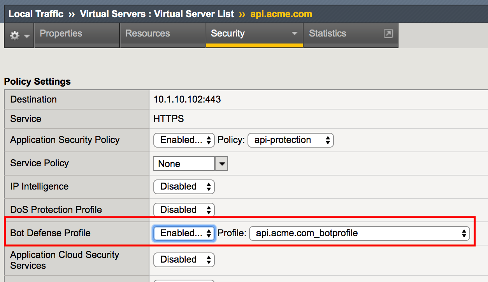
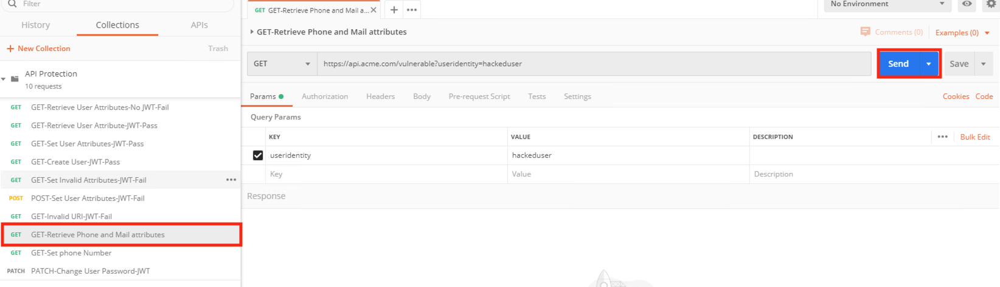
..  |module2Lab2Task1-image4| image:: media/module2Lab2Task1-image4.png
        :width: 800px
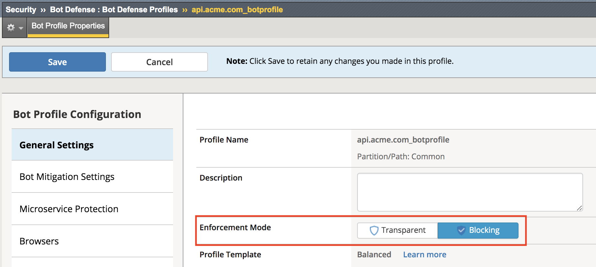
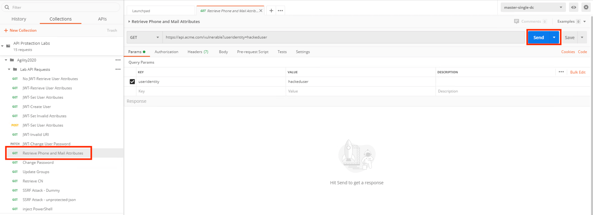
..  |module2Lab2Task2-image3| image:: media/module2Lab2Task2-image3.png
        :width: 800px
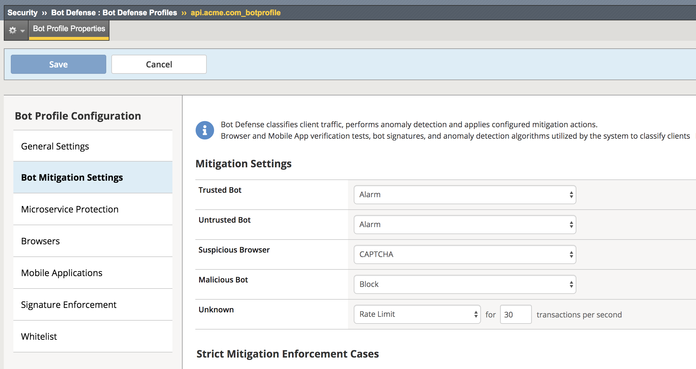
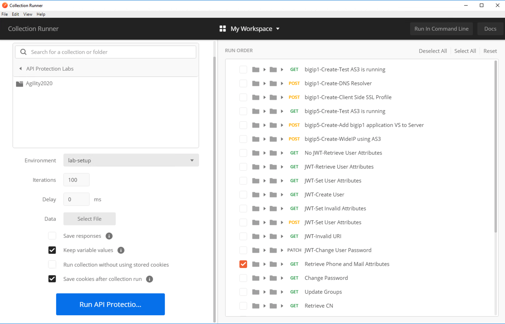
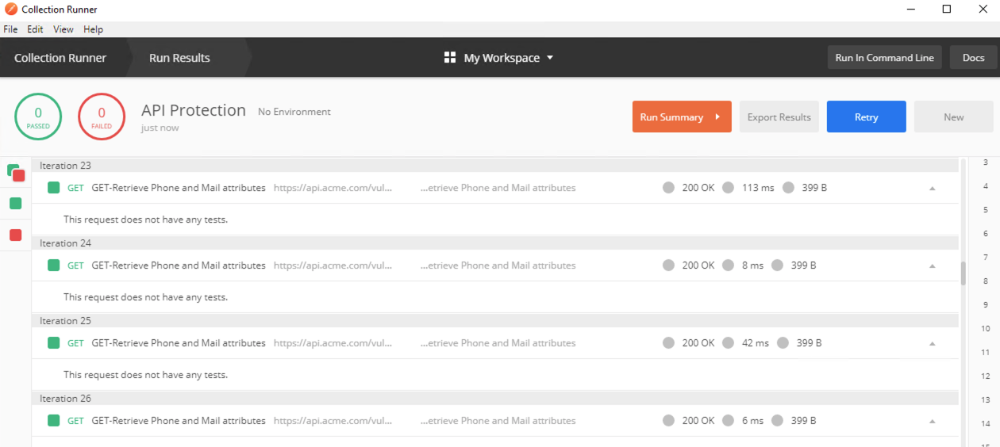
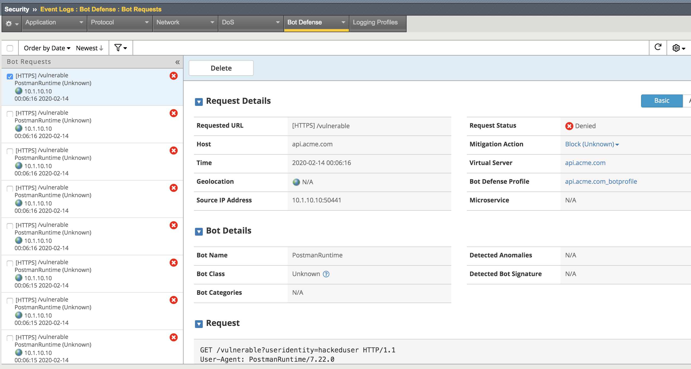
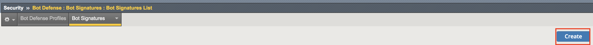
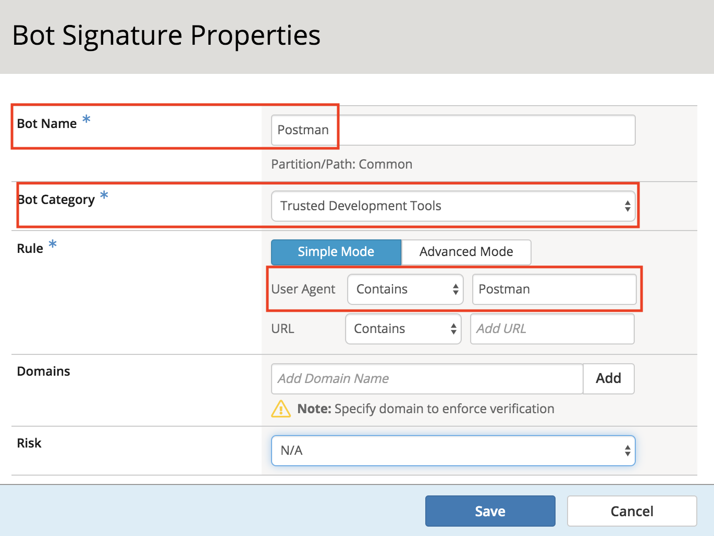
..  |module2Lab2Task2-image10| image:: media/module2Lab2Task2-image10.png
        :width: 800px
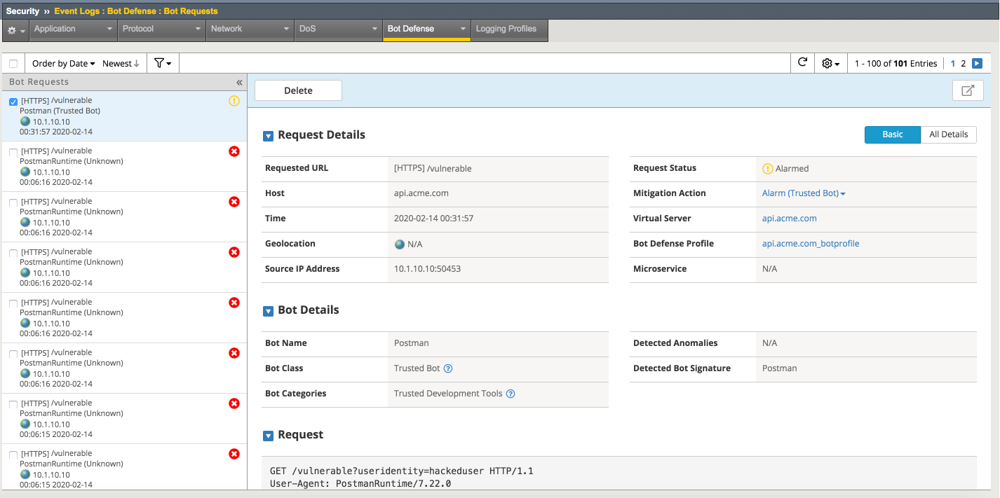

..  |module2Lab2Task2-image12| image:: media/module2Lab2Task2-image12.png
        :width: 800px

