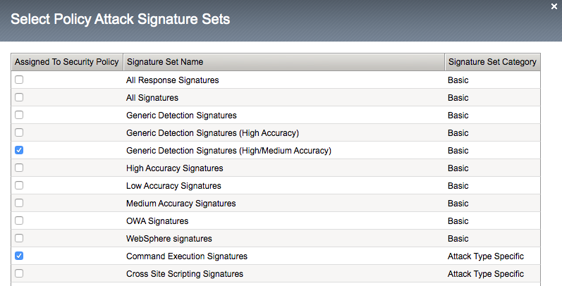

Lab 2.3 - Tweaking the WAF Policy to provide additional security
=======================================================================

APIs are a collection of technologies just like any other application, in the lab the api is built on top of a windows server using powershell. This lab demonstrate how to tune the WAF policy to use attack signatures and meta-character enforcement to provide additional protection against malicious clients.

Meta-character enforcement allows the WAF admin to enforce which characters are allowed into a web application, whether it be in the header, url or parameter. In this lab we examine parameter meta-character enforcement.

Task 1 - Configure Attack Signatures and Change WAF Policy to Blocking
--------------------------------------------------------------------------

.. note :: Ensure you are logged into BIGIP1

1. Open a command prompt on the jumphost (a shortcut is on the desktop) 

   |module2Lab3Task1-image2|

2. Run the following command **curl -k "https://api.acme.com/vulnerable?Inject=|powershell%20badprogram.ps1" -v**

	**Pay special attention to the double quotes ("") around the url.**

3. Navigate to **Security -> Event Logs -> Application -> Requests** and find this latest request. 
Locate the parameter value **|powershell badprogram.ps1**. Click the parameter and then hover over the parameter value and additional details will describe this part of the attack.

   |module2Lab3Task1-image3|

   .. note:: The **Enforcement Action** is None

	The F5 WAF highlights the part of the request it detects as malicious based on the policy's configuration. This can be very useful for learning and troubleshooting purposes.

4. Next hover over the **User-Agent** portion of the request.

   |module2Lab3Task1-image4|

	Notice the user-agent is curl, which may be a legitimate client. Make note of this.

	Ideally we want to block any malicious request, in this case the powershell execution attempt, but want to allow curl as it's a legitimate client in our case. What about the %20 meta character, should it be allowed? Depending on the application, this could be legitimate.
	
	In your environment, you must decide what is legitimate and what is illegitimate traffic, the F5 WAF can guide you via learning and help eliminate noise using Bot Defense, however to increase security beyond a basic WAF policy, understanding the application is needed.

5. Click on the  **Security -> Application Security -> Policy Building -> Learning and Blocking Settings -> Attack Signatures** and click Change

|module2Lab3Task1-image5|

6. Enable **Command Execution Signatures** and click **Change**

|module2Lab3Task1-image6|

7. Scroll to the bottom anc click **Save**.

|module2Lab3Task1-image7|

8. Navigate to Security -> Application Security -> Security Policies -> **Policies List**.

9. Click  **api-protection** 

10. Click **Attack Signatures** 

11. Click the filter icon to easily locate the **Automated client access "curl"** signature.

|module2Lab3Task1-image8| 

12. For the Attack Signature Name enter **Automated client access "curl"** and click **Apply Filter**.

|module2Lab3Task1-image9|

|

The result is

|module2Lab3Task1-image10|

13. Select this signature and click **Disable**

|module2Lab3Task1-image11|

14. Click **General Settings** and scroll down to "Enforcement Mode" and change it to "Blocking." Click Save and then Apply the Policy

|module2Lab3Task1-image12|

15. Once again run the following command **curl -k "https://api.acme.com/vulnerable?Inject=|powershell%20badprogram.ps1" -v**

**Pay special attention to the double quotes ("") around the url.**

16. Navigate to **Security -> Event Logs -> Application -> Requests** and find this latest request.

|module2Lab3Task1-image13|

Notice the enforcement action is still **None** but also notice the user-agent curl is no longer highlighted (since the signature was disabled). We changed the Policy to Blocking so why wasn't the request blocked? Hint: Click the "1" under Occurrences and you'll see the current status of the Attack Signature.

17. Hover over the highlighted payload and notice that the powershell attack signature is triggered.

|module2Lab3Task1-image14|

Powershell execution via http parameters is now mitigated. If you noticed in the request, that the **|** is considered illegal.
What if that character was a legitimate value for a parameter?

|module2Lab3Task1-image15|

18. Go back to the command prompt on the jumphost and run

|

 **curl -k "https://api.acme.com/vulnerable?param1=|legitimate%20value" -v**

19. Navigate to **Security -> Event Logs -> Application -> Requests** and find this latest request. Notice the **|** is considered illegal. However its not blocked, the Enforcement Action is None

|module2Lab3Task1-image16|

20. To see why this parameter character violation is not being blocked, but is being logged (alarmed). Navaigate to **Security -> Application Security -> Policy Building -> Learning and Blocking Settings -> Parameters** and enable the **Block** column for the **Illegal meta character in value** under the Parameters Section

|module2Lab3Task1-image17|

|

21. Click **Save** then **Apply Policy**

22. Go back to the command prompt on the jumphost and run 

|

**curl -k "https://api.acme.com/vulnerable?param1=|legitimate%20value" -v**

23. Navigate to **Security -> Event Logs -> Application -> Requests** and find this latest request. Notice the **|** is considered illegal and is now blocked.

|module2Lab3Task1-image18|

..  |module2Lab3Task1-image18| image:: media/module2Lab3Task1-image18.png
        :width: 800px

..  |module2Lab3Task1-image16| image:: media/module2Lab3Task1-image16.png
        :width: 400px

..  |module2Lab3Task1-image14| image:: media/module2Lab3Task1-image14.png
        :width: 400px

..  |module2Lab3Task1-image11| image:: media/module2Lab3Task1-image11.png
        :width: 800px

..  |module2Lab3Task1-image8| image:: media/module2Lab3Task1-image8.png
        :width: 100px

..  |module2Lab3Task1-image4| image:: media/module2Lab3Task1-image4.png
        :width: 400px

..  |module2Lab3Task1-image2| image:: media/module2Lab3Task1-image2.png
        :width: 100px

