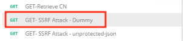
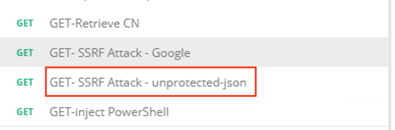
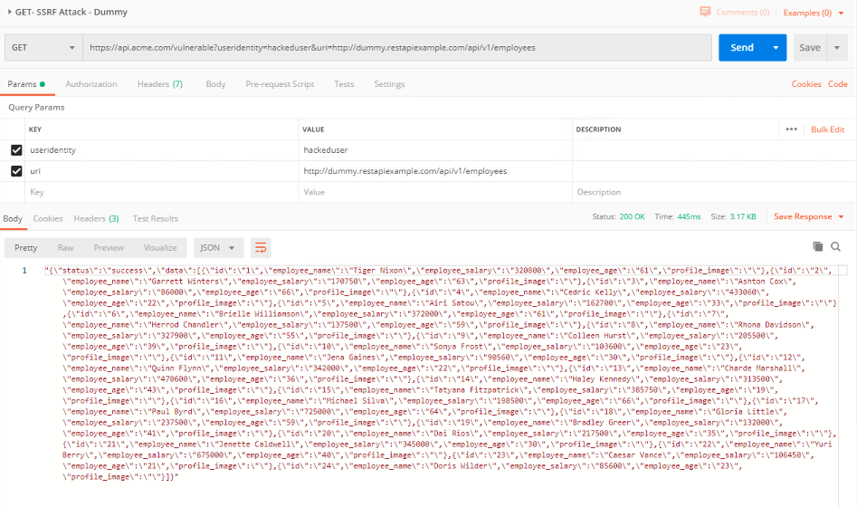
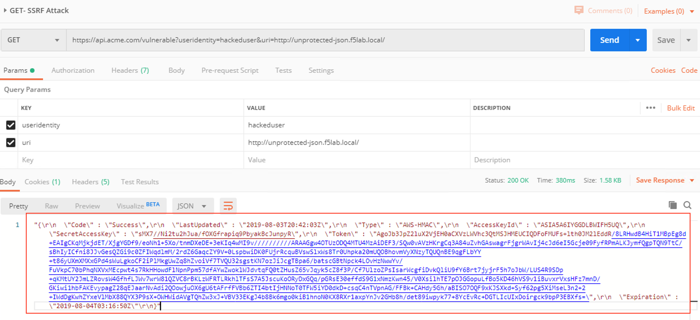
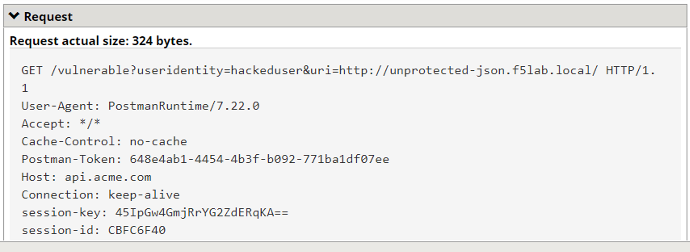
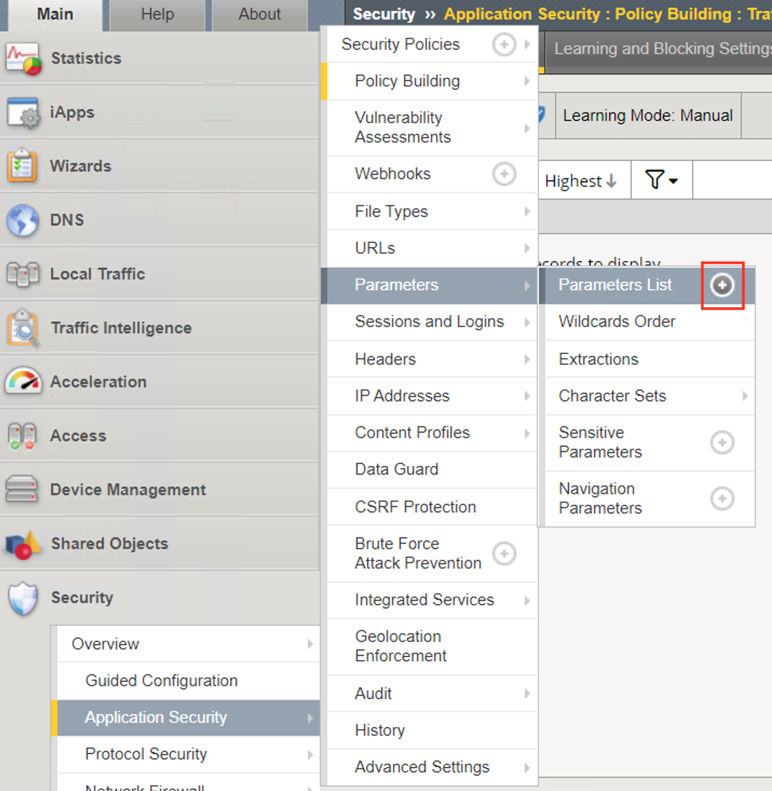
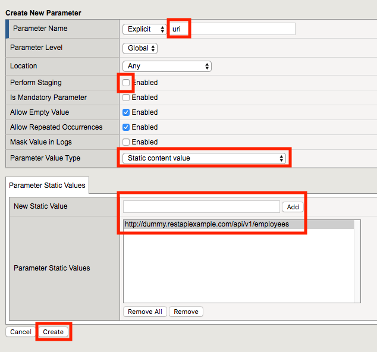
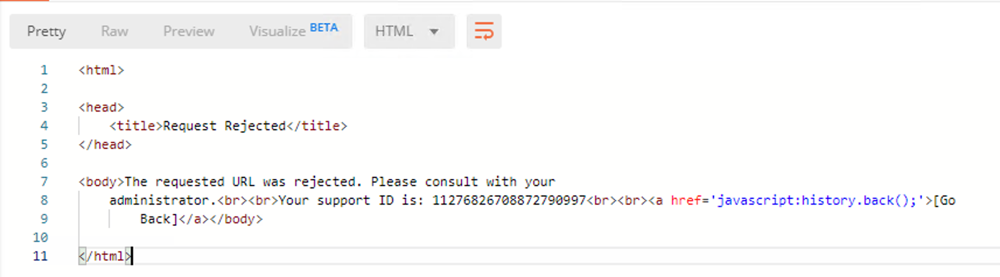

Lab 2.4 - Protect against a SSRF attack
========================================

Task 1 - Implement Static Parameter values
--------------------------------------------

1. From Postman, click "Send" on the **SSRF Attack-Dummy** request.  Notice you get content from restapiexammple.com via api.acme.com/vulnerable.  This endpoint is vulnerable to Server Side Request Forgery attacks

|image118|

2. From Postman, run **SSRF Attack-unprotected-json**. This site contains example ID and keys in JSON format.  Hackers will uses your servers as a jump off point to gain access to internal resources 

|image119|

3. Navigate to **Security -> Event Logs -> Application -> Requests** and find both requests.  Notice nothing appears malicious about these requests except for the destinations. 

|image120|

 

4.  We are going to secure the the uri parameter, so it only allows access to restapiexample, but not access to the internal private data.

5. Navigate to **Security -> Application Security -> Parameters -> Parameters List**.  Click the **+ Plus Symbol**

|image121|

6. Enter the Name **uri**
7. Uncheck **Perform Staging**
8. From the Parameter Value Type dropdown select **Static Content Value**
9. Enter **http://dummy.restapiexample.com/api/v1/employees** for the New Static Value 
10. Click **Add**
11. Click **Create**

|image122|

12. Click **Apply Policy**

13. From Postman, run **SSRF Attack-Dummy**.  Access to Google is still allowed.

14. From Post, run **SSRF Attack-unprotected-json**. This site is now blocked as intended

|image123|

15. Navigate to **Security -> Event Logs -> Application -> Requests** and find the latest blocked request.  The uri parameter is highlighted due to Illegal Static Parameter Value.

|image124|

.. |image124| image:: media/image124.png
	:width: 800px
