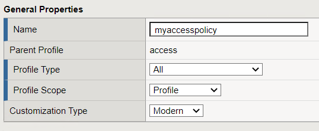
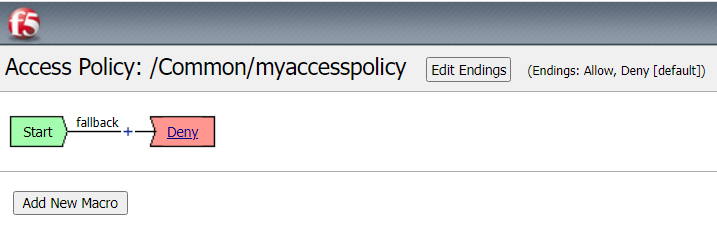
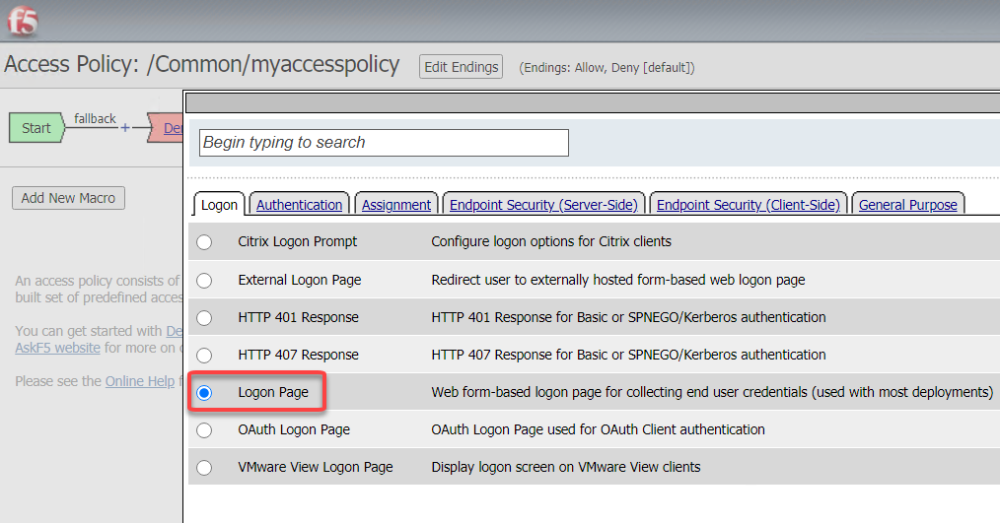
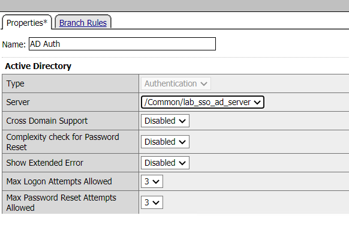
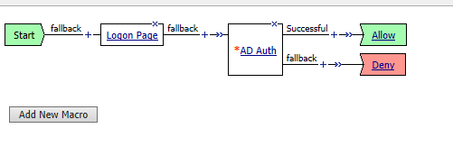
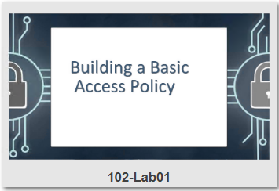

Lab 1: Building a Basic Access Policy
=====================================

Objectives
----------
In this lab we will work through the building blocks of Access Policy Manager. Much like the majority of the other modules around LTM they are policy based meaning you are binding a Profile
to the virtual server in question that you want to provide enhanced functionality. In this case those come in the form of Per-Session and Per-Request Policies

Setup Lab Environment
-----------------------------------

To access your dedicated student lab environment, you will need a web browser and Remote Desktop Protocol (RDP) client software. The web browser will be used to access the Unified Demo Framework (UDF) Training Portal. The RDP client will be used to connect to the jumphost, where you will be able to access the BIG-IP management interfaces (HTTPS, SSH).

#. Click **DEPLOYMENT** located on the top left corner to display the environment

#. Click **ACCESS** next to jumphost.f5lab.local

   |accessjh|

#. Select your RDP resolution.

#. The RDP client on your local host establishes a RDP connection to the Jump Host.

#. Login with the following credentials:

         - User: **f5lab\\user1**
         - Password: **user1**

#. After successful logon the Chrome browser will auto launch opening the site https://portal.f5lab.local.  This process usually takes 30 seconds after logon.

#. Click the **Classes** tab at the top of the page.

	|accessportal|

#. Scroll down the page until you see **102 Access Building Blocks** on the left

   |102intro|

#. Hover over tile **Building a Basic Acces Policy**. A start and stop icon should appear within the tile.  Click the **Play** Button to start the automation to build the environment

   +---------------+-------------+
   | |lab01|       | |lab01fly|  |
   +---------------+-------------+

#. After the click it may take up to 30 seconds before you see processing

   |process|

#. Scroll to the bottom of the automation workflow to ensure all requests succeeded.  If you experience errors try running the automation a second time or open an issue on the `Access Labs Repo <https://github.com/f5devcentral/access-labs>`__.

   |issues|

Task 1: Intro to Access Profiles and Policies
-----------------------------------------------
Access Policy Manager (APM) provides two types of policies.

**Per-session policy**

    The per-session policy runs when a client initiates a session. (A per-session policy is also known as an access policy.) Depending on the actions you include in the access policy, it can authenticate the user and perform other actions that populate session variables with data for use throughout the session.

**Per-request policy**

    After a session starts, a per-request policy runs each time the client makes an HTTP or HTTPS request. Because of this behavior, a per-request policy is particularly useful in the context of a Zero Trust scenario, where the client requires re-verification on every request. A per-request policy can include a subroutine, which starts a subsession. Multiple subsessions can exist at one time. You cannot use subroutines in macros within per-request policies.

You can associate one access policy and one per-request policy with a virtual server.

**Access Session**

    An access session is recorded when a client initiates a connection through a per-session policy.  Once an access session is established it has a set of timeouts set within the Access profile.  A session will terminate if it reaches a timeout or the client ends the session.  An access session is now not limited by a license but by the platform running APM.  For more information on APM licensing see `K15624537: BIG-IP APM Licensing for BIG-IP Standard Platforms <https://support.f5.com/csp/article/K15624537>`_

**Subsession**

    A subsession is part of the per-request policy framework.  It starts when a subroutine (within a per-request policy) runs and continues until reaching the maximum lifetime specified in the subroutine properties, or until the session terminates. A subsession populates subsession variables that are available for the duration of the subsession. Subsession variables and events that occur during a subsession are logged.

    Multiple subsessions can exist at the same time. The maximum number of subsessions allowed varies across platforms. The total number of subsessions is limited by the session limits in APM (128 * max sessions). Creating a subsession does not count against the license limit.

Objectives
----------

The lab has a pre-configured test Virtual Server which will be used throughout the lab.  You will use the Visual Policy Editor (VPE) to create and attach a simple Access Profile which performs user authentication.

Lab Requirements
----------------

-  A pre existing virtual server at 10.1.10.101 or https://app.acme.com

Task 1: Define an Authentication Server
---------------------------------------

Before we can create an access profile, we must create the necessary AAA
server profile for our Active Directory.

#. Click the bigip1 bookmark from within Chrome and login to the BIG-IP, admin/admin

#. From the main screen, browse to **Access > Authentication > Active
   Directory**

#. Click **Create...** in the upper right-hand corner

#. Configure the new server profile as follows:

    +------------------+---------------------------+
    |Name:             | **lab\_sso\_ad\_server**  |
    +------------------+---------------------------+
    |Domain Name:      | **f5lab.local**           |
    +------------------+---------------------------+
    |Server Connection:| **Direct**                |
    +------------------+---------------------------+
    |Domain Controller:| **10.1.20.7**             |
    +------------------+---------------------------+
    |User Name:        | **admin**                 |
    +------------------+---------------------------+
    |Password:         | **admin**                 |
    +------------------+---------------------------+

#. Click **Finished**

    .. Note:: If you wish you can simply use the **app-ad-servers**.

Task 2: Create a Simple Access Profile
--------------------------------------

#. Navigate to **Access > Profiles / Policies > Access Profiles
   (Per-Session Policies)**

   |Lab1-Image1|

#. From the Access Profiles screen, click **Create...** in the upper
   right-hand corner

#. In the Name field, enter **mycccesspolicy** and for the **Profile Type**,
   select the dropdown and choose **All**

   |Lab1-Image2|

#. Under "Language Settings", choose **English** and click the
    **<<** button to slide over to the **Accepted Languages** column.

   |Lab1-Image3|

#. Click **Finished**, which will bring you back to the Access Profiles
   screen.

#. On the Access Profiles screen, click the **Edit** link under the
   Per-Session Policy column.

   |Lab1-Image4|

   The Visual Policy Editor (VPE) will open in a new tab.

#. On the VPE page, click the **+** icon on the **fallback** path,
   to the right of the **Start** object.

   |Lab1-Image5|

#. On the popup menu, choose the **Logon Page** radio button under the
   Logon tab and click **Add Item**

   |Lab1-Image6|

   |Lab1-Image7|

#. Accept the defaults and click **Save**

    Now let's authenticate the client using the credentials to be provided via the **Logon Page** object.

#. Between the **Logon Page** and **Deny** objects, click the **+**
   icon, select **AD Auth** found under the **Authentication** tab,
   and click the **Add Item** button

   |Lab1-Image8|

   |Lab1-Image9|

#. Accept the default for the **Name** and in the **Server** drop-down
   menu select the AD server created above:
   **/Common/lab\_sso\_ad\_server**, then click **Save**

   |Lab1-Image10|

#. On the **Successful** branch between the **AD Auth** and **Deny**
   objects, click on the word **Deny** to change the ending

   |Lab1-Image11|

#. Change the **Successful** branch ending to **Allow**, then click **Save**

   |Lab1-Image12|

   |Lab1-Image13|

#. In the upper left-hand corner of the screen, click on the **Apply
   Access Policy** link, then close the window using the **Close**
   button in the upper right-hand. Click **Yes** when asked **Do you
   want to close this tab?**

   |Lab1-Image14|

   |Lab1-Image15|

Task 3: Associate Access Policy to Virtual Servers
--------------------------------------------------

Now that we have created an access policy, we must apply it to the
appropriate virtual server to be able to use it.

#. From the **Local Traffic** menu, navigate to the **Virtual Servers
   List** and click the name of the virtual server created previously:
   **app-https**.

#. Scroll down to the **Access Policy** section, then for the **Access
   Profile** dropdown, select **myaccesspolicy**

   |Lab1-Image16|

#. Click **Update** at the bottom of the screen

Task 4: Testing
----------------

Now you are ready to test.

#. Open a new browser window and open the URL for the virtual server that has the access policy applied:

   **https://app.acme.com**

   You will be presented with a login window

   |Lab1-Image17|

#. Enter the following credentials and click **Logon**:

    +------------+-----------+
    | Username:  |**user1**  |
    +------------+-----------+
    | Password:  |**user1**  |
    +------------+-----------+

You will see a screen similar to the following:

   |Lab1-Image18|

Task 7: Troubleshooting tips
----------------------------

You can view active sessions by navigating Access/Overview/Active Sessions

You will see a screen similar to the following:

Click on the session id for the active session. If the session is active it will show up as a green in the status.

|Lab1-Image19|

Click on the "session ID" next to the active session. Note every session has a unique session id. Associated with it.
This can be used for troubleshooting specific authentication problem.

Once you click on the session id you will be presented with a screen that is similar to the following.

|Lab1-Image20|

Note that the screen will show all of the log messages associated with the session. This becomes useful if there is a problem authenticating users.

The default log level shows limited "informational" messages but you can enable debug logging in the event that you need to increase the verbosity of the logging
on the APM policy. Note you should always turn off debug logging when you are finished with trouble shooting as debug level logging can
generate a lot of messages that will fill up log files and could lead to disk issues in the event that logging is set to log to the
local Big-IP.

Please review the following support article that details how to enable debug logging.

https://support.f5.com/csp/article/K45423041

Lab 1 is now complete.

.. |Lab1-Image1| image:: ./media/Lab1-Image1.png

.. |Lab1-Image3| image:: ./media/Lab1-Image3.png
.. |Lab1-Image4| image:: ./media/Lab1-Image4.png

.. |Lab1-Image7| image:: ./media/Lab1-Image7.png
.. |Lab1-Image8| image:: ./media/Lab1-Image8.png
.. |Lab1-Image9| image:: ./media/Lab1-Image9.png

.. |Lab1-Image11| image:: ./media/Lab1-Image11.png
.. |Lab1-Image12| image:: ./media/Lab1-Image12.png

.. |Lab1-Image14| image:: ./media/Lab1-Image14.png
.. |Lab1-Image15| image:: ./media/Lab1-Image15.png
.. |Lab1-Image16| image:: ./media/Lab1-Image16.png
.. |Lab1-Image17| image:: ./media/Lab1-Image17.png
.. |Lab1-Image18| image:: ./media/Lab1-Image18.png
.. |Lab1-Image19| image:: ./media/Lab1-Image19.png
.. |Lab1-Image20| image:: ./media/Lab1-Image20.png
.. |accessjh| image:: ./media/accessjh.png
.. |accessportal| image:: ./media/accessportal.png
.. |102intro| image:: ./media/102intro.png
.. |guioverview| image:: /class1/module1/media/lab01/setup/guioverview.png

.. |lab01fly| image:: ./media/lab01fly.png
.. |process| image:: ./media/process.png
.. |issues| image:: ./media/issues.png
