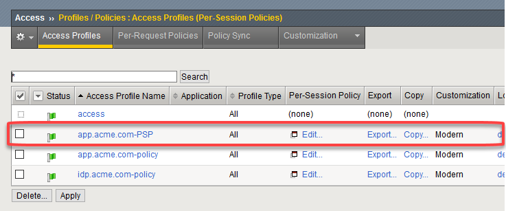
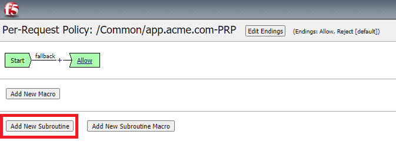
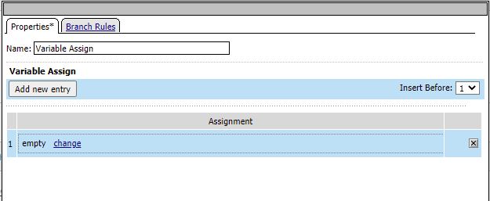
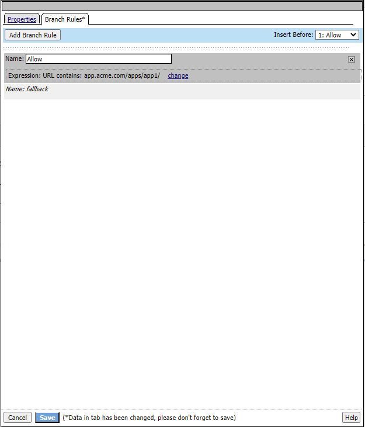

Lab 2: Step up Authentication with Per-Request Policies
========================================================

Objectives
----------

The purpose of this lab is to familiarize the Student with Per Request Policies.
The F5 Access Policy Manager (APM) provides two types of policies.

**Access Policy** - The access policy runs when a client initiates a session. Depending
on the actions you include in the access policy, it can authenticate the user
and perform group or class queries to populate session variables with data for
use throughout the session. We created one of these in the prior lab

**Per-Request Policy** - After a session starts, a per-request policy runs each time
the client makes an HTTP or HTTPS request.  A per-request policy can include a
subroutine, which starts a sub-session.  Multiple sub-sessions can exist at one
time. One access policy and one per-request are specified within a virtual server.

**It's important to note that APM first executes a per-session policy when a client
attempts to connect to a resource.   After the session starts then a per-request
policy runs on each HTTP/HTTPS request.  Per-Request policies can be utilized in a
number of different scenarios; however, in the interest of time this lab will only
demonstrate one method of leveraging Per-Request policies for controlling access
to specific URI's and submitting information from Active Directory as a header to the application.**

Objective:
----------

-  Gain an understanding of Per Request policies

-  Gain an understanding of use for Per Request Policy

Lab Requirements:
-----------------

-  All lab requirements will be noted in the tasks that follow

Estimated completion time: 15 minutes

Lab 2 Tasks:
-----------------

TASK 1: Create Per Session Policy
----------------------------------

Refer to the instructions and screen shots below:

#. Login to your lab provided **Virtual Edition BIG-IP**

     - On your jumphost launch Chrome and click the bigip1 link from the app shortcut menu
     - Login with credentials admin/admin

#. Begin by selecting: **Access -> Profiles/Policies -> Per Session Policies** ->

#. Click the + Sign next to **Access Profiles (Per-Session Policies)**

    |Lab2-Image1|

#. Enter the name of the policy, profile type, and profile scope

    +--------------------------+-------------------------+
    |**Name**:                 |**app.acme.com-PSP**     |
    +--------------------------+-------------------------+
    |**Profile Type**:         |**All**                  |
    +--------------------------+-------------------------+
    |**Profile Scope**:        |**Profile**              |
    +--------------------------+-------------------------+
    |**Accept Languages**:     | **English (en)**        |
    +--------------------------+-------------------------+

    .. Note:: You will need a per session policy and a per request policy but we will be leaving the per session policy blank and performing our auth in per Request

    |Lab2-Image2|

#. On the app.acme.com-PSP policy click **Edit**

#. Click on the **Deny** and change the Select Ending to **Allow**

#. Click **Save**

#. Click Apply policy

    .. Note::  Nothing will be set in this policy we will simply establish a session and manage all the authentication in the Per-Request Policy

    |Lab2-Image3|

    |Lab2-Image4|

#. Close Visual Policy Editor

    |Lab2-Image40|

Task 2: Step Up Authentication with Per Request Policies
---------------------------------------------------------------

Step-up authentication can be used to protect layers or parts of a web application that manage more sensitive data. It can be used to increase protection by requiring stronger authentication within an already authenticated access to the web application.
Step-up authentication can be a part of using the portal access or web application management (reverse proxy) features of Access Policy Manager.

In this example we're going to use a Per-Request Policy with a subroutine to authenticate user when they access a specific URI, extract information from Active Directory and submit that information as a header

#. Begin by selecting: **Access -> Profiles/Policies -> Per Request Policies** ->

#. Click the **Create** button (far right)

    |Lab2-Image7|

#. Give the policy a name and select the Language Settings

    +-------------------------+---------------------+
    |**Name**:                |**app.acme.com-PRP** |
    +-------------------------+---------------------+
    |**Accept Languages**:    |**English (en)**     |
    +-------------------------+---------------------+

    |Lab2-Image8|

#. Click **Finished**

#. Back in the **Access** --> **Profiles/Policies** --> **Per-Request Policies** screen locate **app.acme.com-PRP** policy you just created.

#. Click **Edit** to the right of the name

#. Click on **Add New Subroutine**

    |Lab2-Image10|

#. Give it a name and Click Save

    +-----------+------------------+
    |**Name**:  | **AD_Subroutine**|
    +-----------+------------------+

    +------------------------------+---------------------------------------------------------------+
    | |Lab2-Image11|               |       |Lab2-Image13|                                          |
    +------------------------------+---------------------------------------------------------------+

#. Click the + between In and Out In the subroutine

#. Click the **Logon** Tab

#. At the middle of the list choose **Logon Page** and click **Add Item**

#. Select **Save** at the bottom of the Logon Page dialog box

#. In the subroutine, between the Logon page and the green **out** terminal click the **+** and select the **Logon Tab** and click the **Logon Page** radio button

     |Lab2-Image15|

     |Lab2-Image16|

#. Click the + sign between Logon Page and Out and select the **Authentication** tab and click the **AD Auth** radio Button

    |Lab2-Image17|

#. Select AD Auth and click **Add Item** at the bottom

    |Lab2-Image18|

#. Give the item a name

    +------------+-------------+
    |**Name**:   | **AD_Auth** |
    +------------+-------------+

#. Select **/Common/lab_sso_sd_server** for the Server option

    .. Note:: The lab_sso_ad_server object was created in Lab 1

#. Click the **Save**

    |Lab2-Image19|

#. Between **AD Auth** and the Out endpoint click the + Sign

    |Lab2-Image38|

#. Select Authentication and Select the **AD Query** radio button and click **Add Item**

#. Change the **Server** option to **/Common/lab_sso_ad_server** and click **Save**

#. Between **AD Query** and the Out endpoint click the + Sign

     |Lab2-Image39|

#. Navigate to the **Assignment** tab and select **Variable Assign** and click **Add Item**

#. Under Variable Assign click **Add New Entry**

    |Lab2-Image20|

#. Next to "Empty" click the **Change** link

#. Change the drop down on the right hand side to **Session Varaible** and input the following value

    +----------------------------------------+
    | **subsession.ad.last.attr.memberOf**   |
    +----------------------------------------+

#. In the left hand box type the following then click **Finished** and **Save**

    +----------------------------------+
    | **session.adgroups.custom**      |
    +----------------------------------+

    |Lab2-Image21|

    |Lab2-Image22|

#. Click the + sign between Start and Allow directly under the Per Request Policy at the top of the page

    |Lab2-Image23|

#. Select the **Classification** tab, click the **URL Branching Radio Button** and click **Add Item**

    |Lab2-Image24|

#. Click the **Branch Rules** tab and then click the **change** hyperlink

    |Lab2-Image25|

#. Change the value **domain.com** to **app.acme.com/apps/app1/** and click finished

    |Lab2-Image26|

    |Lab2-Image27|

#. Change the name from **Allow** to **/apps/app1/** and then click **Save**

    |Lab2-Image28|

#. Click the + sign after the **/apps/app1/** branch you just added and select the subroutines tab and click the **AD_Subroutine** radio button and click Add Item

    |Lab2-Image34|

#. Click the + sign after the AD_Subroutine Box you just added and select the **General Purpose** tab and click the **HTTP Headers** radio Button

    |Lab2-Image29|

#. Under **HTTP Header Modify**, click **Add new entry**

    |Lab2-Image30|

#. Type **AD_Groups** for header name and **%{session.adgroups.custom}** for **Header Value** and click Save

    |Lab2-Image31|

#. In the Per-Request Policy follow the **fallback** branch for the URL Branching.  Click on the **Reject** terminal and change to **Allow**

#. Your Per-Request Policy should now look like this

    |Lab2-Image32|

#. Navigate back to Local Traffic -> Virtual Servers and select your VIP, under the Access policy section of your VIP bind your Per-Session and Per Request policies

    |Lab2-Image33|

#. In a browser on your jumphost access https://app.acme.com you should see the webpage listed below, click the Application1 link

    |Lab2-Image35|

#. Authenticate with the **user1** username and **user1** password

    |Lab2-Image36|

#. Notice the **Ad-Groups** header which contains the extracted AD group information submitted to the application as a HTTP Header

    |Lab2-Image37|

What we have demonstrated here is the application of step-up authentication to a portion of the webpage, from there we extracted information from Active Directory to submit to
the application in the form of an HTTP Headers

Lab 2 is now complete.

.. |Lab2-Image1| image:: ./media/Lab2-Image1.png
.. |Lab2-Image2| image:: ./media/Lab2-Image2.png

.. |Lab2-Image4| image:: ./media/Lab2-Image4.png
.. |Lab2-Image7| image:: ./media/Lab2-Image7.png
.. |Lab2-Image8| image:: ./media/Lab2-Image8.png
.. |Lab2-Image9| image:: ./media/Lab2-Image9.png

.. |Lab2-Image11| image:: ./media/Lab2-Image11.png
.. |Lab2-Image12| image:: ./media/Lab2-Image12.png
.. |Lab2-Image13| image:: ./media/Lab2-Image13.png
.. |Lab2-Image14| image:: ./media/Lab2-Image14.png
.. |Lab2-Image15| image:: ./media/Lab2-Image15.png
.. |Lab2-Image16| image:: ./media/Lab2-Image16.png
.. |Lab2-Image17| image:: ./media/Lab2-Image17.png
.. |Lab2-Image18| image:: ./media/Lab2-Image18.png
.. |Lab2-Image19| image:: ./media/Lab2-Image19.png

.. |Lab2-Image21| image:: ./media/Lab2-Image21.png
.. |Lab2-Image22| image:: ./media/Lab2-Image22.png
.. |Lab2-Image23| image:: ./media/Lab2-Image23.png
.. |Lab2-Image24| image:: ./media/Lab2-Image24.png
.. |Lab2-Image25| image:: ./media/Lab2-Image25.png
.. |Lab2-Image26| image:: ./media/Lab2-Image26.png

.. |Lab2-Image28| image:: ./media/Lab2-Image28.png
.. |Lab2-Image29| image:: ./media/Lab2-Image29.png
.. |Lab2-Image30| image:: ./media/Lab2-Image30.png
.. |Lab2-Image31| image:: ./media/Lab2-Image31.png
.. |Lab2-Image32| image:: ./media/Lab2-Image32.png
.. |Lab2-Image33| image:: ./media/Lab2-Image33.png
.. |Lab2-Image34| image:: ./media/Lab2-Image34.png
.. |Lab2-Image35| image:: ./media/Lab2-Image35.png
.. |Lab2-Image36| image:: ./media/Lab2-Image36.png
.. |Lab2-Image37| image:: ./media/Lab2-Image37.png
.. |Lab2-Image38| image:: ./media/Lab2-Image38.png
.. |Lab2-Image39| image:: ./media/Lab2-Image39.png

