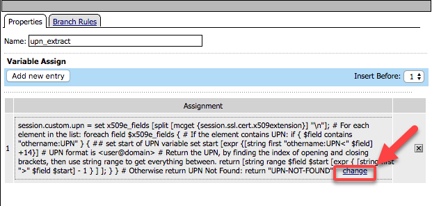
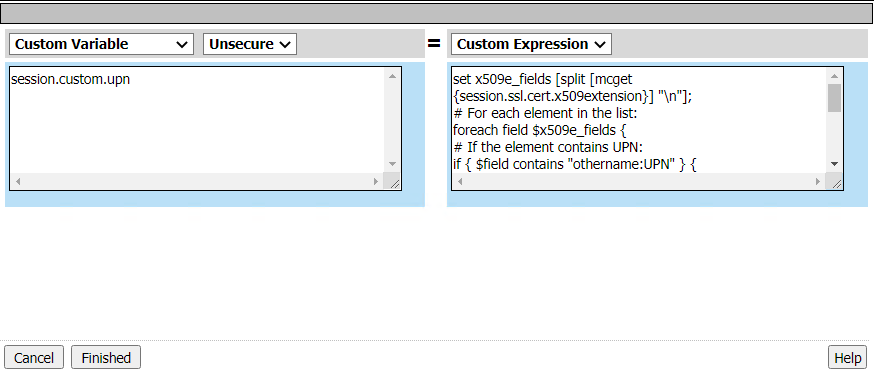
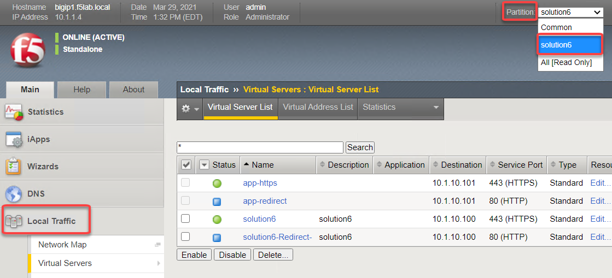

Lab 3: Server-Side Single Sign-On
=====================================

The purpose of this lab is to demonstrate Single Sign-On capabilities of APM.  The SSO Credential Mapping action enables users to forward
stored user names and passwords to applications and servers automatically, without having to input credentials repeatedly.   This allows single
sign-on (SSO) functionality for secure user access.  As different applications and resources support different authentication mechanisms, the SSO system
may be required to store and transform credentials to meet these requirements. For example, username and password may be transformed into forms-based
authentication, a SAML assertion into Kerberos or Kerberos authentication into SAML.

Although a number of different SSO methods exist, this lab will demonstrate access single SSO method certificate authentication on the client side to Kerberos authentication to the backend server

Objective:

-  Gain an understanding of authentication transformation through APM, client side vs server side

-  Gain an understanding of the leveraging different auth methods

-  Develop an awareness of the different deployment models for single sign on

Lab Requirements:

-  Virtual Servers policies and configuration for this lab were completed through the automation run in Lab1.  We will review the components involved in this SSO solution.

Estimated completion time: 15 minutes

Task 1: Policy review
-----------------------

..Note::  All the objects and configuration have been completed for you.  In this lab we will explore the configuration and test.

#. From the jumphost launch Chrome and login to bigip1.f5lab.local.  admin/admin

#. Navigate to **Access** -> **Profiles/Policies** -> **Access Profiles (Per-Session Policies)**

#. Locate solution6-psp and click **Edit**

    |Lab3-Image1|

    Let's walk through the policy flow:

    - A user is prompted to select their certificate.

    - The validation of the user certificates is controlled via CA bundles selected in the Client-side SSL Profile.

    - The certificate is validated by OCSP if the user presents a certificate issued by a trusted CA

    - The othername field is extracted from the certificate

    - A LDAP query is performed to collect the sAMAccountName of the user

    - The domain and username variables are set

    - The user is granted access via the Allow Terminal

    - If the LDAP Query is unsuccessful, the user proceeds down the fallback branch to the Deny Terminal

    - If the OCSP check is unsuccessful, the user proceeds down the fallback branch to the Deny Terminal

    - If the user fails to present a certificate, the user proceeds down the fallback branch to the Deny Terminal

Task 2: Supporting APM Objects review
---------------------------------------

#. Navigate to **Access** -> **Authentication** -> **OCSP Responder** and click on the AAA OCSP Responder object **solution6-ocsp-servers**

#. Change the configuration from **Basic** to **Advanced**.  The OCSP Responder has been configured with the following settings:

    - URL: this field is only used if you check the Ignore AIA field

    - Certificate Authority File: contains the root ca bundle

    - Certificate Authority Path: this field is only used if you check the Ignore AIA field

    - The rest of the settings are default

    |Lab3-Image10|

#. Navigate to **Access** -> **Authentication** -> **LDAP** for the AAA LDAP Object

#. Click on **solution6-ldap-servers**. A single LDAP server of 10.1.20.7 has been configured with a admin service account to support queries

    |Lab3-Image11|

#. Navigated to **Access** -> **Single Sign-On** -> **Kerberos** and review the Kerberos SSO Object **solution6-kerbsso**

    - The Username Source field has been modified from the default to reference the sAMAccountName stored in session.logon.last.username

    - Kerberos Realm has been set to the Active Directory domain (realms should always be in uppercase)

    - The service account used for Kerberos Constrained Delegation (Service Account Names should be in SPN format)

    - SPN Pattern has been hardcoded to HTTP/solution6.acme.com (This is only necessary if the SPN doesn’t match the FQDN typed in the web browser by the user)

    |Lab3-Image12|

Task 3: Access Profile Configuration
--------------------------------------

#. Navigate to **Access** -> **Profiles/Policies** -> **Access Profiles (Per-Session Policies)** and locate the **solution6-psp** profile.  Click on the profile and review the customized APM Profile Settings

#. Click on the SSO/Auth Domains of the APM profile and note it is configured with the Kerberos SSO Profile which will be used to authenticate to the backend server.

    |Lab3-Image9|

#. Click on **Access Policy** and the **Edit Access Policy for Profile "solution6-psp"** link

    .. Note::  You can also see from this screen any AAA server objects associated with this profile/policy.  You can see we will be using the OCSP responder and

#. Click on the **On-Demand Cert Auth** box in the VPE.  The agent uses the default settings of **Auth Mode** = **Request**

    |Lab3-Image2|

#. Click **Cancel**

#. Click on the **OCSP Auth** box.  The OCSP Agent validates the certificate against the OCSP responder configured

    |Lab3-Image3|

#. Click Cancel

#. Click the **upn extract** box.  Under Assignment click on the **Change** link

    |Lab3-Image4|

#. Note that a custom variable will be created called session.custom.upn.  We will write an expression that will extract the othername:UPN field from the certificate for a new custom variable.

    .. parsed-literal::

      set x509e_fields [split [mcget {session.ssl.cert.x509extension}] "\n"];
      # For each element in the list:
      foreach field $x509e_fields {
      # If the element contains UPN:
      if { $field contains "othername:UPN" } {
      ## set start of UPN variable
      set start [expr {[string first "othername:UPN<" $field] +14}]
      # UPN format is <user@domain>
      # Return the UPN, by finding the index of opening and closing brackets, then use string range to get everything between.
      return [string range $field $start [expr { [string first ">" $field $start] - 1 } ] ];  } }
      # Otherwise return UPN Not Found:
      return "UPN-NOT-FOUND";

      |Lab3-Image15|

#. Click Cancel twice

#. Click the LDAP Query box. The LDAP query connects to the LDAP server to the dc=f5lab,dc=local DN for a user that contains the userPrincipalName matching the value stored in session.custom.upn.

#. You can see that we are using the AAA LDAP object created early to validate the variable session.custom.upn. The LDAP query requests the sAMAccountName attribute if the user is found.

      |Lab3-Image5|

#. Click on **Branch Rules**. The branch rule was modified to only require a LDAP Query passed condition

      |Lab3-Image6|

#. Click **Cancel**

#. Click the **set_variables** box.  Two session variables are set

      - session.logon.last.username is populated with the value of the sAMAccountName returned in the LDAP query
      - session.logon.last.domain is populated with a static value for the Active Directory domain F5LAB.LOCAL

      |Lab3-Image7|

Task 4: Customized LTM Profile settings
------------------------------------------

We will need to make some modifications to the client SSL profile to accommodate Certificate authentication.

#. Navigate to **Local Traffic** from the left menu.  Under Partitions select the drop down and choose **solution6**.  This will change the partition so that you can see the LTM objects used in this lab.

    .. Note:: We deployed the LTM objects in to another administrative partition for the purposes of separating the objects.  If you were to deploy this in your own environment using a partition is not a requirement.

    |Lab3-Image16|

#. Navigate to **Local Traffic** -> **Profiles** -> **SSL** -> **Client**.  Click on **solution6-clientssl**.

#. In he Client-side SSL profile scroll down to the **Client Authentication** section and notice it has been modified to support certificate authentication

    **Trusted Certificate Authorities has been set to ca.f5lab.local**

      - The bundle validates client certificates by these issuers
      - The bundle must include all CAs in the chain

    **Advertised Certificate Authorities has ben set to ca.f5lab.local**

      - The bundle controls which certificates are displayed to a user when they are prompted to select their certificate

    |Lab3-Image8|

Task 5: Logging in from a user’s perspective
----------------------------------------------

#.  Open an incognito window in the Chrome browser and access https://solution6.acme.com

#.  You will be presented with three possible certificates.  Choose **User1** and click **OK**

    |Lab3-Image13|

#. If successful the user is granted access to the application

    |Lab3-Image14|

Lab 3 is now complete.

.. |Lab3-Image1| image:: ./media/Lab3-Image1.png
.. |Lab3-Image2| image:: ./media/Lab3-Image2.png
.. |Lab3-Image3| image:: ./media/Lab3-Image3.png

.. |Lab3-Image5| image:: ./media/Lab3-Image5.png
.. |Lab3-Image6| image:: ./media/Lab3-Image6.png
.. |Lab3-Image7| image:: ./media/Lab3-Image7.png
.. |Lab3-Image8| image:: ./media/Lab3-Image8.png
.. |Lab3-Image9| image:: ./media/Lab3-Image9.png
.. |Lab3-Image10| image:: ./media/Lab3-Image10.png
.. |Lab3-Image11| image:: ./media/Lab3-Image11.png
.. |Lab3-Image12| image:: ./media/Lab3-Image12.png
.. |Lab3-Image13| image:: ./media/Lab3-Image13.png
.. |Lab3-Image14| image:: ./media/Lab3-Image14.png

