Lab 1: Webtop Links
====================
A full webtop provides an access policy ending for an access policy branch to which you can optionally assign portal access resources, app tunnels, remote desktops, and webtop links, in addition to network access tunnels.

In this lab you will explore how to create a Webtop Link resource that will enable an administrator to add bookmarks to commonly used Webpages that do not require rewriting.  Webtop links point to external sites or even other sites hosted and protected by BIG-IP APM Virtual Servers.

Task 1 - Setup Lab Environment
-----------------------------------

To access your dedicated student lab environment, you will require a web browser and Remote Desktop Protocol (RDP) client software. The web browser will be used to access the Lab Training Portal. The RDP client will be used to connect to the Jump Host, where you will be able to access the BIG-IP management interfaces (HTTPS, SSH).

#. Click **DEPLOYMENT** located on the top left corner to display the environment

#. Click **ACCESS** next to jumpohost.f5lab.local

   |image001|

#. Select your RDP resolution.

#. The RDP client on your local host establishes a RDP connection to the Jump Host.

#. Login with the following credentials:

         - User: **f5lab\\user1**
         - Password: **user1**

#. After successful logon the Chrome browser will auto launch opening the site https://portal.f5lab.local.  This process usually takes 30 seconds after logon.

#. Click the **Classes** tab at the top of the page.

	|image002|

#. Scroll down the page until you see **102 Webtop Features** on the left

   |image003|

#. Hover over tile **Webtop Links**. A start and stop icon should appear within the tile.  Click the **Play** Button to start the automation to build the environment

   +---------------+-------------+
   | |image004|    | |image005|  |
   +---------------+-------------+

#. The screen should refresh displaying the progress of the automation within 30 seconds.  Scroll to the bottom of the automation workflow to ensure all requests succeeded.  If you experience errors try running the automation a second time or open an issue on the `Access Labs Repo <https://github.com/f5devcentral/access-labs>`__.

   |image006|

Task 2 - Create a Webtop 
--------------------------

#. From a browser navigate to https://bigip1.f5lab.local

#. Login with username **admin** and password **admin**

   |image009|

#. Navigate to **Access** >> **Webtops** >> **Webtop Lists** >> click the **Plus Sign(+)**.

   |image010|

#. Enter the Name **full-webtop**
#. From the Type dropdown menu select **Full**
#. Click **Finished**.

   |image011|

Task 3 - Create a webtop Link Resource
-----------------------------------------

#. Navigate to **Access** > **Webtops >** **Webtop Links** >> click the **Plus Sign(+)**.

   |image012|

#. Enter the Name **F5**
#. From the Link Type dropdown menu select **Application URI**
#. Enter the Application URI **https://www.f5.com**
#. Enter the Caption **F5**
#. Click **Finished**

   |image013|

Task 4 - Add a Webtop Resource to an existing Policy
------------------------------------------------------

#. Navigate to **Access** > **Profiles / Policies** > **Access Profiles (Per-Session Policies)**, 

    |image014|

#. Click on **Edit** for **webtop-psp**. 

   |image015|

#. Click the Plus Sign(+) in between the AD Auth policy item and the Allow Terminal .

   |image016|

#. Click on the **Assignment Tab**
#. Select the **Advanced Resource Assign** radio button
#. Click **Add Item**

   |image017|

#. Click the **Add New Entry** button.
#. Click the **Add/Delete** button

   |image018|

#. Click on the **Webtop Links** tab
#. Select the radio button for **/Common/F5**

   |image019|

#. Click on the **Webtop** tab
#. Select the radio button for **/Common/full-webtop**
#. Click the **Update** button at the bottom of the screen.

   |image020|

#. Click **Save**.

   |image021|

#. At the top left of the browser window, click on **Apply Access Policy**

   |image022|

Task 5 - Test the Configuration
---------------------------------

#. Open a **New Incognito** web browser and navigate to **https://webtop.acme.com**. 
#. Enter the following credentials:

    +-------------+--------------+
    |Username:    |**user1**     |
    +-------------+--------------+
    |Password:    |**user1**     |
    +-------------+--------------+

#. Click **Logon**.

   |image023|

   .. note:: This will open the APM landing page that shows the resources you are allowed to access. In this lab, we've only configured a single resource but you can add as many as you want and they will appear on this Webtop page.

#. Click the **F5** Resource on the webtop

   |image024|

#.  You are redirected to the https://www.f5.com website.  

   |image025| 

Task 9 - Lab Cleanup
------------------------

#. From a browser on the jumphost navigate to https://portal.f5lab.local

#. Click the **Classes** tab at the top of the page.

    |image002|

#. Scroll down the page until you see **102 Webtop Features** on the left

   |image003|

#. Hover over tile **Webtop Links**. A start and stop icon should appear within the tile.  Click the **Stop** Button to trigger the automation to remove any prebuilt objects from the environment

    +---------------+-------------+
    | |image004|    | |image007|  |
    +---------------+-------------+

#. The screen should refresh displaying the progress of the automation within 30 seconds.  Scroll to the bottom of the automation workflow to ensure all requests succeeded.  If you experience errors try running the automation a second time or open an issue on the `Access Labs Repo <https://github.com/f5devcentral/access-labs>`__.

   |image008|

#. This concludes the lab.

   |image000|

.. |image000| image:: ./media/lab01/000.png
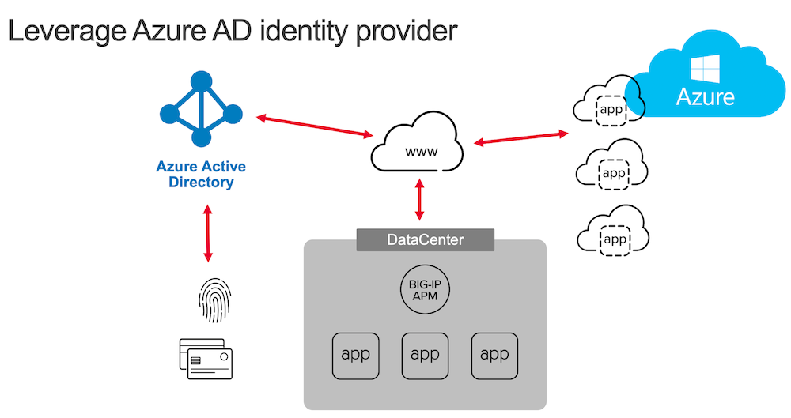
.. |image002| image:: ./media/lab01/002.png
.. |image003| image:: ./media/lab01/003.png
.. |image004| image:: ./media/lab01/004.png
.. |image005| image:: ./media/lab01/005.png
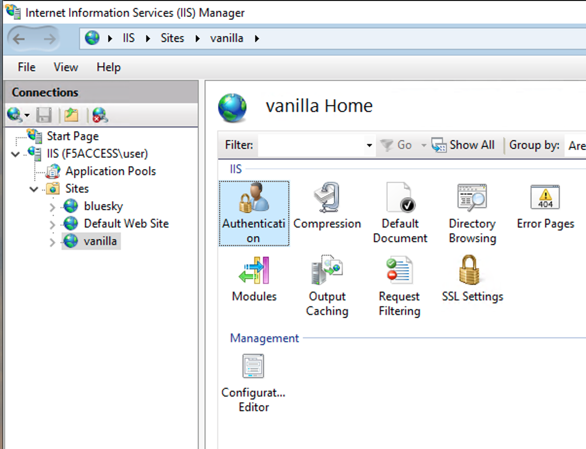
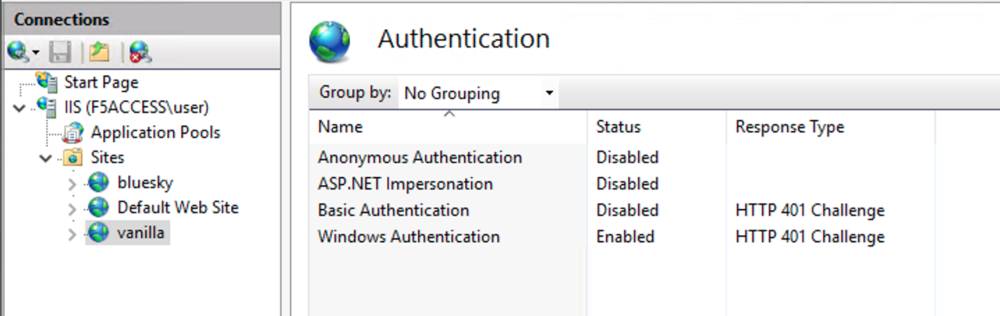
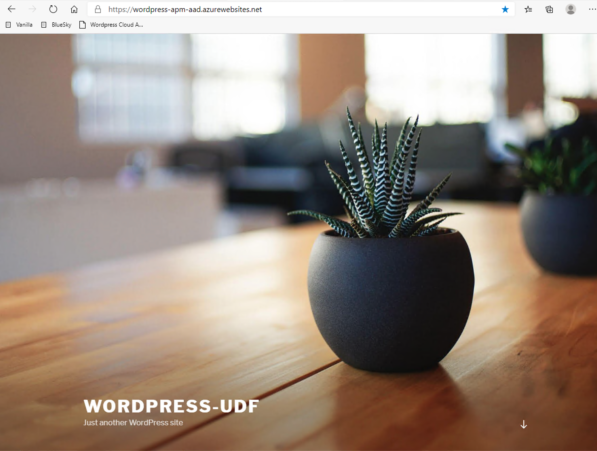
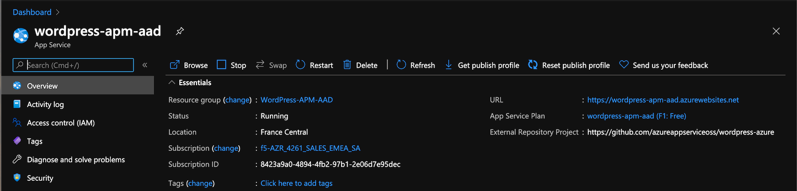
.. |image010| image:: ./media/lab01/010.png
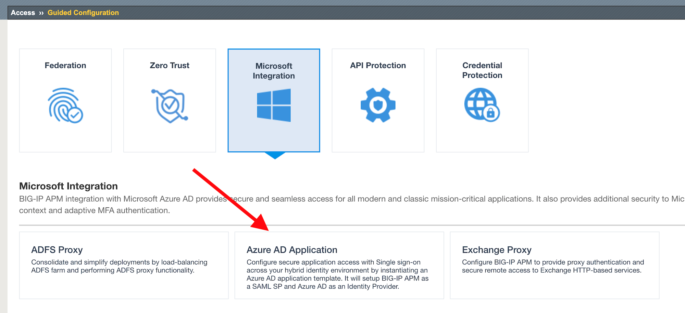
.. |image012| image:: ./media/lab01/012.png
.. |image013| image:: ./media/lab01/013.png
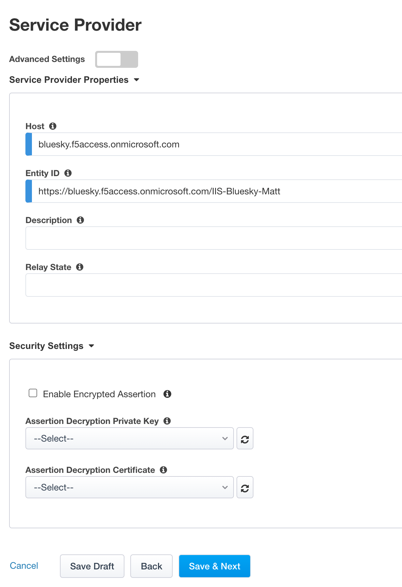
.. |image015| image:: ./media/lab01/015.png
.. |image016| image:: ./media/lab01/016.png
.. |image017| image:: ./media/lab01/017.png
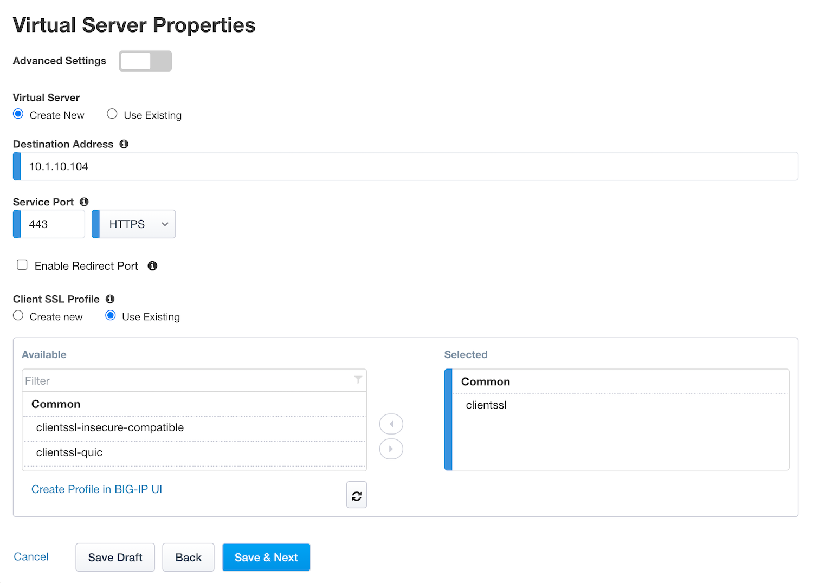
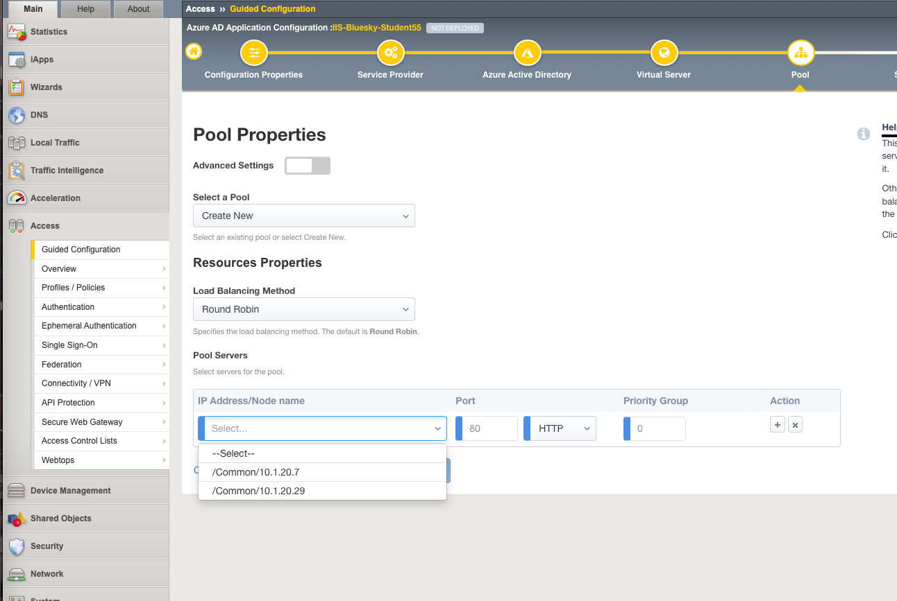
.. |image020| image:: ./media/lab01/020.png
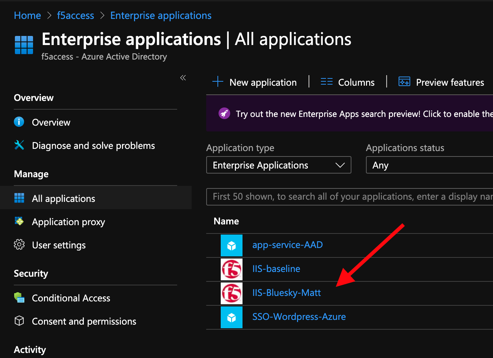
.. |image022| image:: ./media/lab01/022.png
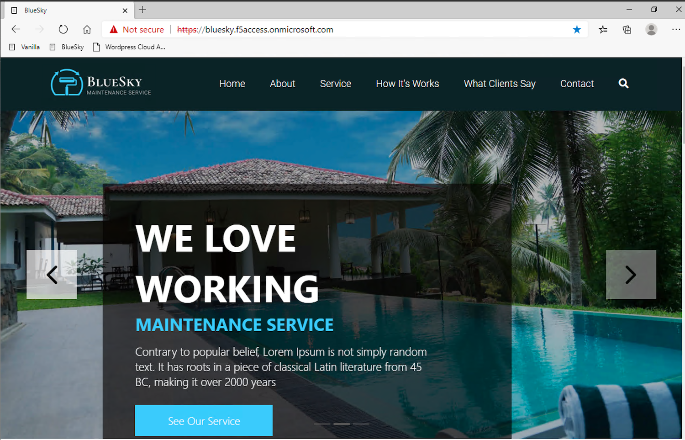
.. |image024| image:: ./media/lab01/024.png
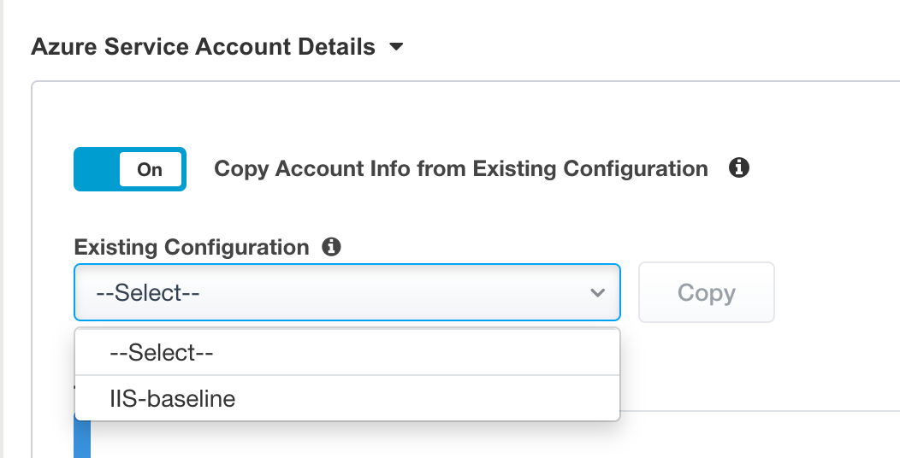
