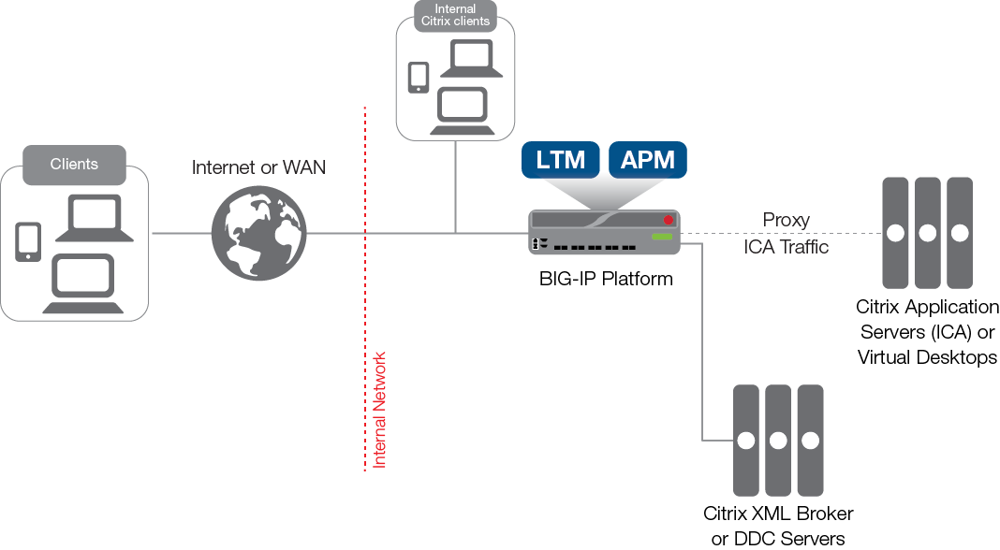

Lab 1: Citrix integration
=========================

UDF Blueprint:
---------------
https://udf.f5.com/b/426b4a32-ba15-40f3-9867-59aabd554e6a#documentation

   

Lab devices: 
---------------

- Xen DDC 7.14
- Storefront 3.11
- Active Directory Domain Controler
- Windows client
- BIGIP 16.1.2 with Storefront protocol support.

Demo script:
---------------

Replacing Citrix Storefront (Storefront replacement)

1. RDP to Win client machine as "ITC\user1" and password "user1"
2. Launch Chrome browser
3. Click on the bookmark "Without Storefront"
4. Authenticate to APM with "user" / "user"
5. Then click on a Citrix ressource
6. Logout from the start menu if you click on the Windows machine in Citrix page.

You can make a demo with Citrix Receiver Initiated:

1. Click on Receiver icon in the taskbar
2. Login as itc\user and password user
3. Click on any apps or desktop.

