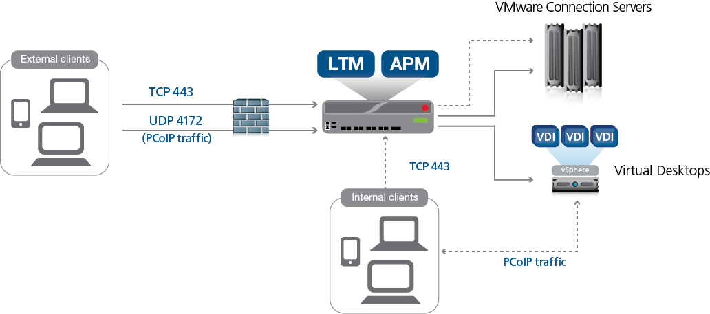

Lab 1: VMware Horizon integration
==================================

UDF Blueprint:
---------------
https://udf.f5.com/b/d0cdf4d9-1624-4727-a6c3-ae6885ac1dc2#documentation

   
.. Note:: For this Horizon Environment to Stabilize it takes approx 20 minutes after starting the deployment for all of the horizon brokers/agents to normalize.

.. Note:: VMware UAGs are not apart of this lab.

Lab devices: 
---------------

+---------------------------------+------------+
| Hostname                        | IP address |
+=================================+============+
| horizon-internal.horizon.local  | 10.1.20.50 |
| horizon-apm.horizon.local       | 10.1.20.51 |
| horizon-dns.horizon.local       | 10.1.20.54 |
| workspace.horizon.local         | 10.1.20.55 |
| horizon-jwt.horizon.local       | 10.1.20.56 |
+---------------------------------+------------+

Demo script:
---------------

1. RDP to External Client machine as "Administrator" and password "obtained from Details tab"
2. Launch Chrome browser
3. write the URL (https://horizon-apm.horizon.local) to access through F5 APM.
4. Authenticate to APM with "horizon\horizon_user" and password "H0rIzoN!"
5. Then click on RDP resource. 
6. Logout from the start menu if you click on the Windows machine in VMware page.

You can make a demo with Horizon VMware view client:

1. Click on VMware view client and add server (horizon-apm.horizon.local)
2. Login as "horizon\horizon_user" and password "H0rIzoN!"
3. Click on any apps or desktop.
