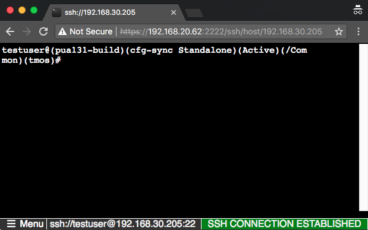
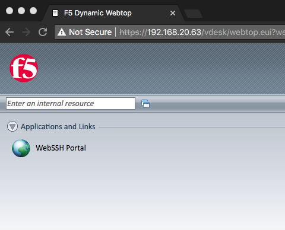
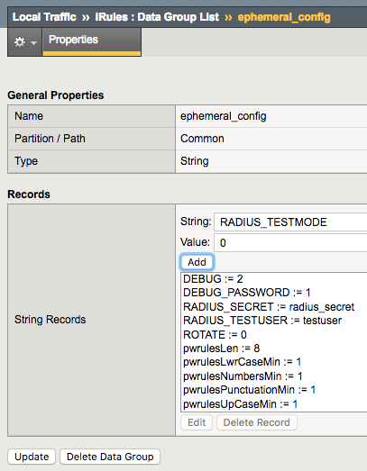

Lab 1: WebSSH and APM
---------------------

The Privileged User Authentication (PUA) solution is made up of three
parts.

1. WebSSH2 Client Plugin

2. Ephemeral Authentication Plugin

3. Access Policy Manager (APM) policy configuration

Requirements
~~~~~~~~~~~~

-  BIG-IP with TMOS v13.1.0.2 or greater.

-  1-5 IP addresses for virtual servers (see Resource
   Table)

Prerequisites
~~~~~~~~~~~~~

BIG-IP with at least APM and iRules LX licensed and provisioned

The `build_pua.zip` or `build_pua_offline.zip`
installation script found here:

    https://raw.githubusercontent.com/billchurch/f5-pua/master/build_pua.zip

    https://raw.githubusercontent.com/billchurch/f5-pua/master/build_pua_offline.zip

.. NOTE::
   These requirements, and prerequisites have all been provisioned ahead of time for you.

Installation Overview
~~~~~~~~~~~~~~~~~~~~~

The installation will consist of installing and testing (in order)

1. BIG-IP Preparation

2. Script download and execution

3. Customization of APM policy

Resource Table
~~~~~~~~~~~~~~

+-------------------------+------------------------------------------------------------------+-------------+
| **Resource**            | **Description**                                                  | **Value**   |
+=========================+==================================================================+=============+
| WebSSH\_proxy\_vs\_IP   | Virtual server IP Address of WebSSH2 service.                    | 10.1.10.240 |
+-------------------------+------------------------------------------------------------------+-------------+
| APM\_Portal\_vs\_IP     | Virtual server IP Address of APM portal for authentication       | 10.1.10.240 |
+-------------------------+------------------------------------------------------------------+-------------+
| RADIUS\_proxy\_vs\_IP   | Virtual server IP address of RADIUS proxy service                | 10.1.10.240 |
+-------------------------+------------------------------------------------------------------+-------------+
| LDAP\_proxy\_vs\_IP     | Virtual server IP address of LDAP proxy service                  | 10.1.10.240 |
+-------------------------+------------------------------------------------------------------+-------------+
| LDAPS\_proxy\_vs\_IP    | Virtual server IP address of LDAPS proxy service                 | 10.1.10.240 |
+-------------------------+------------------------------------------------------------------+-------------+
| LDAP\_server\_IP        | IP Address of site LDAP or AD server (required for LDAP use)     | 10.1.10.240 |
+-------------------------+------------------------------------------------------------------+-------------+
| RADIUS\_server\_IP      | IP Address of site RADIUS server (if RADIUS bypass is used)      | 10.1.10.240 |
+-------------------------+------------------------------------------------------------------+-------------+

Installation
~~~~~~~~~~~~

This script will configure a reference implementation of the F5 Privileged User Authentication solution.
The only requirements are a running and licensed system ("Active"), initial configuration complete
(licensed, VLANs, self IPs), and preferably already provisioned for LTM+APM+ILX. The script will check
for and can enable it for you if you wish.

You will be prompted for IP addresses for 5 services:

- WebSSH Proxy - This IP may be shared with other IPs on the BIG-IP system if the protocol/port (tcp/2222)
  do not conflict. This proxy is ultimately called by the APM web top. It’s also important to note that
  SNAT may not be used on this virtual server. (webssh_proxy)

- RADIUS Proxy – This runs the RADIUS Ephemeral Authentication Service. This IP may be shared with other IPs
  on the BIG-IP system if the protocol/port (udp/1812) do not conflict. (radius_proxy)

- LDAP Proxy – This runs the LDAP Ephemeral Authentication Service. This IP may be shared with other IPs on
  the BIG-IP system if the protocol/port (tcp/389) do not conflict. (ldap_proxy)

- LDAPS Proxy – This runs the LDAPS (ssl) Ephemeral Authentication Service. This IP may be shared with other
  IPs on the BIG-IP system if the protocol/port (tcp/636) do not conflict. (ldaps_proxy)

- Web top – This runs the LDAP Ephemeral Authentication Service. This IP may be shared with other IPs on the
  BIG-IP system if the protocol/port (tcp/443) do not conflict. By default SNAT is disabled for this vs as
  the WebSSH proxy may not interoperate with SNAT. If you change this option be sure to institute some sort
  of selective disable option (iRule) when connecting to the webssh_proxy as a portal resource.

WebSSH, LDAPS, and web top will all be initially configured with a default client-ssl profile, after testing
this should be changed to use a legitimate certificate.

A blank APM policy is created and attached to the web top vs “pua_webtop”, this policy will need to be built
out for the pua_webtop service to operate correctly.

.. NOTE::
   For this lab, the scripts have been preloaded to /tmp, and we will be using build_pua_offline.sh and using Offline Installation Method.  The online instructions, in the event you wish to deploy in your own environment, can be located here:  https://raw.githubusercontent.com/billchurch/f5-pua/master/docs/PUA%20Solution%20Install%20Guide.docx  If the scripts do not appear in /tmp, they have also been copied to /root.

Offline Installation Method
~~~~~~~~~~~~~~~~~~~~~~~~~~~

This method utilizes the `build_pua_offline.sh/zip` method to
install the PUA solutions from a closed network or a BIG-IP with limited
or no Internet connectivity.

Run Installation Script
~~~~~~~~~~~~~~~~~~~~~~~

.. NOTE::
   This lab utilizes the Non-Interactive Install mode. A file called pua_config.sh may be placed in the same directory as build_pua.sh or build_pua_offline.sh to fully automate the install, or provide defaults for a "semi-automatic" deployment. See pua_config.sh as an example.

   When started, build_pua.sh or build_pua_offline.sh both check for the existence of this file.

   Additionally, most of the variables set in the top of pua_config.sh and pua_config_offline.sh may be overridden by this file.

1. Run **/tmp/build_pua_offline.sh** or **/root/build_pua_offline.sh**
2. Win.

Validation
----------

WebSSH2 Client
~~~~~~~~~~~~~~

1. Open a web browser and DO NOT navigate to the first URL given by the script.  The IP show in the script is internal and will not be accessible externally.  Instead, you will have to use the IP from the Student Portal "Webtop" link.

example: https://[VS_IP]:2222/ssh/host/10.1.0.240

2. Enter the username **testuser** with any password and click login.

|image0|

3. You should be greeted with a tmsh prompt to the BIG-IP the script was installed on, logged in as the user ***testuser***.

|image1|

APM Policy and Portal Mode
~~~~~~~~~~~~~~~~~~~~~~~~~~

1. Open a web browser and navigate to the second URL given by the script.

example: `https://[Public IP of Virtual Server]`

2. The sample USG Warning and Consent Banner should appear, click **OK**.

|image2|

3. Enter a random username other than *testuser* and any password. Click **Logon**.

|image3|

4. You should be directed to the webtop, click the **WebSSH Portal** icon.

|image4|

5. You should be presented with another WebSSH2 screen, logged into the BIG-IP the script was installed on as the user you provided in step 3.

|image5|

.. |image0| image:: ./media/image1.png
   :width: 3in

.. |image2| image:: media/image3.png
   :width: 3in
.. |image3| image:: media/image4.png
   :width: 3in

.. |image5| image:: media/image6.png
   :width: 4.64000in
   :height: 1.96000in

.. |image7| image:: media/image8.png
   :width: 2.77000in
   :height: 1.96000in
.. |image8| image:: media/image9.png
   :width: 2.77000in
   :height: 2.01000in
