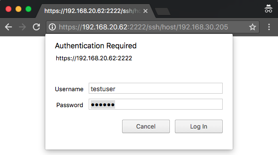
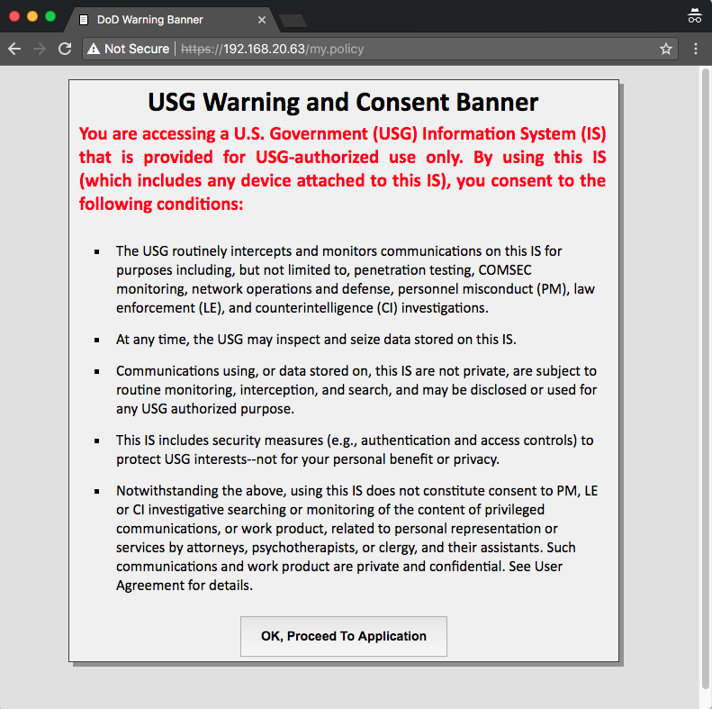
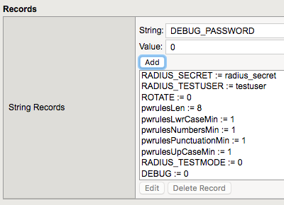

Validation
==========

WebSSH2 Client
--------------

1. | Open a web browser and navigate to the first URL given by the
     script.
   | example: **https://192.168.20.62:2222/ssh/host/192.168.30.205 **

2. | Enter the username **testuser** with any password and click login
   | |image0|

3. | You should be greeted with a tmsh prompt to the BIG-IP the script
     was installed on, logged in as the user ***testuser***.
   | |image1|

APM Policy and Portal Mode
--------------------------

1. | Open a web browser and navigate to the second URL given by the
     script.
   | example: `**https://192.168.20.63** <https://192.168.20.63>`__

2. The sample USG Warning and Consent Banner should appear, click **OK
   **\ |image2|\ **
   **

3. | Enter a random username other than *testuser* and any password.
     Click **Logon**.
   | |image3|

4. | You should be directed to the webtop, click the **WebSSH Portal**
     icon.
   | |image4|

5. You should be presented with another WebSSH2 screen, logged into the
   BIG-IP the script was installed on as the user you provided in step
   3. |image5|

Production Considerations
=========================

The solution enables test accounts to ensure all components are
configured correctly as well as additional debug messages, these should
be disabled on production systems.

You may prevent the creation of these test accounts as well as
additional debug messages from the start by utilizing the
***pua\_config.sh*** script and setting ***disabletest=”y”***. Otherwise
follow the instructions outlined in `Disable Test Accounts and
Debug <#disable-test-accounts-and-debug>`__.

Disable Test Accounts and Debug
-------------------------------

1. Navigate to **Local Traffic > iRules > Data Group List**

2. Click **ephemeral\_config**

3. Find and select **RADIUS\_TESTMODE** and click **Edit**

4. Under **Value**, enter **0** and click **Add
   **\ |image6|

5. Find and select **DEBUG** and click **Edit**

6. Under **Value**, enter **0** and click **Add
   **\ |image7|

7. Find and select **DEBUG\_PASSWORD** and click **Edit**

8. | Under **Value**, enter **0** and click **Add**
   | |image8|

9. Click **Update**

Test accounts and additional debug messages are now disabled on the
system. You will need to cause the pua\_webtop virtual server to trigger
RULE\_INIT in order to reload this configuration.

.. |image1| image:: images/image2.png
   :width: 4.27000in
   :height: 2.68000in

.. |image3| image:: images/image4.png
   :width: 2.94000in
   :height: 2.64000in
.. |image4| image:: images/image5.png
   :width: 3.32000in
   :height: 2.68000in
.. |image5| image:: images/image6.png
   :width: 4.64000in
   :height: 1.96000in
.. |image6| image:: images/image7.png
   :width: 2.82000in
   :height: 3.63000in
.. |image7| image:: images/image8.png
   :width: 2.77000in
   :height: 1.96000in

