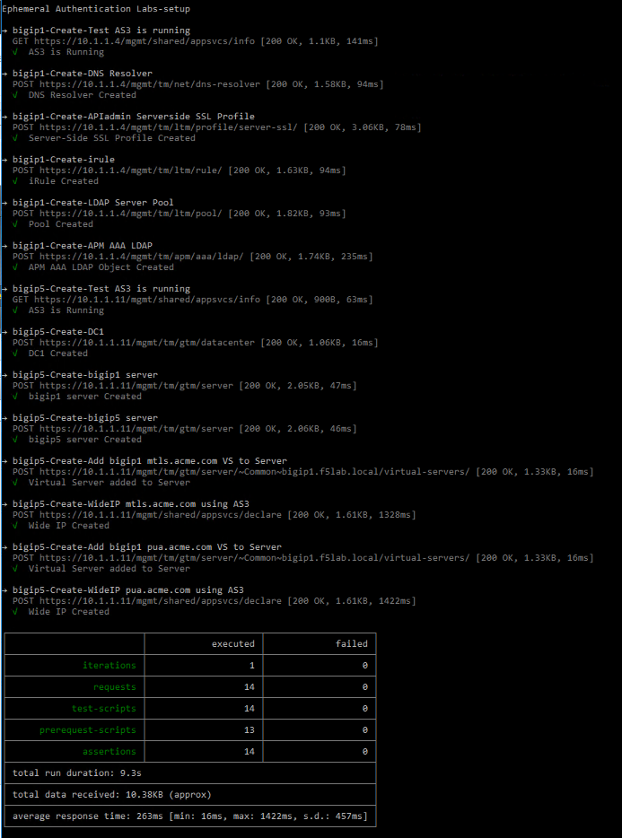

Class - Ephemeral Authentication
===================================

The Ephemeral Authentication lab is a combination of multiple features included in Access Policy Manager to enhance security for Authentication schemes. The first module will cover the implementation of **Client Certificate Constrained Delegation (C3D)** features enhanced in APM. This use case is often referred to as CertSSO.  The second module covers the **Privileged User Access** solution with a specific focus on ephemeral authentication for SSH access to network devices, as well integration with code respositories.

This class covers the following topics related to Ephemeral Authentication:

- LDAP Ephemeral Authentication
- RADIUS Ephemeral Authentication
- HTML5 SSH
- C3D APM Enhancements

Expected time to complete: **1 hour**

UDF blueprint version: **44**

Setup Lab Environment
----------------------------------------

#. Click the **Command Prompt** shortcut to open the command prompt on the jumphost 

   |image1|

#. Type the command **cd c:\\labs\\class2\\postman** to navigate the Postman collection folder.

#. Type the command **setup.bat**

#. All Steps in the collection should succeed before moving on to the lab.  If an API call fails run the collection again by repeating the previous step.  

   |image2|

.. |image1| image:: media/image001.png

.. toctree::
   :maxdepth: 1
   :glob:

   labinfo
   module*/module*
