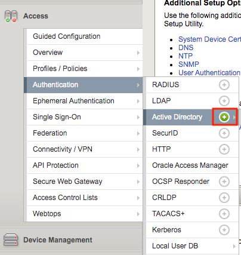
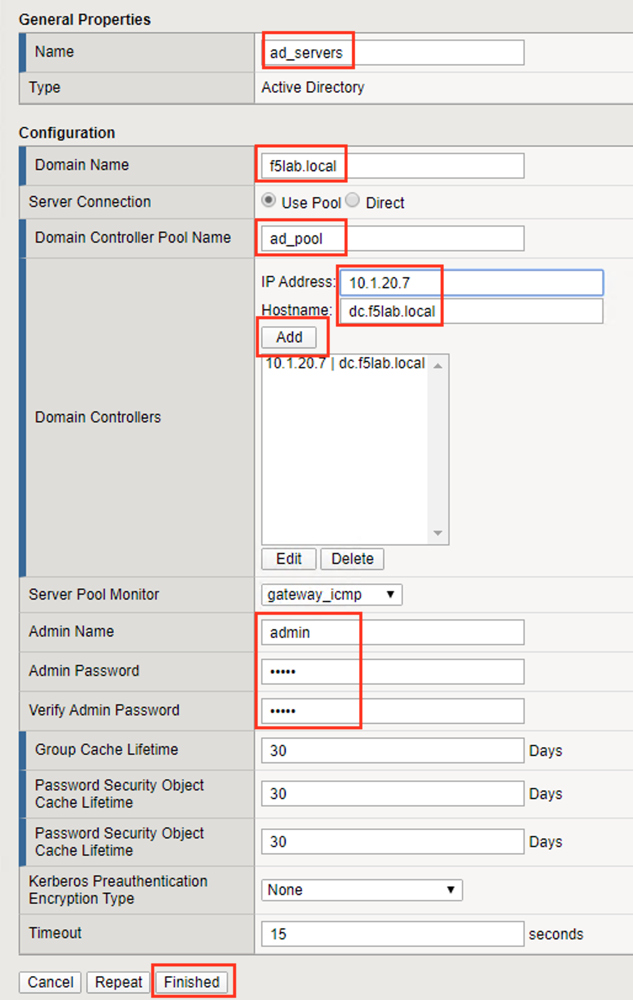
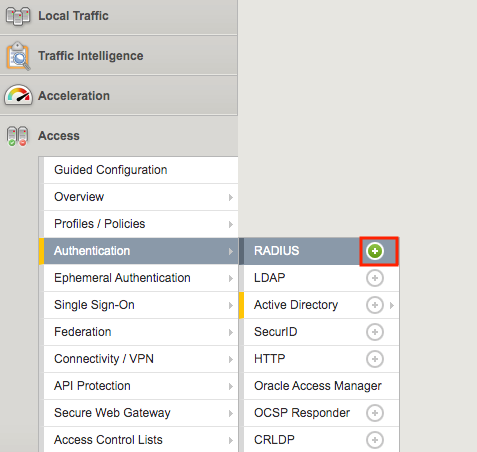
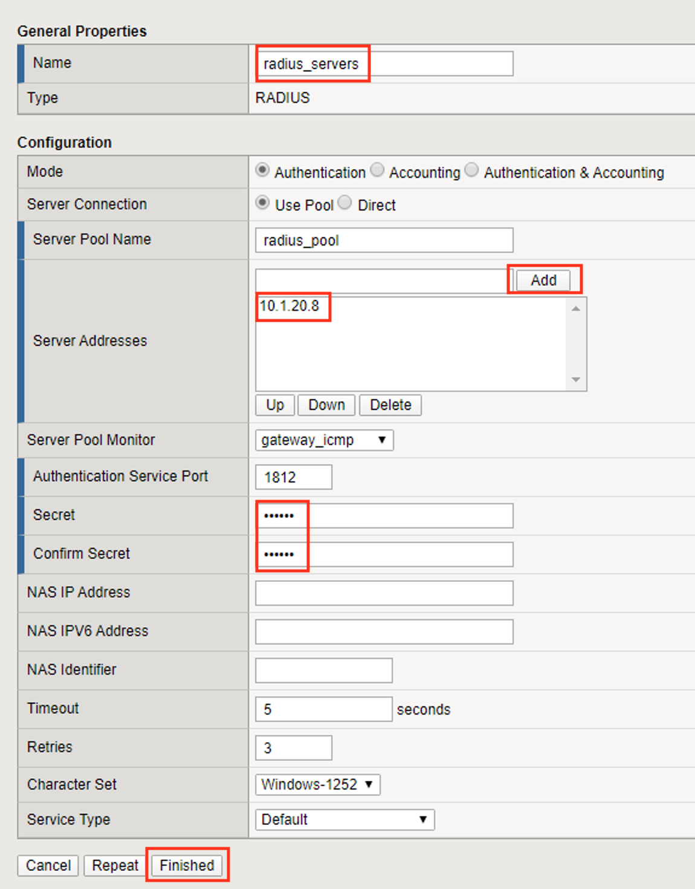

Lab 1.1 - Create Authentication objects
---------------------------------------

The first step in deploying CertSSO is creating the objects required for the user to authenticate to APM.  In this lab, the user will authenticate via Active Directory and simulated MFA via RADIUS.  The user's authentication method to APM is independent of how the BIG-IP authenticates the user to the backend server for Single-Sign-On.  This allows an organization to choose an authentication scheme that matches their needs such as SAML, OAuth, or other method.

Task 1 - Create an Active Directory AAA Object
~~~~~~~~~~~~~~~~~~~~~~~~~~~~~~~~~~~~~~~~~~~~~~~~~~

#. From the web browser, click on the **Access** tab located on the left side.

   |image0|

#. Navigate to **Authentication >> Active Directory**, then click the **+** (plus symbol) to create a new AAA object

   |image1|

#. Enter the following information for the AD Authentication Object

   - Name: **ad_servers**
   - Domain Name: **f5lab.local**
   - Domain Controller Pool Name: **ad_pool**
   - Domain Controller IP address: **10.1.20.7**
   - Domain Controller Hostname: **dc.f5lab.local**
   - Admin name: **admin**
   - Admin Password: **admin**

   |image2|

#. Click **Finished**

Task 2 - Create a RADIUS AAA Object
~~~~~~~~~~~~~~~~~~~~~~~~~~~~~~~~~~~~~~~~~

#. From the web browser, click on the **Access** tab located on the lefthand side.

#. Navigate to **Authentication >> RADIUS**, then click the **+** (plus symbol) to create a new AAA object

   |image3|

#. Enter the following information for the Radius Authentication Object

   - Name: **radius_servers**
   - Server Pool Name: **radius_pool**
   - Server Addresses: **10.1.20.8**
   - Secret password: **secret**

   |image4|

#. Click **Finished**

.. |image0| image:: media/image000.png
	:width: 800px

