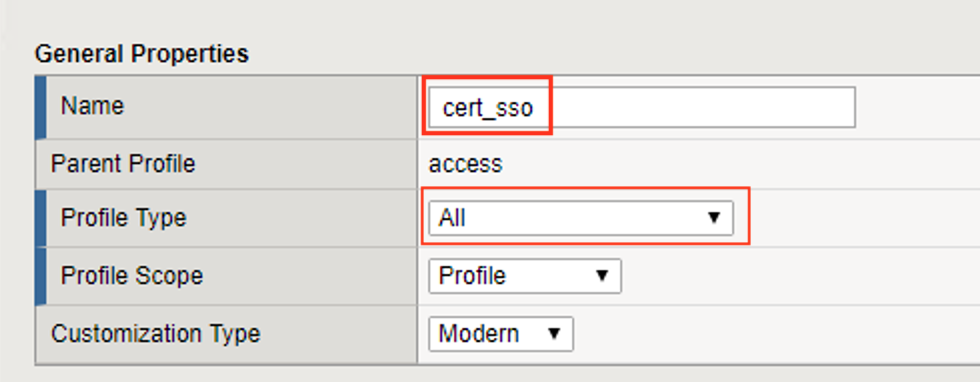

Lab 1.2 - Create an Access profile
-----------------------------------

In this section, you will create and define the settings of the APM Access Profile.

Task 1 - Create the cert_sso Access Profile
~~~~~~~~~~~~~~~~~~~~~~~~~~~~~~~~~~~~~~~~~~~~

#. From the web browser, click on the **Access** tab located on the left side.

#. Navigate to **Profile/ Policies >> Access Profile(Per-Session Policies)**, then click the **+** (plus symbol) to create a new Access Profile

   |image5|

#. Enter the Name **cert_sso** 
#. Select the profile Type **All** from the dropdown

   |image6|

#. Scroll to the bottom of the profile settings to set the default language to **English**

#. Click **Finished**

   |image7|

.. |image0| image:: media/image000.png
	:width: 800px
.. |image1| image:: media/image001.png
.. |image2| image:: media/image002.png
	:width: 800px
.. |image3| image:: media/image003.png
.. |image4| image:: media/image004.png
	:width: 700px
.. |image5| image:: media/image005.png

.. |image7| image:: media/image007.png

