Lab 1.3 - Create the Access Policy
------------------------------------

In this section, edit the policy using the Visual Policy Editor to enable users to login via AD+MFA, then transition to CertSSO.

Task 1 - Open Visual Policy Editor
~~~~~~~~~~~~~~~~~~~~~~~~~~~~~~~~~~~~

#. On the cert_sso profile line click **edit** under Per-Session Policy

   |image8|

#. Click the **+** (plus symbol) located on the fallback branch located between the **Start** and **Deny** boxes

   |image9|

#. Click the **Logon** Tab
#. Select **Logon Page**  
#. Click **Add Item**

   |image11|

#. Add an additional field to the logon page by selecting **password** from the **Type** dropdown (line 3)
#. Enter **OTP** for **Post Variable Name**
#. Enter **OTP** for **Session Variable Name**
#. Enter **OTP** for **Logon Page Input Field #3**
#. Click **Save**

   |image12|

#. Click the **+** (plus symbol) located on the fallback branch located between the **Logon Page** and **Deny** boxes

   |image13|

#. Click the **Authentication** tab
#. Select **RADIUS Auth**  
#. Click **Add Item**

   |image14|

#. Select **radius_servers** from the **AAA Server** dropdown box
#. Change the password source to **%{session.logon.last.OTP}**
#. Click **Save**

   |image15|

#. Click the **+** (plus symbol) located on the **Successful** branch located between **RADIUS Auth** and **Deny** boxes

   |image16|

#. In the **Authentication** tab, select **AD Auth** 
#. Click **Add Item**

   |image17|

#. Select **ad_servers** from the Server dropdown box
#. Click **Save**

   |image18|

#. Click the **+** (plus symbol) located on the **Successful** branch located between **AD Auth** and **Deny** box
#. Click **Add Item**

   |image10|

#. In the **Assignment** tab, select **Variable Assign** 
#. Click **Add Item**

   |image19|

#. Click **Add new entry**

   |image36|

#. Click **change**

   |image37|

#. Enter **session.ssl.cert.whole** in the custom variable field

   |image38|

#. Locate the **F5CertSSO.f5lab.local.txt** file in the **C:\\labs\\class2\\student_files** directory. 

   |image39|

#. Open the file with **notepad++** and copy the contents of the file

   |image40|

#. Return to the **Visual Policy Editor** and paste the certificate into the **custom expression** field
#. Click **Finished**

   |image41|

#. Click **Save**

   |image42|

#. Click the **Deny** ending icon located on the fallback branch of the **Variable Assign** agent

   |image20|

#. Click **Allow**
#. Click **Save**

   |image21|

#. Click **Apply Access Policy** located in the top left corner to commit the policy changes

.. |image0| image:: media/image000.png
	:width: 800px
.. |image1| image:: media/image001.png
.. |image2| image:: media/image002.png
	:width: 800px
.. |image3| image:: media/image003.png
.. |image4| image:: media/image004.png
	:width: 700px
.. |image5| image:: media/image005.png
.. |image6| image:: media/image006.png
	:width: 800px
.. |image7| image:: media/image007.png
.. |image8| image:: media/image008.png
.. |image9| image:: media/image009.png
.. |image10| image:: media/image010.png
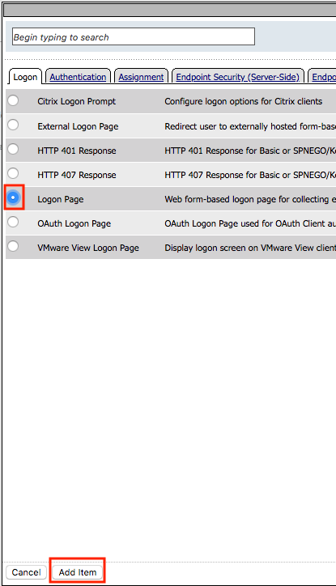
.. |image12| image:: media/image012.png
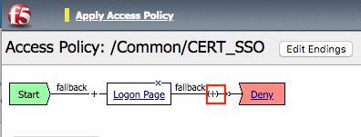
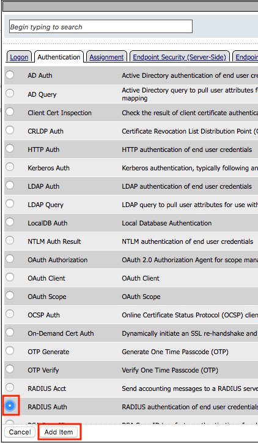
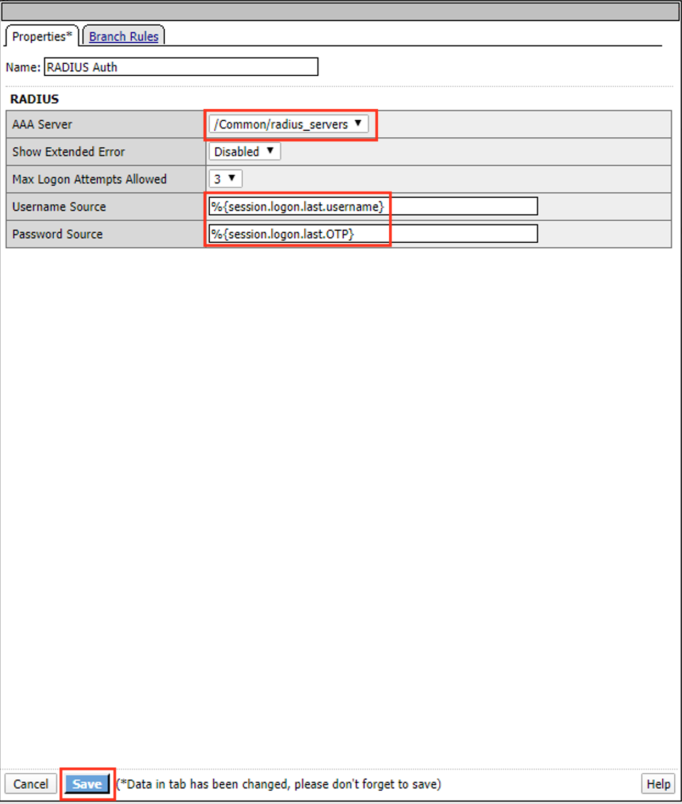
.. |image16| image:: media/image016.png
.. |image17| image:: media/image017.png
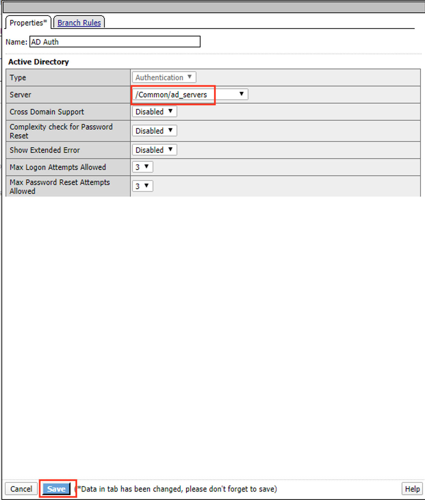
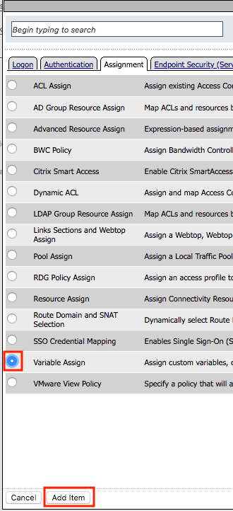
.. |image20| image:: media/image020.png
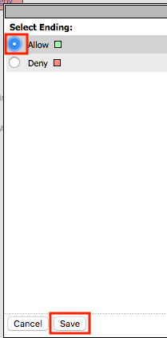
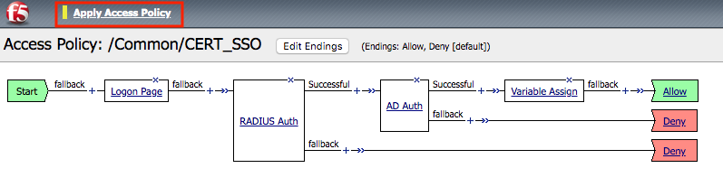
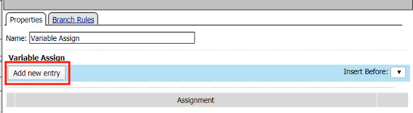
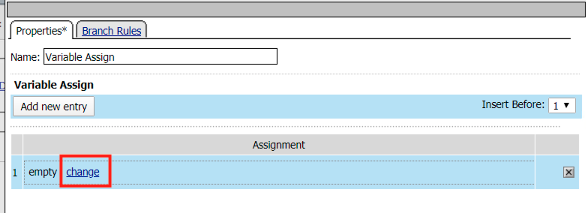
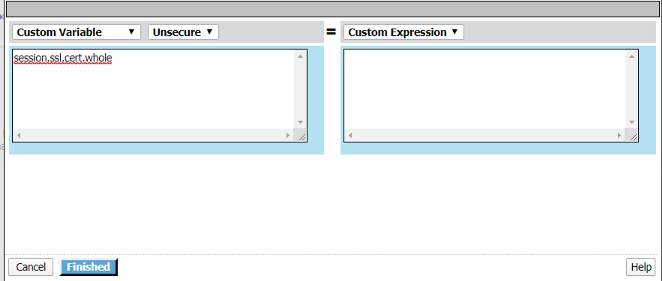
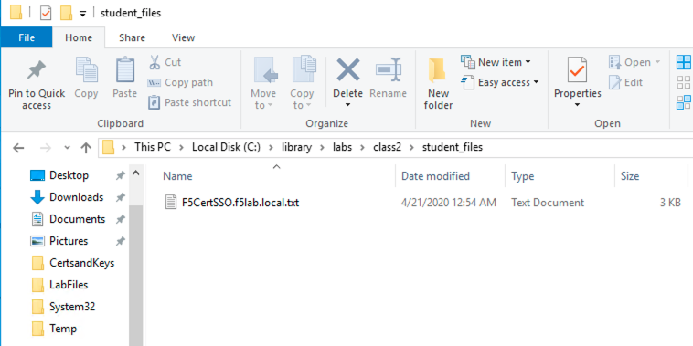
.. |image40| image:: media/image040.png
.. |image41| image:: media/image041.png
.. |image42| image:: media/image042.png
