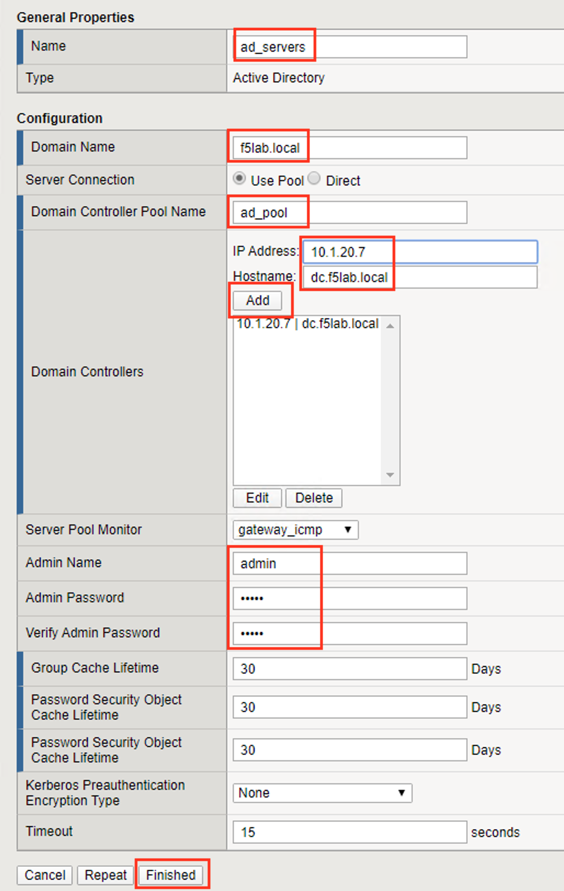
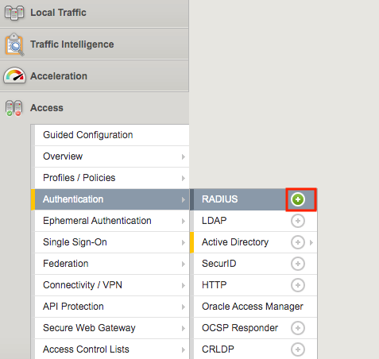
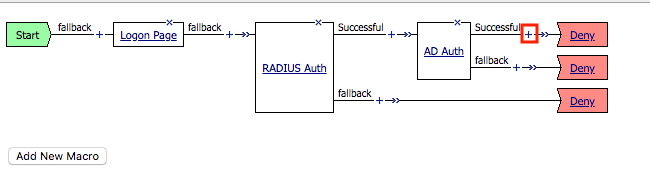
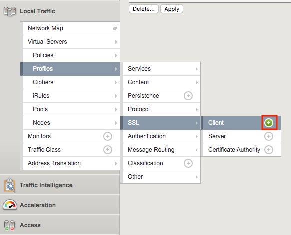
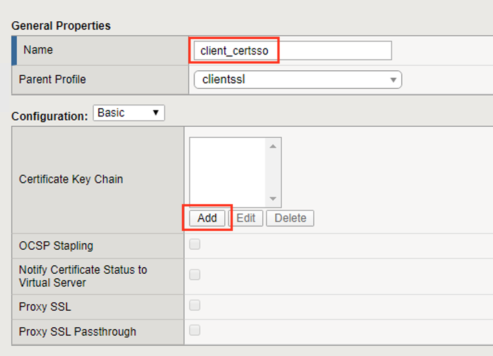
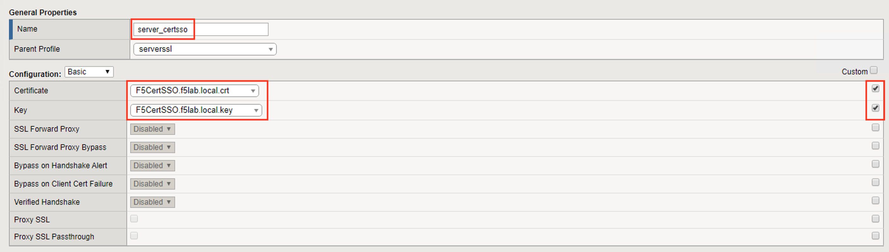
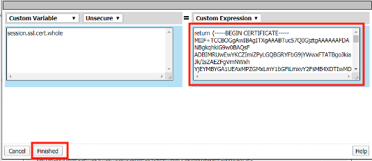

Lab 1.4. - Create the SSL Profiles
------------------------------------

In this section, you will define the virtual server IP address and its SSL profile settings.

Task 1 - Create a Client SSL Profile
~~~~~~~~~~~~~~~~~~~~~~~~~~~~~~~~~~~~~~

#. Navigate to **Local Traffic >> Profiles >> SSL >> Client**, then click the **+** (plus symbol) to create a new **SSL Profile**

   |image23|

#. Enter the name **client_certsso**
#. **Check** the **custom** box to the right of **Certificate Key Chain**
#. Click **add**

   |image24|

#. Select **acme.com-wildcard.crt** from the **certificate** dropdown box
#. Select **acme.com-wildcard.key** from the **key** dropdown box
#. Click **Add**

   |image25|

#. **Check** the **custom** box to the right of **Client Certificate Constrained Delegation**
#. Select **Enabled** from the **Client Certificate Constrained Delegation** dropdown box
#. Click **Finished**

   |image26|

#. Click **Finished**

Task 2 - Create a Server SSL Profile
~~~~~~~~~~~~~~~~~~~~~~~~~~~~~~~~~~~~~~~~~~

#. Navigate to **Local Traffic >> Profiles >> SSL >> Server**, then click the **+** (plus symbol) to create a new SSL Profile

   |image27|

#. Enter **server_certsso** for profile name
#. **Check** the two custom boxes next to **Certificate** and **Key**
#. Select **F5CertSSO.f5lab.local.crt** from the **certificate** dropbox box
#. Select **F5CertSSO.f5lab.local.key** from the **key** dropdown box

   |image28|

#. Check the **custom** box about the **Client Certificate Constrained Delegation** box
#. Select **Enabled** from the **Client Certificate Constrained Delegation** dropdown box
#. Select **F5SubCA.f5lab.local.crt** from the **CA Certificate** dropdown box
#. Select **F5SubCA.f5lab.local.key** from the **CA Key dropdown** box
#. **Click** Finished

   |image29|

.. |image0| image:: media/image000.png
	:width: 800px
.. |image1| image:: media/image001.png

.. |image4| image:: media/image004.png
	:width: 700px

.. |image6| image:: media/image006.png
	:width: 800px

.. |image11| image:: media/image011.png

.. |image13| image:: media/image013.png
.. |image14| image:: media/image014.png
.. |image15| image:: media/image015.png
	:width: 800px

.. |image17| image:: media/image017.png
.. |image18| image:: media/image018.png
	:width: 800px
.. |image19| image:: media/image019.png

.. |image21| image:: media/image021.png
.. |image22| image:: media/image022.png

.. |image36| image:: media/image036.png
.. |image37| image:: media/image037.png
.. |image38| image:: media/image038.png
.. |image39| image:: media/image039.png

