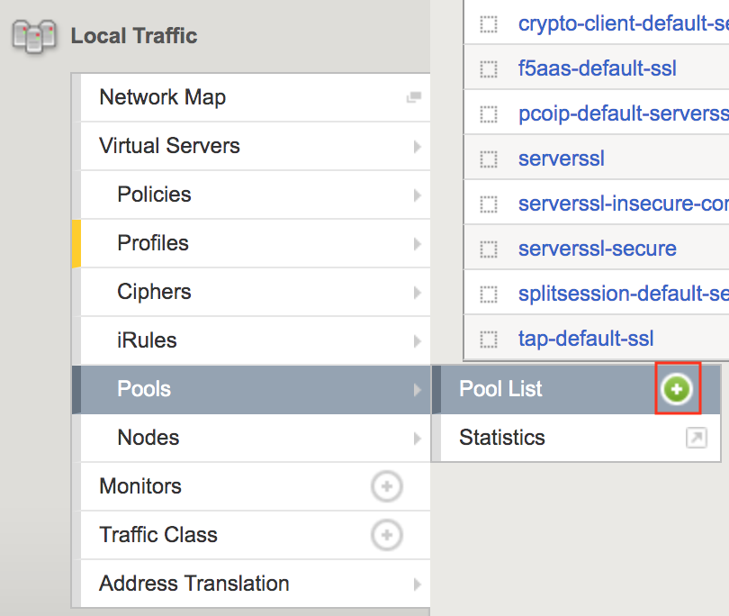
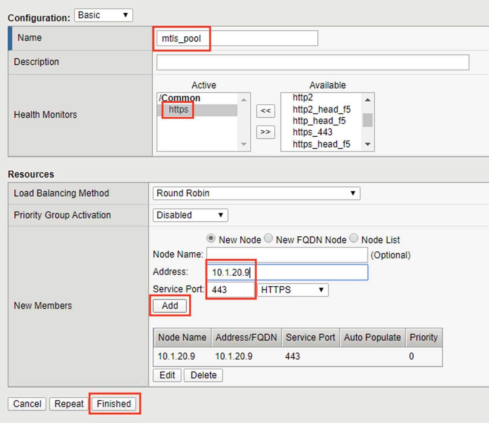

Lab 1.5 - Create a Pool
------------------------

In this section you create a pool that contains the IP address of the CentOS server hosting the website requiring mTLS.

Task 1 - Create the Pool
~~~~~~~~~~~~~~~~~~~~~~~~~

#. Navigate to **Local Traffic >> Pools >> Pool List**, then click the **+** (plus symbol) to create a new **Pool**

   |image30|

#. Enter **mtls_pool** for the **Pool Name**
#. Select **https** from the list of available monitors
#. Enter **10.1.20.9** for the member address
#. Enter **443** for the member port
#. Click **add**
#. Click **Finished**

   |image31|

