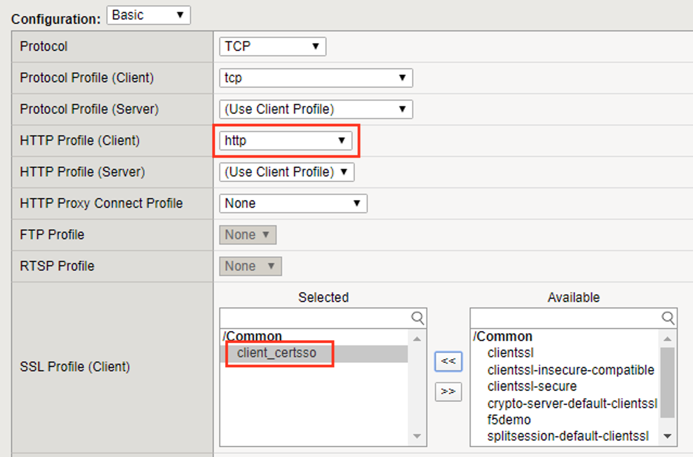
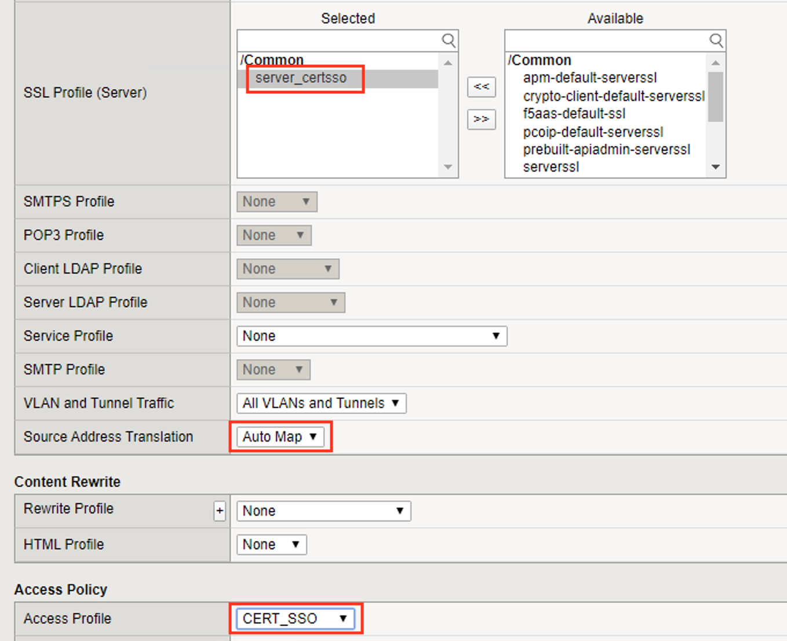
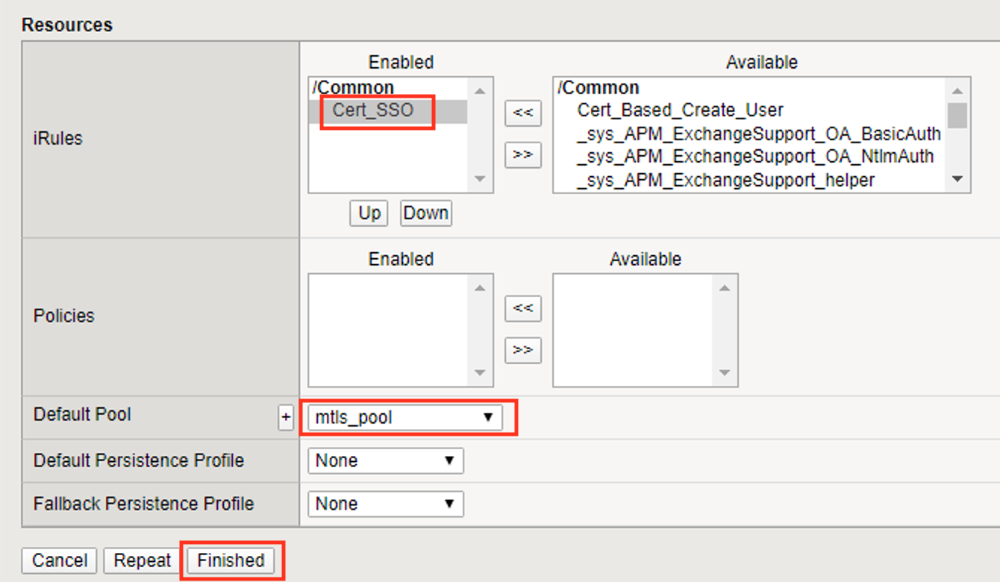

Lab 1.6 - Create the Virtual Server
------------------------------------------------

In this section you will configure a RADIUS server to enable simulated MFA capabilities.

Task 1 - Configure Virtual Server
~~~~~~~~~~~~~~~~~~~~~~~~~~~~~~~~~~~~~~~~~~

#. Navigate to **Local Traffic >> Virtual Servers >> Virtual Server List**, then click the **+** (plus symbol) to create a new virtual Server

   |image32|

#. Enter **mtls_vs** for the **Name**
#. Enter **10.1.10.105** for the **DestinationAddress/Mask**
#. Enter **443** for the **Service Port**
#. Select **http** for **HTTP Profile (Client)**
#. Select **client_certsso** from the **SSL Profile (Client)** List

   |image33|

#. Select **server_certsso** from the **SSL Profile (Server)** List
#. Select **Auto Map** from the **Source Address Translation** dropdown Box
#. Select **cert_sso** from the **Access Profile** dropdown Box

   |image34|

#. Select the irule **Cert_SSO**
#. Select **mtls_pool** for the **Default Pool**
#. Click **Finished**

.. note::

   The following iRule must be used when inserting custom extensions using C3D.

.. code-block:: none
   :linenos:

   when SERVERSSL_CLIENTHELLO_SEND {
      set username [ACCESS::session data get "session.logon.last.username"]
      set domain [ACCESS::session data get "session.ad.last.actualdomain"]
      SSL::c3d extension 1.1.1.1 "Minted Extension=$username@$domain"
   }

|image35|

