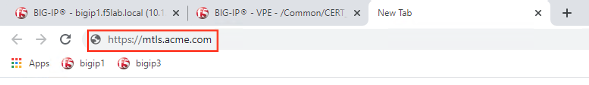
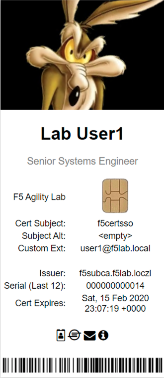
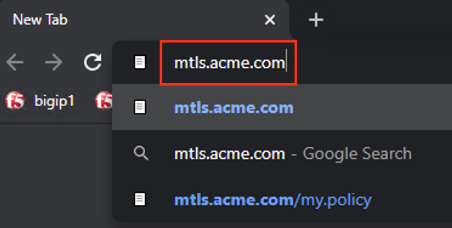
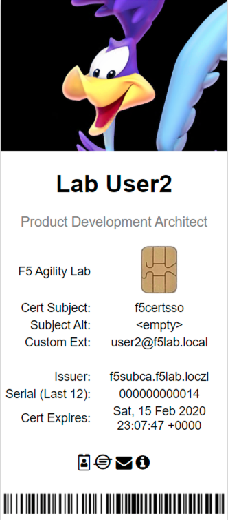

Lab 1.7 - Test CertSSO
------------------------------------------------

In this section, you will test access to an NGINX website requiring mTLS.

Task 1 - Access mtls.acme.com with static certificate
~~~~~~~~~~~~~~~~~~~~~~~~~~~~~~~~~~~~~~~~~~~~~~~~~~~~~~

#. From the jumpbox's web browser, access https://mtls.acme.com

#. Use the following credentials:
    - Username **user1** 
    - Password: **user1**
    - OTP: **123456**

   |image44|

#. You will be logged into the site as **User1**.

   .. note::

      The contents of the certificate used for logging into the website was the CertSSO certificate copied into Per-Session Policy. The iRule that was attached inserted the custom extension 1.1.1.1 with the value of the user's logon name.  Notice that the Subject Name is CertSSO, the Subject Alternative Name is empty, and the custom extension is user1@f5lab.local.
   
       - Cert Subject: **f5certsso**
       - Subject Alt: **<empty>**
       - Custom Ext: **user1@f5lab.local**

   |image45|

#. Open a new incognito browser window so you can test access to https://mtls.acme.com with different user credentials.

   |image48|

#. Use the following credentials:
    - Username **user2** 
    - Password: **user2**
    - OTP: **123456** 

   |image50|

#. You will be logged into the site as **user2@f5lab.local**

   .. note::

      Notice that user2's Cert Subject is the same as in User1, but the custom extension name is different (now user2@f5lab.local).
   
        - Cert Subject: **f5certsso**
        - Subject Alt: **<empty>**
        - Custom Ext: **user2@f5lab.local**

   |image51|

.. |image44| image:: media/image044.png
	:width: 800px

.. |image48| image:: media/image048.png

.. |image50| image:: media/image050.png
	:width: 800px

