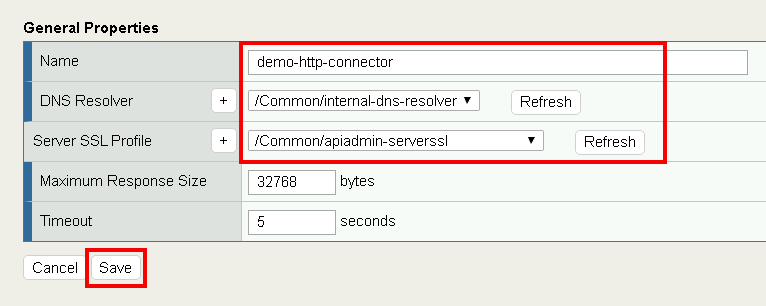
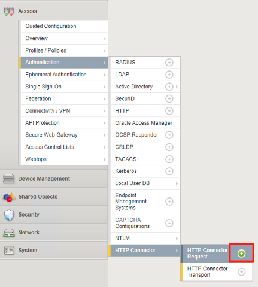
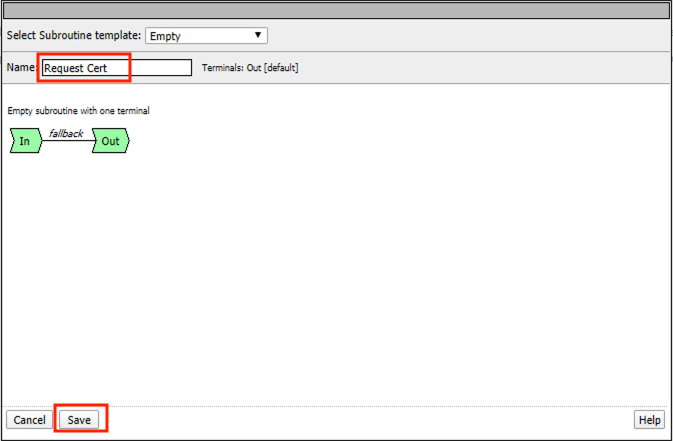
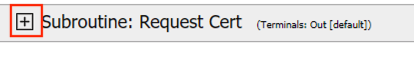
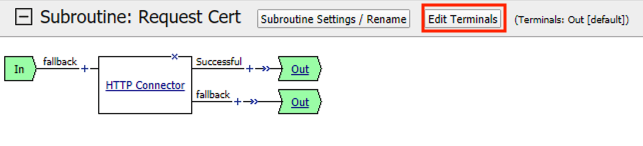
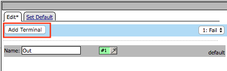
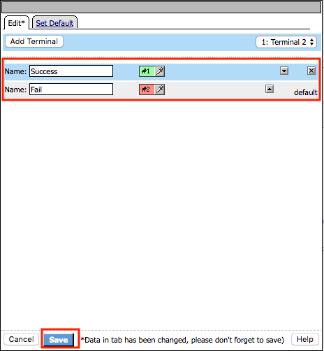
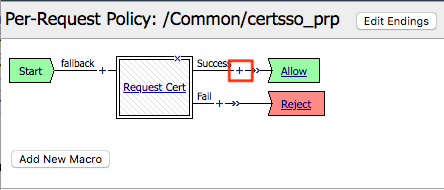
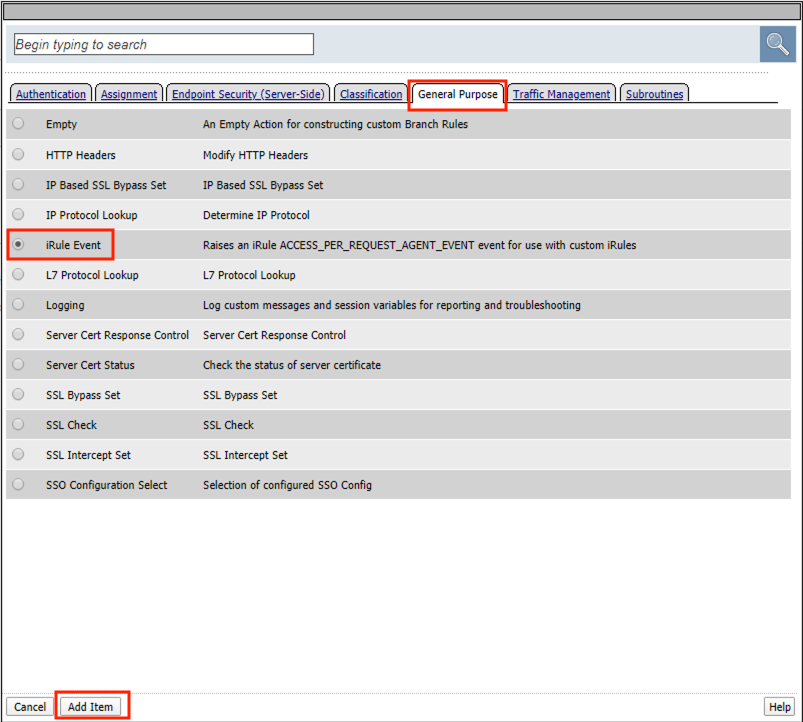

Lab 1.8 - Implement Dynamic Certificate Injection
--------------------------------------------------

In this section, we will use the HTTP Connector to retrieve a user's certificate from Active Directory and use it in the BIG-IP Certificate minting process.

Task 1 - Create an HTTP Connector Transport
~~~~~~~~~~~~~~~~~~~~~~~~~~~~~~~~~~~~~~~~~~~~

#. Navigate to **Access >> Authentication >> HTTP Connector >> HTTP Connector Transport** and click the  **+** (plus symbol)

   |image54|

#. Enter Name **demo-http-connector**

#. Select **internal-dns-resolver** from the **DNS Resolver** dropdown

#. Select **apiadmin-serverssl** from the **Server SSL Profile**

#. Click **Save**

   |image55|

Task 2 - Create a HTTP Connector Request
~~~~~~~~~~~~~~~~~~~~~~~~~~~~~~~~~~~~~~~~~~

#. Navigate to **Access >> Authentication >> HTTP Connector >> HTTP Connector Request** and click the  **+** (plus symbol)

   |image56|

#. Enter name **get-cert**
#. Select **demo-http-connector** from the dropdown
#. Enter URL **https://adapi.f5lab.local:8443/aduser/cert?useridentity=%{perflow.username}**
#. Enter **GET** for the **Method**
#. Select **Parse** for the **Response Action**
#. Click **Save**

   |image57|

Task 3 - Create a Per-Request Policy
~~~~~~~~~~~~~~~~~~~~~~~~~~~~~~~~~~~~~~

#. Navigate to **Access >> Profiles/Policies >> Per-Request Policies** and click the  **+** (plus symbol)

   |image58|

#. Enter the name **certsso_prp**
#. Select the Language **English**
#. Click **Finished**

   |image59|

#. Click **edit** under **Per-Request Policy**

   |image60|

#. Click **Add New Subroutine**

   |image61|

#. Enter the name **Request Cert**
#. Click **Save**

   |image62|

#. Expand the subroutine by click the **+** (plus symbol)

   |image63|

#. Click the **+** (plus symbol) on the fallback branch.

   |image64|

#. Click the **General Purpose** tab
#. Select **HTTP Connector**
#. Click **Add Item**

   |image65|

#. Select **get-cert** drop the dropdown

   |image66|

#. Click **Edit Terminals**

   |image67|

#. Click **Add Terminal**

   |image68|

#. Change the name for the default branch to **Fail**
#. Change the default branch text to **Red**
#. Enter the name **Success** for the new branch
#. Change the color of the new branch to **Green**

   |image69|

#. Click the **Fail** terminal at the end of the **Successful** branch

   |image70|

#. Select the **Success** terminal
#. Click **Save**

   |image71|

#. Click the **+** (plus symbol) on the **successful** branch

   |image72|

#. Click the **Assignment** tab
#. Select **Variable Assign**
#. Click **Add Item**

   |image73|

#. Click **Add new entry**
#. Click **change**

   |image74|

#. Enter **session.ssl.cert.whole** for the **Custom Variable**
#. Select **Session Variable** from the dropdown
#. Enter **subsession.http_connector.body.certificate** for the **Session Variable**
#. Click **Finished**

   |image75|

#. Click **Save**

   |image76|

#. Click the **+** (plus symbol) located between **Start** and **Allow** in the policy

   |image77|

#. Click the **Subroutines** tab
#. Select the **Request Cert** subroutine
#. Click **Add Item**

   |image78|

#. Click the **+** (plus symbol) on the success branch of **Request Cert**

   |image79|

#. Click the **General Purpose** tab
#. Select **irule Event**
#. Click **Add Item**

.. note::

   This iRule event triggers the code from the previously attached iRule. This iRule must be used when inserting a certificate using C3D in a per-request policy.

.. code-block:: none
   :linenos:

   when ACCESS_PER_REQUEST_AGENT_EVENT {
      set cert [ACCESS::session data get {session.ssl.cert.whole}]
      log local0. "My cert: $cert"
      SSL::c3d cert [X509::pem2der $cert]
   }

|image80|

43. Enter **lab** for the **ID**
44. Click **Save**

|image81|

Task 4 - Attach the PRP to the mTLS Virtual Server
~~~~~~~~~~~~~~~~~~~~~~~~~~~~~~~~~~~~~~~~~~~~~~~~~~~~~

1. Navigate to **Local Traffic >> Virtual Servers**.  Click **Virtual Server List**

|image82|

2. Click **mtls_vs**

|image83|

3. Navigate to the **Access Policy** section and select **certsso_prp** from the **Per-Request Policy** dropdown
4. Click **Update**

|image84|

