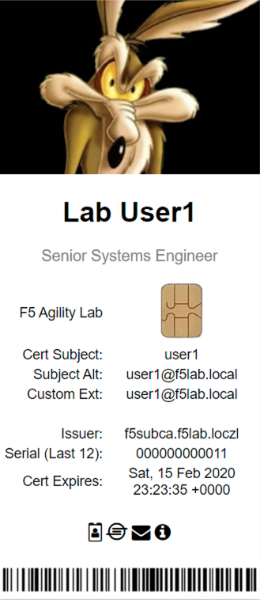

Lab 1.9 - Test Dynamic Certificate Injection
------------------------------------------------

In this section, you will learn how the HTTP Connector can used to retrieve dynamic content for use in C3D.

Task 1 - Access mtls.acme.com with Dynamic Certificate
~~~~~~~~~~~~~~~~~~~~~~~~~~~~~~~~~~~~~~~~~~~~~~~~~~~~~~~~

#. From the web browser on the jumphost, access https://mtls.acme.com

#. Use the following credentials:
   - Username: **user1**
   - password: **user1**
   - OTP: **123456**

   |image44|

3. You will be logged into the site as **user1@f5lab.local**

   .. note::
   	The contents of the certificate used for logging into the website were from certificate retrieved via HTTP connector in Active Directory. The irule continues to insert the 	custom extension 1.1.1.1 with the value containing the user's logon name. Notice the Subject Name is user1, the Subject Alternative Name is user1@f5lab.local and the custom 	extension is user1@f5lab.local
   
      - Cert Subject: **user1**
      - Subject Alt: **user1@f5lab.local**
      - Custom Ext: **user1@f5lab.local**

   |image85|

4. Open a new incognito browser window so you can test access to mtls.acme.com with different user credentials.

   |image48|

5. Use the following credentials: 

   - Username: **user1**
   - password: **user1**
   - OTP: **123456**

   |image50|

6. You will be logged into the site as **user2@f5lab.local**

   .. note::
     Notice that user2's Cert Subject is now user2 and the subject alt is user2@f5lab.local.  The irule continues to insert the custom extension.
   
      - Subject: **user2**
      - Subject Alt: **user2@f5lab.local**
      - Custom Ext: **user2@f5lab.local**

   |image86|

.. |image43| image:: media/image043.png

.. |image45| image:: media/image045.png

.. |image49| image:: media/image049.png

